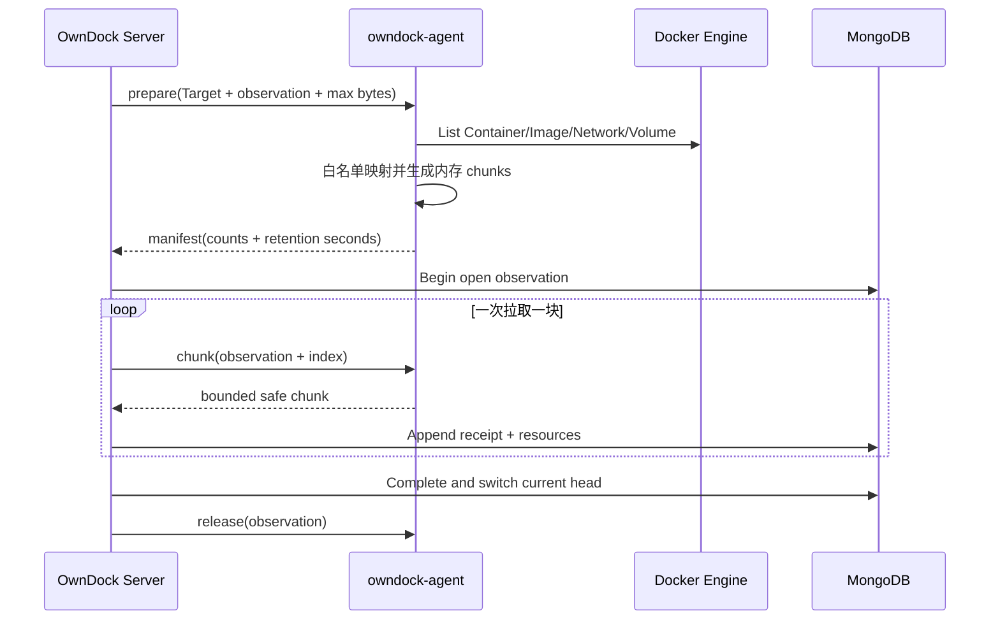
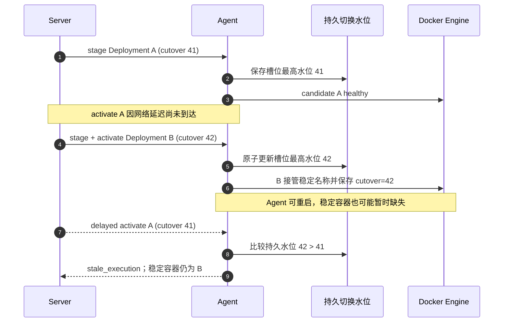

# Agent Control Protocol v1

> 状态：Server 端连接、认证、版本协商、心跳，以及类型化 probe/部署/Runtime Inventory command/result 和容器/主机终端会话复用已实现；`owndock-agent` 控制客户端、抖动退避重连、本机 Docker 执行、跨重启小结果缓存、Inventory 内存快照、持久切换水位、受限容器终端和固定身份主机 PTY 也已实现。Agent 证书已经支持到期前自动轮换、响应丢失恢复、短时双证书过渡和新连接确认。自动安装、跨控制面实例断流与多主机故障系统验收仍未完成。

Agent 控制协议运行在独立的 mTLS 监听端口，不与浏览器 Bearer API 共用认证边界。Agent 主动发起：

```text
POST /api/v1/agent/connect
Content-Type: application/x-ndjson
```

请求体和响应体都是持续打开的 NDJSON 流，每行只能包含一个 JSON frame。HTTP/2 可以原生并发读写；HTTP/1.1 由 Server 显式开启 full duplex。该协议不是普通 REST operation，因此不放入主 HTTP OpenAPI 的默认 Server 地址。

## mTLS 身份

TLS 1.3 listener 强制校验 Agent CA 签发的客户端证书。证书叶子的唯一 SPIFFE URI 必须使用：

```text
spiffe://owndock/organizations/{organization_id}/managed-hosts/{host_id}/agents/{identity_id}/instances/{instance_id}
```

Server 还会使用证书序列号和 SHA-256 指纹查询 MongoDB，并确认：

- Agent Identity 存在、未吊销且未过期；
- Organization、Host、Identity、instance 与证书 URI 完全一致；
- Host 仍绑定该身份、使用 `agent` 模式且未禁用；
- hello frame 中的身份字段与证书身份完全一致。
- hello 上报的 capabilities 是 enrollment 时写入 Agent Identity 能力授权的子集。
- Agent 二进制新增 capability 不会自动扩大已有 Identity 权限；实际 hello 使用本机配置的列表。Runtime Inventory 的 prepare/chunk/release/events 必须作为一组授权和启用。

TLS 校验成功不等于应用身份成功；两层都通过后才能把 Host 标记为 `online`。

## 客户端证书轮换

Agent 使用当前机器证书，在同一个独立 mTLS 监听端口调用：

```text
POST /api/v1/agent/certificate:rotate
Content-Type: application/json
```

这个接口不接受 enrollment token、用户 Bearer Token，也不允许请求体指定 Organization、Host、Identity 或 instance。Server 只从当前 TLS 客户端证书和数据库固定身份推导这些字段。它与持续连接一样不放入主 HTTP OpenAPI 的默认 Server 地址。

请求中的 CSR 由 Agent 本地生成，私钥不会离开主机。`rotation_id`、CSR 和私钥会先以 `0600` pending 文件持久化，因此请求成功但响应丢失、进程退出或网络中断后，Agent 会重放同一请求，而不是生成另一把无法匹配的私钥：

```json
{
  "rotation_id": "url-safe-random-id",
  "csr_pem": "-----BEGIN CERTIFICATE REQUEST-----\n...\n-----END CERTIFICATE REQUEST-----\n"
}
```

Server 对同一 Agent Identity 的同一 `rotation_id + CSR SHA-256` 幂等返回原证书；同一 rotation ID 携带不同 CSR 会失败。成功响应带有 `Cache-Control: no-store`：

```json
{
  "agent_identity_id": "identity-id",
  "managed_host_id": "host-id",
  "rotation_id": "url-safe-random-id",
  "certificate_pem": "-----BEGIN CERTIFICATE-----\n...\n-----END CERTIFICATE-----\n",
  "ca_certificate_pem": "-----BEGIN CERTIFICATE-----\n...\n-----END CERTIFICATE-----\n",
  "certificate_expires_at": "2026-09-01T00:00:00Z"
}
```

完整过渡顺序如下：

1. Agent 默认在证书到期前 7 天生成新 Ed25519 密钥和 CSR，并持久化 pending 请求；
2. Server 在事务内保存新证书、旧证书和 pending 响应。旧证书最多再接受 10 分钟的普通控制连接，且不能超过它自己的有效期；
3. Agent 不信任响应中的 CA 来改变信任根，而是使用本机已配置 CA 验证新证书、固定 SPIFFE 身份、clientAuth、有效期和密钥配对；
4. 验证通过后，Agent 用同目录临时文件、`fsync` 和一次 `rename` 原子替换单文件 identity bundle，删除 pending 文件并立即重连；
5. Server 看到新证书完成 hello 后确认轮换，立即删除旧证书和 pending 响应。此后旧证书即使仍在 10 分钟窗口内也不能再连接。

如果 Agent 在第 2～4 步之间退出，启动恢复会用旧证书和原 pending 请求取回同一张新证书。即使 10 分钟普通连接窗口已经结束，只要旧证书自身仍有效，Server 也仅允许它凭完全相同的 rotation ID 和 CSR hash 读取已经保存的 pending 响应；它不能建立控制流、提交不同 CSR 或创建另一轮换。新身份、CA、权限或文件安全检查失败时，现有 bundle 不会被覆盖；损坏的 pending 文件也不会被静默忽略。

## Frame 规则

- 默认最大 frame 为 65,536 字节，可配置范围为 1 KiB～1 MiB；
- 未知 JSON 字段、多个 JSON 值、空 frame 和超限 frame 都会拒绝；
- Agent `sequence` 必须为大于零的单调递增整数；
- Server 使用独立的单调递增 `sequence`；
- Agent 可以发送 `hello`、`heartbeat`、`command_result` 和 `terminal`；Server 可以发送确认、安全错误、严格类型化的 `command` 和 `terminal`；
- `v1` 已注册 `runtime.probe`、`deployment.prepare/stage/activate/cancel` 和 `runtime.inventory.prepare/chunk/release/events`；目标只能使用 Server 已解析的 Runtime Target/Managed Host，不能由调用方提交 Docker endpoint；
- frame 中不能携带 Docker endpoint、Socket、SSH 地址、用户选择的 Shell 或任意宿主机命令；
- 连接建立后的协议错误通过安全 `error` frame 返回，不透传数据库或证书错误。

首个 Agent frame：

```json
{
  "type": "hello",
  "sequence": 1,
  "hello": {
    "organization_id": "organization-id",
    "managed_host_id": "host-id",
    "agent_identity_id": "identity-id",
    "instance_id": "instance-id",
    "boot_id": "linux-boot-id",
    "agent_version": "1.0.0",
    "protocol_version": "v1",
    "capabilities": [
      "runtime.probe",
      "deployment.prepare",
      "deployment.stage",
      "deployment.activate",
      "deployment.cancel",
      "runtime.inventory.prepare",
      "runtime.inventory.chunk",
      "runtime.inventory.release",
      "runtime.inventory.events",
      "terminal.container",
      "terminal.host"
    ]
  }
}
```

Server 接受后返回：

```json
{
  "type": "hello_ack",
  "sequence": 1,
  "session_id": "session-id",
  "protocol_version": "v1",
  "heartbeat_interval_seconds": 10,
  "max_frame_bytes": 65536,
  "server_time": "2026-07-26T00:00:00Z"
}
```

心跳和确认：

```json
{"type":"heartbeat","sequence":2}
{"type":"heartbeat_ack","sequence":2,"acknowledged_sequence":2,"server_time":"2026-07-26T00:00:10Z"}
```

## 类型化命令

`runtime.probe` 的含义是：“请在这台已认证的 Host 上，检查 OwnDock 后端指定的 Runtime Target 是否可用”。Server 只给出领域 ID，不让浏览器或 Agent 临时替换 Docker 地址：

```json
{
  "type": "command",
  "sequence": 3,
  "command": {
    "command_id": "command-id",
    "kind": "runtime.probe",
    "deadline": "2026-07-26T00:00:30Z",
    "runtime_probe": {
      "runtime_target_id": "runtime-target-id"
    }
  }
}
```

Agent 必须在 deadline 前返回同一 `command_id`。成功结果只能是三个安全状态之一：

```json
{
  "type": "command_result",
  "sequence": 3,
  "command_result": {
    "command_id": "command-id",
    "status": "succeeded",
    "runtime_probe": {
      "status": "ready"
    }
  }
}
```

`runtime_probe.status` 只接受 `ready`、`unreachable` 或 `unsupported`。执行失败时不返回底层地址、Socket 或原始错误，只返回小写稳定错误码：

```json
{
  "type": "command_result",
  "sequence": 3,
  "command_result": {
    "command_id": "command-id",
    "status": "failed",
    "error_code": "runtime_unavailable"
  }
}
```

Server 接受并缓存结果后给出确认，Agent 之后才能安全清理自己的结果：

```json
{
  "type": "command_result_ack",
  "sequence": 4,
  "acknowledged_sequence": 3,
  "command_id": "command-id",
  "server_time": "2026-07-26T00:00:20Z"
}
```

命令传输遵循以下规则：

- 默认每条 Agent 连接最多排队 32 条待发送命令；队列已满时调用方立即得到 backpressure，不会无限占用内存；
- 同一 Host 上，相同 ID 且内容完全一致的并发请求复用同一个等待结果；相同 ID、不同目标、deadline 或部署内容会被拒绝；
- 每条新命令下发前都会检查当前已认证 hello 是否声明该 command capability；未声明时命令不会入队，Deployment Gateway 返回 `unsupported_target`；
- 已完成结果保存在 Server 进程内的全局有界缓存中，默认最多 256 条；缓存只保留 command kind、SHA-256 指纹和安全结果，不保留完整命令或秘密；同一进程内重连后可重放结果，Server 重启或缓存淘汰后不能把它当作持久化事实；
- Runtime Inventory 四类命令是例外：chunk 可能接近 frame 上限，prepare 对应 Agent 内存快照，events 是短时实时结果，都不能作为跨重启事实，因此 Agent 磁盘缓存和 Server 已完成结果缓存都明确跳过它们；快照重试会重新下发同一 observation/index，Agent 进程仍在时从同一内存快照返回，Agent 重启后返回 snapshot missing 并重新开始 observation；
- command deadline 到期、Agent 断线、Host 被禁用或新 session 替换旧 session 时，所有仍在等待的调用都会得到明确失败；
- 重复且完全相同的结果可安全确认；未知、冲突或结构不匹配的结果会关闭当前协议连接；
- Project Runtime Target 已有受 RBAC 保护的 probe API，Server 侧会从数据库 Target/Host 映射到 `runtime.probe` command；Agent 控制客户端通过受信任的本机 Unix Socket Ping Docker，并把安全结果写入 `0600`、原子替换、有界的磁盘缓存。缓存 v2 只保存 command kind、SHA-256 指纹和安全结果，不保存 Runtime Target ID、Registry authorization、Environment 值或原始错误；旧版只含 probe 标识的缓存可以读取，并在后续写入时升级。Agent Control Server 启用后，composition root 会把 Agent prober 与已实现的 Deployment Gateway 配套注册；离线或未启用仍安全返回不可达/不可用，不会回退 direct。

## 终端会话复用

`terminal.container` 和 `terminal.host` 都不是任意命令 RPC。Server 只有在 TerminalSession 已通过登录会话、RBAC、策略、固定目标和一次性票据检查后，才会通过已认证的 Host 连接发送 `terminal` frame。两项 capability 分开授权，拥有容器终端能力不能打开主机终端。终端不使用 command/result 缓存；断线即关闭，用户需要重新创建会话。

Server 发出的第一帧固定为 `open`，每个终端拥有独立的 `session_id` 和双向 sequence：

```json
{"type":"terminal","sequence":8,"terminal":{"session_id":"terminal-session-id","sequence":1,"type":"open","open":{"kind":"container","deployment_id":"deployment-id","project_id":"project-id","application_id":"application-id","environment_id":"environment-id","runtime_target_id":"runtime-target-id","container_name":"owndock-managed-name","cutover_sequence":42,"columns":120,"rows":30}}}
```

Agent 不直接信任容器名。它根据 Project、Application、Environment 和 Runtime Target 再次推导稳定名称，并用 Deployment、cutover sequence 和领域标签核对运行中的容器。通过后返回 `ready`：

```json
{"type":"terminal","sequence":6,"terminal":{"session_id":"terminal-session-id","sequence":1,"type":"ready"}}
```

主机 OPEN 更窄，只允许类型和窗口尺寸：

```json
{"type":"terminal","sequence":9,"terminal":{"session_id":"host-session-id","sequence":1,"type":"open","open":{"kind":"host","columns":120,"rows":30}}}
```

Agent 从本机可信配置取得固定系统账号、Shell 和终止宽限，拒绝所有容器选择字段。Agent 进程必须本来就以配置账号运行；协议和执行器都不支持 `sudo`、`su`、`setuid`、任意 command/env/workdir 或用户切换。PTY 使用最小重建环境，关闭时回收整个进程组。

后续 `stdin`/`stdout` 每帧最多 32 KiB，`resize` 最大 1000×500。Server→Agent 和 Agent→Server 的会话 sequence 分别从 1 连续递增；全局 frame sequence 仍按整条 Agent 连接递增。启用任一终端 capability 时双方 frame 上限必须至少为 65,536 字节。Agent 同时最多维护 16 个终端，其中主机终端最多 4 个；Server Registry、Agent 入站队列和共享发送队列均有界，背压、重连、目标停止或 identity 变化都会关闭会话。

容器 executor 固定尝试 `/bin/sh`、`/bin/bash`、`/bin/ash`；主机 executor 只使用本机可信配置中的单个 Shell。协议没有 Docker endpoint、socket path、shell、command、user、env、workdir、detach 或 privileged 字段。终端字节不进入 MongoDB、命令结果缓存、普通日志、Trace 或审计事件。

## Runtime Inventory 拉取协议

Runtime Inventory 不把一台主机的全部 Container、Image、Network 和 Volume 塞进一条 command result。Server 使用三步拉取：

1. `runtime.inventory.prepare` 固定 Runtime Target、observation ID 和单块字节上限；
2. Agent 通过本机 Docker List API 生成安全投影，在内存中按字节和资源数分块；Server 收到 manifest 后逐个发送 `runtime.inventory.chunk`；
3. Server 每收到一块就校验并事务写入 MongoDB，全部完成后切换 current head，再发送 `runtime.inventory.release`；
4. 两次全量盘点之间，Server 使用独立的 `runtime.inventory.events` 短时轮询，让 Agent 从上次 Docker 事件时间继续读取安全摘要。

prepare 示例：

```json
{
  "command_id": "command-prepare",
  "kind": "runtime.inventory.prepare",
  "deadline": "2026-07-30T10:00:30Z",
  "runtime_inventory": {
    "runtime_target_id": "runtime-target-id",
    "observation_id": "observation-id",
    "max_chunk_bytes": 49152
  }
}
```

Agent 只返回小 manifest。`retention_seconds` 是相对保留时间，不是 Agent 的绝对时间；Server 使用自己的开始时间计算截止点，避免主机时钟偏差影响协议：

```json
{
  "command_id": "command-prepare",
  "status": "succeeded",
  "runtime_inventory": {
    "manifest": {
      "observation_id": "observation-id",
      "schema_version": 1,
      "expected_chunks": 3,
      "expected_resources": 742,
      "retention_seconds": 600
    }
  }
}
```

chunk 请求只增加 index；返回值只能包含 OwnDock 安全资源结构：

```json
{
  "command_id": "command-chunk-0",
  "kind": "runtime.inventory.chunk",
  "deadline": "2026-07-30T10:00:30Z",
  "runtime_inventory": {
    "runtime_target_id": "runtime-target-id",
    "observation_id": "observation-id",
    "max_chunk_bytes": 49152,
    "chunk_index": 0
  }
}
```

当前限制为：

- 默认单块 48 KiB、最多 500 个资源，48 KiB 按完整 chunk JSON 的实际编码字节计算；
- Agent 最多同时保留 2 份快照，每份所有 chunk 合计不超过 32 MiB，10 分钟后即使 Server 未 release 也自动删除；
- 共享 transport 硬限制为 100,000 个资源、10,000 个 chunk 和 64 MiB 编码资源数据；Agent 的 32 MiB 上限更严格；
- 一次只拉取一块，现有 command/result 确认就是流控和背压边界；
- Container Env、Registry authorization、Volume mountpoint/options/status、宿主机 mount source、任意 Docker 原始错误和非白名单 Label 不进入 chunk；
- `release` 幂等；断线或部分失败时 MongoDB 继续返回上一份完整视图，open observation 两小时后自动回收。

Event 请求示例：

```json
{
  "command_id": "command-events",
  "kind": "runtime.inventory.events",
  "deadline": "2026-07-30T10:00:30Z",
  "runtime_inventory": {
    "runtime_target_id": "runtime-target-id",
    "event_since": "2026-07-30T09:59:58.123Z",
    "event_wait_seconds": 2
  }
}
```

`event_since` 不是 Server 当前时间，而是上一批已经安全处理的 Docker Event 时间。Agent 最多等待 10 秒并返回最多 64 条白名单事件；结果不包含 Actor attributes、Labels 或命令内容：

```json
{
  "command_id": "command-events",
  "status": "succeeded",
  "runtime_inventory": {
    "events": {
      "events": [
        {
          "kind": "container",
          "runtime_id": "docker-container-id",
          "action": "start",
          "occurred_at": "2026-07-30T10:00:00.456Z"
        }
      ]
    }
  }
}
```

Server 只有在所有事件提示都写入成功后，才把游标推进到最大的 `occurred_at`。断线、超时以外的读取错误或 MongoDB 写入失败都会保留旧游标；下一次使用 inclusive `Since` 重放，重复提示按稳定 ID 去重。Event 只催促一次完整 observation，不能直接把资源标记为 present 或 absent。



共享协议、Agent 执行器和 Server 拉取编排已经实现；把它接到 Runtime Target credential/source resolver、周期任务和公开查询 API 仍属于后续任务。

## Agent Deployment 两阶段契约

Agent 部署不能简单地把现有 Server 直连 Docker 操作整体搬到远端。候选容器健康后，Server 必须重新验证 MongoDB 中当前 Deployment 的 worker owner、lease generation、状态、过期时间，以及它仍是部署槽位的当前序号，才能允许候选接管稳定容器名。每个命令还携带同一部署槽位内单调递增的 `cutover_sequence`：lease generation 区分同一 Deployment 的 Worker 尝试，cutover sequence 区分不同 Deployment 的新旧。内部 `v1` 契约因此按下面四种类型化命令拆分：

- `deployment.prepare`：按不可变 digest 检查或拉取镜像；只有该命令可携带有界 Registry authorization；
- `deployment.stage`：使用受约束的 Runtime Spec 和 Environment 创建候选容器并等待健康，但不切换稳定名称；
- `deployment.activate`：Server 重新通过 lease fence 后下发，只负责进行幂等的最终名称切换；
- `deployment.cancel`：只清理由同一 Deployment ID、fencing token 和 cutover sequence 拥有的候选、回退或稳定容器。

`prepare/stage/activate/cancel` 都固定 Deployment、Worker、generation、cutover sequence、Runtime Target 和稳定容器名，不能携带 Docker endpoint 或 Shell。`stage` 的 Environment 必须与 Release Runtime Spec 声明的键完全一致；`activate/cancel` 禁止携带 Registry、Environment 或镜像字段。Agent 会把 cutover sequence 写入候选和稳定容器标签，并在独立的本机文件中保存每个稳定容器槽位的最高 sequence 与 Deployment ID。该水位不随结果缓存淘汰；因此即使 Agent 重启或稳定容器被删除，延迟到达的旧 `prepare/stage/activate` 仍返回 `stale_execution`。较旧 `cancel` 仍可按完整执行身份清理自己的候选，不会删除新 Deployment。水位文件损坏、写入失败或达到配置上限时失败关闭。Agent 本机执行器、Server Gateway、secret-safe 双端结果缓存、跨重启/容器缺失延迟命令回归和单机真实 Engine 两阶段测试已经实现；两台真实主机、网络分区和网络层延迟命令的系统验收仍未完成，因此当前不能据此宣称 Agent 模式生产就绪。

```mermaid
sequenceDiagram
    autonumber
    participant W as Deployment Worker
    participant G as Agent Gateway
    participant R as Agent Connection Registry
    participant A as owndock-agent
    participant D as Docker Engine
    participant M as MongoDB Fence

    W->>G: Prepare(plan)
    G->>R: deployment.prepare(digest + bounded registry auth)
    R-->>A: typed command
    A->>D: inspect/pull immutable digest
    A-->>R: safe result
    W->>G: Deploy(plan)
    G->>R: deployment.stage(spec + resolved environment)
    R-->>A: typed command
    A->>D: create/start candidate; wait healthy
    A-->>R: staged
    G->>M: validate owner + generation + state + lease + current cutover
    alt fence current
        G->>R: deployment.activate(no secrets)
        R-->>A: typed command
        A->>D: compare cutover sequence; idempotent stable-name switch
        A-->>R: activated
    else fence stale
        G->>R: deployment.cancel(owned execution only)
        R-->>A: typed command
        A->>D: remove owned candidate
        G-->>W: stale execution
    end
```

不同 Deployment 乱序到达时，`cutover_sequence` 提供跨操作的比较依据：



## 在线、重连与关闭

- hello 通过后，Server 原子写入 `online`、session/boot ID、版本、能力和 `last_seen_at`，并记录 `agent_session.connect`；
- 每次 heartbeat 只在 Host 仍绑定当前 session 且为 `online` 时更新时间；
- 超过 heartbeat timeout、请求结束或 Server 停止时，当前 session 条件更新为 `offline` 并记录 `agent_session.disconnect`；
- 同一 Host 的新连接会替换并取消旧连接；旧连接随后关闭时，session fence 会阻止它把新连接标记为离线；
- Owner 禁用 Host 时先提交禁用、身份吊销和审计，再取消本进程当前连接；后续 heartbeat 和重连都会失败；
- 单实例路由已经实现。未来多控制面实例需要 session affinity 或共享连接路由，不能假设进程内 registry 可以跨实例断流。

## 后续兼容扩展

`v1` 的后续 frame 只能加入与已授权领域操作关联的类型化 command/result 或临时会话。每条持久命令必须有唯一 command ID、幂等结果、超时和有界缓冲；临时终端使用独立会话序号、上限与关闭语义。协议不会提供“执行任意宿主机命令”的通用 RPC。

Server 侧 probe/Deployment 类型契约、重复等待、secret-safe 结果缓存和慢消费者 backpressure，以及 Agent 侧 TLS 1.3 客户端、严格帧校验、心跳、抖动退避重连、优雅停止、deadline、本机 Docker executor、并发去重和跨重启持久结果均已完成。双端流一致性测试已覆盖当前 `v1`；在相邻 Agent/Server 版本 conformance 和发行升级矩阵完成前，`AGENT-002` 仍处于进行中。
