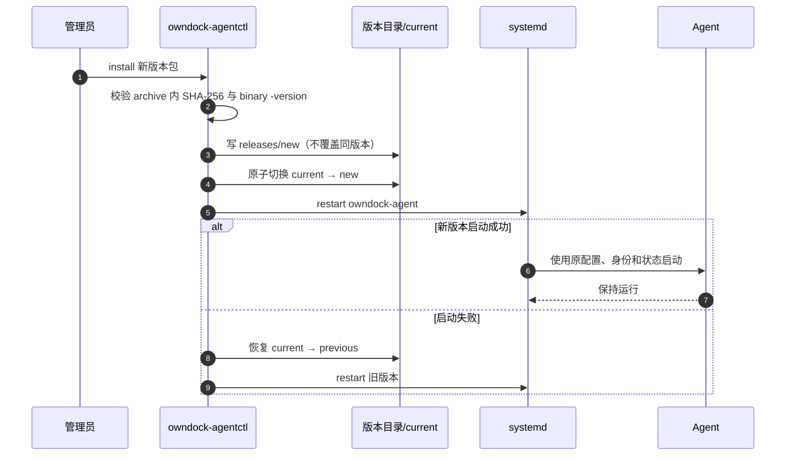

# Agent 安装、升级与回滚

> 状态：仓库已经提供 Linux/systemd Agent 的确定性版本包、SHA-256 校验、Sigstore keyless 发布签名与离线验签、专用系统账号、安全加固 unit、一次性安全 enrollment、版本化安装、原子升级和本机回滚。首个受保护正式 Tag、真实双主机灰度升级和隔离网络分发验收仍未完成，因此当前制品仍按 pre-release 管理。

这套交付方式解决三个问题：升级不能覆盖唯一可运行版本；配置、机器证书和运行状态不能跟着二进制回滚；启动失败时必须自动恢复上一个二进制。

## 支持边界

当前安装器面向 `amd64` 或 `arm64`、使用 systemd 的 Linux 主机，并要求：

- Docker Engine 已安装，本机存在 `docker` group 和 `/var/run/docker.sock`；
- 使用 root 执行安装管理器；Agent 进程使用安装器创建的 `owndock-agent` 系统账号；
- Owner 已在控制面为这台 Managed Host 创建尚未过期的一次性 enrollment token；
- 主机终端使用同一个低权限 `owndock-agent` 账号，不允许浏览器选择账号或提升为 root。

加入 `docker` group 通常等价于获得较高的主机控制能力。专用账号和 systemd 沙箱可以减少误用面，但不能把 Docker Socket 变成低权限接口。

## 构建发布包

发布版本不能使用默认的 `dev`：

```bash
make package-agent VERSION=0.1.0 AGENT_GOOS=linux AGENT_GOARCH=amd64
```

正式打包默认拒绝未提交的工作区，避免制品声称来自某个 commit、实际却包含额外修改。开发阶段只验证打包流程时可以显式使用 `ALLOW_DIRTY_RELEASE=1`，此类包不能发布。

输出文件：

```text
dist/owndock-agent_0.1.0_linux_amd64.tar.gz
dist/owndock-agent_0.1.0_linux_amd64.tar.gz.sha256
```

构建默认嵌入完整 Git SHA 和该 commit 的稳定时间；打包器固定文件顺序、时间、所有者和权限。相同 commit、版本和目标架构会生成相同 archive；包内还保存 Agent 二进制自己的 SHA-256。外层 checksum 用于发现下载损坏，包内 checksum 在切换版本前再次验证二进制。

SHA-256 只能验证文件与发布清单一致，不能单独证明发布者身份。正式 Tag 工作流会使用 GitHub OIDC 的 Sigstore keyless 身份签名统一清单，并精确绑定仓库、工作流和版本；客户必须先验签，再信任 checksum。完整步骤见[Agent 正式发布与制品验签](release-security.md)。本地 `make package-agent` 生成的 checksum 不等于正式发布签名。

## 首次安装

先按[正式发布与制品验签](release-security.md)验证签名身份和下载文件，再解压：

```bash
sha256sum -c owndock-agent_0.1.0_linux_amd64.tar.gz.sha256
tar -xzf owndock-agent_0.1.0_linux_amd64.tar.gz
cd owndock-agent_0.1.0_linux_amd64
sudo ./owndock-agentctl install
```

第一次 `install` 不会在缺少正式配置时启动服务。它会创建专用账号、目录、systemd unit 和版本化二进制。

在控制面中为目标 Managed Host 创建一次性 enrollment token，把它保存到目标主机上仅 root 可读的普通文件。不要把 token 直接写入命令、环境变量、systemd unit 或 Shell history：

```bash
sudo install -o root -g root -m 0600 /secure/input/token \
  /root/owndock-agent-enrollment.token
sudo owndock-agentctl enroll \
  --enrollment-endpoint \
  https://console.example.com/api/v1/agent/enrollments:exchange \
  --control-endpoint \
  https://control.example.com:8443/api/v1/agent/connect \
  --token-file /root/owndock-agent-enrollment.token
```

安装器默认授权部署、Runtime Inventory 和容器终端能力，不授权主机终端。确实需要网页进入主机 Shell 时，由管理员显式增加 `--enable-host-terminal`；这只授予 Agent 身份能力上限，用户仍必须通过独立 RBAC、重新确认和审计门禁。

如果管理 API 使用企业私有 HTTPS CA，可增加 `--server-ca-file /root/management-ca.pem`。该 CA 只用于验证 enrollment HTTPS Server；控制流使用 Server 在响应中返回并经证书链校验的独立 Agent CA。安装器不支持跳过 TLS 校验、不跟随重定向，也不读取系统代理环境变量，避免 token 被发送到非目标服务。

成功前应保留 token 文件，成功后再删除。Server 只保存 token 的 SHA-256；同一 token 不能换 CSR、instance、版本或能力重新兑换。客户端在发请求前先把 CSR、私钥和非秘密请求元数据写入 `0600` pending；遇到超时、断线或不确定响应时，使用原 token 和完全相同参数重跑同一条 `enroll` 命令，它会复用原 CSR。Server 在 10 分钟内幂等返回同一张证书，不会创建第二个 Identity 或重复审计。收到成功响应后，客户端把响应更新到 pending，再原子安装 CA 和 identity，最后写配置作为完成标记。

如果进程在本地响应持久化后、配置提交前中断，直接执行：

```bash
sudo owndock-agentctl enroll --recover
```

恢复流程不再读取或重用 token，只验证本地 pending 中的证书链、私钥配对、有效期和固定 SPIFFE Organization/Host/Identity/instance，然后完成落盘并启动服务。损坏、过期、权限过宽或符号链接形式的 token、pending、identity 都会失败关闭。完整身份模型见[首次安全接入](agent-enrollment.md)。

## 文件布局

| 路径 | 所有者与权限 | 用途 |
| --- | --- | --- |
| `/opt/owndock-agent/releases/<version>` | `root:root`, `0755` | 不可变的历史二进制、systemd unit 与包内 checksum |
| `/opt/owndock-agent/current` | root 管理的相对 symlink | 当前二进制，升级和回滚只原子替换它 |
| `/etc/owndock/agent.yaml` | `root:owndock-agent`, `0640` | 只读运行配置 |
| `/etc/owndock/agent-ca.pem` | `root:owndock-agent`, `0640` | 只读 Agent CA 信任根 |
| `/var/lib/owndock-agent/identity/agent-identity.pem` | `owndock-agent`, `0600` | 可由证书轮换原子替换的机器身份 bundle |
| `/var/lib/owndock-agent/instance-id` | `owndock-agent`, `0600` | 安装实例的稳定随机身份；重试时不重新生成 |
| `/var/lib/owndock-agent` | `owndock-agent`, `0700` | 命令结果、部署水位和轮换状态 |
| `/etc/systemd/system/owndock-agent.service` | root 管理的 symlink | 跟随 `current` 的版本化安全加固服务单元 |

配置和 CA 与可写机器身份分开。这样证书轮换只需要写 Agent 私有状态目录，不能覆盖启动配置或改变信任根。

## 升级

在新包目录再次执行：

```bash
sudo ./owndock-agentctl install
```

安装器按以下顺序执行：

1. 校验包内二进制 checksum 和 `-version` 输出；
2. 拒绝用不同内容覆盖已存在的同版本目录；
3. 写入新的 `/opt/owndock-agent/releases/<version>`；
4. 原子切换 `current` symlink；
5. 如果服务原本正在运行，重启并让 Agent 重新执行协议协商；
6. 新版本启动失败时恢复旧 symlink，并重新启动旧版本。

安装器不会只相信 `systemctl restart` 的瞬时返回值。每次启动、升级或回滚后都会等待 3 秒稳定观察窗并再次确认 unit 仍为 active；新进程在启动后立即退出时，会恢复旧 `current` 并验证旧版本确实重新运行。如果新旧版本都无法稳定启动，安装器明确失败并保留现场，不会输出误导性的成功结果。

Linux CI 使用真实 systemd 覆盖首次启动、相邻测试版本升级、启动即崩溃版本的自动恢复、显式回滚和状态文件保留；fixture 还会确认服务进程不是 root、`ProtectSystem=strict` 阻止写 `/etc`，同时 `/var/lib/owndock-agent` 保持可写。独立的真实 enrollment 进程门禁覆盖 HTTPS 响应丢失后的同 CSR 重试、符号链接拒绝后的无 token 本地恢复，以及 token 不落入状态和日志。两项系统门禁都会先拒绝 runner 上任何既有 OwnDock 路径，再只清理本次创建的固定路径；它们仍不替代真实 Agent 与 Server、Docker Engine 和两台客户等价主机的灰度验收。

升级不会覆盖 `/etc/owndock/agent.yaml`、CA、identity bundle、结果缓存或部署 cutover 水位。协议兼容仍由 Server 的版本协商失败关闭；当前还需要相邻 Agent/Server 版本的真实节点矩阵验收。



## 回滚

查看当前版本：

```bash
sudo owndock-agentctl status
```

回滚到已经安装并通过 checksum/版本检查的版本：

```bash
sudo owndock-agentctl rollback --version 0.1.0
```

回滚只切换二进制，不回滚配置、机器证书和运行状态。这是有意的安全边界：恢复旧 cutover 水位可能让延迟部署命令覆盖新版本，恢复旧证书可能重新启用已经退出宽限期的机器身份。

安装器不会自动删除旧 release。管理员应在灰度观察期和回滚窗口结束后，只删除既不是 `current`、也不在回滚计划中的目录。

## systemd 安全边界

正式 unit 使用 `NoNewPrivileges`、只读系统文件、私有临时目录/设备、空 capability set、namespace/kernel/control-group 防护、地址族白名单、进程数与文件描述符上限。唯一声明的可写路径是 `/var/lib/owndock-agent`。

主机终端也继承这些限制。即使如此，Agent 仍可通过 Docker Socket 管理容器，因此生产开放前仍必须完成真实主机、升级中断、网络分区和秘密扫描验收。
