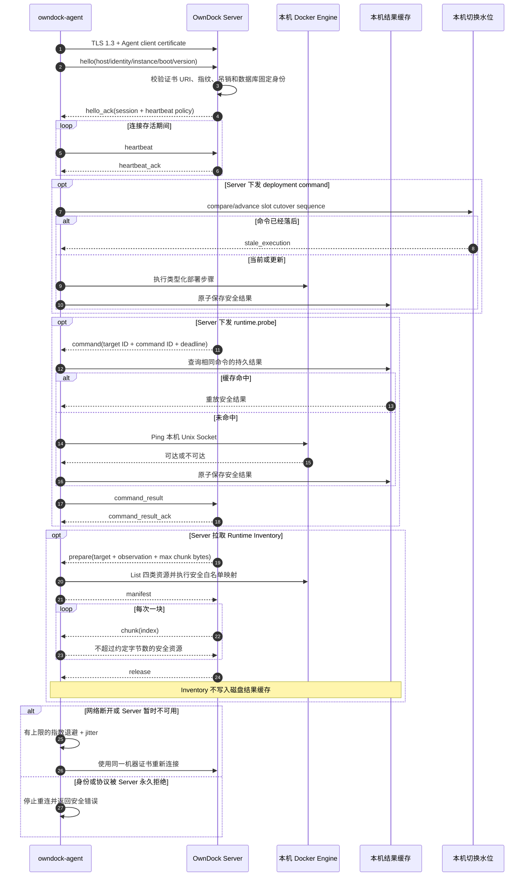

# Agent 运行与配置

> 状态：`owndock-agent` 已可构建并能使用已签发的机器证书连接 OwnDock Server，可执行 `runtime.probe`、两阶段 Docker Deployment、Runtime Inventory 内存分块和有界 Event 续读。Server 已有默认关闭的 Inventory 全量与 Event Worker；Inventory 已覆盖重连、快照丢失、背压、多 Server 调度门禁、Docker 时间游标和失败不推进游标。自动安装、证书轮换和部署/终端的真实多主机故障系统验收尚未完成，因此这不代表 Agent 模式已经生产就绪。

OwnDock Agent 安装在需要纳管的 Linux 主机上。它主动向 Server 建立出站连接，再访问主机本地的 Docker Unix Socket。管理员不需要把 Docker TCP API 或 SSH 端口暴露给控制面。

## 构建

在仓库根目录执行：

```bash
make build-agent
./bin/owndock-agent -version
```

`make build` 会同时生成 Server 和 Agent：

```text
bin/owndock
bin/owndock-agent
```

Linux AMD64 交叉构建示例：

```bash
GOOS=linux GOARCH=amd64 go build \
  -trimpath \
  -o bin/owndock-agent-linux-amd64 \
  ./cmd/agent
```

正式发行还需要固定版本、校验和、签名、systemd unit、升级和回滚流程；当前仓库尚未提供安装包。

## 运行前准备

当前 Agent 进程不在启动时使用 enrollment token。管理员或后续安装器需要先完成[首次安全接入](agent-enrollment.md)，并在主机上准备：

- OwnDock Agent CA 证书；
- 该 Agent Identity 的客户端证书；
- 只保存在本机的客户端私钥；
- Organization、Managed Host、Agent Identity 和安装 instance ID；
- 可访问本机 Docker Engine 的 Unix Socket。

客户端私钥必须是普通文件，不能是符号链接，也不能允许 group 或 other 读取。推荐权限：

```bash
chmod 0600 /etc/owndock/agent-key.pem
install -d -m 0700 /var/lib/owndock-agent
```

能够访问 Docker Socket 的进程通常拥有接近主机 root 的控制能力。应使用专用系统账号运行 Agent、限制配置和状态目录权限，并把该主机身份视为高权限机器身份；不要为了方便把 Docker Socket 暴露为未认证 TCP 服务。

## 配置

参考 [configs/agent.yaml](../configs/agent.yaml) 创建实际配置。模板中的 ID 和域名都是占位值：

```yaml
control:
  endpoint: https://control.example.com:8443/api/v1/agent/connect
  organization_id: organization-1
  managed_host_id: host-1
  identity_id: identity-1
  instance_id: installation-1
  boot_id_file: /proc/sys/kernel/random/boot_id
  ca_certificate_file: /etc/owndock/agent-ca.pem
  client_certificate_file: /etc/owndock/agent.pem
  client_private_key_file: /etc/owndock/agent-key.pem
  handshake_timeout: 10s
  server_silence_timeout: 45s
  reconnect_minimum: 1s
  reconnect_maximum: 30s
  reconnect_stable_after: 1m
  max_frame_bytes: 65536
  max_concurrent_commands: 4
  capabilities:
    - runtime.probe
    - deployment.prepare
    - deployment.stage
    - deployment.activate
    - deployment.cancel
    - runtime.inventory.prepare
    - runtime.inventory.chunk
    - runtime.inventory.release
    - runtime.inventory.events

runtime:
  docker_socket: /var/run/docker.sock
  state_directory: /var/lib/owndock-agent
  result_cache_size: 256
  cutover_watermark_size: 16384
```

关键边界：

- `endpoint` 必须是 `https://`，固定路径为 `/api/v1/agent/connect`，不能包含账号、query token 或 fragment；
- Agent 不使用系统 HTTP Proxy，也不跟随 HTTP redirect，避免证书身份被带到意外地址；
- TLS 最低版本为 1.3，Server 证书必须由配置的 CA 验证；
- `docker_socket` 只接受本机绝对 Unix Socket 路径，不接受 `tcp://` 地址；
- `state_directory` 必须是权限受限的真实目录；命令结果和部署切换水位分别使用 `0600` 文件、fsync 和原子替换保存；
- 持久结果只保存 command kind、SHA-256 指纹和安全结果；Registry authorization、Environment 值、目标 ID 和原始 Docker 错误不会写入缓存；
- Runtime Inventory manifest/chunk/release/events 不写入持久结果缓存。安全快照只在内存保留 10 分钟，最多 2 份、每份 32 MiB；manifest 和 Event poll 每批最多携带 64 条规范化 Event，不含 Actor attributes，达到上限只要求 Server 再次全量采集；Agent 重启后由 Server 放弃 open observation 并重新全量采集；
- 部署切换水位只保存稳定容器槽位、最高 cutover sequence 和对应 Deployment ID，不保存完整命令或秘密；它独立于可淘汰的结果缓存，因此 Agent 重启或容器缺失后仍能拒绝旧命令；
- `cutover_watermark_size` 是失败关闭的槽位上限：达到上限后拒绝新槽位，不淘汰旧水位；删除 Application/Environment/Runtime Target 时的生命周期感知回收尚未实现；
- `max_frame_bytes`、并发命令数、结果缓存和切换水位都有上限，慢连接不能造成无界内存增长。
- 当前二进制从共享协议清单上报精确 capabilities；Server 会同时验证它们没有超出 enrollment 时授予该 Agent Identity 的范围。
- Agent 只上报配置中的 capability 子集。安装器必须把同一列表同时写入 enrollment 和本机配置；四项 `runtime.inventory.*` 必须一起启用，并要求 `max_frame_bytes >= 65536`。旧配置未声明 `capabilities` 时只启用原有 probe/部署基线，升级 Agent 不会因为二进制新增能力而自动扩大机器身份权限。

运行：

```bash
./bin/owndock-agent -conf /etc/owndock/agent.yaml
```

收到 `SIGTERM` 或 `SIGINT` 后，Agent 会取消当前连接和本地执行并等待任务退出，不会启动新的重连。

## 通信过程



Agent 只理解版本化的类型化命令。当前没有“执行任意 Shell”或“传入任意 Docker 地址”的通用 RPC。完整帧格式见 [Agent Control Protocol v1](../api/agent-control.md)。

## 当前不能做什么

- 不能自动生成私钥、兑换 enrollment 并安装证书；
- 不能自动轮换即将过期的 Agent 证书；
- 尚未完成双主机选址、断线、网络分区和旧命令延迟到达的系统验收；
- 不能进入容器终端或主机终端；
- 不能依靠当前进程内连接 Registry 实现多 Server 实例的跨实例命令路由。
- Runtime Inventory 协议、执行器和默认关闭的 Mongo 租约全量/Event 任务已存在，并已覆盖重连续拉、重启等价快照丢失、真实队列背压、snapshot window、有界持续 Event、Docker 时间游标和两个 Runner 竞争；Project/Host 权限查询 API 已实现，真实双主机断线/洪峰系统验收尚未完成。

Agent Control Server 启用时，Server 会同时注册 Agent probe 和部署路径；Host 在线且本机 Docker probe 成功后，Agent Runtime Target 可以进入 `ready`。多主机系统验收完成前，文档和 UI 仍需明确标注当前支持范围。

部署协议和本机执行器已经完成 `deployment.prepare/stage/activate/cancel` 的严格契约和 secret-safe 幂等指纹。候选容器先在 `stage` 阶段通过健康检查，Server 再验证 MongoDB lease 与槽位当前 cutover sequence，最后才发送不含秘密的 `activate`；Agent 会同时使用独立持久化最高水位和受管容器标签判断新旧，即使进程重启或稳定容器缺失，也不会让更早的 Deployment 再次变为当前部署。本机语义回归已经覆盖该乱序场景，真实网络故障验收仍属于上面的未完成项。详细时序见 [Agent Control Protocol v1](../api/agent-control.md#agent-deployment-两阶段契约)。
