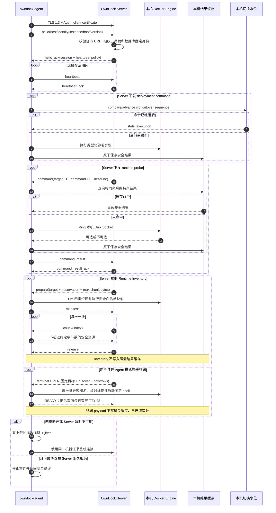
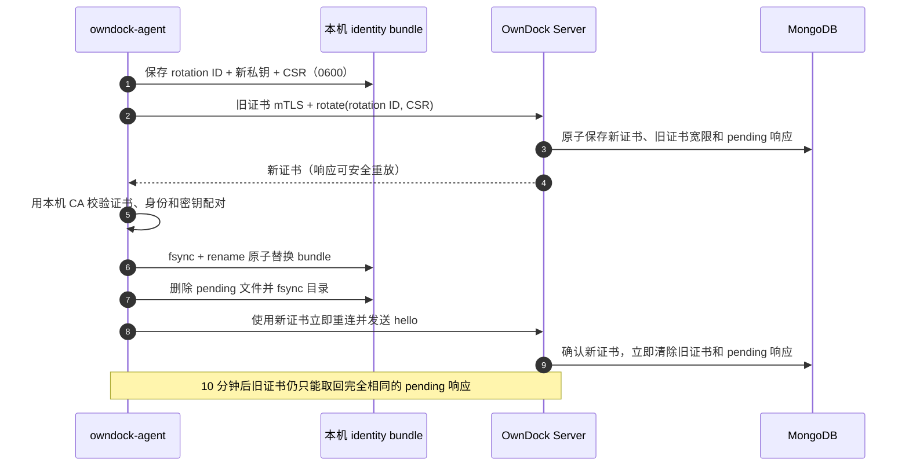

# Agent 运行与配置

> 状态：`owndock-agent` 已可构建并能通过自动 enrollment 获得机器证书、连接 OwnDock Server，可执行 `runtime.probe`、两阶段 Docker Deployment、Runtime Inventory 内存分块、有界 Event 续读、受限容器终端和固定身份主机 PTY，并支持首次响应丢失恢复、证书到期前自动轮换和短时双证书过渡。仓库已提供带 checksum 的版本包、Sigstore keyless 签名/离线验签、systemd 安全单元、原子升级和二进制回滚；首个正式 Tag，以及部署、Inventory、轮换和终端的真实多主机故障系统验收尚未完成，因此这不代表 Agent 模式已经生产就绪。

OwnDock Agent 安装在需要纳管的 Linux 主机上。它主动向 Server 建立出站连接，再访问主机本地的 Docker Unix Socket。管理员不需要把 Docker TCP API 或 SSH 端口暴露给控制面。

## 构建

在仓库根目录执行：

```bash
make build-agent
./bin/owndock-agent -version
```

`make build` 会同时生成 Server 和 Agent：

```text
bin/owndock
bin/owndock-agent
```

正式 Linux AMD64 版本包：

```bash
make package-agent VERSION=0.1.0 AGENT_GOOS=linux AGENT_GOARCH=amd64
```

该命令生成确定性的 `tar.gz`、外层 SHA-256、包内二进制 SHA-256、systemd unit 和安装管理器。安装、升级、失败恢复与回滚命令见[Agent 安装、升级与回滚](agent-installation.md)，正式发行身份与离线验签见[Agent 正式发布与制品验签](release-security.md)。受保护 Tag 的真实发布和节点灰度仍是正式发布门禁。

## 运行前准备

Agent 常驻进程不在启动时使用 enrollment token。管理员先通过 `owndock-agentctl enroll` 完成[首次安全接入](agent-enrollment.md)，安装器会在主机上准备：

- OwnDock Agent CA 证书；
- 该 Agent Identity 的客户端证书；
- 只保存在本机的客户端私钥；
- Organization、Managed Host、Agent Identity 和安装 instance ID；
- 可访问本机 Docker Engine 的 Unix Socket。

客户端私钥必须是普通文件，不能是符号链接，也不能允许 group 或 other 读取。推荐权限：

```bash
install -d -o owndock-agent -g owndock-agent -m 0700 \
  /var/lib/owndock-agent/identity
chmod 0600 /var/lib/owndock-agent/identity/agent-identity.pem
```

能够访问 Docker Socket 的进程通常拥有接近主机 root 的控制能力。应使用专用系统账号运行 Agent、限制配置和状态目录权限，并把该主机身份视为高权限机器身份；不要为了方便把 Docker Socket 暴露为未认证 TCP 服务。

## 配置

参考 [configs/agent.yaml](../configs/agent.yaml) 创建实际配置。模板中的 ID 和域名都是占位值：

```yaml
control:
  endpoint: https://control.example.com:8443/api/v1/agent/connect
  organization_id: organization-1
  managed_host_id: host-1
  identity_id: identity-1
  instance_id: installation-1
  boot_id_file: /proc/sys/kernel/random/boot_id
  ca_certificate_file: /etc/owndock/agent-ca.pem
  client_certificate_file: /var/lib/owndock-agent/identity/agent-identity.pem
  client_private_key_file: /var/lib/owndock-agent/identity/agent-identity.pem
  handshake_timeout: 10s
  server_silence_timeout: 45s
  reconnect_minimum: 1s
  reconnect_maximum: 30s
  reconnect_stable_after: 1m
  max_frame_bytes: 65536
  max_concurrent_commands: 4
  capabilities:
    - runtime.probe
    - deployment.prepare
    - deployment.stage
    - deployment.activate
    - deployment.cancel
    - deployment.cutover.release
    - runtime.inventory.prepare
    - runtime.inventory.chunk
    - runtime.inventory.release
    - runtime.inventory.events
    - terminal.container
    - terminal.host

host_terminal:
  enabled: true
  user: owndock-agent
  shell: /bin/sh
  termination_grace: 5s

certificate_rotation:
  enabled: true
  renew_before: 168h
  retry_delay: 15m
  request_timeout: 30s

runtime:
  docker_socket: /var/run/docker.sock
  state_directory: /var/lib/owndock-agent
  result_cache_size: 256
  cutover_watermark_size: 16384
```

关键边界：

- `endpoint` 必须是 `https://`，固定路径为 `/api/v1/agent/connect`，不能包含账号、query token 或 fragment；
- Agent 不使用系统 HTTP Proxy，也不跟随 HTTP redirect，避免证书身份被带到意外地址；
- TLS 最低版本为 1.3，Server 证书必须由配置的 CA 验证；
- `docker_socket` 只接受本机绝对 Unix Socket 路径，不接受 `tcp://` 地址；
- `state_directory` 必须是权限受限的真实目录；命令结果和部署切换水位分别使用 `0600` 文件、fsync 和原子替换保存；
- 持久结果只保存 command kind、SHA-256 指纹和安全结果；Registry authorization、Environment 值、目标 ID 和原始 Docker 错误不会写入缓存；
- Runtime Inventory manifest/chunk/release/events 不写入持久结果缓存。安全快照只在内存保留 10 分钟，最多 2 份、每份 32 MiB；manifest 和 Event poll 每批最多携带 64 条规范化 Event，不含 Actor attributes，达到上限只要求 Server 再次全量采集；Agent 重启后由 Server 放弃 open observation 并重新全量采集；
- 部署切换水位只保存稳定容器槽位、最高 cutover sequence 和对应 Deployment ID，不保存完整命令或秘密；它独立于可淘汰的结果缓存，因此 Agent 重启或容器缺失后仍能拒绝旧命令；
- `cutover_watermark_size` 是失败关闭的槽位上限：达到上限后拒绝新槽位，不按时间或容量淘汰旧水位。Agent 已支持精确、幂等的 `deployment.cutover.release`，但只有产品删除编排先停止该槽位的新任务、等待在途部署命令结束并移除运行资源后才能调用；Application/Environment/Runtime Target 删除 API 尚未接入这条编排；
- `max_frame_bytes`、并发命令数、结果缓存和切换水位都有上限，慢连接不能造成无界内存增长。
- 当前二进制从共享协议清单上报精确 capabilities；Server 会同时验证它们没有超出 enrollment 时授予该 Agent Identity 的范围。
- Agent 只上报配置中的 capability 子集。安装器必须把同一列表同时写入 enrollment 和本机配置；四项 `runtime.inventory.*` 必须一起启用，任一 `runtime.inventory.*`、`terminal.container` 或 `terminal.host` 要求 `max_frame_bytes >= 65536`。`terminal.host` 必须与 `host_terminal.enabled` 同时启用或同时关闭。配置中的 `user` 必须等于 Agent 进程的有效系统账号，Agent 不负责创建账号或切换身份。旧配置未声明 `capabilities` 时只启用原有 probe/部署基线，升级 Agent 不会因为二进制新增能力而自动扩大机器身份权限。
- 启用 `certificate_rotation` 时，`client_certificate_file` 与 `client_private_key_file` 必须指向同一个 `0600` PEM identity bundle。Agent 默认在到期前 7 天生成新密钥和 CSR；失败按 `retry_delay` 重试，单次请求受 `request_timeout` 限制。轮换写入器会在同目录创建受限临时文件，验证本机 CA、固定 SPIFFE Agent 身份、clientAuth、有效期和密钥配对后，以一次 rename 替换整个 bundle，并 fsync 文件与目录；无效或属于其他 Host/instance 的证书不会覆盖现有身份。每次新的 TLS 握手都会重新打开 bundle 并重复普通文件、禁止 symlink 和权限检查，因此替换后可以主动重连而不必重启 Agent。
- 新 CSR、私钥和 rotation ID 会先保存到 bundle 旁的 `0600` pending 文件。请求成功但响应丢失或 Agent 重启时会复用同一请求；新证书安装成功后才删除 pending 文件。Server 最多允许旧证书继续建立普通连接 10 分钟，并在新证书首次完成 hello 后立即撤销旧证书的过渡资格。超过 10 分钟后，仍有效的旧证书只能凭原 rotation ID/CSR hash 取回已保存响应，不能建立控制流或发起新轮换。
- 外部进程门禁会让第一次轮换响应在 Server 收到请求后丢失，停止并重启真实 Agent，再验证完全相同的 rotation ID/CSR、原子替换后的新证书以及后续 hello 的新证书序列号。启动恢复发生在控制流启动之前，因此轮换完成时会立即清理空闲 TLS 连接，避免后续 hello 复用仍携带旧证书的轮换连接；已有控制流场景仍会取消当前流，并在结束后再次清理连接。
- 双 Agent 外部进程门禁为两个不同 Managed Host 使用同一控制面 CA 和同一个 HTTPS 入口，同时保留独立证书、配置和状态目录。两个 Agent 先分别完成 hello；随后共享控制面只保留 Host B 的会话，验证 Host A 的会话可以独立收敛并进入有界重试，而 Host B 正常重连；最后 Host A 再通过同一入口恢复。每次 hello 都校验固定 SPIFFE URI 和 `managed_host_id`，用于发现跨 Host 身份、连接或会话状态串线。

运行：

```bash
./bin/owndock-agent -conf /etc/owndock/agent.yaml
```

收到 `SIGTERM` 或 `SIGINT` 后，Agent 会取消当前连接和本地执行并等待任务退出，不会启动新的重连。

## 通信过程



证书轮换不会把私钥上传到 Server：



Agent 只理解版本化的类型化命令。当前没有“执行任意 Shell”或“传入任意 Docker 地址”的通用 RPC。完整帧格式见 [Agent Control Protocol v1](../api/agent-control.md)，产品版本、控制协议和相邻版本升级规则见[Agent 与 Server 版本兼容策略](agent-compatibility.md)。

## 当前不能做什么

- 首次私钥生成、enrollment 兑换和配置/身份材料安全落盘已经自动化，但仍需真实发行网络、私有 CA 和进程崩溃点系统验收；
- 版本化包、systemd 安装和发行签名流水线已经实现；CI 已加入真实 Agent 进程的 mTLS hello/heartbeat/断线重连，以及真实 systemd 的启动、相邻测试版本升级、启动崩溃恢复、状态保留和回滚门禁，但 Linux 首次执行证据、正式相邻 Tag、真实 Agent 命令升级中断和多主机灰度/回滚验收仍未完成；
- 自动证书轮换已经有代码级竞态和响应丢失恢复测试，但尚未完成真实双主机、跨控制面实例、进程崩溃点和升级/回滚系统验收；
- 尚未完成产品删除 API 到 cutover release 的事务编排，以及双主机选址、断线、网络分区和旧命令延迟到达的系统验收；
- 容器和主机终端已支持 Agent 模式，但仍需真实远程 Linux、两主机和浏览器故障矩阵验收；
- 不能依靠当前进程内连接 Registry 实现多 Server 实例的跨实例命令路由。
- Runtime Inventory 协议、执行器和默认关闭的 Mongo 租约全量/Event 任务已存在，并已覆盖重连续拉、重启等价快照丢失、真实队列背压、snapshot window、有界持续 Event、Docker 时间游标和两个 Runner 竞争；Project/Host 权限查询 API 已实现，真实双主机断线/洪峰系统验收尚未完成。

Agent Control Server 启用时，Server 会同时注册 Agent probe 和部署路径；Host 在线且本机 Docker probe 成功后，Agent Runtime Target 可以进入 `ready`。多主机系统验收完成前，文档和 UI 仍需明确标注当前支持范围。

部署协议和本机执行器已经完成 `deployment.prepare/stage/activate/cancel` 以及 `deployment.cutover.release` 的严格契约和 secret-safe 幂等指纹。候选容器先在 `stage` 阶段通过健康检查，Server 再验证 MongoDB lease 与槽位当前 cutover sequence，最后才发送不含秘密的 `activate`；Agent 会同时使用独立持久化最高水位和受管容器标签判断新旧，即使进程重启或稳定容器缺失，也不会让更早的 Deployment 再次变为当前部署。生命周期释放只接受精确的 Deployment ID、sequence、Runtime Target 和稳定容器槽位；不匹配时失败关闭，成功响应丢失后可重放同一命令。本机语义回归已经覆盖该乱序和释放场景，真实产品删除编排与网络故障验收仍属于上面的未完成项。详细时序见 [Agent Control Protocol v1](../api/agent-control.md#agent-deployment-两阶段契约)。
