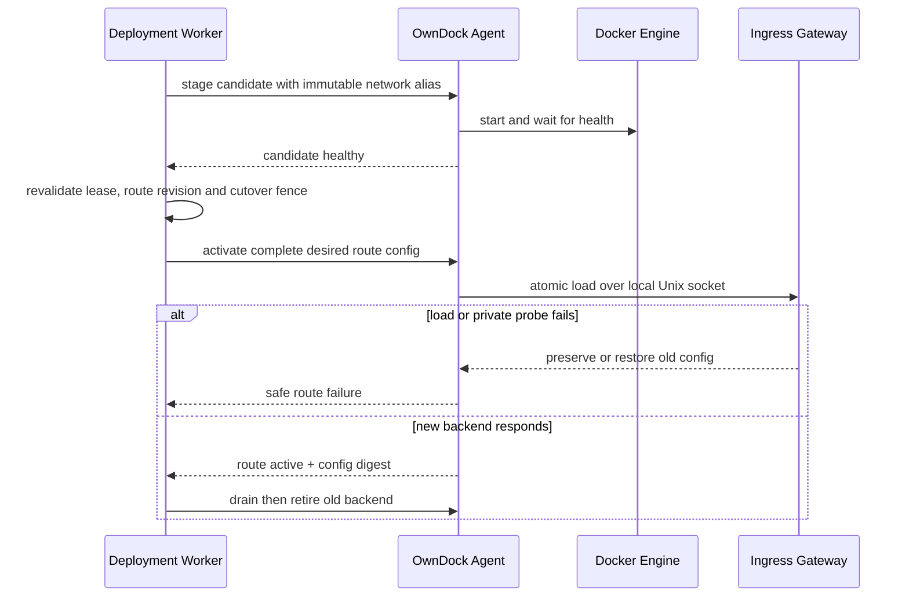

# Application ingress

OwnDock 将应用入口定义为稳定 hostname 到某个 Application、Environment 和 Runtime Target 当前成功 Deployment 的路由。Release 端口只是容器内部声明；容器运行或改名不代表用户流量已经切换。

`ApplicationRoute` 的 desired-state 领域、MongoDB Repository、RBAC、审计和 HTTP/OpenAPI 已实现；创建或更新只接受为 `pending`，不代表公网入口已配置。Agent capability、Host fence、Gateway 和 Deployment 切流编排尚未实现，因此当前版本仍只交付容器，不绑定宿主端口，也不应宣称自动低停机流量切换。

## 目标模式

- `managed`：推荐模式。安装 Agent 的主机运行独立 Ingress Gateway，OwnDock 负责 HTTP/HTTPS route、自动证书状态、切换、回滚和有限连接排空。
- `external`：客户继续管理自己的负载均衡器、反向代理、DNS 和证书。OwnDock 只报告 Deployment，不把外部流量状态推断成 ready。

managed ingress 首期只支持 Agent Runtime Target。网关不会挂载 Docker Socket、MongoDB、Agent 身份或应用 Secret；管理接口只通过 Agent 可访问的权限受限 Unix Socket。浏览器和 Server 都不能提交任意代理配置。

## 资源边界

`ApplicationRoute` 属于 Project，固定 Application、Environment、Runtime Target、规范化 hostname、Release 命名 HTTP 端口和 TLS 模式。同一 Organization 中活动 hostname 唯一。API 只允许 Agent Runtime Target；`disabled` TLS 只允许 development Environment，staging/production 强制 `automatic`。一个 Project 最多保留 128 条活动 Route。

控制面开放 `GET/POST /api/v1/projects/{project_id}/application-routes` 与 `GET/PATCH /api/v1/projects/{project_id}/application-routes/{route_id}`。Application、Environment 和 Runtime Target 绑定创建后不可修改；PATCH 使用 `expected_version` 乐观锁，成功后回到 `pending`。删除会依赖真实网关清理和 fence，因此在执行面完成前不开放。

首期不包括 wildcard、path routing、任意 Header 改写、用户插件、自带证书、DNS-01、TCP/UDP、多 Target 负载均衡或跨主机高可用。

## 切换顺序

网关加载成功不是唯一门禁。Agent 还必须使用 hostname 和固定路径执行私有探测，并返回期望 config digest。旧 backend 只有在控制面提交成功和排空预算结束后才会删除。过期 Route revision、Deployment ID 或 cutover sequence 不能覆盖较新 route。

## 自动 HTTPS 前置条件

自动 HTTPS 要求 hostname DNS 指向目标主机或前置四层 LB，公网 80/443 可达，端口未被其他进程占用，网关能访问配置的 ACME CA，并且证书数据目录持久可写。OwnDock 不会在首期持有 DNS Provider 凭据或自动修改 DNS。

首次上线没有旧 route 可回退。证书或私有探测失败时，Route 保持 provisioning/degraded，不能展示为入口 ready。单主机 managed ingress 也不等于高可用。

## 验收门槛

已进入自动门禁的控制面范围：领域规范化与状态转换、角色权限、绑定不可变、非开发环境 TLS 底线、Project 配额、OpenAPI/实现一致性，以及 Mongo hostname 唯一、跨 Organization 隔离和 revision 冲突。Mongo 实测需要 `OWNDOCK_RUN_MONGO_INTEGRATION=1`，并使用仓库固定的非 `latest` MongoDB 镜像。

以下仍是执行面与联合验收门槛：

- 多 Application 在同一 Host 按 Host/SNI 隔离；
- 并发 hostname 创建、更新和过期命令有持久 fence；
- candidate 不健康、网关拒绝、Agent/网关断线和响应丢失不破坏旧 route；
- Agent/Gateway 重启能从持久状态与控制面期望配置收敛；
- 端口冲突、DNS、ACME、证书续期和只读磁盘使用稳定安全错误；
- HTTP/1.1、HTTP/2、WebSocket、长连接、IPv4/IPv6 和真实回滚停机预算通过客户等价主机验收；
- 日志、Trace、MongoDB、Agent 状态和测试 artifact 不包含证书、ACME 或应用秘密。
