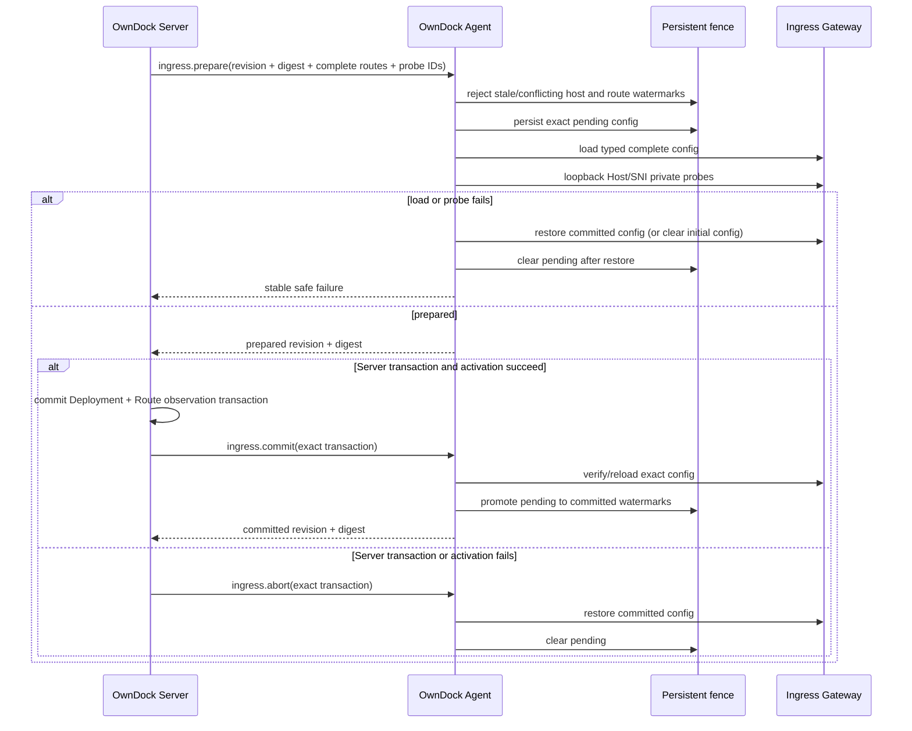
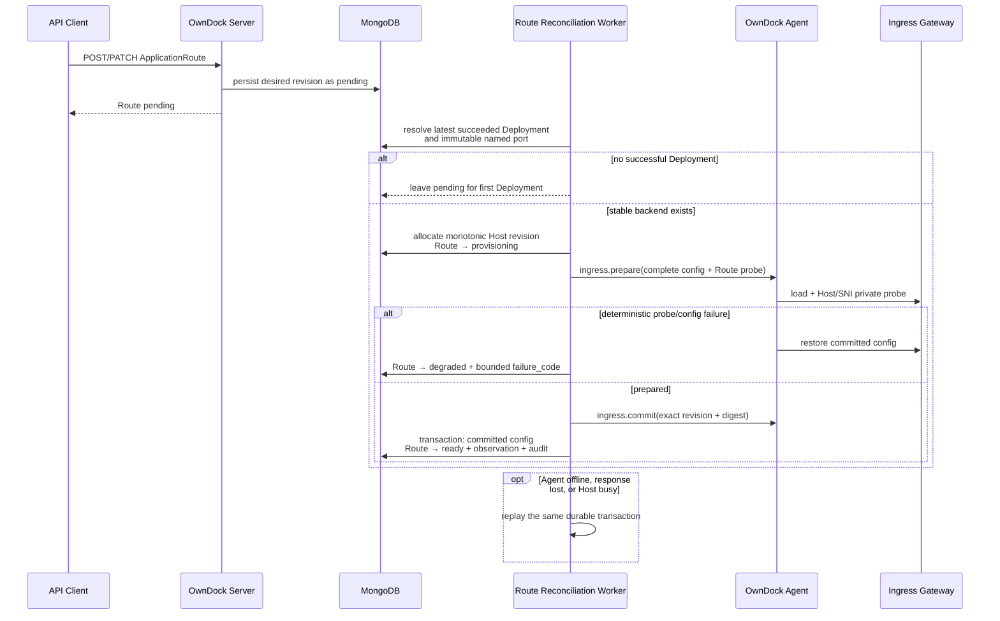
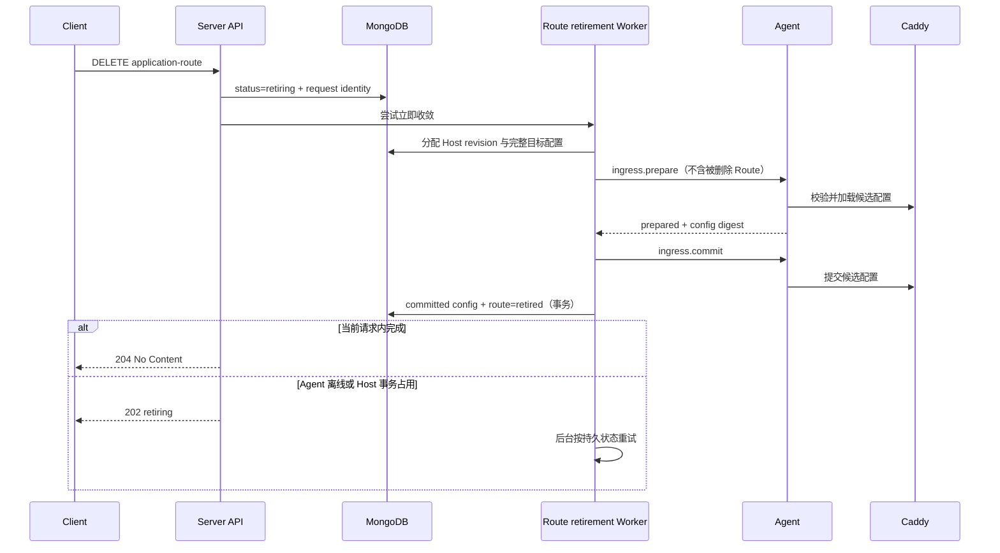

# Application ingress

OwnDock 将应用入口定义为稳定 hostname 到某个 Application、Environment 和 Runtime Target 当前成功 Deployment 的路由。Release 端口只是容器内部声明；容器运行或改名不代表用户流量已经切换。

`ApplicationRoute` 的 desired-state 领域、MongoDB Repository、RBAC、审计和 HTTP/OpenAPI 已实现；创建或更新先进入 `pending`，不直接代表公网入口已配置。若绑定槽位已有成功 Deployment，独立 Route Reconciliation Worker 会解析该稳定运行身份和 Release 命名端口，以持久 Host transaction 执行完整配置 prepare、私有探测和 commit，无需为了新增域名或修改 TLS 再部署应用；没有成功 Deployment 时保持 `pending`，由首次 Deployment 切流接管。Server Deployment Worker 已接入另一条持久 Host cutover transaction：匹配 Route 时先固定 Host revision 与原始运行身份，再执行 stage、route prepare/私有探测、activate、Deployment `committing` + Route observation 原子事务、route commit、固定 30 秒 drain 和 retire；不确定响应保留可领取状态，后继 Worker 用新租约授权、按原始运行身份精确重放。三个 Host 配置写入者——Route 主动调和、Deployment 切流和 Route 退役——在同一 Host 文档上互斥并安全重试。Agent 具备类型化 `ingress.prepare/commit/abort`、跨重启 pending/committed 完整配置与 Host/Route fence、固定 Caddy JSON/Unix Socket Gateway adapter 和 Host/SNI 私有探测。仓库的 Linux-kernel 容器门禁已通过真实 Gateway 和生产 Worker 组合链；自动 HTTPS、原生 systemd 主机和客户等价流量门禁仍未完成，因此不能据此宣称生产级低停机流量切换。

## 目标模式

- `managed`：推荐模式。安装 Agent 的主机运行独立 Ingress Gateway，OwnDock 负责 HTTP/HTTPS route、自动证书状态、切换、回滚和有限连接排空。
- `external`：客户继续管理自己的负载均衡器、反向代理、DNS 和证书。OwnDock 只报告 Deployment，不把外部流量状态推断成 ready。

managed ingress 首期只支持 Agent Runtime Target。网关不会挂载 Docker Socket、MongoDB、Agent 身份或应用 Secret；管理接口只通过 Agent 可访问的权限受限 Unix Socket。浏览器和 Server 都不能提交任意代理配置。

direct Runtime Target 始终跳过 managed ingress 的 Host transaction、Route commit 和恢复路径。全局启用 managed ingress 不会改变 direct Deployment 的提交语义；两种连接模式不会共享入口状态。

## Agent desired config 与 fence

Server 每次发送同一 Host 的完整期望配置，而不是增量补丁或任意 Caddy JSON。三个 Ingress 事务命令最多携带 128 条按 Route ID 排序的类型化 Route；每条只包含 Route revision、Deployment ID、cutover sequence、Runtime Target ID、规范 hostname、受限 backend alias/port 和 TLS 模式。prepare 另列出需要私有探测的已有 Route ID。命令不携带用户 Header、插件、文件路径、证书、ACME 凭据、Docker Socket 或应用 Secret。

Host revision 对完整配置单调递增，config digest 覆盖 Host revision 和全部 Route 字段。Agent 在调用网关之前检查本机持久 fence：旧 Host revision、同 revision 不同 digest、旧 Route revision、旧 cutover sequence，以及同一水位换 Deployment 都会失败关闭。prepare 只写 pending，并保留上一个 committed 完整配置；Caddy load 与 Host/SNI 私有探测都成功、Server 的 Mongo 事务提交后，commit 才推进不可逆 fence。abort 会先恢复 committed Gateway 配置，再清除 pending。Agent/Worker 在任一阶段重启都从同一原子状态文件继续。

Route 从完整配置中消失后，Agent 仍保留其 inactive 高水位。该记录不按 TTL、时间或容量淘汰，因此延迟命令不能重新引入已删除 Route；容量达到上限时拒绝新的 Route ID。状态文件使用受限权限、原子替换和重启恢复。后续资源退役必须提供显式、安全的精确回收协议，不能通过删最旧记录释放容量。



## 固定 Gateway 包

首个 Gateway 锁定为 `caddy:2.11.4-alpine@sha256:6aeddd44c3078b0f9a35206472a11420648a79c184603ef95957d0a20044cb2b`。镜像锁文件同时记录 linux/amd64 和 linux/arm64/v8 子 manifest digest；Compose 不接受 `latest` 或浮动 tag。

Gateway 使用独立 `owndock-ingress` 系统账号，容器显式 non-root、只读根文件系统、先 drop all capabilities 再只加入 `NET_BIND_SERVICE`，并启用 `no-new-privileges`。固定上游 Caddy 二进制带该文件 capability；保留同名 capability 是在 `no-new-privileges` 下允许内核执行它所需的最小边界，实际配置仍只监听容器 8080/8443，并只映射宿主 80→容器 8080 和 443→8443。它不挂载 Docker Socket；唯一控制入口是共享运行目录中的 `0660` Unix Socket。证书数据 `/data` 与 Caddy autosave `/config` 分别持久化，启动时 `--resume` 先恢复最后成功配置；Agent 再通过 config digest 对应的 Caddy `@id` 检查当前配置，不一致才提交完整 `/load`。应用候选只能由类型化 stage 选择加入同名固定 Docker network，backend alias 由 Deployment ID 派生，Server 和用户不能指定任意网络或 alias。开发环境全部为 `tls=disabled` 时不会监听容器 HTTPS 端口。

代码生成器已经用 Caddy 2.11.4 官方二进制执行 `caddy validate`。这证明 JSON schema/模块可加载，不等于主机端口、Docker 网络、ACME 或流量行为已经通过系统验收。

仓库还提供 `make test-ingress-integration` Linux 门禁：它以固定 digest 启动受限 Caddy、三个静态后端和两个协议后端，通过实际 Unix admin socket 与流量验证多 Host 隔离、HTTP/1.1、WebSocket、长响应、prepare 切流、旧连接有界保留、新连接进入新后端、abort 恢复、commit 固化、坏后端私有探测回滚，以及 Gateway 重启从 autosave 恢复。生产 Worker 组合链还断言坏后端最终只记录有界 `backend_unhealthy`，同时保留旧路由、旧稳定容器并清理候选。候选刚启动但 marker 尚未出现时，私有探测会在原请求超时预算内以 100 毫秒间隔重试；连接、TLS、上下文错误仍立即失败关闭。协议后端是门禁运行时由仓库源码构建的静态 Go 二进制，复制进固定 digest 容器，不引入浮动测试镜像。该门禁已在一次性 Linux arm64 容器与隔离 Docker Engine 中完整通过；这属于 Linux 内核执行证据，不替代原生 Ubuntu/systemd、宿主 80/443、公网 DNS/ACME 或客户物理主机认证。

## 资源边界

`ApplicationRoute` 属于 Project，固定 Application、Environment、Runtime Target、规范化 hostname、Release 命名 HTTP 端口和 TLS 模式。同一 Organization 中活动 hostname 唯一。API 只允许 Agent Runtime Target；`disabled` TLS 只允许 development Environment，staging/production 强制 `automatic`。一个 Project 最多保留 128 条活动 Route。

控制面开放 `GET/POST /api/v1/projects/{project_id}/application-routes` 与 `GET/PATCH/DELETE /api/v1/projects/{project_id}/application-routes/{route_id}`。Application、Environment 和 Runtime Target 绑定创建后不可修改；PATCH 使用 `expected_version` 乐观锁，成功后回到 `pending`。已有成功 Deployment 时后台主动调和；没有时等待首次 Deployment。主动调和处于 `provisioning` 时 DELETE 返回冲突，避免把尚未确定的 Gateway prepare 与删除并发执行；客户端在本轮事务收敛后重试。DELETE 随后把 Route 持久化为 `retiring`，再以单调 Host revision 通过 Agent 移除 Caddy 配置；网关提交后才进入 `retired`。Agent 暂时离线或 Host 上有其他事务时返回 `202`，后台 Worker 会从 MongoDB 恢复。

## 已有 Deployment 上的 Route 主动调和



主动调和只读取最新成功 Deployment，不启动、替换或删除容器。它冻结 Deployment ID、cutover sequence、Managed Host、确定性 backend alias 和命名 TCP 端口；私有探测通过后才写 `ready`。配置错误或确定性探测失败进入 `degraded`，Agent 离线和响应不确定则保留可重放事务。Deployment 同时到达时会收到可重试占用结果，等待 Route 事务释放 Host 后继续，不会把短暂的配置竞争写成 Deployment 失败。

Application、Environment 或 Runtime Target 的退役也会先收敛关联 Route。只有公网入口已从网关提交配置中消失后，控制面才继续删除运行实例和资源元数据，避免残留入口指向已退役容器。



首期不包括 wildcard、path routing、任意 Header 改写、用户插件、自带证书、DNS-01、TCP/UDP、多 Target 负载均衡或跨主机高可用。

## 切换顺序

```mermaid
sequenceDiagram
    participant W as Deployment Worker
    participant M as MongoDB
    participant A as OwnDock Agent
    participant D as Docker Engine
    participant G as Ingress Gateway

    W->>M: begin durable Host transaction<br/>freeze revision + original execution identity
    W->>A: stage candidate with frozen identity + immutable network alias
    A->>D: start and wait for health
    A-->>W: candidate healthy
    W->>W: revalidate lease, route revision and cutover fence
    W->>A: ingress.prepare(complete desired config + probe IDs)
    A->>G: atomic load over local Unix socket + private probe
    alt load or private probe fails
        G-->>A: preserve or restore old config
        A-->>W: safe route failure
    else prepared
        A-->>W: prepared revision + digest
        W->>M: validate current Worker lease
        W->>A: authorize with current lease;<br/>activate frozen identity and preserve previous
        W->>M: transaction: Deployment → committing<br/>Route observation → ready + audit
        W->>A: ingress.commit(exact transaction)
        A-->>W: committed revision + digest
        W->>W: bounded 30s drain
        W->>A: retire exact previous backend
        W->>M: Deployment → succeeded + audit
    end
    opt Worker is replaced or user cancels before committing
        W->>A: ingress.abort restores committed Gateway config
        W->>A: tombstone and cancel frozen identity
        A->>D: remove candidate/current; restore previous if activated
        W->>M: clear pending Host transaction
    end
```

网关加载成功不是唯一门禁。Agent 还必须使用 hostname 和固定路径执行私有探测，并返回期望 config digest。旧 backend 只有在控制面提交成功和排空预算结束后才会删除。过期 Route revision、Deployment ID 或 cutover sequence 不能覆盖较新 route。

## 自动 HTTPS 前置条件

自动 HTTPS 要求 hostname DNS 指向目标主机或前置四层 LB，公网 80/443 可达，端口未被其他进程占用，网关能访问配置的 ACME CA，并且证书数据目录持久可写。OwnDock 不会在首期持有 DNS Provider 凭据或自动修改 DNS。

首次上线没有旧 route 可回退。自动 TLS 私有探测会验证精确 hostname/SNI 和系统信任链：证书校验失败或本机 TLS listener 返回握手告警时使用稳定 `ingress_certificate_unavailable`，listener 无法连接使用 `ingress_gateway_unavailable`，TLS 已建立但精确 marker 缺失才是 `ingress_backend_unhealthy`。原始 TLS、ACME、网关和应用错误不会进入 Agent wire 或持久结果。切换最终回滚时，如果旧 observation 仍匹配当前 Route revision，控制面恢复 `ready` 并继续展示已证明可用的旧 Deployment；首次发布或 hostname/port/TLS desired revision 已变化时才进入 `degraded`，其只读 `failure_code` 仅保存安全产品枚举（包括 runtime/port/certificate/gateway/backend/fence/state/configuration/canceled/unknown）。运行时错误只从既有安全执行类别映射为 `runtime_unavailable`，不复制 Docker、Registry 或 Agent 原始错误。重新 provisioning 或 ready 会清除该字段。单主机 managed ingress 也不等于高可用。

## 监控与告警

Server 从 `/metrics` 暴露 `owndock_managed_ingress_operations_total{phase,result}` 和 `owndock_managed_ingress_operation_duration_seconds{phase,result}`。阶段覆盖事务建立、运行时 stage/activate/cancel/retire、route prepare/commit/restore、控制面提交和事务结束；标签仅使用代码固定阶段与 `success/error`，不包含 Host、Route、Deployment、错误文本或应用配置。

生产告警应优先关注 `route_prepare`、`runtime_activate`、`route_commit` 和 `runtime_retire` 的错误增量，并结合阶段耗时分位数与 Deployment Worker 最近成功时间判断卡住或外部依赖退化。指标用于发现切换阶段，不替代 Route observation、审计和受控 Trace 排障。

## 验收门槛

已进入自动门禁的范围：领域规范化与状态转换、角色权限、绑定不可变、非 development 环境 TLS 底线、Project 配额、OpenAPI/实现一致性、Mongo hostname 唯一/隔离/revision 冲突，已有成功 Deployment 上的 Route 主动调和、Server Host revision/持久事务/Route observation 与 Deployment `committing` 接管，以及 Agent wire canonicalization、完整配置 digest、Host/Route/Deployment/cutover fence、原子状态恢复和失败关闭。Replica Set 用例还会把成功响应视为丢失，以新的 Store/Coordinator 重复主动调和和退役，以及 Deployment prepare、控制面提交、Gateway commit、finish、restore 与 abort，验证重放仍使用原始运行身份。Mongo 实测需要 `OWNDOCK_RUN_MONGO_INTEGRATION=1`，并使用仓库固定的非 `latest` MongoDB 镜像；测试代码编译通过不等于已获得 Replica Set 实跑证据。

以下仍是执行面与联合验收门槛：

- 多 Application 在同一 Host 按 Host/SNI 隔离；
- 并发 hostname 创建、更新和过期命令在真实 Gateway/主机链路中保持已实现的持久 fence；
- candidate 不健康、网关拒绝、Agent/网关断线和响应丢失不破坏旧 route；
- Agent/Gateway 重启能从持久状态与控制面期望配置收敛；
- 端口冲突、DNS、ACME、证书续期和只读磁盘使用稳定安全错误；
- HTTP/2、自动 HTTPS、IPv4/IPv6 和真实回滚停机预算通过客户等价主机验收；仓库 Linux 门禁已编码 HTTP/1.1、WebSocket 和长响应切换不断流；
- 日志、Trace、MongoDB、Agent 状态和测试 artifact 不包含证书、ACME 或应用秘密。
