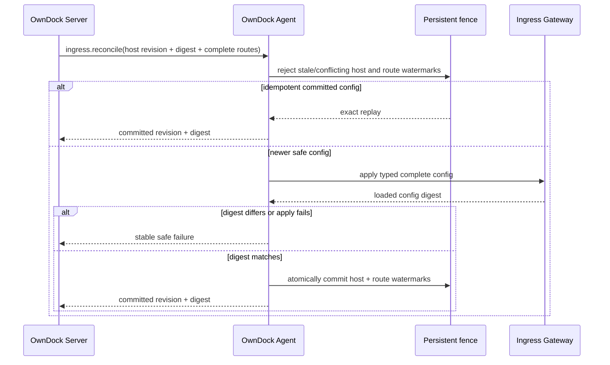
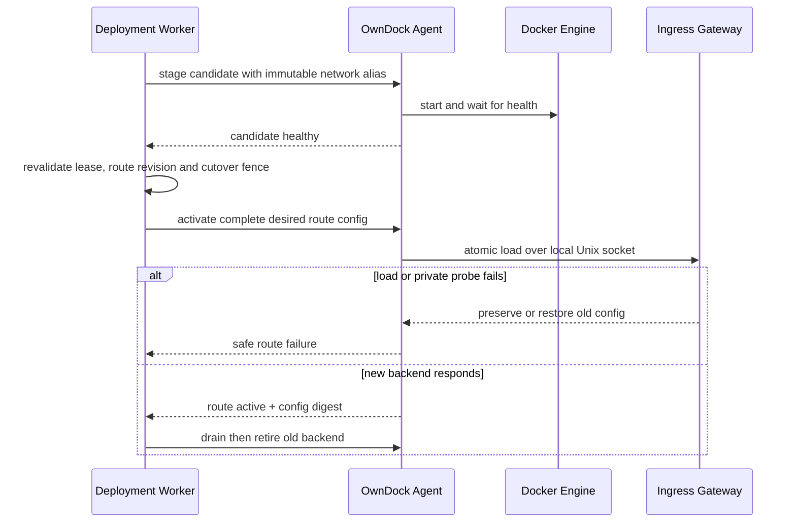

# Application ingress

OwnDock 将应用入口定义为稳定 hostname 到某个 Application、Environment 和 Runtime Target 当前成功 Deployment 的路由。Release 端口只是容器内部声明；容器运行或改名不代表用户流量已经切换。

`ApplicationRoute` 的 desired-state 领域、MongoDB Repository、RBAC、审计和 HTTP/OpenAPI 已实现；创建或更新只接受为 `pending`，不代表公网入口已配置。Agent 已具备类型化 `ingress.reconcile` 协议、Server adapter，以及跨重启保留的 Host/Route fence，但 capability 默认关闭，固定 Caddy Gateway、生产 wiring 和 Deployment 切流编排尚未实现。因此当前版本仍只交付容器，不绑定宿主端口，也不应宣称自动低停机流量切换。

## 目标模式

- `managed`：推荐模式。安装 Agent 的主机运行独立 Ingress Gateway，OwnDock 负责 HTTP/HTTPS route、自动证书状态、切换、回滚和有限连接排空。
- `external`：客户继续管理自己的负载均衡器、反向代理、DNS 和证书。OwnDock 只报告 Deployment，不把外部流量状态推断成 ready。

managed ingress 首期只支持 Agent Runtime Target。网关不会挂载 Docker Socket、MongoDB、Agent 身份或应用 Secret；管理接口只通过 Agent 可访问的权限受限 Unix Socket。浏览器和 Server 都不能提交任意代理配置。

## Agent desired config 与 fence

Server 每次发送同一 Host 的完整期望配置，而不是增量补丁或任意 Caddy JSON。`ingress.reconcile` 最多携带 128 条按 Route ID 排序的类型化 Route；每条只包含 Route revision、Deployment ID、cutover sequence、Runtime Target ID、规范 hostname、受限 backend alias/port 和 TLS 模式。命令不携带 Header、插件、文件路径、证书、ACME 凭据、Docker Socket 或应用 Secret。

Host revision 对完整配置单调递增，config digest 覆盖 Host revision 和全部 Route 字段。Agent 在调用网关之前检查本机持久 fence：旧 Host revision、同 revision 不同 digest、旧 Route revision、旧 cutover sequence，以及同一水位换 Deployment 都会失败关闭。网关只有返回完全相同的 config digest 后才提交 fence；失败或响应不匹配不会把未确认配置记录为成功。

Route 从完整配置中消失后，Agent 仍保留其 inactive 高水位。该记录不按 TTL、时间或容量淘汰，因此延迟命令不能重新引入已删除 Route；容量达到上限时拒绝新的 Route ID。状态文件使用受限权限、原子替换和重启恢复。后续资源退役必须提供显式、安全的精确回收协议，不能通过删最旧记录释放容量。

## 资源边界

`ApplicationRoute` 属于 Project，固定 Application、Environment、Runtime Target、规范化 hostname、Release 命名 HTTP 端口和 TLS 模式。同一 Organization 中活动 hostname 唯一。API 只允许 Agent Runtime Target；`disabled` TLS 只允许 development Environment，staging/production 强制 `automatic`。一个 Project 最多保留 128 条活动 Route。

控制面开放 `GET/POST /api/v1/projects/{project_id}/application-routes` 与 `GET/PATCH /api/v1/projects/{project_id}/application-routes/{route_id}`。Application、Environment 和 Runtime Target 绑定创建后不可修改；PATCH 使用 `expected_version` 乐观锁，成功后回到 `pending`。删除会依赖真实网关清理和 fence，因此在执行面完成前不开放。

首期不包括 wildcard、path routing、任意 Header 改写、用户插件、自带证书、DNS-01、TCP/UDP、多 Target 负载均衡或跨主机高可用。

## 切换顺序

网关加载成功不是唯一门禁。Agent 还必须使用 hostname 和固定路径执行私有探测，并返回期望 config digest。旧 backend 只有在控制面提交成功和排空预算结束后才会删除。过期 Route revision、Deployment ID 或 cutover sequence 不能覆盖较新 route。

## 自动 HTTPS 前置条件

自动 HTTPS 要求 hostname DNS 指向目标主机或前置四层 LB，公网 80/443 可达，端口未被其他进程占用，网关能访问配置的 ACME CA，并且证书数据目录持久可写。OwnDock 不会在首期持有 DNS Provider 凭据或自动修改 DNS。

首次上线没有旧 route 可回退。证书或私有探测失败时，Route 保持 provisioning/degraded，不能展示为入口 ready。单主机 managed ingress 也不等于高可用。

## 验收门槛

已进入自动门禁的范围：领域规范化与状态转换、角色权限、绑定不可变、非开发环境 TLS 底线、Project 配额、OpenAPI/实现一致性、Mongo hostname 唯一/隔离/revision 冲突，以及 Agent wire canonicalization、完整配置 digest、Host/Route/Deployment/cutover fence、原子状态恢复和失败关闭。Mongo 实测需要 `OWNDOCK_RUN_MONGO_INTEGRATION=1`，并使用仓库固定的非 `latest` MongoDB 镜像。

以下仍是执行面与联合验收门槛：

- 多 Application 在同一 Host 按 Host/SNI 隔离；
- 并发 hostname 创建、更新和过期命令在真实 Gateway/主机链路中保持已实现的持久 fence；
- candidate 不健康、网关拒绝、Agent/网关断线和响应丢失不破坏旧 route；
- Agent/Gateway 重启能从持久状态与控制面期望配置收敛；
- 端口冲突、DNS、ACME、证书续期和只读磁盘使用稳定安全错误；
- HTTP/1.1、HTTP/2、WebSocket、长连接、IPv4/IPv6 和真实回滚停机预算通过客户等价主机验收；
- 日志、Trace、MongoDB、Agent 状态和测试 artifact 不包含证书、ACME 或应用秘密。
