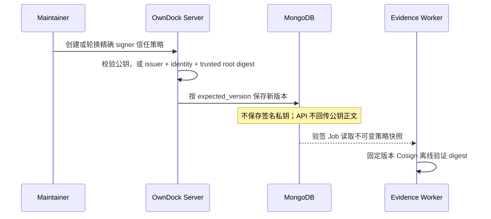
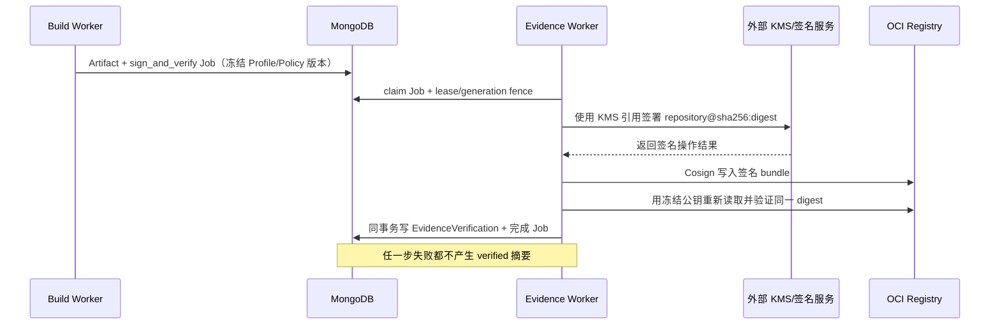
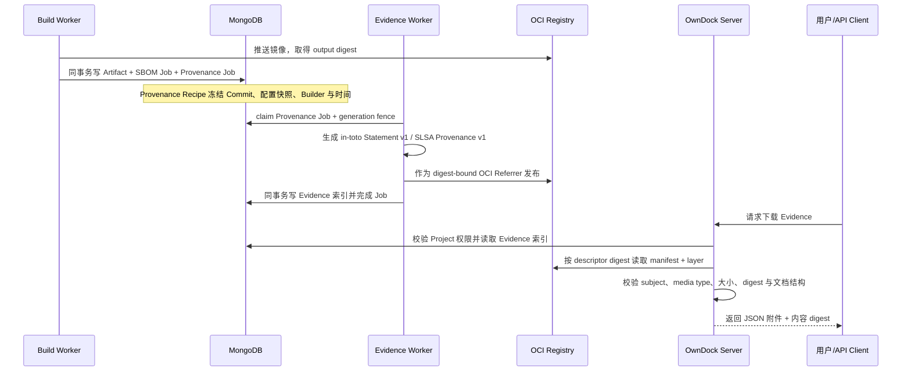
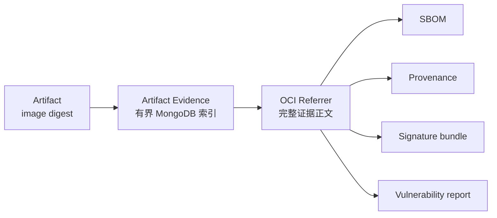
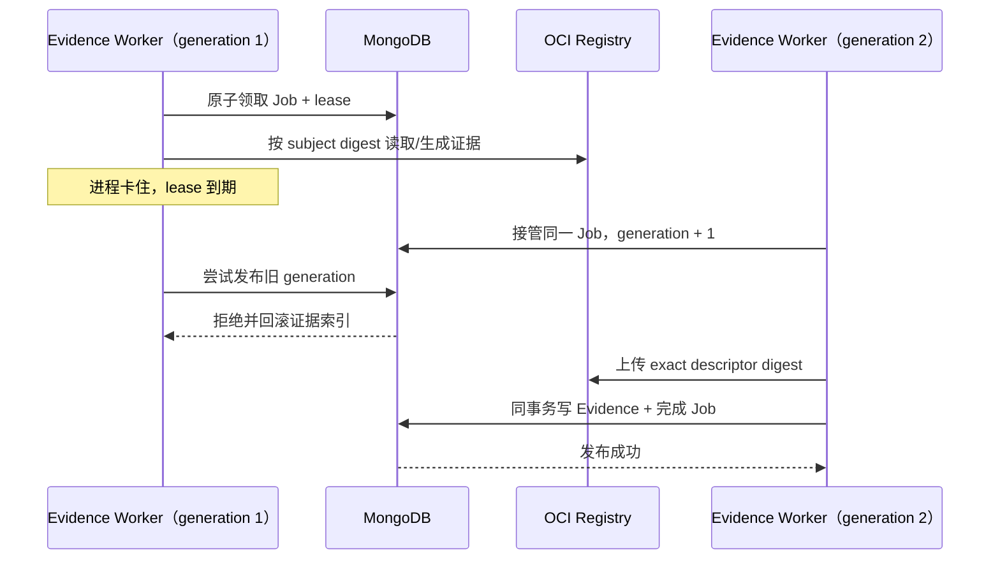
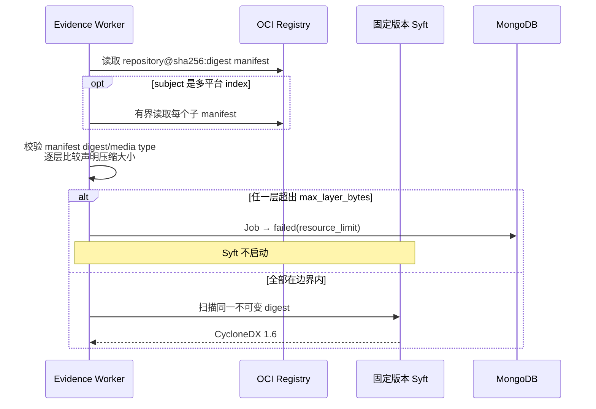
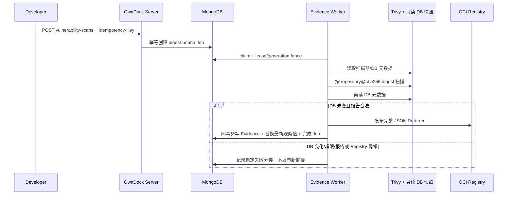
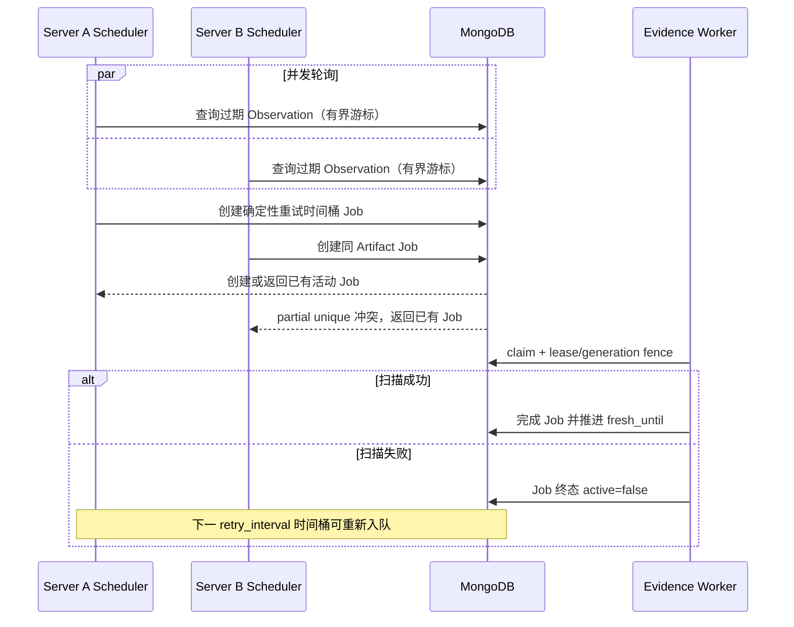

# Artifact Evidence：镜像证据索引

Artifact Evidence 是“这个镜像有哪些可验证材料”的安全目录。它绑定不可变 OCI SHA-256 digest，不绑定会移动的镜像 Tag。

当前后端已实现 Evidence 领域模型、MongoDB 索引、元数据查询与授权下载 API，以及内部 Evidence Job 的原子领取、租约续期、generation fence 和事务发布协议。Build 发布 Artifact 时会在同一 MongoDB 事务中幂等创建 CycloneDX 1.6 SBOM、SLSA Provenance v1 和 Trivy 漏洞扫描 Job；Provenance Recipe 同时冻结精确 Commit、无秘密 Build Configuration 快照、Builder/BuildKit/frontend 身份、执行时间和最终 output digest，Evidence Worker 不回查可变配置。

外部 CI 镜像使用同一个 Artifact/Evidence 模型，但信任边界不同：登记精确 digest 后，OwnDock 原子排入 SBOM、漏洞扫描以及当前 Project 适用的已有签名验证 Job；不会生成 OwnDock Build Provenance，也不会调用 OwnDock Signing Profile 代替第三方生产者签名。Artifact 的 `producer` 保持调用方声明，`producer_verification=declared`。OwnDock 后续生成的 SBOM 或漏洞报告只能证明“平台检查过这个 digest”，不能证明“平台构建了这个镜像”。登记流程与 API 见 [Artifact 与 Release 交接](artifacts.md)。

独立 `owndock-evidence-worker` 已完成 MongoDB 队列、固定 Syft 启动验版、标准 in-toto Statement v1/SLSA Provenance v1 生成、ORAS Publisher、健康端点和有界指标装配。固定 Syft 1.50.0 镜像已在非 root、只读、无 capabilities 和资源上限下读取真实 htpasswd Registry；SBOM 与 Provenance 随后由 ORAS 认证发布，并可通过 Referrer 查询和授权 API 下载。错误密码失败关闭，Registry 密码只在单次拉取、发布或下载操作中存在并清零；证据、OCI manifest/blob、错误和 Registry 日志均通过秘密哨兵检查。

当前 Provenance 的 `verification_status` 是 `unverified`：它已经按 OCI digest 校验存储完整性和来源字段，但 Provenance 自身尚未形成受信任 Builder 的 DSSE 签名声明。镜像签名验证会单独写入不可变的 `EvidenceVerification` 摘要，不能用它反向把所有 SBOM 或 Provenance 自动标记为可信。漏洞报告、原子数据库更新、限时漏洞豁免、版本化 Deployment Policy 和 Registry 镜像层超限前置拒绝已实现，但客户生产环境矩阵仍待后续任务，因此不能据此宣称镜像已完成完整供应链验证，也不能宣称 SLSA Build L2/L3。

## 签名信任策略

OwnDock 已提供 Project 级、版本化的签名信任策略。策略不是“存在任意签名即可”，而是二选一固定信任对象：

- `public_key`：保存规范化后的验签公钥，API 只返回其 SHA-256 指纹；私钥不会被 API 接收、保存或返回；
- `keyless`：同时固定离线 trusted root 的引用与 SHA-256 digest、完整 certificate identity 和 HTTPS OIDC issuer，不接受通配符或正则表达式。

```http
POST /api/v1/projects/{project_id}/signature-trust-policies
GET /api/v1/projects/{project_id}/signature-trust-policies
GET /api/v1/projects/{project_id}/signature-trust-policies/{policy_id}
PATCH /api/v1/projects/{project_id}/signature-trust-policies/{policy_id}
Authorization: Bearer <session-token>
Content-Type: application/json
```

Viewer 及以上角色可以读取策略；只有 Maintainer 和 Owner 可以创建、轮换、禁用策略。更新必须提交 `expected_version`，发生并发修改时返回 `409`。每次轮换都会递增版本；后续验签 Job 使用创建时冻结的策略快照，不能被随后发生的公钥或 trusted root 轮换悄悄改变。



固定 Cosign `3.0.6` 的适配器、Evidence Job 和 Worker 已接通。Build 成功后会为启用的策略冻结 Policy ID、版本、公钥指纹或 trusted-root digest、identity 与 issuer；手动验证也使用同样的不可变快照。Worker 只接受 `repository@sha256:digest`，在私有临时目录注入 Registry 凭据与 trust material，校验工具精确版本、默认 claims 和 Cosign JSON 结果，并把规范化结果集合的 SHA-256 摘要写入 MongoDB。版本漂移、错误签名、错误身份、错误可信根、异常输出或 Registry 断网都会失败关闭。

Cosign v3 已弃用旧的 `--offline` 工作方式。OwnDock 不依赖这个开关：

- 私有公钥模式使用无 Fulcio、Rekor、OIDC 或 TSA 服务的显式 signing-config，并用固定公钥直接验证 bundle；因为该模式本来就没有透明日志服务，所以只跳过透明日志包含证明，不跳过签名、payload、镜像 identity 或 digest 校验；
- keyless 模式必须提供内容 digest 固定的离线 trusted root，并精确验证 certificate identity、OIDC issuer 和透明日志材料，不允许使用“忽略透明日志”参数；
- 两种模式都不会为了获取默认 TUF/Sigstore 配置而访问公共服务。生产网络仍应只放行 MongoDB、目标 Registry、所选 KMS/签名服务及必要 DNS。

真实 Distribution 3.0.0 门禁已验证：正确公钥通过；同一签名不能重放到另一个镜像 digest；轮换到不受信任公钥会拒绝；Registry 断网会失败关闭。固定 Vault 1.20.4 TLS Transit 门禁还会用真实不可导出 P-256 key 完成签名后复验，轮换 Transit key 后证明旧公钥拒绝、新公钥通过，并验证 Vault 停机和 Cosign operation deadline 均失败关闭。专用 CI 已加入固定私有 Sigstore 栈的真实 keyless 证书/bundle 门禁：签名后停止 Fulcio/Rekor/CT/TSA/TUF 承载节点，离线验证精确 identity/issuer、跨 digest 重放和透明日志根材料；其首次 GitHub Actions 远程结果仍待取得。AWS/GCP/Azure/Kubernetes 等客户等价服务矩阵也仍属于后续系统验收，不能把已有结果扩大解释为所有 keyless/KMS 环境均已认证。

### 手动验证与失败重试

```http
POST /api/v1/projects/{project_id}/artifacts/{artifact_id}/signature-verifications
Authorization: Bearer <session-token>
Idempotency-Key: verify-release-20260822-01
Content-Type: application/json

{"policy_id":"release-signers"}
```

Developer、Maintainer 或 Owner 可以排入验证 Job。相同 `Idempotency-Key` 在同一 Artifact 和 Policy 版本下只创建一次，并返回同一个 `job_id`；临时 Registry 故障已经形成终态失败时，调用方应使用一个新键创建新的尝试。OwnDock 不复活或覆盖旧 Job，因此失败历史和审计记录仍可追溯。

验证成功后可查询有界摘要：

```http
GET /api/v1/projects/{project_id}/artifacts/{artifact_id}/verifications
Authorization: Bearer <session-token>
```

摘要包含 Artifact digest、Policy ID/版本、信任根指纹、精确 signer identity/issuer、Cosign 版本和已验证 bundle 集合摘要。完整 bundle 仍保存在 OCI Registry，MongoDB 不复制无限增长的签名内容。

## 外部密钥签名

OwnDock 的 Signing Profile 是“用哪把外部受管密钥签名，以及签完后用哪个公钥策略复验”的版本化配置，不是 Webhook 地址，也不是私钥内容。首版接受 Cosign 原生的 `awskms://`、`gcpkms://`、`azurekms://`、`hashivault://` 和 `k8s://` 引用；拒绝本地文件、`env://` 私钥和普通 HTTP URL。API 响应只返回 provider 与引用的 SHA-256 指纹，不回传完整 KMS URI 或凭据。

```http
POST /api/v1/projects/{project_id}/signature-signing-profiles
GET /api/v1/projects/{project_id}/signature-signing-profiles
GET /api/v1/projects/{project_id}/signature-signing-profiles/{profile_id}
PATCH /api/v1/projects/{project_id}/signature-signing-profiles/{profile_id}
Authorization: Bearer <session-token>
Content-Type: application/json
```

启用的 Signing Profile 必须引用同 Project 中已启用的 `public_key` 信任策略。Build 调度器会创建一个 `sign_and_verify` Job：先按冻结的 KMS 引用对镜像 digest 签名，再用冻结的公钥复验 Registry 中刚写入的签名；两步都成功后才发布验证摘要。这样可以发现错误 KMS key、签名写入异常和 Registry 中内容被替换的问题。



KMS 认证信息只从 Evidence Worker 的执行环境读取，并按 provider 使用白名单：AWS 使用静态凭据或 Web Identity 加区域；GCP 使用绝对路径的 Application Credentials 文件；Azure 使用 tenant/client 加 secret 或 federated token 文件；Vault 使用不带业务路径、查询或 fragment 的精确 HTTPS `VAULT_ADDR`、Token 和可选 namespace/绝对 CA 路径；Kubernetes 使用绝对路径 `KUBECONFIG`。凭据文件必须通过部署平台额外只读挂载，不能放进仓库、MongoDB、Signing Profile 或普通 API 请求。

## 为什么不把完整报告放进 Artifact

一个 Artifact 可能有多份不同类型、版本和生产者的证据。SBOM 和漏洞报告还可能很大，并会随着漏洞数据库更新反复生成。如果全部嵌进 Artifact 文档，会让普通 Artifact 查询、MongoDB 文档大小和历史保留互相耦合。

因此当前模型只保存：

- `subject_digest`：被证明的镜像 digest；
- `kind`：`sbom`、`provenance`、`signature` 或 `vulnerability_report`；
- `media_type`、`format_version` 与可选 `predicate_type`；
- `producer`：谁生成了这份材料；
- `registry_repository` 与 `descriptor_digest`：材料在 OCI Registry 中的稳定身份；
- `verification_status`：`unverified`、`verified` 或 `rejected`；
- 创建时间和 Organization/Project/Artifact 所有权。

证据正文作为 OCI Artifact/Referrer 保存，MongoDB 只承担权限查询和稳定索引。OwnDock 会先查询 Registry 的原生 Referrers API；若 Registry 按标准返回 `404`，则查询 `sha256-<digest>` 形式的 Referrers Tag Schema 索引。这是 OCI 标准兼容路径，不表示证据退化为普通镜像 Tag。两种方式都不可用时会明确报错，不会在缺失证据时标记成功。API 不返回 Registry 凭据、签名私钥或任意 Registry 下载地址；授权下载由 Server 代为读取 immutable descriptor 并完成完整性校验。

## 查询 API

```http
GET /api/v1/projects/{project_id}/artifacts/{artifact_id}/evidence
GET /api/v1/projects/{project_id}/artifacts/{artifact_id}/evidence/{evidence_id}
GET /api/v1/projects/{project_id}/artifacts/{artifact_id}/evidence/{evidence_id}:download
Authorization: Bearer <session-token>
```

Viewer、Developer、Maintainer 和 Owner 都可以读取自己有权访问的 Project Evidence。不存在或跨 Organization/Project 的 Artifact 统一返回 `404`，避免泄露资源是否存在。未知 query 参数会被拒绝；当前没有公开创建、覆盖或删除 Evidence 的 API。

下载不是把 Registry URL 原样交给浏览器。Server 会按 `descriptor_digest` 读取 OCI manifest，逐项校验 manifest digest、Artifact `subject_digest`、artifact/layer media type、单 layer 数量、大小和 layer digest，再校验 CycloneDX 1.6 或 SLSA Provenance v1 文档结构。只有全部通过才返回附件，同时提供 `ETag` 和 `X-OwnDock-Content-Digest`。Registry 不可达、密码错误、内容超限或任一 digest/subject 不一致时统一失败关闭，不返回部分内容。

下载并做一次本地核对：

```bash
curl --fail-with-body \
  -H "Authorization: Bearer ${OWNDOCK_TOKEN}" \
  -D evidence.headers \
  -o provenance.json \
  "https://your-owndock.example/api/v1/projects/project-01/artifacts/artifact-01/evidence/evidence-01:download"

sha256sum provenance.json
jq '{type: ._type, predicateType, subject, buildDefinition: .predicate.buildDefinition, builder: .predicate.runDetails.builder}' provenance.json
```

`sha256sum` 输出应与响应头 `X-OwnDock-Content-Digest` 去掉 `sha256:` 后一致；Provenance 的 `subject[0].digest.sha256` 应与 Artifact 镜像 digest 一致。不要把 `verification_status: unverified` 解读成已完成签名身份验证。

示例响应：

```json
{
  "items": [
    {
      "id": "evidence-01",
      "organization_id": "org-01",
      "project_id": "project-01",
      "artifact_id": "artifact-01",
      "subject_digest": "sha256:...",
      "kind": "sbom",
      "media_type": "application/vnd.cyclonedx+json",
      "format_version": "1.6",
      "producer": "owndock-evidence-worker/1.0.0",
      "registry_repository": "registry.example.com/team/api",
      "descriptor_digest": "sha256:...",
      "verification_status": "verified",
      "created_at": "2026-08-15T10:00:00Z"
    }
  ]
}
```

## SLSA Provenance v1 如何理解

Provenance 可以理解为镜像的“构建出生证明”。它回答四个问题：

1. **产物是什么**：`subject` 固定 Registry repository 与最终镜像 SHA-256 digest；
2. **源码是什么**：`resolvedDependencies` 固定无凭据 Git URI、完整 ref 与 40 位 Commit SHA；
3. **怎么构建**：`externalParameters` 和 `internalParameters` 固定 Application、Build Configuration 版本、Dockerfile、context、平台、资源上限、超时以及不可变 BuildKit/frontend 镜像；
4. **谁执行、何时执行**：`builder.id` 固定 OwnDock BuildKit Builder 模式，`metadata` 固定 Build ID 和开始/结束时间。

Build Configuration 的无秘密快照另以 SHA-256 `byproduct` 固定。Registry Credential ID、密码、Git Token、SSH 私钥、Environment 值和运行时 Secret 都不会进入 Provenance。



这里生成的是规范格式且字段可追溯的 Provenance，但在签名能力完成前仍显示 `unverified`。`unverified` 不等于内容可以被悄悄替换：下载路径仍会验证 OCI descriptor/layer digest；它表示目前还不能用可信 signer identity 证明“这份声明一定由被授权的 Builder 签发”。

完整字段定义、Builder 信任边界和验证清单见 [OwnDock Dockerfile Build Provenance v1](provenance-build-type.md)。

## 数据与信任关系



`verified` 只说明对应类型的证据经过了指定验证，不能简化成“镜像绝对安全”。例如签名验证通过只证明签名身份与内容完整性，不代表漏洞扫描通过。

## Worker 接管与发布



Registry 上传发生在 MongoDB 事务之前，因此失去租约的 Worker 最多留下一个没有被 OwnDock 索引的 OCI blob；它不能把 Job 标记成功，也不能覆盖新 generation 的结果。后台回收器后续可以按 Registry 保留策略清理这类孤立内容。

首版 SBOM 生成器固定为 Syft `1.50.0`，调用时显式指定 `cyclonedx-json@1.6`。Worker 启动时必须核对工具报告的精确版本，输出超过配置上限、格式版本漂移、JSON 损坏或组件缺少基本身份时均失败关闭。Provenance 由同一个隔离 Worker 根据事务内冻结的 Recipe 确定性生成，最大 4 MiB；生成和下载都会校验标准类型、subject、Commit、配置快照 digest、Builder 依赖和时间边界。这里固定的是可评审的工具和格式基线，不是承诺永远不升级；升级需要兼容测试、变更记录和新的不可变镜像 digest。

Syft 1.50.0 的 `source.image.max-layer-size` 对直接 Registry source 不构成完整前置门禁，因此 OwnDock 不把安全性押在这个上游参数上。Evidence Worker 会先用与 ORAS 相同的 TLS、CA、代理和 Registry Credential 回读精确 subject manifest；单平台镜像检查全部 layer descriptor，多平台 index 最多展开 63 个子 manifest，并验证子 manifest 的 SHA-256、媒体类型和声明大小。任一层声明的压缩 blob 大小超过 `max_layer_bytes` 时，Job 在 Syft 启动前以稳定 `resource_limit` 失败；畸形、递归或超限 index 失败关闭。Syft 参数继续保留作纵深防御，容器内存和 tmpfs 上限仍是执行期硬资源边界。



OCI 发布和授权读取使用 ORAS Go `2.6.2`。Registry 密码只由外部凭据提供器在单次操作中解析，不进入 Job、Evidence、错误文本或日志；Publisher 只接受 digest subject，并复核文档内容 digest 与最终 OCI manifest digest。明文 HTTP 只允许显式配置的本机集成测试，远程 Registry 必须使用 TLS 1.3 或更高版本。

## 运行 Evidence Worker

Evidence Worker 默认关闭。启用时配置 `runtime.evidence_worker.enabled: true`，并确保 MongoDB 已启用。`syft_executable` 必须是绝对路径，`syft_version` 只能是当前固定的 `1.50.0`；Worker 启动时会执行精确版本校验，版本不符就拒绝接单。`max_document_bytes` 默认 16 MiB，限制最终 SBOM 和 Server 下载；Provenance 另有 4 MiB 硬上限。`max_layer_bytes` 默认 256 MiB，限制 digest-bound manifest 中任一层声明的压缩 blob 大小，并在启动 Syft 前检查。两项都不能替代容器 512 MiB 临时目录和内存上限。若需要从宿主机采集指标，把容器使用的配置设为 `metrics_address: 0.0.0.0:9092`，Compose 仍只把端口绑定到宿主机回环地址。

Registry Credential 仍只在 MongoDB 保存 `secret://production` 这样的引用。对应的执行环境变量是 `OWNDOCK_REGISTRY_PRODUCTION_PASSWORD`；别名中的连字符转换为下划线。Evidence Worker 用它完成私有镜像拉取和证据发布，Server 用它完成已授权的证据下载；两种进程都只在单次 Registry 操作中解析密码并随后清零，不会写入 Job、Evidence、响应或错误消息。部署时必须把同一别名的秘密安全注入需要下载能力的 Server 实例，不能通过 API 配置或回读密码。

自建 Registry 使用企业 CA 时，通过 `product.registry_ca_cert_file` 给 Server、Build Worker 和 Evidence Worker 挂载同一份只读 PEM。Worker 启动时固定经过校验的内容，再用私有 `0600` 快照向 Syft、Trivy 和 Cosign 提供 `SSL_CERT_FILE`；不会关闭 TLS 或主机名校验。完整文件规则及 BuildKit/Docker daemon 的独立信任边界见 [Registry 连接与认证](registry-connections.md#自建-registry-的私有-ca)。

需要经过企业出口访问 Registry 时，设置无凭据的 `product.registry_https_proxy`。Server/Build Worker 的内置 OCI 客户端以及 Evidence Worker 的 ORAS、Syft、Trivy、Cosign 都只使用这个显式代理，不继承宿主环境代理；工具进程的 `NO_PROXY` 会被清空，Registry 凭据不会成为代理凭据。BuildKit、Docker daemon 和漏洞库 Updater 是独立网络边界，必须分别配置，详见 [Registry 显式代理](registry-connections.md#显式-registry-https-代理)。

```bash
make docker-evidence-worker VERSION=dev

OWNDOCK_EVIDENCE_WORKER_IMAGE='registry.example.com/owndock/evidence-worker@sha256:...' \
OWNDOCK_MONGODB_URI='mongodb://...' \
OWNDOCK_CONFIG_FILE='/etc/owndock/config.yaml' \
OWNDOCK_EVIDENCE_SECRET_ENV_FILE='/etc/owndock/evidence-secrets.env' \
OWNDOCK_TRUSTED_ROOTS_DIRECTORY='/etc/owndock/trusted-roots' \
OWNDOCK_TRIVY_DATABASE_ROOT='/var/lib/owndock/trivy-db' \
docker compose -f deploy/evidence-worker.compose.yaml up -d
```

`evidence-secrets.env` 可以同时包含 `OWNDOCK_REGISTRY_<ALIAS>_PASSWORD` 和当前启用 provider 所需的 KMS 环境变量，但文件本身必须在仓库外由部署系统管理。trusted root 目录中的文件必须是非符号链接普通文件，名称等于策略的 `trusted_root_id`，内容 SHA-256 必须等于策略冻结的 digest。GCP/AWS Web Identity/Azure Federated/Kubernetes/Vault CA 等文件型凭据需要通过客户自己的 Compose override 或编排清单只读挂载，并让环境变量指向容器内绝对路径。

容器使用固定非 root UID/GID `65532`、只读根文件系统、无 Linux capabilities、`no-new-privileges`、128 PID、1 CPU、1 GiB 内存和 512 MiB 临时目录。Compose 不能表达“只允许访问某个 Registry 或 KMS 域名”的出口策略，因此生产环境还必须通过主机防火墙或编排平台 NetworkPolicy，只放行 MongoDB、目标 Registry、所选 KMS/签名服务和必要 DNS。

## 后续阶段

签名公钥与 Vault Transit KMS 闭环、固定 Trivy 漏洞扫描、原子数据库更新、限时漏洞豁免、可选持续重扫和版本化 Deployment Policy 已经落地；策略会在创建 Deployment 前读取并完整校验证据正文，把实际策略版本、证据 digest、签名验证、漏洞观察值和命中豁免冻结为不可变快照。keyless 私有根真实 bundle 门禁已接入专用 CI 并等待首次远程结果；后续供应链阶段继续补齐其他 KMS provider 和客户网络矩阵。生产环境一旦启用强制策略，证据缺失、过期或无法验证必须失败关闭。详见 [Deployment Policy](deployment-policies.md)。

## 漏洞扫描与重扫

OwnDock 固定使用 Trivy `0.74.0`，Evidence Worker 镜像固定多架构 digest，不使用 `latest`。漏洞库与 Worker 镜像分开管理：独立的一次性 `owndock-vulnerability-db-updater` 下载到同卷 staging，校验版本、元数据、时效和 DB SHA-256，再原子切换 `/var/lib/owndock/trivy-db/current`；Evidence Worker 只读挂载父目录。Worker 扫描时强制 `--skip-db-update` 和 `--offline-scan`，不允许单个 Job 自行从公网改变安全基线。完整初始化、调度与恢复步骤见[Trivy 漏洞库快照运维](vulnerability-database.md)。

每次扫描前后都会读取数据库 schema version、`updated_at`、`downloaded_at` 和 `next_update`；两次结果不一致时失败关闭。详细 Trivy JSON 报告以 `application/vnd.aquasec.trivy.report+json` OCI Referrer 绑定精确镜像 digest，MongoDB 只保存最新的有界摘要：各严重级数量、可修复数量、最高严重级、扫描/数据库时间和完整报告 digest。报告 Evidence 历史不覆盖；“最新观察值”只是一个便于查询和策略计算的投影。



```http
POST /api/v1/projects/{project_id}/artifacts/{artifact_id}/vulnerability-scans
Authorization: Bearer <session-token>
Idempotency-Key: rescan-20260822-01

GET /api/v1/projects/{project_id}/artifacts/{artifact_id}/vulnerability-observation
Authorization: Bearer <session-token>
```

Developer、Maintainer 和 Owner 可以手动重扫；同一幂等键只代表同一次尝试，需要新扫描时必须换新键。Viewer 可读摘要和下载报告，不能发起扫描。`stale=true` 表示已达到配置的扫描年龄上限，或漏洞库已达到它声明的下次更新时间；这不等于“没有漏洞”。

基础持续重扫也是社区安全能力，但默认关闭。开启后由 Server 只调度 Job，不执行 Trivy；实际扫描仍由独立 Evidence Worker 完成。配置示例：

```yaml
product:
  vulnerability_rescan_enabled: true
  vulnerability_rescan_poll_interval: 5m
  vulnerability_rescan_retry_interval: 6h
  vulnerability_rescan_operation_timeout: 30s
  vulnerability_rescan_candidate_limit: 100
```

`poll_interval` 是发现过期 Observation 的频率，`retry_interval` 是失败任务可再次入队的时间桶，不是扫描结果有效期。成功扫描会写入新的 `fresh_until`，在它到期前不会重复调度。候选按 `(fresh_until, id)` 使用有界游标轮转，单次最多 1000 条；多个 Server 副本可以同时运行，MongoDB migration v52 的 partial unique index 保证同一 Artifact 最多只有一个活动漏洞任务。手动请求若撞上活动任务，会复用该任务 ID。



社区核心支持构建后自动扫描、手动及持续重扫和 Project 级基础豁免。集中风险看板、跨 Project 通知、Organization 级策略继承和合规报表属于商业治理能力。误报豁免必须精确限定单个漏洞 ID、Project/Artifact 范围、理由、批准人和到期时间，不接受永久或全局“忽略全部”，详见[漏洞豁免](vulnerability-waivers.md)。
