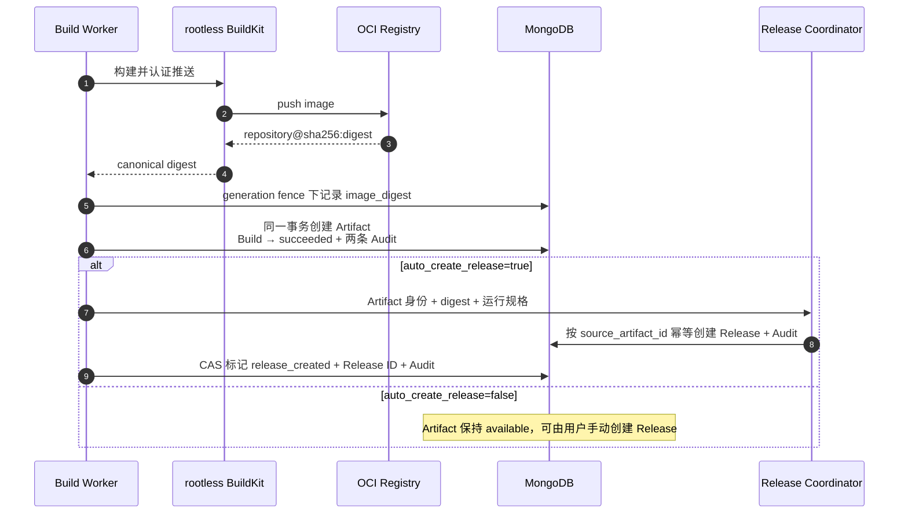
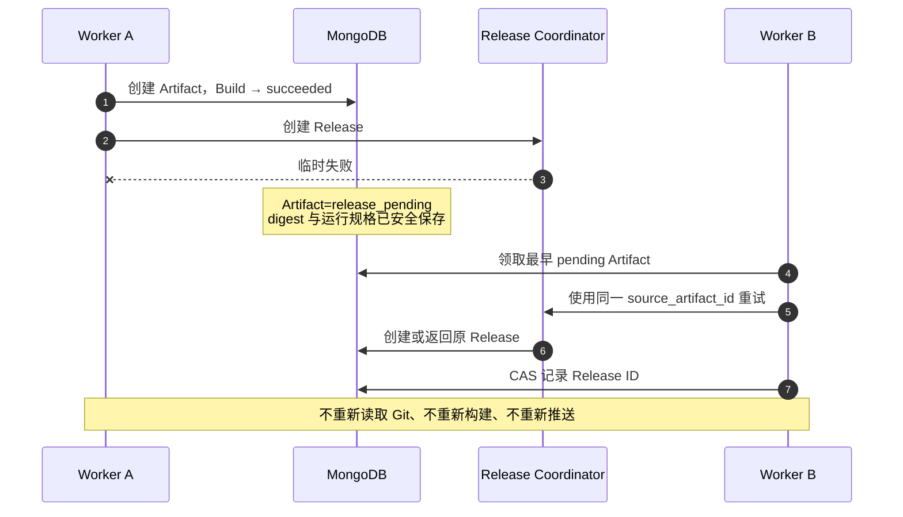

# Artifact 与 Release 交接

Artifact 是一次成功 Build 推送到 OCI Registry 后得到的、由 SHA-256 digest 固定的镜像结果。它不是可修改的镜像标签，也不是 Deployment；它把“代码已经构建成什么”与“这个版本应当怎样运行”安全地交给 Release。

## 默认行为

新建 Build Configuration 时，`auto_create_release` 默认是 `true`。用户还可以在 `release_runtime_spec` 中声明容器端口、需要由 Environment 绑定的配置键、CPU/内存和健康检查。这些内容会依次复制到不可变 Build 快照、Artifact 和 Release，后续修改 Build Configuration 不会改变历史结果。



Build 只有在 Artifact 与 `succeeded` 状态通过同一事务提交后才算构建成功。过期 Worker 必须同时匹配 lease owner、generation 和版本，不能在新 Worker 接管后创建重复 Artifact 或覆盖 Build。

## 失败后为什么不重新构建

镜像成功推送后，Release 或配置中的自动 Deployment 协调可能因数据库、目标就绪状态等短暂问题而失败。此时 Build 已经 `succeeded`，Artifact 保持 `release_pending`；Worker 后续只重试幂等交接，不再 checkout、重新执行 Dockerfile 或再次 push。只有 Release 和全部配置目标的 Deployment 都已创建，Artifact 才进入 `release_created`。



`source_artifact_id` 在 Release 中唯一。即使网络响应丢失、两个 Worker 竞争或请求重放，也只会得到同一条 Release。

## Artifact 状态

| 状态 | 含义 | 下一步 |
| --- | --- | --- |
| `available` | 镜像已固定，但配置关闭了自动 Release | 用户按需手动创建 Release |
| `release_pending` | 应自动创建 Release，当前等待或重试协调 | Worker 自动重试，不重新构建 |
| `release_created` | 已连接唯一 Release，且配置的自动 Deployment 已创建 | 可以查看自动结果，或继续手动选择 Environment 与 Runtime Target |

## API 与权限

```text
GET  /api/v1/projects/{project_id}/artifacts
GET  /api/v1/projects/{project_id}/artifacts/{artifact_id}
POST /api/v1/projects/{project_id}/artifacts/{artifact_id}:create-release
```

Viewer 可以读取 Artifact；Developer、Maintainer 和 Owner 可以创建 Release。手动请求可以提供 `runtime_spec`；省略时使用安全默认值。自动路径始终使用触发 Build 时保存的 `release_runtime_spec`。API 不返回 Registry 密码、Git 凭据、BuildKit Session 数据或源码。

创建 Artifact、Build 成功、创建 Release和 Artifact 连接 Release 都写入审计。镜像身份始终使用 `repository@sha256:...`，不能用 `latest` 或其他可移动 tag 替代。

自动部署目标从 Artifact、Environment 和 Runtime Target 派生稳定幂等键。已完成的目标会在重试时复用，未就绪目标恢复后继续创建，因此多目标交接不会重复部署。详见[自动部署规则](automatic-deployments.md)。
