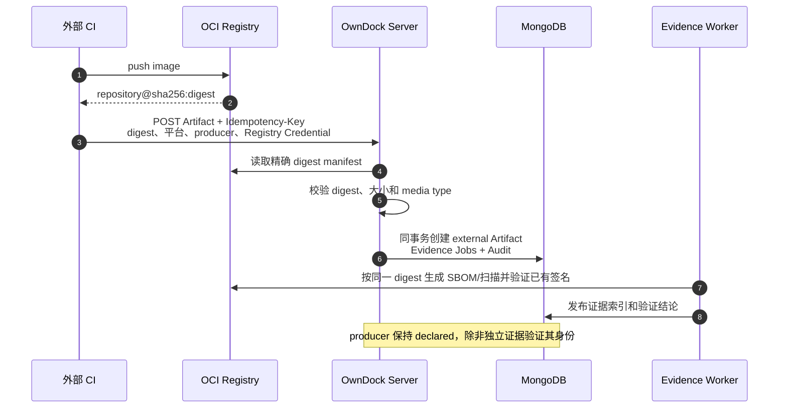
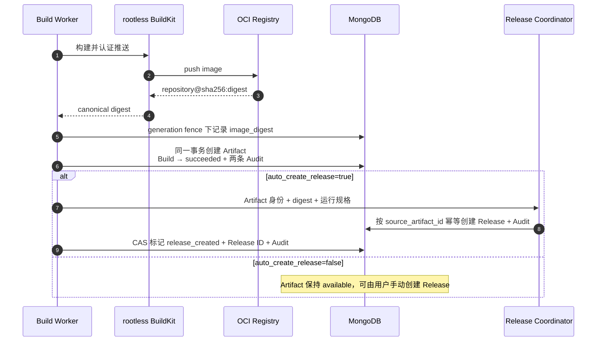
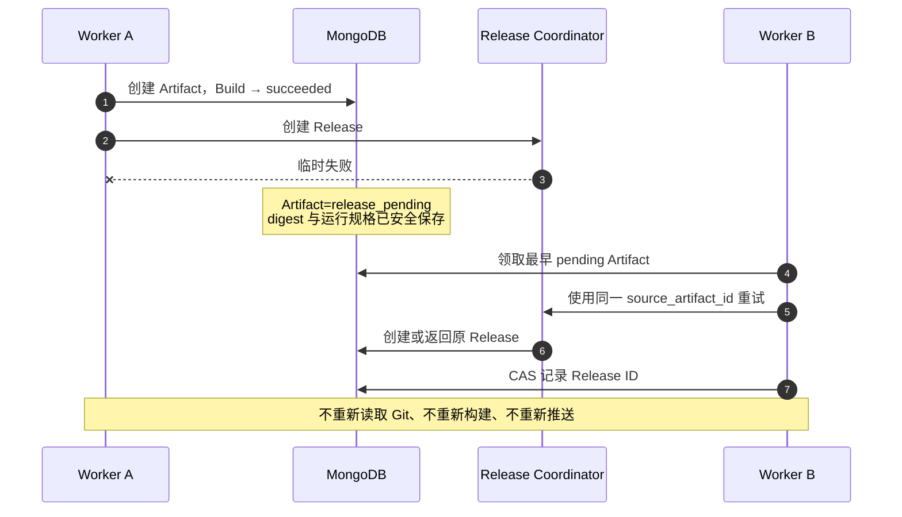

# Artifact 与 Release 交接

Artifact 是 OwnDock 对一个不可变 OCI 镜像的产品记录。镜像既可以由 OwnDock Build 产生，也可以由 GitHub Actions、GitLab CI、Jenkins 等外部 CI 产生；两条路径都必须使用 `repository@sha256:...`，不能使用会移动的 Tag。Artifact 不是 Deployment，它把“实际要交付哪个镜像、由谁产生、怎样运行”安全地交给 Release 和部署准入。

## 两种 Artifact 来源

| `origin` | 如何进入 OwnDock | 生产者结论 |
| --- | --- | --- |
| `owndock_build` | Build Worker 推送镜像后在 generation fence 下创建 | `producer_verification=verified`，表示由当前 OwnDock Build Worker 信任边界产生 |
| `external` | 外部 CI 推送后，通过 API 登记精确 digest | `producer_verification=declared`，生产者名称只是调用方声明，不能当作签名或 Provenance 证明 |

外部 Artifact 不伪造 Build ID、Build Configuration ID 或 OwnDock Provenance。OwnDock 会确认精确 manifest 能由所选 Registry Credential 读取，并校验 Registry 返回的 manifest digest、大小和 OCI/Docker media type；manifest 上限为 8 MiB，Registry 重定向只能保持同一 scheme、主机和端口。随后在同一 MongoDB 事务中创建 Artifact、审计事件以及 SBOM、漏洞扫描和适用的签名验证 Job。Registry 连接必须显式选择 `anonymous` 或 `basic`，认证失败不会自动降级为匿名；详见 [Registry 连接与认证](registry-connections.md)。外部镜像不会由 OwnDock 的 KMS Signing Profile 自动补签。



登记请求示例：

```http
POST /api/v1/projects/{project_id}/artifacts
Authorization: Bearer <session-token>
Idempotency-Key: github-run-1842-attempt-1
Content-Type: application/json

{
  "application_id": "api",
  "registry_credential_id": "production-registry",
  "image_digest": "registry.example.com/team/api@sha256:...",
  "target_platform": "linux/amd64",
  "producer": "github-actions/acme/api"
}
```

同一个 Project 中，相同 `Idempotency-Key` 和相同请求会返回原 Artifact，不会重新探测或重复排 Job；同一个键表达不同镜像、平台、Application、Credential、producer 或运行规格时返回 `409`。幂等键只用于防重，不会出现在 Artifact API 响应中。

## OwnDock Build 的默认行为

新建 Build Configuration 时，`auto_create_release` 默认是 `true`。用户还可以在 `release_runtime_spec` 中声明容器端口、需要由 Environment 绑定的配置键、CPU/内存和健康检查。这些内容会依次复制到不可变 Build 快照、Artifact 和 Release，后续修改 Build Configuration 不会改变历史结果。



Build 只有在 Artifact 与 `succeeded` 状态通过同一事务提交后才算构建成功。过期 Worker 必须同时匹配 lease owner、generation 和版本，不能在新 Worker 接管后创建重复 Artifact 或覆盖 Build。

## 失败后为什么不重新构建

镜像成功推送后，Release 或配置中的自动 Deployment 协调可能因数据库、目标就绪状态等短暂问题而失败。此时 Build 已经 `succeeded`，Artifact 保持 `release_pending`；Worker 后续只重试幂等交接，不再 checkout、重新执行 Dockerfile 或再次 push。正常运行期间，只有 Release 和全部配置目标的 Deployment 都已创建，Artifact 才进入 `release_created`。

Application 退役是显式终止条件，不按临时失败无限重试。退役围栏前已创建 Release 的 Artifact 会补齐关联并进入 `release_created`；此时该状态确认的是 Release 已存在，退役围栏会终止尚未创建的自动 Deployment。没有 Release 的 pending Artifact 会保留镜像与全部证据，但进入 `release_skipped`，表示自动交接因 Application 生命周期结束而停止。



`source_artifact_id` 在 Release 中唯一。即使网络响应丢失、两个 Worker 竞争或请求重放，也只会得到同一条 Release。

## Artifact 状态

| 状态 | 含义 | 下一步 |
| --- | --- | --- |
| `available` | 镜像已固定，但配置关闭了自动 Release | 用户按需手动创建 Release |
| `release_pending` | 应自动创建 Release，当前等待或重试协调 | Worker 自动重试，不重新构建 |
| `release_created` | 已连接唯一 Release；正常交接已创建配置的自动 Deployment，退役收敛则可能由生命周期围栏终止未完成项 | 查看已存在的 Release 和 Deployment 结果 |
| `release_skipped` | Application 已退役，且围栏前没有创建 Release | 保留 Artifact 与证据，不再自动重试交接 |

## API 与权限

```text
GET  /api/v1/projects/{project_id}/artifacts
GET  /api/v1/projects/{project_id}/artifacts/{artifact_id}
POST /api/v1/projects/{project_id}/artifacts
POST /api/v1/projects/{project_id}/artifacts/{artifact_id}:create-release
```

Viewer 可以读取 Artifact；Developer、Maintainer 和 Owner 可以登记外部 Artifact 或创建 Release。手动 Release 请求可以提供 `runtime_spec`；省略时使用 Artifact 保存的运行规格或安全默认值。自动 Build 路径始终使用触发 Build 时保存的 `release_runtime_spec`。API 不返回 Registry 密码、Git 凭据、BuildKit Session 数据、登记幂等键或源码。

创建 Artifact、Build 成功、创建 Release和 Artifact 连接 Release 都写入审计。镜像身份始终使用 `repository@sha256:...`，不能用 `latest` 或其他可移动 tag 替代。

自动部署目标从 Artifact、Environment 和 Runtime Target 派生稳定幂等键。已完成的目标会在重试时复用，未就绪目标恢复后继续创建，因此多目标交接不会重复部署。详见[自动部署规则](automatic-deployments.md)。
