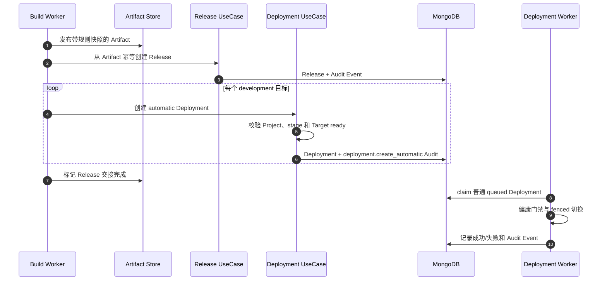

# 自动部署规则

OwnDock 首个版本默认采用“构建成功后创建 Release，由人选择何时部署”。如果团队希望开发环境持续更新，可以在 Build Configuration 中显式加入自动部署目标。它不是一条绕过部署系统的快捷命令：OwnDock 仍会创建一条普通 Deployment，并继续执行目标就绪检查、幂等、审计、健康检查、失败恢复和取消流程。

## 首版环境规则

| Environment stage | 默认行为 | 能否配置自动部署 |
| --- | --- | --- |
| `development` | 手动 | 可以，由 Maintainer/Owner 显式开启 |
| `staging` | 手动 | 不可以 |
| `production` | 手动 | 不可以 |

`staging` 和 `production` 不存在隐藏开关，也不能通过 Webhook、Trigger Token 或 Developer 权限绕过。以后若加入生产审批、时间窗口和环境保护，会作为单独的治理能力设计。

## 怎样配置

创建或更新 Build Configuration 时提交完整目标列表：

```json
{
  "auto_create_release": true,
  "automatic_deployments": [
    {
      "environment_id": "development-1",
      "runtime_target_id": "target-1"
    }
  ]
}
```

- 只有 Maintainer 或 Owner 可以修改 `automatic_deployments`；
- 省略或提交空数组表示全部手动部署；
- 最多配置 8 个不重复的 Environment/Runtime Target 组合；
- Environment 和 Runtime Target 必须与 Build Configuration 位于同一 Project；
- 只要列表非空，`auto_create_release` 就必须保持 `true`；
- Runtime Target 可以在配置时暂时不在线，但实际创建 Deployment 时必须已完成成功探测并处于 `ready`。

规则会和 Dockerfile、Commit、资源限制及 Release 运行规格一起复制到 Build 快照。之后修改 Build Configuration，不会改变已经排队或正在执行的 Build 将要部署到哪里。

## 构建成功后的过程



Deployment 的 `trigger_source` 为 `automatic`，并保存 `source_artifact_id`、`source_build_id` 和 `build_configuration_id`，因此页面可以从 Deployment 一直追溯到 Release、Artifact、Build 和固定 Commit。手动创建的 Deployment 使用 `trigger_source=manual`。

## 重试与故障

每个自动目标使用由 Artifact、Environment 和 Runtime Target 派生的稳定幂等键。Worker 失联或多个 Worker 同时协调时，同一目标仍只会形成一条 Deployment。

如果 Runtime Target 尚未 `ready`，Release 不会被删除，也不会伪造一条成功记录；Artifact 保持 `release_pending`，协调器稍后重试。已经为其他目标创建的 Deployment 会通过同一幂等键复用，不会重复部署。目标恢复并成功创建全部 Deployment 后，Artifact 才进入 `release_created`。如果 Application 在此期间进入退役，生命周期围栏会终止未创建的 Deployment；退役 Worker 根据权威 Release 记录把 Artifact 收敛到 `release_created` 或 `release_skipped`，不再无限重试。

自动部署失败后的业务重试仍使用正常 Deployment retry；修改规则只影响之后创建的 Build，不会重写历史链路。
