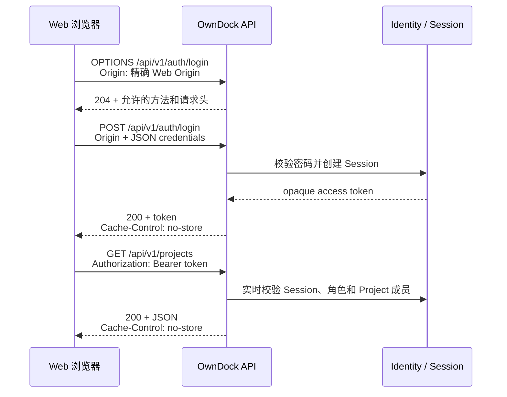
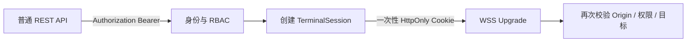

# 浏览器接入 API：Origin、Token 与安全响应头

本文面向 OwnDock Web 前端开发者和部署人员，说明浏览器如何安全调用 OwnDock API。这里的 CORS 只解决“浏览器是否允许某个网页读取 API 响应”，不能代替登录、RBAC 或 Project 范围校验。

## 推荐部署：前端与 API 使用同一个站点

最简单的生产部署是让反向代理对外提供一个 HTTPS 地址：

```text
https://console.owndock.net/        -> Web 静态文件
https://console.owndock.net/api/    -> OwnDock Server
```

浏览器看到的 scheme、host 和 port 完全相同，因此这是同源请求，不需要配置 CORS。`server.http.cors_allowed_origins` 保持空数组即可。这种方式配置少、出错面小，推荐中小型团队首选。

## 前端与 API 不同源时

例如：

```text
Web: https://console.owndock.net
API: https://api.owndock.net
```

Server 需要精确允许 Web 的 Origin：

```yaml
server:
  http:
    cors_allowed_origins:
      - https://console.owndock.net
```

Origin 只有 `scheme://host[:port]`，不能带路径或结尾 `/`。OwnDock 拒绝 `*`、子域通配符、重复值、userinfo、query 和 fragment；非本机地址必须使用 HTTPS。本地开发可以使用 `http://localhost:3000`、`http://127.0.0.1:3000` 或 loopback IPv6。

未配置的 Origin 会在业务 Handler 之前收到 `403 origin_not_allowed`。Webhook、Git 平台回调和服务间调用通常不带浏览器 `Origin`，不受 CORS 影响，仍按各自签名或 Token 规则认证。

## 登录与 API 调用

OwnDock REST API 当前不读取用户 Session Cookie。登录、bootstrap 或接受邀请成功后，API 在 JSON 中返回 opaque access token；后续请求显式使用 `Authorization: Bearer <token>`。



浏览器跨域请求只允许一组固定请求头，包括 `Authorization`、`Content-Type`、`Idempotency-Key`、`X-Request-ID` 和 W3C Trace Context。OwnDock 不返回 `Access-Control-Allow-Credentials`，所以浏览器不会把跨域 Cookie 当作 REST API 身份。

前端不应把 access token 放入 URL、日志、错误报告、埋点或可被第三方脚本读取的长期存储。首版 Web 客户端应优先只在运行内存保存 Token；如果产品需要刷新页面后继续登录，应先设计受信任的同源 BFF 或独立的 HttpOnly Session 方案，不能直接把当前 Bearer Token 改成跨域 Cookie。

## 默认安全响应头

OwnDock Server 对所有 HTTP 响应设置以下浏览器安全头：

| Header | 作用 |
| --- | --- |
| `X-Content-Type-Options: nosniff` | 防止浏览器猜测并执行错误的内容类型 |
| `X-Frame-Options: DENY` | 阻止 API 页面被嵌入 frame |
| `Content-Security-Policy: default-src 'none'; ...` | API 响应默认不加载脚本、图片、表单或子页面 |
| `Referrer-Policy: no-referrer` | 不把 API 地址作为 Referer 发送出去 |
| `Permissions-Policy` | API 页面不使用相机、定位和麦克风 |

所有 `/api/` 响应统一包含 `Cache-Control: no-store`，包括成功、认证失败、限流和 CORS 拒绝响应，降低 Token 或用户数据被浏览器和中间缓存保存的风险。

API 的 CSP 不适用于独立 Web 前端。Web 仓库需要根据实际静态资源、字体和 API 地址配置自己的 CSP；直接复制 API 的 `default-src 'none'` 会让 Web 页面无法加载。`Strict-Transport-Security` 应由真正终止公网 TLS 的反向代理或负载均衡器设置，因为 Server 可能只看到代理后的内部 HTTP。

## 与未来终端能力的区别

终端连接属于高权限、长连接能力，不能复用普通 REST Bearer Token 作为 URL 参数。规划中的流程是：REST API 先创建固定目标的 `TerminalSession`，再下发一次性、短时、`Secure + HttpOnly + SameSite` 的专用 Cookie；WSS Upgrade 必须验证精确 Origin，并原子消费票据。



这张图中的终端 Cookie 尚未实现。当前 `cors_allowed_origins` 只控制 REST API 的浏览器跨域读取，不能视为终端访问策略。

## 上线检查

1. 优先让 Web 与 API 同源；只有确实分域时才填写白名单。
2. 白名单只填写实际 Web Origin，不填写 API 自身 URL、路径、通配符或尾部 `/`。
3. 公网入口启用 TLS，并在 TLS 终止层配置 HSTS、连接数限制和请求体限制。
4. Web 不把 Token 写入 URL、日志、分析平台或长期浏览器存储。
5. 使用浏览器验证允许 Origin 的 preflight 成功，未允许 Origin 返回 403。
6. 检查响应不存在 `Access-Control-Allow-Credentials: true`。
7. Web 前端单独验证 CSP；终端上线前单独完成 Cookie、Origin、重放和 WSS 安全验收。
