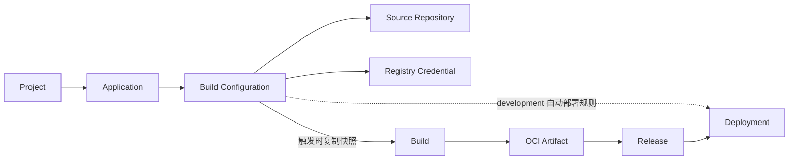
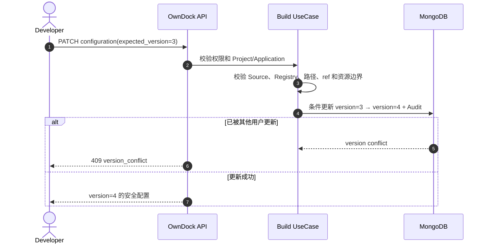

# Build Configuration 使用说明

Build Configuration 是 Application 下的一份“构建配方”。它说明以后从哪个已登记的 Git 仓库读取代码、使用哪个 Dockerfile、把镜像推到哪里，以及单次构建最多可以占用多少资源。

保存或修改 Build Configuration **不会立即构建镜像**。触发 API 会创建不可变 Build，并复制当时的完整配置快照，因此以后修改配方不会改变历史 Build。独立 Build Worker 已交付受控源码检出、rootless BuildKit 构建、认证 Registry push，以及 Artifact/Release 交接。

## 它连接哪些资源



- Source Repository 决定代码来源和默认分支；
- Registry Credential 决定 OwnDock 是否有权限推送镜像；
- `image_repository` 决定镜像推送位置，例如 `registry.example.com/team/api`；
- 三者必须属于同一个 Project；Build Configuration 还必须属于路径中的 Application。

`image_repository` 不能带 `:tag` 或 `@digest`。Tag 和 digest 属于构建结果，不属于可修改的构建配方。Registry Credential 的 server 必须与镜像仓库域名一致，避免把一套凭据意外发送给另一个 Registry。

## Dockerfile 和构建上下文

两个路径都以仓库根目录为基准：

```json
{
  "context_path": "services/api",
  "dockerfile_path": "services/api/Dockerfile"
}
```

- 仓库根目录写作 `.`；
- 路径必须是规范的相对路径；
- 不接受绝对路径、反斜杠、`..` 路径穿越或 context 之外的 Dockerfile；
- checkout 后仍需由隔离 Build Worker 检查符号链接，API 校验不能替代文件系统边界。

## 允许触发的 Git ref

`allowed_refs` 使用完整且精确的 Git ref：

```json
{
  "allowed_refs": [
    "refs/heads/main",
    "refs/tags/v1.0.0"
  ]
}
```

首版不接受 `*` 通配符。省略时默认只允许 Source Repository 的默认分支。分支和 Tag 都可能移动；触发 Build 时会解析并固定完整 Commit SHA。

## 默认资源限制

| 配置 | 默认值 | 当前允许范围 |
| --- | ---: | ---: |
| CPU | 2000 milli CPU | 100～16000 |
| 内存 | 2 GiB | 128 MiB～32 GiB |
| 临时磁盘 | 10 GiB | 1～200 GiB |
| 超时 | 1800 秒 | 60～7200 秒 |
| 同配置并发 | 1 | 1～4 |
| 目标平台 | `linux/amd64` | `linux/amd64`、`linux/arm64` |
| 自动创建 Release | `true` | `true`、`false` |

这些字段进入版本化契约和 MongoDB，并由隔离 Worker 执行。构建资源限制与 Release 运行资源是两组不同配置：前者限制 BuildKit 任务，后者限制最终应用容器。

## Release 运行规格

`release_runtime_spec` 会进入 Build 的不可变快照和 Artifact，并用于自动创建 Release：

```json
{
  "auto_create_release": true,
  "release_runtime_spec": {
    "ports": [{"name":"http","container_port":8080,"protocol":"tcp"}],
    "environment_keys": ["DATABASE_URL"],
    "resources": {"cpu_milli":500,"memory_bytes":268435456},
    "health_check": {
      "command": ["CMD-SHELL", "wget -qO- http://127.0.0.1:8080/health || exit 1"],
      "interval_seconds": 30,
      "timeout_seconds": 5,
      "retries": 3,
      "start_period_seconds": 10
    }
  }
}
```

省略运行规格时使用 500 milli CPU、256 MiB 内存、无端口和无健康检查的安全默认值。`environment_keys` 只声明名称，不保存值；真正的值或 `secret://` 引用在部署时由 Environment 提供。

## 自动部署规则

首版默认仍由人创建 Deployment。Maintainer/Owner 可以在配方中增加 `automatic_deployments`，让成功 Artifact 创建 Release 后继续为 development 环境创建普通 Deployment：

```json
{
  "auto_create_release": true,
  "automatic_deployments": [
    {"environment_id":"development-1","runtime_target_id":"target-1"}
  ]
}
```

规则最多 8 个且组合不能重复；Environment、Runtime Target 和配方必须同属一个 Project。列表非空时必须开启 `auto_create_release`。staging 和 production 首版强制人工触发，后端会拒绝绕过。规则同样进入 Build 与 Artifact 的不可变快照，详细权限、重试和时序见[自动部署规则](automatic-deployments.md)。

创建或更新时可以省略整组 `resources`；创建省略时使用默认值。如果提交 `resources`，必须同时给出 CPU、内存和磁盘三个字段。PATCH 中显式提交的空路径、零值或不完整资源不会被默认值静默替换。

## 更新和并发保护

更新使用 `PATCH`，并必须提交当前 `expected_version`：

```json
{
  "expected_version": 3,
  "timeout_seconds": 1200
}
```

如果另一位用户已经更新过该配置，服务返回 `409 version_conflict`。客户端应重新读取最新配置，让用户确认后再提交，不能静默覆盖别人的修改。



Owner、Maintainer 和 Developer 可以创建或修改；Viewer 可以读取。创建和更新都写入基础审计事件。配置不保存 Git Token、Deploy Key、Registry 密码、源码或构建缓存。

## API

```text
GET/POST /api/v1/projects/{project_id}/applications/{application_id}/build-configurations
GET/PATCH /api/v1/projects/{project_id}/applications/{application_id}/build-configurations/{build_configuration_id}
```

当前 API 是 pre-release。触发、状态推进、取消、重试、有界 Build 日志、Artifact 与 Release 交接已经开放。使用方式见[手动触发 Build](builds.md)、[Build 日志](build-logs.md)与[Artifact 与 Release 交接](artifacts.md)。
