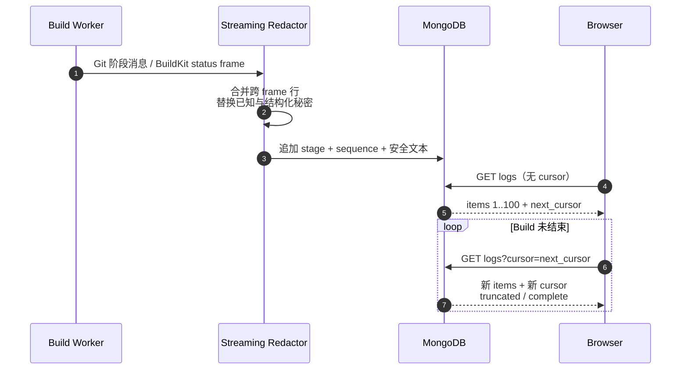

# Build 日志与排障

Build 日志用于回答“代码检出、Dockerfile 构建、镜像推送或 Release 交接卡在了哪里”。它不是永久审计档案，也不是原始 BuildKit 调试输出；OwnDock 会先脱敏、再做容量限制，最后保存可供浏览器增量读取的安全日志。

## 浏览器怎样增量读取

```http
GET /api/v1/projects/{project_id}/builds/{build_id}/logs?cursor=...&limit=100
Authorization: Bearer ...
```

第一次请求省略 `cursor`。响应中的 `next_cursor` 只属于当前 Build，浏览器之后带上它轮询，就只会收到更晚的日志；即使暂时没有新内容，也继续使用服务端返回的新 cursor。不要解析、拼接或跨 Build 复用 cursor。



响应示例：

```json
{
  "items": [
    {
      "sequence": 17,
      "stage": "build",
      "message": "#7 DONE 2.4s",
      "created_at": "2026-08-01T08:00:00Z"
    }
  ],
  "next_cursor": "djEKYnVpbGQtM...",
  "truncated": false,
  "complete": false,
  "expires_at": "2026-08-08T08:00:00Z"
}
```

- `stage` 是 `system`、`checkout`、`build`、`push` 或 `release`；
- `complete=true` 表示 Build 已进入终态，正常情况下不会再追加日志；
- `truncated=true` 表示达到容量上限，后面的输出已被丢弃，已有内容仍可读取；
- `expires_at` 是近似清理时间。MongoDB TTL 异步执行，因此不能把它理解为精确到秒的删除承诺。

## 默认容量与保留

| 边界 | 默认值 | 可配置范围 |
| --- | ---: | ---: |
| 单 Build 最大日志 | 10 MiB | 1～100 MiB |
| 单块最大大小 | 16 KiB | 4～64 KiB，且不能超过总上限 |
| 保留时间 | 7 天 | 1～30 天 |
| 单次读取条数 | 100 | 1～200 |

配置位于 `runtime.build_worker.log_retention`、`log_max_bytes` 和 `log_chunk_bytes`。增加这些值会直接增加 MongoDB 数据量与索引压力；首版不承诺长期归档或无限下载。

## 秘密保护

BuildKit 的 status frame 不会直接写库。Worker 先按行合并可能被网络拆开的片段，再替换：

- 本次 Registry Session 中已知的账号密码和 Basic 编码；
- URL userinfo；
- Authorization/Bearer/Basic 值；
- 常见 password、token、secret、API key 参数与赋值。

底层错误仍只映射为稳定失败类别，API 不返回 Git/Registry 原始认证错误。脱敏是纵深防御，不是让 Dockerfile 打印秘密的许可：应用仍不应使用 `RUN echo $TOKEN`，Build Secret 也不能转换成普通 build arg。

Viewer、Developer、Maintainer 和 Owner 都可以在所属 Project 内读取；跨 Project 请求先被所有权和 RBAC 拒绝。响应带 `Cache-Control: no-store`，前端也不应把日志写入 Local Storage、分析事件或错误上报正文。

## 运维指标与 Trace

Build Worker 在独立 metrics 地址暴露低基数指标：

- `owndock_build_worker_operations_total`；
- `owndock_build_worker_operation_duration_seconds`；
- `owndock_build_worker_log_writes_total`；
- `owndock_build_worker_log_bytes_total`。

默认监听 `127.0.0.1:9091`，生产中可以改为受监控网络保护的地址，不能直接暴露到公网。指标不带 Build ID、Project ID、仓库或错误正文。启用全局 OTLP/HTTP tracing 后，每次被领取的 Build operation 会产生 `build.execute` Span；失败只记录安全状态，不把底层错误正文写入 Trace。
