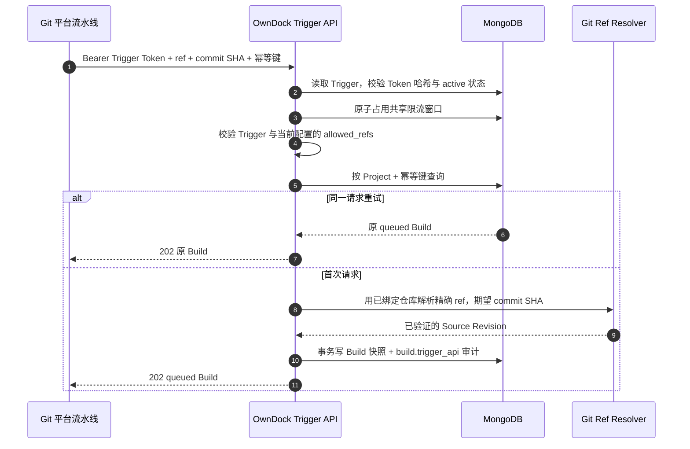

# 用 Trigger Token 从任意 Git 平台触发 Build

Build Trigger 是给 GitHub Actions、GitLab CI、Gitea、Coding、Jenkins 等自动化系统使用的专用凭据。它不是用户登录 Session，也不是某一家 Git 平台的 Webhook：只要自动化任务能发出 HTTPS 请求，就能调用同一个接口。

一个 Trigger 固定绑定一个 Project、Application 和 Build Configuration。外部请求只能提交 `ref` 与完整 `commit_sha`，不能临时更换 Git 仓库、Dockerfile、Registry、镜像仓库、资源上限或允许分支。这使得“谁能触发”和“触发后能构建什么”成为两个明确、可审计的边界。

## 创建与保存 Token

Owner 或 Maintainer 在 Build Configuration 下创建 Trigger：

```http
POST /api/v1/projects/{project_id}/applications/{application_id}/build-configurations/{configuration_id}/triggers
Authorization: Bearer <user-session>
Content-Type: application/json
```

```json
{
  "name": "GitHub production workflow",
  "allowed_refs": ["refs/heads/main"]
}
```

`allowed_refs` 必须是 Build Configuration 允许范围的子集。例如配置允许 `main` 和 `develop`，生产 Trigger 可以进一步只允许 `main`，不能扩大到新分支。

创建响应中的 `token` 只显示一次，响应带 `Cache-Control: no-store`。OwnDock 在 MongoDB 中只保存 Token 的 SHA-256 哈希，之后的列表和查询不会返回明文或哈希。请立即把明文放进 Git 平台的 Secret/Variable 管理功能；如果丢失，撤销旧 Trigger 并创建新的，不能找回。

## 自动化调用

```http
POST /api/v1/build-triggers/{build_trigger_id}
Authorization: Bearer <build-trigger-token>
Idempotency-Key: github-run-123456-1
Content-Type: application/json
```

```json
{
  "commit_sha": "a975c10d68a2d7461634f13b15c52a2efba72d16",
  "ref": "refs/heads/main"
}
```

- `commit_sha` 必须是 40 位完整 SHA，不能用短 SHA；
- `ref` 必须写完整的 `refs/heads/...` 或 `refs/tags/...`；
- `Idempotency-Key` 在 Project 内唯一。同一次流水线重试应复用原键，另一次运行必须使用新键；
- Server 会用已经登记的 Source Repository 只读解析该 ref，并确认它仍指向请求中的 Commit。分支已移动时返回 `409 revision_mismatch`，不会构建错误代码；
- 默认每个 Trigger 每分钟允许 60 次已认证请求。多个 Server 实例共享 MongoDB 计数，超限返回 `429` 和 `Retry-After`。可通过 `product.build_trigger_rate_limit` 与 `product.build_trigger_rate_window` 调整；
- `202` 只表示不可变 queued Build 已记录，不能当作镜像构建或发布成功。后续应查询 Build；只有 `succeeded` 才表示 digest Artifact 已安全保存，Release 状态则从 Artifact 查询。



## 撤销与权限

```text
GET  /api/v1/projects/{project_id}/applications/{application_id}/build-configurations/{configuration_id}/triggers
POST /api/v1/projects/{project_id}/applications/{application_id}/build-configurations/{configuration_id}/triggers/{trigger_id}:revoke
```

只有 Owner、Maintainer 能创建、查看元数据或撤销 Trigger；Developer 可以用用户 Session 手动触发 Build，但不能签发长期自动化凭据。撤销永久生效，之后使用该 Token 会得到通用 `401 invalid_build_trigger_token`。创建、外部触发和撤销分别写入 `build_trigger.create`、`build.trigger_api`、`build_trigger.revoke` 审计事件。

当前通用 Trigger API 适合任何能发起 HTTPS 请求的自动化系统。GitHub、GitLab、Gitea 和 Forgejo 也可以使用已经实现的[平台 Webhook](webhooks.md)：Adapter 负责平台签名与事件转换，但仍进入同一 Build 领域规则，不会绕过允许 ref、Commit 校验、幂等和审计。
