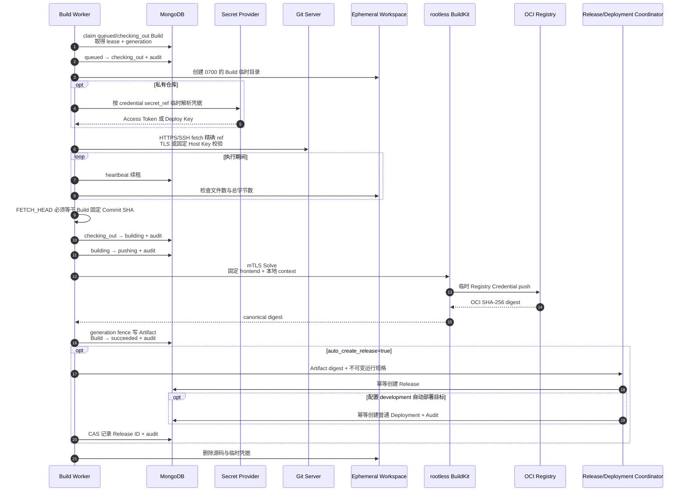

# Build Worker 运行与安全边界

`owndock-build-worker` 是独立于 API Server 的构建执行进程。它从 MongoDB 原子领取 Build、续租、在临时工作区检出精确 Commit，再通过受认证的 rootless BuildKit 构建并推送镜像。Registry 返回的 SHA-256 digest 会在 generation fence 下形成 Artifact；Build 与 Artifact 原子提交后进入 `succeeded`，随后按配置幂等创建 Release，并为快照中的 development 目标创建普通 Deployment。Worker 同时保存有界、脱敏、可增量读取的 Build 日志，并暴露低基数指标与可选 OTLP Trace。

## 一次构建的过程



分支和 Tag 可能移动，因此 Worker 不会只相信触发请求中的名称。它 fetch 精确 ref 后再次解析 `FETCH_HEAD^{commit}`，只有结果与 Build 中保存的完整 Commit SHA 一致才继续。

## Git 与凭据约束

- Worker 启动时要求 `git version 2.55.0` 精确匹配；镜像从校验 SHA-256 的官方源码构建该版本。
- 只接受产品层已批准的 HTTPS、`ssh://` 和 SCP-like SSH 地址；Git 的 `file`、`ext` 协议、递归 submodule、hooks 和 HTTP redirect 均关闭。
- HTTPS Token 写入单次操作专用的 `0600` 临时文件，通过 AskPass 读取，不进入 URL、命令参数或普通环境变量。
- SSH Deploy Key 写入单次操作专用的 `0600` 临时文件；连接前必须同时验证 Deploy Key 公钥指纹和服务器 Host Key 指纹。
- Worker 不继承调用进程中的 Git 凭据变量。操作结束后删除临时凭据目录，并尽力清零内存中的秘密字节。
- API 和 Build 失败记录只保存稳定失败类别，不回传 Git 原始输出、路径或凭据。

## BuildKit 与 Registry 约束

- BuildKit 固定为 `v0.31.2-rootless@sha256:0eeb…65b`，Worker 建立连接后还会读取 daemon info 并精确核验版本。
- Dockerfile frontend 固定为 `docker/dockerfile:1.25.0@sha256:0adf…f12`。仓库中的 `# syntax=` 为空时使用该版本；若显式声明，就必须与完整固定引用一致，`docker/dockerfile:1`、`latest` 或其他 frontend 会在上传 context 前被拒绝。
- TCP endpoint 必须使用双向 TLS，并验证 `server_name`；本机方式只允许专用绝对 Unix Socket。`docker-container://` 和 `/var/run/docker.sock` 均被拒绝。
- Registry Password 按 `secret://alias` 在单次操作中解析，只交给 BuildKit Session auth provider；不会进入 image name、Solve attrs、Build、MongoDB 或普通日志。
- Exporter 固定启用 `push=true`、canonical name 与 OCI media types，只接受 BuildKit 返回的 SHA-256 digest，且仓库必须与配置快照完全相同。
- BuildKit 的 cache 位于独立 Volume，启用 8 GB GC 基线；该策略负责回收，不是硬磁盘配额，生产环境仍应使用独立文件系统或 project quota。

## 两层资源限制

应用层在 fetch 期间持续计算工作区文件数和总字节数，超过 `max_workspace_files` 或 `max_workspace_bytes` 会立即取消 Git 子进程。容器层再限制 CPU、内存、PID、只读根文件系统和 `/tmp` 大小。工作区 bind mount 必须位于独立文件系统或配置 project quota；仅靠目录扫描不能阻止同一轮询间隔内瞬时占满宿主磁盘。

```yaml
runtime:
  build_worker:
    enabled: true
    poll_interval: 2s
    lease_duration: 30s
    operation_timeout: 2h15m
    checkout_timeout: 10m
    workspace_root: /var/lib/owndock/builds
    max_workspace_bytes: 5368709120
    max_workspace_files: 250000
    git_executable: git
    git_version: 2.55.0
    buildkit_endpoint: tcp://buildkit:1234
    buildkit_server_name: buildkit
    buildkit_ca_cert_file: /etc/owndock/buildkit/ca.pem
    buildkit_client_cert_file: /etc/owndock/buildkit/worker-cert.pem
    buildkit_client_key_file: /etc/owndock/buildkit/worker-key.pem
    log_retention: 168h
    log_max_bytes: 10485760
    log_chunk_bytes: 16384
    metrics_address: 127.0.0.1:9091
database:
  mongo:
    enabled: true
    uri_env: OWNDOCK_MONGODB_URI
```

`lease_duration` 应明显大于数据库正常往返时间；Worker 每约三分之一租期发送一次 heartbeat。进程退出、网络中断或续租失败时，旧 generation 不再有权推进状态，租约到期后由其他 Worker 接管。

日志的容量、脱敏和访问规则见 [Build 日志与排障](build-logs.md)。Build Worker 在 metrics 地址同时提供 `/livez`、MongoDB `/readyz` 和 `/metrics`；指标包含已领取 Build 的专用执行信号，以及 `worker="build"` 的统一轮询信号。完整指标、Trace 和告警语义见 [Worker 可观测性与告警](worker-observability.md)。该地址默认只监听容器/主机 loopback；如果改为可被 Prometheus 抓取的地址，必须由监控网络或防火墙保护，不能公开到互联网。

如果镜像已推送但进程在 Artifact 发布前中断，新 Worker 会直接使用已保存的 digest 完成 Artifact，不重新构建。Release 或自动 Deployment 协调失败时 Artifact 保持 `release_pending`，任意 Worker 后续只重试幂等交接；已创建目标不会重复。详见 [Artifact 与 Release 交接](artifacts.md)和[自动部署规则](automatic-deployments.md)。

## 构建与部署 Worker 镜像

```bash
make docker-build-worker VERSION=dev
docker run --rm --entrypoint git owndock-build-worker:dev --version
make test-build-integration
make test-build-security
```

`test-build-security` 额外运行竞态、MongoDB 恢复、恶意 Dockerfile、容器网络故障和 OCI 制品秘密扫描；当前证据与尚未完成的发布阻断项见 [Git-to-Deploy 安全验收](build-security-acceptance.md)。

生产部署必须把 Worker 镜像发布到受控 Registry，并以 `image@sha256:...` 的不可变引用设置 `OWNDOCK_BUILD_WORKER_IMAGE`；不要部署浮动 tag。BuildKit 镜像和 Dockerfile frontend 已在仓库中固定不可变 digest。先生成专用 mTLS 材料，并把配置中的 endpoint 与证书路径改成上面的 TCP 示例：

```bash
./deploy/generate-buildkit-certs.sh /srv/owndock-buildkit-certs buildkit
```

CA 私钥只用于后续签发和轮换，不能挂载进容器；Compose 只挂载 CA、Server 和 Worker 所需文件。Linux 上 BuildKit 与 Worker 都使用 UID/GID 1000，私钥保持 `0600` 且应由 UID 1000 读取。示例约束位于 [`deploy/build-worker.compose.yaml`](../deploy/build-worker.compose.yaml)：

```bash
OWNDOCK_BUILD_WORKER_IMAGE='registry.example.com/owndock/build-worker@sha256:...' \
OWNDOCK_MONGODB_URI='mongodb://...' \
OWNDOCK_CONFIG_FILE="$PWD/configs/config.yaml" \
OWNDOCK_BUILD_WORKSPACE='/srv/owndock-builds' \
OWNDOCK_BUILDKIT_CERT_DIR='/srv/owndock-buildkit-certs' \
docker compose -f deploy/build-worker.compose.yaml up -d
```

不要给 Worker 挂载 `/var/run/docker.sock`、生产主机目录、Runtime Target 凭据或 BuildKit rootful Socket。示例 rootless BuildKit 需要官方文档列出的 user namespace 与 `/proc` security options，这些放宽只属于独立 BuildKit 容器，不能复制到 API Server、Worker 或生产应用容器。
