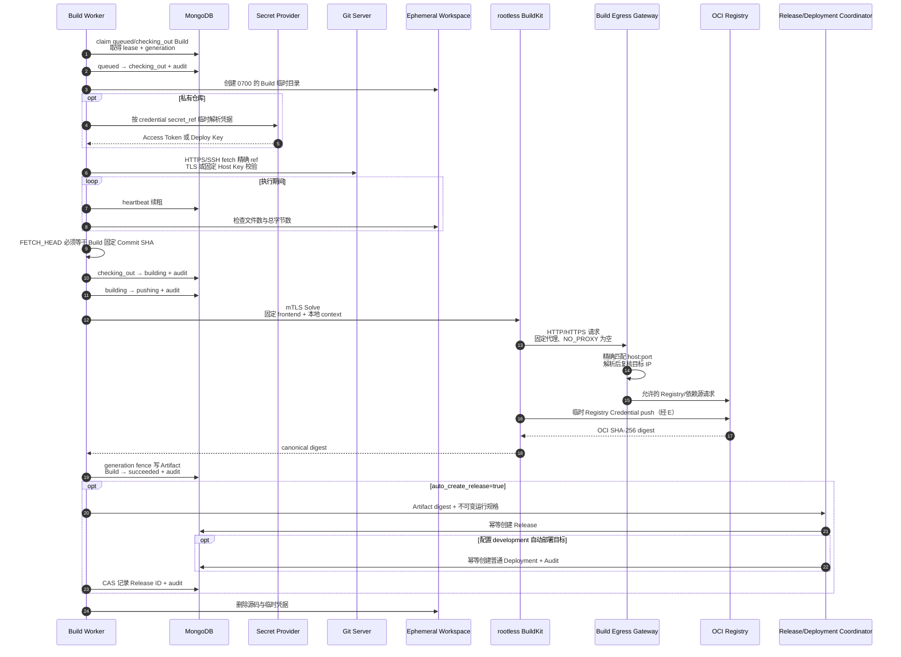
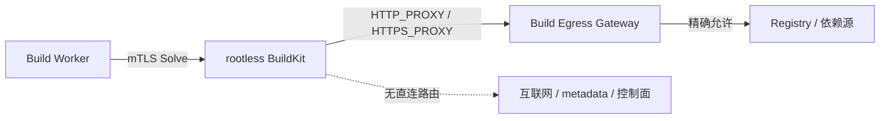

# Build Worker 运行与安全边界

`owndock-build-worker` 是独立于 API Server 的构建执行进程。它从 MongoDB 原子领取 Build、续租、在临时工作区检出精确 Commit，再通过受认证的 rootless BuildKit 构建并推送镜像。Registry 返回的 SHA-256 digest 会在 generation fence 下形成 Artifact；Build 与 Artifact 原子提交后进入 `succeeded`，随后按配置幂等创建 Release，并为快照中的 development 目标创建普通 Deployment。Worker 同时保存有界、脱敏、可增量读取的 Build 日志，并暴露低基数指标与可选 OTLP Trace。

## 一次构建的过程



分支和 Tag 可能移动，因此 Worker 不会只相信触发请求中的名称。它 fetch 精确 ref 后再次解析 `FETCH_HEAD^{commit}`，只有结果与 Build 中保存的完整 Commit SHA 一致才继续。

## Git 与凭据约束

- Worker 启动时要求 `git version 2.55.0` 精确匹配；镜像从校验 SHA-256 的官方源码构建该版本。
- 只接受产品层已批准的 HTTPS、`ssh://` 和 SCP-like SSH 地址；Git 的 `file`、`ext` 协议、递归 submodule、hooks 和 HTTP redirect 均关闭。
- HTTPS Token 写入单次操作专用的 `0600` 临时文件，通过 AskPass 读取，不进入 URL、命令参数或普通环境变量。
- SSH Deploy Key 写入单次操作专用的 `0600` 临时文件；连接前必须同时验证 Deploy Key 公钥指纹和服务器 Host Key 指纹。
- Worker 不继承调用进程中的 Git 凭据变量。操作结束后删除临时凭据目录，并尽力清零内存中的秘密字节。
- Worker 也不继承环境中的 CA/代理变量；自建 CA 与 HTTPS CONNECT 代理只能由 `product.source_git_ca_cert_file`、`product.source_git_https_proxy` 显式配置，并与 Server probe 共用同一信任策略。
- API 和 Build 失败记录只保存稳定失败类别，不回传 Git 原始输出、路径或凭据。

## BuildKit 与 Registry 约束

- BuildKit 固定为 `v0.31.2-rootless@sha256:0eeb…65b`，Worker 建立连接后还会读取 daemon info 并精确核验版本。
- Dockerfile frontend 固定为 `docker/dockerfile:1.25.0@sha256:0adf…f12`。仓库中的 `# syntax=` 为空时使用该版本；若显式声明，就必须与完整固定引用一致，`docker/dockerfile:1`、`latest` 或其他 frontend 会在上传 context 前被拒绝。
- TCP endpoint 必须使用双向 TLS，并验证 `server_name`；本机方式只允许专用绝对 Unix Socket。`docker-container://` 和 `/var/run/docker.sock` 均被拒绝。
- Registry Password 按 `secret://alias` 在单次操作中解析，只交给 BuildKit Session auth provider；不会进入 image name、Solve attrs、Build、MongoDB 或普通日志。
- `product.registry_ca_cert_file` 供 Build Worker 自身的 OCI Evidence 回读使用；BuildKit daemon 推送镜像时的 Registry CA 必须在 BuildKit 的 Registry 配置中独立安装，不能把两者混为一个信任边界。
- Exporter 固定启用 `push=true`、canonical name 与 OCI media types，只接受 BuildKit 返回的 SHA-256 digest，且仓库必须与配置快照完全相同。
- BuildKit 的 cache 位于独立文件系统，启用 8 GB GC 基线。Compose 中的 `buildkit-storage-preflight` 会在 BuildKit 启动前检查该路径确实是独立挂载点，并确认文件系统总容量不超过 `OWNDOCK_BUILDKIT_CACHE_HARD_QUOTA_BYTES`（默认 12 GiB）；普通宿主目录会失败关闭。GC 只负责回收，硬容量边界由文件系统负责。安全门禁会直接流式导出该 Volume，并在容量/文件数上限内扫描原始、gzip 与 zstd 内容中的已知秘密哨兵；`docker export` 不包含镜像声明的 Volume，不能单独作为 cache 无泄漏证据。

## 构建出口网关

BuildKit 和 Dockerfile `RUN` 位于 `internal: true` 的 Build Boundary，没有直接外网路由。`owndock-build-egress-gateway` 是唯一同时连接 Build Boundary 与出口网络的容器，只接受 HTTP `GET`/`HEAD` 和 HTTPS `CONNECT`，并按精确的小写 `host:port` 允许列表转发。DNS 解析后还会逐个复核 IP，再连接已复核的地址，避免域名重绑定绕过；loopback、link-local、multicast 和 metadata 地址始终拒绝，RFC1918 私网目标必须逐项设置 `allow_private: true`。

这不是 Webhook。Webhook 是 Git 平台主动通知 OwnDock“代码发生变化”；出口网关则是构建过程中 BuildKit 主动访问 Registry 或依赖源时经过的受控通道。用户 Dockerfile 清空代理变量、填写目标 IP 或使用原始 TCP，也不能获得直连路由。未授权目标在 API 中表现为稳定的 `build_network_policy`，不会回显目标或底层网络错误；网关断开时构建失败关闭且不产生镜像 manifest。



Compose 默认使用固定内部地址 `172.31.240.2:3128`，因为 rootless BuildKit 在该隔离拓扑中不能依赖 Docker 的 loopback DNS resolver。`OWNDOCK_BUILD_BOUNDARY_SUBNET`、`OWNDOCK_BUILD_EGRESS_GATEWAY_IP` 和配置中的 `build_egress_proxy_url` 必须保持一致且不能与宿主网络冲突。Docker Hub 的 frontend/基础镜像可能跳转到多个官方内容域名，允许列表必须包含实际使用的精确目标；国内或离线部署更适合配置企业 Registry mirror，并只放行 mirror 与内部 Registry。允许列表变更属于安全配置变更，应先在预发布环境运行完整门禁。

## 两层资源限制

应用层在 fetch 期间持续计算工作区文件数和总字节数，超过 `max_workspace_files` 或 `max_workspace_bytes` 会立即取消 Git 子进程。fetch 完成后、checkout 之前，Worker 还会流式读取目标 Commit 的 Git tree 元数据，按 blob 展开大小、条目数和 `max_workspace_depth` 路径深度提前拒绝压缩炸弹、海量小文件和异常深目录；不会为了检查而把完整 tree 输出一次性读入内存。checkout 完成后再次扫描真实工作区。

硬边界由独立文件系统提供。Worker 默认在启动时检查 `workspace_root` 与其父目录不在同一设备上，并确认该文件系统总容量不超过 `workspace_hard_quota_bytes`；普通目录、symlink、无法读取容量或容量过大都会让进程退出。`max_workspace_bytes` 是源码内容的应用上限，`workspace_hard_quota_bytes` 还要容纳 `.git`、文件系统元数据和 checkout 临时开销，因此前者必须小于或等于后者。容器层再限制 CPU、内存、PID、只读根文件系统和 `/tmp` 大小。`require_workspace_hard_quota: false` 只供隔离的工程测试使用，生产配置不得关闭。

```yaml
product:
  source_git_ca_cert_file: /etc/owndock/git/ca.pem
  source_git_https_proxy: http://proxy.internal:3128
  registry_ca_cert_file: /etc/owndock/registry/ca.pem
runtime:
  build_worker:
    enabled: true
    poll_interval: 2s
    lease_duration: 30s
    operation_timeout: 2h15m
    checkout_timeout: 10m
    workspace_root: /var/lib/owndock/builds
    require_workspace_hard_quota: true
    workspace_hard_quota_bytes: 8589934592
    max_workspace_bytes: 5368709120
    max_workspace_files: 250000
    max_workspace_depth: 64
    git_executable: git
    git_version: 2.55.0
    buildkit_endpoint: tcp://buildkit:1234
    buildkit_server_name: buildkit
    buildkit_ca_cert_file: /etc/owndock/buildkit/ca.pem
    buildkit_client_cert_file: /etc/owndock/buildkit/worker-cert.pem
    buildkit_client_key_file: /etc/owndock/buildkit/worker-key.pem
    build_egress_proxy_url: http://172.31.240.2:3128
    log_retention: 168h
    log_max_bytes: 10485760
    log_chunk_bytes: 16384
    metrics_address: 127.0.0.1:9091
  build_egress_gateway:
    enabled: true
    address: 0.0.0.0:3128
    dial_timeout: 10s
    idle_timeout: 2m
    maximum_connections: 128
    allowed_destinations:
      - authority: registry.example.com:443
        allow_private: false
      - authority: registry.internal:5000
        allow_private: true
database:
  mongo:
    enabled: true
    uri_env: OWNDOCK_MONGODB_URI
```

生产 Linux 主机应分别为工作区和 BuildKit cache 创建独立的 LVM logical volume、云数据盘分区或固定容量文件系统，格式化并挂载后把目录属主设为容器内 UID/GID `1000:1000`、权限设为 `0700`。不要只在共享根分区上新建目录。启动 Compose 前可核对：

```bash
findmnt -T /srv/owndock/build-workspaces
findmnt -T /srv/owndock/buildkit-cache
df -B1 --output=size /srv/owndock/build-workspaces /srv/owndock/buildkit-cache
stat -c '%d %n' /srv/owndock /srv/owndock/build-workspaces /srv/owndock/buildkit-cache
```

然后设置 `OWNDOCK_BUILD_WORKSPACE=/srv/owndock/build-workspaces`、`OWNDOCK_BUILDKIT_CACHE=/srv/owndock/buildkit-cache`。两个存储目录的设备号应与父目录不同，容量分别不得超过配置中的 8 GiB 和 Compose 默认的 12 GiB。容量如需调整，必须同时调整实际文件系统和对应上限；只调大配置不会扩大磁盘。

BuildKit 会从自己的私有 cache 执行固定 digest 的 Dockerfile frontend，因此 cache 文件系统不能使用 `noexec`；真实门禁会在 `noexec` 时失败。该挂载只属于 rootless BuildKit，不能与 Server、Agent、Runtime Target 或应用容器共享。工作区本身不执行仓库文件，可以按主机策略使用 `noexec`。

自建 CA 为可选项。启用时必须把同一 CA bundle 只读挂载到 Server 与 Build Worker 的配置路径；文件必须是普通文件，不能使用 symlink。代理 URL 不允许包含认证信息，且只代理 HTTPS Git。完整配置和失败语义见 [Source Repository 与读取凭据](source-repositories.md)。

`lease_duration` 应明显大于数据库正常往返时间；Worker 每约三分之一租期发送一次 heartbeat。进程退出、网络中断或续租失败时，旧 generation 不再有权推进状态，租约到期后由其他 Worker 接管。

日志的容量、脱敏和访问规则见 [Build 日志与排障](build-logs.md)。Build Worker 在 metrics 地址同时提供 `/livez`、MongoDB `/readyz` 和 `/metrics`；指标包含已领取 Build 的专用执行信号，以及 `worker="build"` 的统一轮询信号。完整指标、Trace 和告警语义见 [Worker 可观测性与告警](worker-observability.md)。该地址默认只监听容器/主机 loopback；如果改为可被 Prometheus 抓取的地址，必须由监控网络或防火墙保护，不能公开到互联网。

如果镜像已推送但进程在 Artifact 发布前中断，新 Worker 会直接使用已保存的 digest 完成 Artifact，不重新构建。Release 或自动 Deployment 协调失败时 Artifact 保持 `release_pending`，任意 Worker 后续只重试幂等交接；已创建目标不会重复。详见 [Artifact 与 Release 交接](artifacts.md)和[自动部署规则](automatic-deployments.md)。

## 构建与部署 Worker 镜像

```bash
make docker-build-worker VERSION=dev
make docker-build-egress-gateway VERSION=dev
docker run --rm --entrypoint git owndock-build-worker:dev --version
make test-git-compatibility
make test-build-integration
make test-build-security
```

`test-build-security` 额外运行竞态、MongoDB 恢复、真实 Server 入口黑盒、工作区与 BuildKit cache 的内核硬配额耗尽、恶意 Dockerfile、容器网络故障和 OCI 制品秘密扫描。定时/手动 CI 会在原生 Ubuntu 24.04 amd64 和 arm64 Runner 上执行同一命令，并在日志中记录内核、cgroup、文件系统和 Docker 环境；当前证据与尚未完成的发布阻断项见 [Git-to-Deploy 安全验收](build-security-acceptance.md)。

生产部署必须把 Worker 与出口网关镜像发布到受控 Registry，并分别以 `image@sha256:...` 的不可变引用设置 `OWNDOCK_BUILD_WORKER_IMAGE`、`OWNDOCK_BUILD_EGRESS_GATEWAY_IMAGE`；不要部署浮动 tag。BuildKit 镜像和 Dockerfile frontend 已在仓库中固定不可变 digest。先生成专用 mTLS 材料，并把配置中的 endpoint 与证书路径改成上面的 TCP 示例：

```bash
./deploy/generate-buildkit-certs.sh /srv/owndock-buildkit-certs buildkit
```

CA 私钥只用于后续签发和轮换，不能挂载进容器；Compose 只挂载 CA、Server 和 Worker 所需文件。Linux 上 BuildKit 与 Worker 都使用 UID/GID 1000，私钥保持 `0600` 且应由 UID 1000 读取。示例约束位于 [`deploy/build-worker.compose.yaml`](../deploy/build-worker.compose.yaml)：

```bash
OWNDOCK_BUILD_WORKER_IMAGE='registry.example.com/owndock/build-worker@sha256:...' \
OWNDOCK_BUILD_EGRESS_GATEWAY_IMAGE='registry.example.com/owndock/build-egress-gateway@sha256:...' \
OWNDOCK_MONGODB_URI='mongodb://...' \
OWNDOCK_CONFIG_FILE="$PWD/configs/config.yaml" \
OWNDOCK_BUILD_WORKSPACE='/srv/owndock-builds' \
OWNDOCK_BUILDKIT_CERT_DIR='/srv/owndock-buildkit-certs' \
docker compose -f deploy/build-worker.compose.yaml up -d
```

不要给 Worker 挂载 `/var/run/docker.sock`、生产主机目录、Runtime Target 凭据或 BuildKit rootful Socket。示例 rootless BuildKit 需要官方文档列出的 user namespace 与 `/proc` security options，这些放宽只属于独立 BuildKit 容器，不能复制到 API Server、Worker 或生产应用容器。
