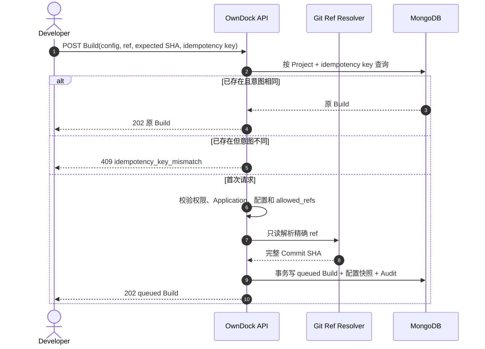
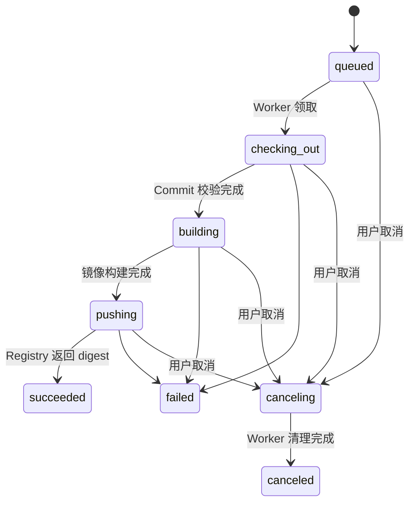

# 触发与查询 Build

Build 是一次不可变的构建操作记录。手动触发时，用户选择已有 Build Configuration 和其中允许的 Git ref；OwnDock 读取已登记的 Source Repository，把分支或 Tag 解析成完整 Commit SHA，然后复制当时的构建配置快照并创建 `queued` Build。

当前切片已经实现 Build 状态机、取消/重试 API、MongoDB queue/lease/fence，以及独立 Worker 的固定 Git checkout、rootless BuildKit 构建、认证 Registry push、Artifact/Release 交接和有界脱敏日志。推送成功后真实 OCI digest 会形成 Artifact，Build 原子进入 `succeeded`；自动 Release 的临时失败不会回滚或重新构建，只把 Artifact 留在 `release_pending` 重试，Application 明确退役时则收敛为 `release_created` 或 `release_skipped`。收到触发请求的 `202` 只表示任务已安全记录，API Server 不执行仓库内容。

## 为什么同时保存 ref 和 Commit SHA

分支与 Tag 都可能移动。例如今天的 `refs/heads/main` 指向 Commit A，明天可能指向 Commit B。Build 同时保存：

- `ref`：用户当时选择了哪个分支或 Tag；
- `commit_sha`：该次 Build 真正固定的 40 位源码身份。

历史 Build 不会因为分支移动而改变。对于 annotated Tag，解析器优先保存 peeled Commit，而不是 Tag 对象本身；后续隔离 Worker 仍必须 fetch 并验证该 Commit，不能只信任触发输入。

## 手动触发请求

```http
POST /api/v1/projects/{project_id}/builds
Content-Type: application/json
Authorization: Bearer ...
```

```json
{
  "application_id": "application-1",
  "build_configuration_id": "configuration-1",
  "ref": "refs/heads/main",
  "expected_commit_sha": "a975c10d68a2d7461634f13b15c52a2efba72d16",
  "idempotency_key": "manual-20260801-001"
}
```

- `ref` 必须是配置中精确允许的 `refs/heads/...` 或 `refs/tags/...`，不接受缩写和通配符；
- `expected_commit_sha` 可省略。填写后，如果远端 ref 已移动到另一个 Commit，返回 `409 revision_mismatch`，不会悄悄构建不同源码；
- `idempotency_key` 在 Project 内唯一，最长 128 字符，用于安全重试请求。

## 幂等如何工作

第一次请求成功后，相同 Project、相同幂等键和相同触发意图会返回原 Build。回放发生在重新读取远端 Git 之前，因此即使分支随后移动，网络重试也不会创建第二条 Build。

同一个幂等键如果改用其他 Application、Build Configuration 或 ref，返回 `409 idempotency_key_mismatch`；如果回放时提供 `expected_commit_sha`，它还必须等于原 Build 已固定的 Commit。客户端必须生成新键，不能把旧键复用于另一项操作。



## 配置快照

Build 保存触发时的 Configuration ID/version，以及 Source Repository、Dockerfile/context、允许 ref、Registry Credential ID、镜像仓库、平台、构建资源、超时、并发、自动 Release 意图和 Release 运行规格。之后修改 Build Configuration 不会改变这条 Build。

快照只包含非秘密字段和凭据资源 ID，不包含 Git Token、Deploy Key、Registry 密码、源码或缓存。API Server 只进行远端 ref 查询，不 checkout 源码，也不运行 Dockerfile。

## Build 状态与失联恢复



Worker 领取 Build 时会获得短时 lease 和递增的 generation。正常执行期间必须 heartbeat 续租；Worker 失联并超过 lease 后，其他 Worker 可以从原阶段接管，并得到更大的 generation。旧 Worker 即使恢复，也不能再写状态或创建后续 Artifact/Release。lease owner、到期时间和 generation 是内部执行信息，不通过普通 Build API 返回。

Registry 返回 digest 后，Worker 在同一事务中创建唯一 Artifact、把 Build 标记为 `succeeded` 并写审计。如果已保存 digest 的 `pushing` Build 被接管，新 Worker 直接完成这一步，不重新 checkout 或构建。Artifact 与 Release 的状态和手动 API 见 [Artifact 与 Release 交接](artifacts.md)。

失败只公开稳定类别，例如仓库认证失败、Commit 不存在、构建资源超限或 Registry push 失败，不回传包含 Token、路径或底层连接细节的原始错误。

## 取消与重试

取消是协作式操作：API 先把非终态 Build 改为 `canceling`，后续独立 Worker 停止当前步骤、清理临时目录或构建任务，再写入 `canceled`。重复取消同一条 `canceling/canceled` Build 会返回当前记录，不重复写审计。

```http
POST /api/v1/projects/{project_id}/builds/{build_id}:cancel
Authorization: Bearer ...
```

重试只允许来源状态为 `failed`。它不会重置或覆盖失败记录，而是复制来源 Build 已固定的 Commit 与非秘密配置快照，创建一条 `trigger_source=retry`、带 `source_build_id` 的新 `queued` Build。这样历史、失败原因和审计链都不会丢失。

```http
POST /api/v1/projects/{project_id}/builds/{build_id}:retry
Content-Type: application/json
Authorization: Bearer ...

{"idempotency_key":"retry-20260801-001"}
```

## 权限和查询

- Owner、Maintainer、Developer 可以触发、取消和重试；
- Viewer 可以读取 Build 与非秘密快照；
- 首次创建写入 `build.trigger_manual` 审计事件，幂等回放不重复写审计。

```text
GET  /api/v1/projects/{project_id}/builds
GET  /api/v1/projects/{project_id}/builds/{build_id}
POST /api/v1/projects/{project_id}/builds
POST /api/v1/projects/{project_id}/builds/{build_id}:cancel
POST /api/v1/projects/{project_id}/builds/{build_id}:retry
```

外部自动化可以使用独立的 [Build Trigger Token](build-triggers.md)，也可以使用 [GitHub/GitLab/Gitea/Forgejo 平台 Webhook](webhooks.md)，不能把用户 Session 放进 Git 平台。
