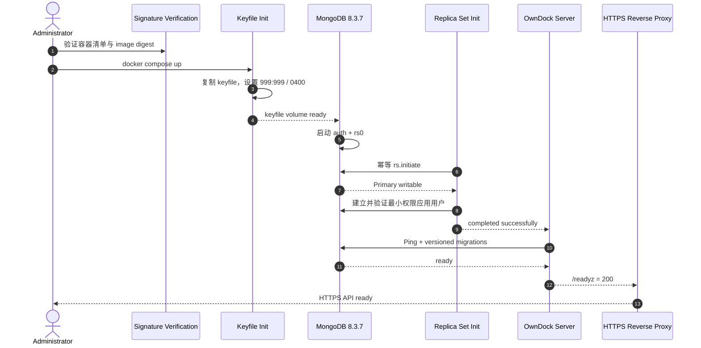
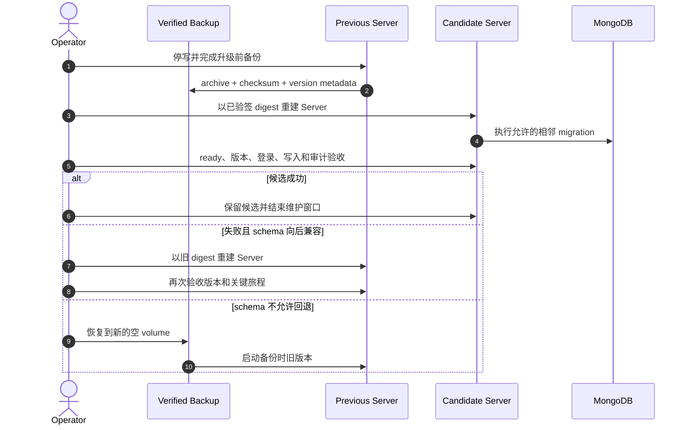
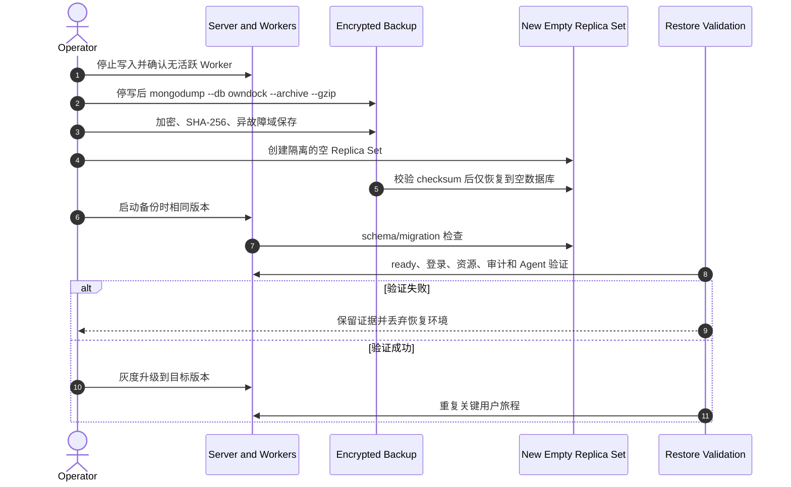

# 社区版单节点安装与恢复

本文给出面向首次试用和小型团队的单节点 Docker Compose 基线。它使用固定 MongoDB 8.3.7 Replica Set 与 FCV 8.3、已签名的 OwnDock 镜像 digest、文件型 Secret、只监听 loopback 的 HTTP 入口，以及默认开启的 Deployment/Inventory Worker。

该拓扑不是高可用方案。正式对外服务前仍必须完成客户环境的 TLS 入口、备份恢复、远程 Runtime Target 和故障演练；缺少这些证据时按 pre-release 使用。

## 准备发行制品

从同一个正式 Release 下载：

- `owndock-community_<version>.tar.gz`；
- `COMMUNITY_SHA256SUMS`；
- `COMMUNITY_SHA256SUMS.sigstore.json`；
- `CONTAINER_IMAGES.txt`；
- `CONTAINER_IMAGES.sigstore.json`；
- `COMMUNITY_COMPATIBILITY_amd64.txt`；
- `COMMUNITY_COMPATIBILITY_arm64.txt`；
- `verify-community-release`；

先使用精确 Tag 的 Release 工作流身份离线验证 `COMMUNITY_SHA256SUMS.sigstore.json`，再校验安装包、`CONTAINER_IMAGES.txt` 和两份原生架构兼容报告的 SHA-256。兼容报告记录精确前后版本、Server digest、commit、内核和 Docker Engine；`result=baseline` 表示首个版本不存在可比较的上一版，不能解释为相邻升级已经验证。下面的 `<tag>` 必须替换为正在安装的完整 Tag，例如 `v0.1.0`：

```bash
cosign verify-blob COMMUNITY_SHA256SUMS \
  --bundle COMMUNITY_SHA256SUMS.sigstore.json \
  --certificate-identity \
    "https://github.com/owndock/owndock/.github/workflows/release.yml@refs/tags/<tag>" \
  --certificate-oidc-issuer https://token.actions.githubusercontent.com \
  --offline
sha256sum --check COMMUNITY_SHA256SUMS
./verify-community-release "${tag#v}" .
tar -xzf "owndock-community_${tag#v}.tar.gz"
```

必须先用独立安装且受信任的 Cosign 验证校验和，再由 `sha256sum` 验证下载的脚本自身，之后才能执行 `verify-community-release`。验证器会再次离线校验两个 Sigstore bundle，并拒绝缺项、额外 checksum 项、可变镜像引用、未知镜像仓库、重复镜像、版本或架构不匹配的兼容报告。

解包后，继续按[社区版发布候选门禁](release-readiness.md)验证容器清单和目标镜像签名，再从清单复制 `ghcr.io/owndock/owndock@sha256:...`。不要把 SemVer tag 或 `latest` 写入实际部署配置。

当前社区安装是联网 Registry 模式：首次安装和升级需要能够按 digest 访问 GHCR，并拉取 Compose 固定的 MongoDB 官方镜像。安装包不内嵌 OCI image layer；Sigstore 的离线验签只表示验证过程不访问签名服务，不等于可以在完全隔离网络中安装。受支持的私有镜像同步、签名重新绑定和完整 air-gapped 介质属于后续商业交付范围。在该能力正式发布前，不要手工改写镜像仓库后仍宣称符合社区兼容报告。

## 生成安装 Secret

在只允许管理员访问的本机目录运行：

```bash
install -d -m 0700 /srv/owndock/secrets
sh deploy/prepare-community-secrets.sh /srv/owndock/secrets
```

脚本使用 OpenSSL 生成 MongoDB 内部认证 keyfile、相互独立的 root/应用/备份恢复密码、一次性 bootstrap token、应用连接 URI 和 Database Tools 配置。Server 只使用 `owndock` 数据库的 `readWrite` 用户；备份恢复使用不具备 root 权限且不会挂载到 Server 的 `backup`/`restore` 操作身份。所有文件都是 `0400`，脚本发现任何同名文件都会停止，不会轮换或覆盖现有安装的身份。

把下面的非秘密路径和已验签镜像引用放入管理员 Shell 或权限为 `0600` 的 Compose env 文件：

```bash
export OWNDOCK_SERVER_IMAGE='ghcr.io/owndock/owndock@sha256:<verified-digest>'
export OWNDOCK_HTTP_PORT='8000'
export OWNDOCK_MONGODB_KEYFILE_PATH='/srv/owndock/secrets/mongodb-keyfile'
export OWNDOCK_MONGODB_ROOT_USERNAME_PATH='/srv/owndock/secrets/mongodb-root-username'
export OWNDOCK_MONGODB_ROOT_PASSWORD_PATH='/srv/owndock/secrets/mongodb-root-password'
export OWNDOCK_MONGODB_APP_PASSWORD_PATH='/srv/owndock/secrets/mongodb-app-password'
export OWNDOCK_MONGODB_TOOLS_PASSWORD_PATH='/srv/owndock/secrets/mongodb-tools-password'
export OWNDOCK_BOOTSTRAP_TOKEN_PATH='/srv/owndock/secrets/owndock-bootstrap-token'
export OWNDOCK_MONGODB_URI_PATH='/srv/owndock/secrets/owndock-mongodb-uri'
export OWNDOCK_MONGODB_TOOLS_CONFIG_PATH='/srv/owndock/secrets/owndock-mongodb-tools.yaml'
```

这些变量只包含路径和公开镜像引用，不包含密码、Token 或 URI 正文。不要把 Secret 内容放入命令行、`.env`、Git 或工单。

## 启动

先检查最终 Compose，不启动容器：

```bash
docker compose -f deploy/community.compose.yaml config --quiet
```

再启动并确认就绪：

```bash
docker compose -f deploy/community.compose.yaml up -d
curl --fail --silent http://127.0.0.1:8000/livez
curl --fail --silent http://127.0.0.1:8000/readyz
```

初始化容器只负责幂等建立 `rs0` 并等待 Primary；Server 在它成功退出后启动，再执行版本化 MongoDB migration。MongoDB 没有映射宿主机端口，Server HTTP 只绑定 `127.0.0.1`。对外访问必须经过显式 HTTPS 反向代理，并按[产品 API 入口保护](ingress-protection.md)设置可信代理 CIDR。



## 首次 Bootstrap

从 `owndock-bootstrap-token` 文件通过安全方式读取 token，并调用 OpenAPI 中的 `POST /api/v1/auth/bootstrap`。不要把 token 直接写入共享 Shell history。成功后数据库会拒绝任何第二次 bootstrap；该文件仍应像其他安装 Secret 一样保管，不能公开或提交。

## 备份

首发单节点基线采用保守的停写逻辑备份。先停止 Server，确认没有外部 Worker 写入，再执行仓库提供的备份命令：

```bash
docker compose -f deploy/community.compose.yaml stop server
install -d -m 0700 /srv/owndock/backups
sh deploy/backup-community.sh \
  "/srv/owndock/backups/owndock-$(date -u +%Y%m%dT%H%M%SZ).archive.gz"
```

脚本拒绝覆盖已有文件、拒绝 Server 仍在运行或 MongoDB 未运行的状态，只导出 `owndock` 数据库，并生成权限为 `0600` 的 SHA-256 文件。由于应用已经停写，数据库级 dump 不使用与 `--db` 不兼容的 `--oplog`。敏感 URI 只从容器 Secret 中的 Database Tools `--config` 读取，不出现在宿主机进程参数中。archive 仍包含敏感业务数据，复制离开本机前必须使用团队批准的加密工具和独立密钥加密，再存放到不同故障域。

至少记录：OwnDock 精确版本和 commit、MongoDB 版本、备份开始/结束时间、archive SHA-256、加密密钥标识和恢复演练结果。只复制 Docker volume 目录不构成支持的在线备份。

## 升级与回滚

社区版升级使用维护窗口，不承诺无停机。只允许升级到发布说明明确支持的相邻版本；开始前必须完成上面的停写备份，并保留当前已验签的 Server image digest。验证候选版本的安装包、容器清单和签名后执行：

```bash
previous_image=$OWNDOCK_SERVER_IMAGE
export OWNDOCK_SERVER_IMAGE='ghcr.io/owndock/owndock@sha256:<verified-candidate-digest>'
docker compose -f deploy/community.compose.yaml up -d --no-deps --force-recreate server
curl --fail --silent http://127.0.0.1:8000/readyz
curl --fail --silent http://127.0.0.1:8000/api/v1/meta/version
```

确认版本和 commit 都与候选清单一致，再验证 Owner 登录、核心资源读取、一次写入操作和审计记录。不要在验证完成前删除旧镜像或唯一可恢复备份。

若候选版本失败，并且该发行说明明确声明数据库 schema 可向后兼容，可在同一维护窗口切回旧 digest：

```bash
export OWNDOCK_SERVER_IMAGE=$previous_image
docker compose -f deploy/community.compose.yaml up -d --no-deps --force-recreate server
curl --fail --silent http://127.0.0.1:8000/readyz
curl --fail --silent http://127.0.0.1:8000/api/v1/meta/version
```

若发布说明没有明确允许二进制回滚，或候选 migration 已产生不兼容变更，不得直接启动旧二进制；应停止服务，按下一节把升级前备份恢复到新的空 volume，再启动旧版本。镜像回滚和备份恢复是两个不同的回退路径。



仓库的 `make test-community-integration` 会从同一 commit 构建两个带不同版本元数据的本地镜像，真实验证 Compose 的升级、数据保持和回滚机制。它不等同于相邻正式发行版 schema 兼容证明；正式 Tag 仍必须用当前版和上一版签名制品重跑本节旅程。

## 恢复演练

恢复必须在隔离环境先验证：

1. 使用同一 MongoDB major/FCV 创建空 Replica Set；
2. 保留原备份，创建新的空数据 volume，禁止直接覆盖唯一副本；
3. 停止 OwnDock Server 和所有 Worker；
4. 校验、解密出权限为 `0600` 的临时 archive 和同名 `.sha256`，然后只对新建的空数据库执行：

   ```bash
   export OWNDOCK_RESTORE_CONFIRM=empty-owndock-database
   sh deploy/restore-community.sh \
     /srv/owndock/restore/input.archive.gz \
     /srv/owndock/restore/input.archive.gz.sha256
   unset OWNDOCK_RESTORE_CONFIRM
   ```

   脚本会再次校验 SHA-256，并在 Server 运行、MongoDB 停止、目标存在任何非系统 collection 或输入可被组/其他用户写入时拒绝恢复；它不使用 `--drop` 覆盖现有数据；
5. 使用 `docker compose -f deploy/community.compose.yaml up -d --no-deps server` 启动与备份相同版本的 Server，让 migration 检查现有 schema；
6. 验证 `/readyz`、Owner 登录、Project/Release/Deployment、审计、Agent 身份和 Runtime Target；
7. 再升级到目标版本并重复关键旅程；失败时丢弃恢复环境，不能反向修改原备份。



只有实际恢复成功且恢复时间满足团队目标，才可以把“存在备份”视为可恢复能力。
