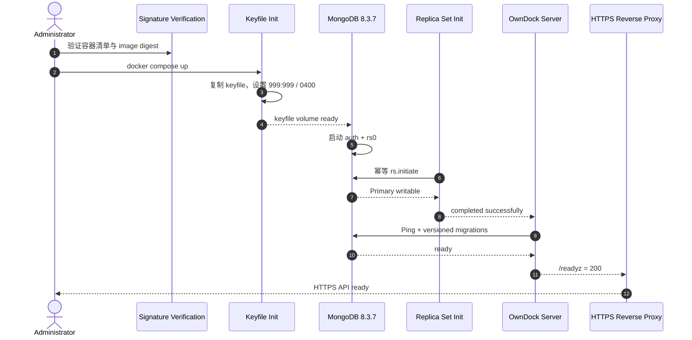
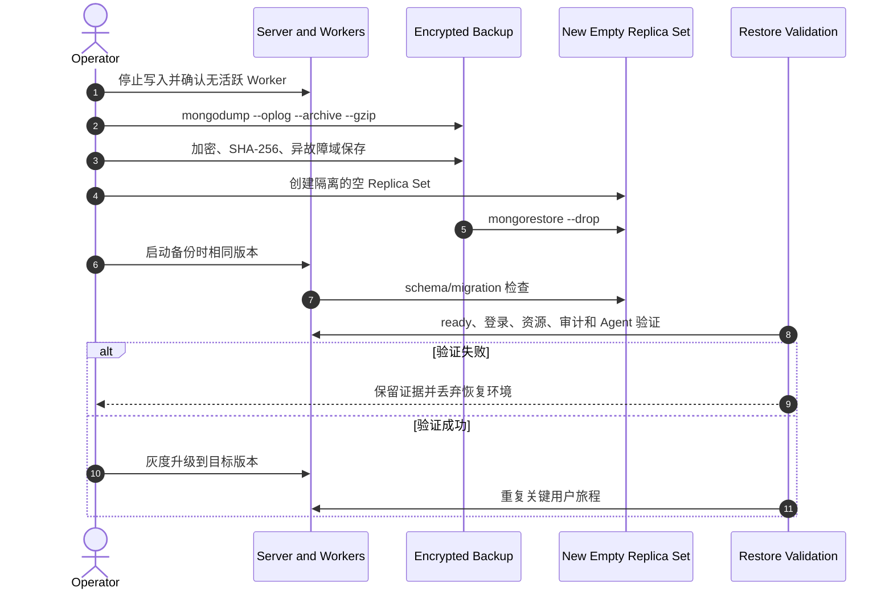

# 社区版单节点安装与恢复

本文给出面向首次试用和小型团队的单节点 Docker Compose 基线。它使用固定 MongoDB 8.3.7 Replica Set、已签名的 OwnDock 镜像 digest、文件型 Secret、只监听 loopback 的 HTTP 入口，以及默认开启的 Deployment/Inventory Worker。

该拓扑不是高可用方案。正式对外服务前仍必须完成客户环境的 TLS 入口、备份恢复、远程 Runtime Target 和故障演练；缺少这些证据时按 pre-release 使用。

## 准备发行制品

从同一个正式 Release 下载：

- `owndock-community_<version>.tar.gz`；
- `COMMUNITY_SHA256SUMS`；
- `COMMUNITY_SHA256SUMS.sigstore.json`；
- `CONTAINER_IMAGES.txt`；
- `CONTAINER_IMAGES.sigstore.json`；

先使用精确 Tag 的 Release 工作流身份离线验证 `COMMUNITY_SHA256SUMS.sigstore.json`，再校验安装包与 `CONTAINER_IMAGES.txt` 的 SHA-256。下面的 `<tag>` 必须替换为正在安装的完整 Tag，例如 `v0.1.0`：

```bash
cosign verify-blob COMMUNITY_SHA256SUMS \
  --bundle COMMUNITY_SHA256SUMS.sigstore.json \
  --certificate-identity \
    "https://github.com/owndock/owndock/.github/workflows/release.yml@refs/tags/<tag>" \
  --certificate-oidc-issuer https://token.actions.githubusercontent.com \
  --offline
sha256sum --check COMMUNITY_SHA256SUMS
tar -xzf "owndock-community_${tag#v}.tar.gz"
```

解包后，继续按[社区版发布候选门禁](release-readiness.md)验证容器清单和目标镜像签名，再从清单复制 `ghcr.io/owndock/owndock@sha256:...`。不要把 SemVer tag 或 `latest` 写入实际部署配置。

## 生成安装 Secret

在只允许管理员访问的本机目录运行：

```bash
install -d -m 0700 /srv/owndock/secrets
sh deploy/prepare-community-secrets.sh /srv/owndock/secrets
```

脚本使用 OpenSSL 生成 MongoDB 内部认证 keyfile、root 密码、一次性 bootstrap token 和应用连接 URI。所有文件都是 `0400`，脚本发现任何同名文件都会停止，不会轮换或覆盖现有安装的身份。

把下面的非秘密路径和已验签镜像引用放入管理员 Shell 或权限为 `0600` 的 Compose env 文件：

```bash
export OWNDOCK_SERVER_IMAGE='ghcr.io/owndock/owndock@sha256:<verified-digest>'
export OWNDOCK_HTTP_PORT='8000'
export OWNDOCK_MONGODB_KEYFILE_PATH='/srv/owndock/secrets/mongodb-keyfile'
export OWNDOCK_MONGODB_ROOT_USERNAME_PATH='/srv/owndock/secrets/mongodb-root-username'
export OWNDOCK_MONGODB_ROOT_PASSWORD_PATH='/srv/owndock/secrets/mongodb-root-password'
export OWNDOCK_BOOTSTRAP_TOKEN_PATH='/srv/owndock/secrets/owndock-bootstrap-token'
export OWNDOCK_MONGODB_URI_PATH='/srv/owndock/secrets/owndock-mongodb-uri'
```

这些变量只包含路径和公开镜像引用，不包含密码、Token 或 URI 正文。不要把 Secret 内容放入命令行、`.env`、Git 或工单。

## 启动

先检查最终 Compose，不启动容器：

```bash
docker compose -f deploy/community.compose.yaml config --quiet
```

再启动并确认就绪：

```bash
docker compose -f deploy/community.compose.yaml up -d
curl --fail --silent http://127.0.0.1:8000/livez
curl --fail --silent http://127.0.0.1:8000/readyz
```

初始化容器只负责幂等建立 `rs0` 并等待 Primary；Server 在它成功退出后启动，再执行版本化 MongoDB migration。MongoDB 没有映射宿主机端口，Server HTTP 只绑定 `127.0.0.1`。对外访问必须经过显式 HTTPS 反向代理，并按[产品 API 入口保护](ingress-protection.md)设置可信代理 CIDR。



## 首次 Bootstrap

从 `owndock-bootstrap-token` 文件通过安全方式读取 token，并调用 OpenAPI 中的 `POST /api/v1/auth/bootstrap`。不要把 token 直接写入共享 Shell history。成功后数据库会拒绝任何第二次 bootstrap；该文件仍应像其他安装 Secret 一样保管，不能公开或提交。

## 备份

首发单节点基线采用保守的停写逻辑备份。先停止 Server，确认没有 Worker 写入，再从固定 MongoDB 容器执行 `mongodump --oplog --archive --gzip`。MongoDB Database Tools 的敏感 URI应通过权限受限的 `--config` 文件提供，不能放在进程参数中。备份文件必须加密、带 SHA-256 校验和，并复制到与当前主机故障域不同的位置。

至少记录：OwnDock 精确版本和 commit、MongoDB 版本、备份开始/结束时间、archive SHA-256、加密密钥标识和恢复演练结果。只复制 Docker volume 目录不构成支持的在线备份。

## 恢复演练

恢复必须在隔离环境先验证：

1. 使用同一 MongoDB major/FCV 创建空 Replica Set；
2. 保留原备份，创建新的空数据 volume，禁止直接覆盖唯一副本；
3. 停止 OwnDock Server 和所有 Worker；
4. 使用权限受限的 Database Tools 配置执行 `mongorestore --archive --gzip --drop`；
5. 启动与备份相同版本的 Server，让 migration 检查现有 schema；
6. 验证 `/readyz`、Owner 登录、Project/Release/Deployment、审计、Agent 身份和 Runtime Target；
7. 再升级到目标版本并重复关键旅程；失败时丢弃恢复环境，不能反向修改原备份。



只有实际恢复成功且恢复时间满足团队目标，才可以把“存在备份”视为可恢复能力。
