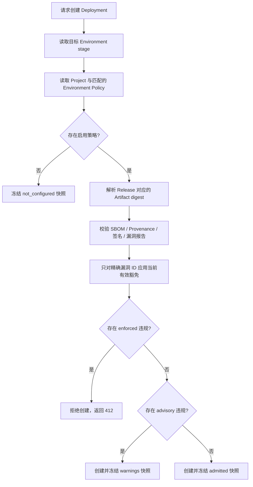
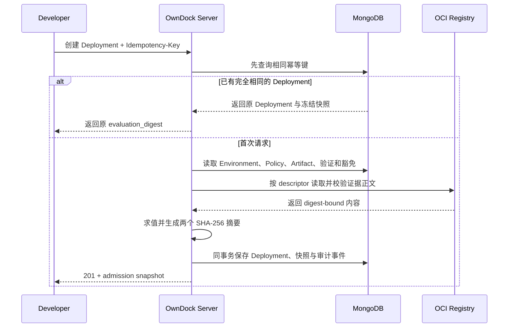

# Deployment Policy：部署前先检查镜像证据

Deployment Policy 是 Project 的部署准入规则。它在创建 Deployment 之前检查 Release 对应的不可变 Artifact，而不是在容器启动后补做检查。

可以把它理解成一道部署门：团队用固定字段说明“进入这个环境前，镜像至少要具备哪些证据”。当前可检查：

- 是否存在可完整读取且与镜像 digest 一致的 CycloneDX SBOM；
- 是否存在可完整读取且与镜像 digest 一致的 SLSA Provenance；
- 是否至少有一次验证结果符合指定的当前 Signature Trust Policy 版本；
- 最新漏洞报告是否仍在有效期内，以及去掉当前有效豁免后，最高漏洞严重级别是否超过上限。

策略不接受 Rego、Shell、任意 YAML 或插件代码。受限字段更容易审计，也避免 API Server 在部署路径执行客户脚本。

## 两层策略如何一起工作

社区版本支持两种范围：

- `project`：整个 Project 的最低要求，同一 Project 最多一条；
- `environment`：某个 Environment 的附加要求，每个 Environment 最多一条。

创建 Deployment 时，Project 策略与目标 Environment 策略会一起求值，必须分别满足。Environment 策略不能抵消或放宽 Project 策略。例如 Project 要求 SBOM，而 Production Environment 还要求签名和最高 `high` 漏洞，两组要求都会生效。

环境阶段还有不可降低的安全底线：

| Environment stage | 实际行为 |
| --- | --- |
| `development` | 只告警。证据不满足时仍创建 Deployment，并冻结 `admitted_with_warnings` 结果。 |
| `staging` | 可配置 `advisory` 或 `enforced`。策略存储不可用时保守阻断。 |
| `production` | 只要启用策略就强制阻断；不能配置成只告警。 |

没有启用的匹配策略时，OwnDock 仍会为新 Deployment 保存 `not_configured` 快照，明确表示“当时没有策略”，而不是把它误写成“检查通过”。



## 为什么每次 Deployment 都保存快照

策略、扫描结果、签名信任根和漏洞豁免都会随时间变化。只保存一个 `passed: true` 无法回答“当时为什么允许部署”。OwnDock 因此把本次求值使用的事实冻结到 Deployment：

- Policy ID、版本、范围、实际模式和完整受限要求；
- Artifact ID 与不可变 OCI subject digest；
- SBOM、Provenance 和漏洞报告的 descriptor/content digest；
- 签名验证记录、Trust Policy ID/版本和 bundle 集合摘要；
- 漏洞扫描器、数据库版本、扫描时间、原始数量和应用豁免后的剩余数量；
- 实际命中的豁免 ID、版本、范围、精确漏洞 ID 和到期时间；
- 稳定违规代码、`evidence_set_digest` 和整个求值的 `evaluation_digest`。

Policy 更新、重新扫描、信任根轮换或豁免到期只影响未来 Deployment，不会重写历史。相同 `Idempotency-Key` 的完全相同请求会直接返回第一次保存的 Deployment 和原始求值摘要，不重新套用后来变化的策略。



## 漏洞与豁免的准确含义

漏洞门禁不会修改原始 Trivy 报告。求值时先重新读取详细 OCI 报告，核对 Artifact subject、Evidence descriptor、正文 digest、报告时间和 MongoDB Observation 数量；任一项漂移都按完整性错误处理。

随后只应用仍有效且未撤销的记录：Project 范围必须属于当前 Project；Artifact 范围还必须同时匹配当前 Artifact ID 和 subject digest。一个豁免只匹配一个精确漏洞 ID。快照同时保存原始数量和剩余数量，因此审计人员仍能看到风险原貌。

`maximum_vulnerability_severity` 与 `maximum_scan_age_seconds` 必须一起配置。扫描最大年龄为 1 小时至 30 天；实际有效期取“策略最大年龄”和 Observation 自身 `fresh_until` 中更早的时间。含有 `unknown` 严重级别的未豁免发现会失败关闭，不能把未知风险当作低风险。

## 外部 CI 镜像

外部 CI 推送镜像后，应先调用 `POST /api/v1/projects/{project_id}/artifacts`，用精确 digest 登记 `external` Artifact，再从该 Artifact 创建 Release。这样外部镜像与 OwnDock Build 镜像共享同一套 Evidence 和 Policy；Artifact 仍明确显示 producer 为调用方声明，不会被误标成 OwnDock 构建。完整流程见 [Artifact 来源、外部登记与 Release 交接](artifacts.md)。

直接创建、但没有关联 Artifact 的历史或基础 Release 无法提供可供策略校验的 digest-bound Evidence。启用策略时：

- development 记录 `artifact_unavailable` 告警并继续；
- staging/production 的强制求值拒绝部署。

这不表示外部 Git 或 CI 平台不受支持，而是要求先把构建结果登记成不可变 Artifact。登记会自动排入 SBOM、漏洞扫描和适用的已有签名验证 Job；不会伪造第三方 Provenance 或由 OwnDock 自动补签。

## 管理 API

Viewer 及以上角色可以读取；Maintainer 和 Owner 可以创建、更新、启用或禁用。更新使用 `expected_version` 乐观锁，并生成下一个版本；范围和 Environment 不能原地改变。

```http
GET /api/v1/projects/{project_id}/deployment-policies
GET /api/v1/projects/{project_id}/deployment-policies/{policy_id}
POST /api/v1/projects/{project_id}/deployment-policies
PATCH /api/v1/projects/{project_id}/deployment-policies/{policy_id}
Authorization: Bearer <session-token>
Content-Type: application/json
```

Production 基线示例：

```json
{
  "name": "Production supply-chain baseline",
  "scope": "environment",
  "environment_id": "production",
  "mode": "enforced",
  "requirements": {
    "require_sbom": true,
    "require_provenance": true,
    "allowed_signature_policy_ids": ["release-signers"],
    "maximum_vulnerability_severity": "high",
    "maximum_scan_age_seconds": 86400
  },
  "enabled": true
}
```

这里的 `high` 表示允许的最高剩余严重级别是 High；仍有 Critical 时拒绝。若希望 High 也拒绝，应配置 `medium`。

## Deployment 响应和错误

新创建的正式 Deployment 响应包含 `admission`。迁移此能力以前产生的历史记录可能没有该字段；这不等于它们通过了当前策略。

- `201`：已创建。查看 `admission.decision` 区分 `not_configured`、`admitted` 和 `admitted_with_warnings`；
- `412 deployment_admission_denied`：已形成可信的保守结论，但强制策略不满足。`details` 只返回策略快照、稳定违规代码和求值摘要；
- `503 deployment_admission_unavailable`：连可信求值快照都无法形成，例如 Environment 阶段无法读取或快照完整性校验失败。Deployment 不会被创建；
- `409`：策略版本冲突或幂等键对应另一组部署参数。

稳定违规代码包括 `sbom_missing`、`provenance_missing`、`signature_missing`、`vulnerability_observation_missing`、`vulnerability_observation_stale`、`vulnerability_report_integrity`、`vulnerability_severity_unknown`、`vulnerability_severity_exceeded`、`artifact_unavailable`、`evidence_unavailable` 和 `policy_unavailable`。界面应把代码翻译成通俗文案，但自动化程序应判断稳定代码，不解析自然语言消息。

策略是一道可追溯的自动门禁，不是“镜像绝对安全”的保证。生产发布仍需要团队结合业务影响、运行时隔离、补丁计划和回滚能力作出判断。
