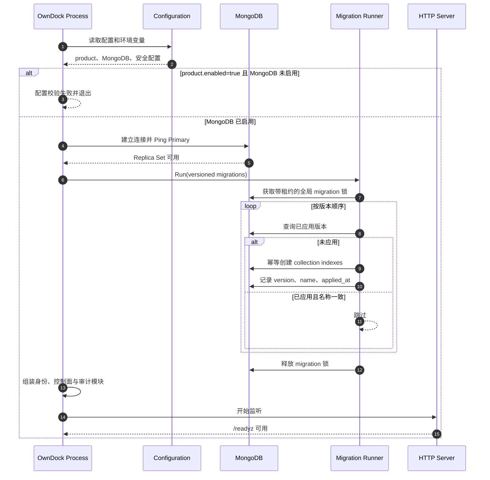
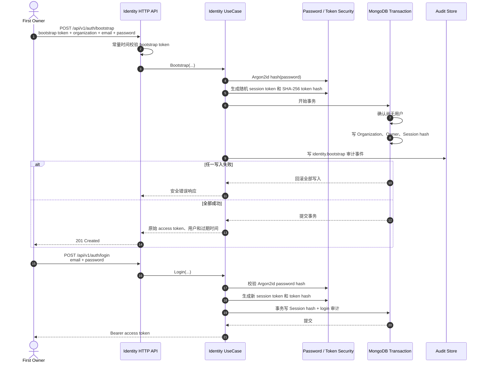
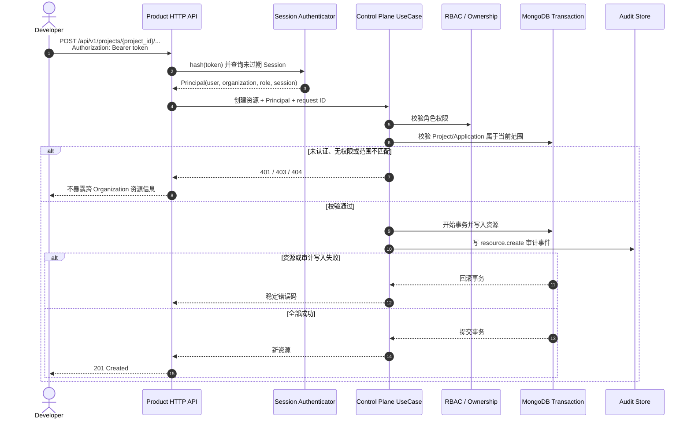
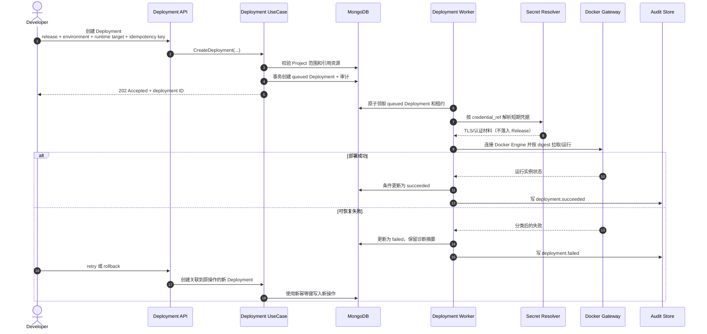

# 核心流程时序

本文用时序图说明 OwnDock 当前已实现的关键链路，以及首个端到端部署用例的目标链路。标题中的“已实现”表示代码、契约和测试已经存在；“目标”表示产品语义已经确定，但执行能力尚未接入，不能据此判断当前版本可以执行生产部署。

## 已实现：启动、Migration 与就绪

产品 API 依赖 MongoDB。进程先连接数据库并运行版本化 migration，全部成功后才创建产品模块和开始监听；任一步失败都会终止启动并清理已经创建的资源。

## 已实现：首次初始化与本地登录

Bootstrap 只用于创建首个 Organization 和 Owner。调用方必须同时提供环境变量配置的 bootstrap token；创建首个用户后，再次 bootstrap 会返回冲突。密码使用 Argon2id 保存，Bearer token 只向客户端返回一次，MongoDB 中仅保存其单向哈希。

## 已实现：认证、授权、资源写入与审计

Project、Project 下的 Application、不可变 Release 和 Runtime Target 共用相同的写入骨架。身份来自 Bearer session，Organization 所有权和角色权限由 UseCase 强制执行。资源与审计事件处于同一 MongoDB 事务，因此审计失败不会留下无审计的资源。

## 目标：从 Release 到 Docker Deployment

下面是首个产品用例的目标流程，当前尚未实现。它用于约束后续 Environment、Deployment 状态机、凭据解析、Docker Gateway 和 Worker 的设计，不表示 Runtime Target 创建后已经发生连接探测或部署。

## 阅读边界

- 当前正式持久化资源：Organization、User、Session、Project、Project Application、Release、Runtime Target、Audit Event。
- 当前 Runtime Target 状态固定为 `pending`，只保存连接元数据和 `credential_ref`，不保存凭据正文。
- Environment、Template、Deployment 正式模型、Docker 连接探测与执行仍是后续纵向切片。
- 顶层 Application、Environment、Deployment 路由是默认关闭的工程样例，与正式 Project 范围 API 相互隔离。
