# 核心流程时序

本文用时序图说明 OwnDock 当前已实现的关键链路，以及首个端到端部署用例的目标链路。标题中的“已实现”表示代码、契约和测试已经存在；“目标”表示产品语义已经确定，但执行能力尚未接入，不能据此判断当前版本可以执行生产部署。

TerminalSession 创建、一次性 Cookie、登录会话重新确认、WSS 和执行网关的分层时序见[安全终端会话](terminal-sessions.md)，Web 入口、连接状态、xterm 边界、客户错误解释和验收清单见[容器与主机终端用户旅程](terminal-user-journey.md)。其中控制面、同域 WSS，以及 direct/Agent 两种连接模式的容器 Docker exec 与主机 PTY/SSH Gateway 已实现；独立 Web 页面、真实远程主机故障和浏览器系统验收仍是目标链路。

## 已实现：启动、Migration 与就绪

产品 API 依赖 MongoDB。进程先连接数据库并运行版本化 migration，全部成功后才创建产品模块和开始监听；任一步失败都会终止启动并清理已经创建的资源。

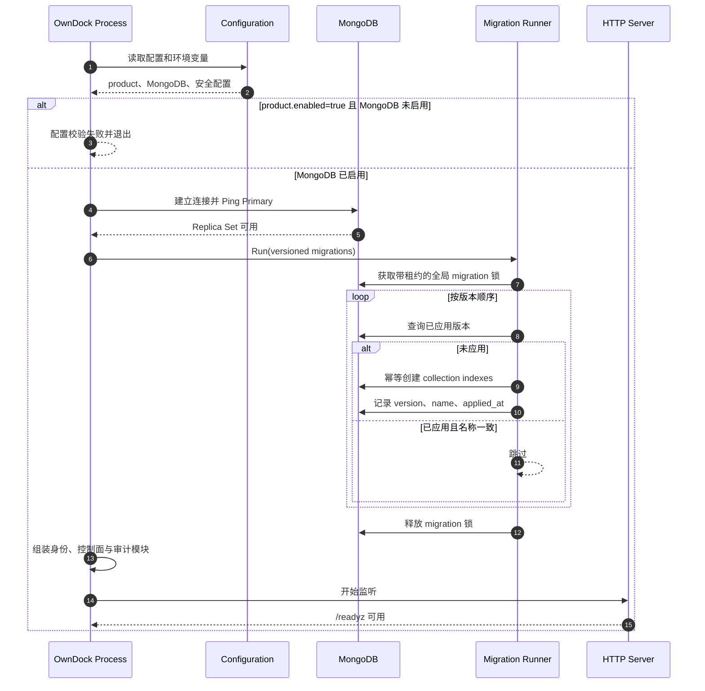
```mermaid
sequenceDiagram
    autonumber
    participant P as OwnDock Process
    participant C as Configuration
    participant M as MongoDB
    participant G as Migration Runner
    participant H as HTTP Server

    P->>C: 读取配置和环境变量
    C-->>P: product、MongoDB、安全配置
    alt product.enabled=true 且 MongoDB 未启用
        P-->>P: 配置校验失败并退出
    else MongoDB 已启用
        P->>M: 建立连接并 Ping Primary
        M-->>P: Replica Set 可用
        P->>G: Run(versioned migrations)
        G->>M: 获取带租约的全局 migration 锁
        loop 按版本顺序
            G->>M: 查询已应用版本
            alt 未应用
                G->>M: 幂等创建 collection indexes
                G->>M: 记录 version、name、applied_at
            else 已应用且名称一致
                G-->>G: 跳过
            end
        end
        G->>M: 释放 migration 锁
        P->>P: 组装身份、控制面与审计模块
        P->>H: 开始监听
        H-->>P: /readyz 可用
    end
```

## 已实现：首次初始化与本地登录

Bootstrap 只用于创建首个 Organization 和 Owner。调用方必须同时提供安装配置从环境变量或受限 Secret 文件读取的 bootstrap token；创建首个用户后，再次 bootstrap 会返回冲突。密码使用 Argon2id 保存，Bearer token 只向客户端返回一次，MongoDB 中仅保存其单向哈希。

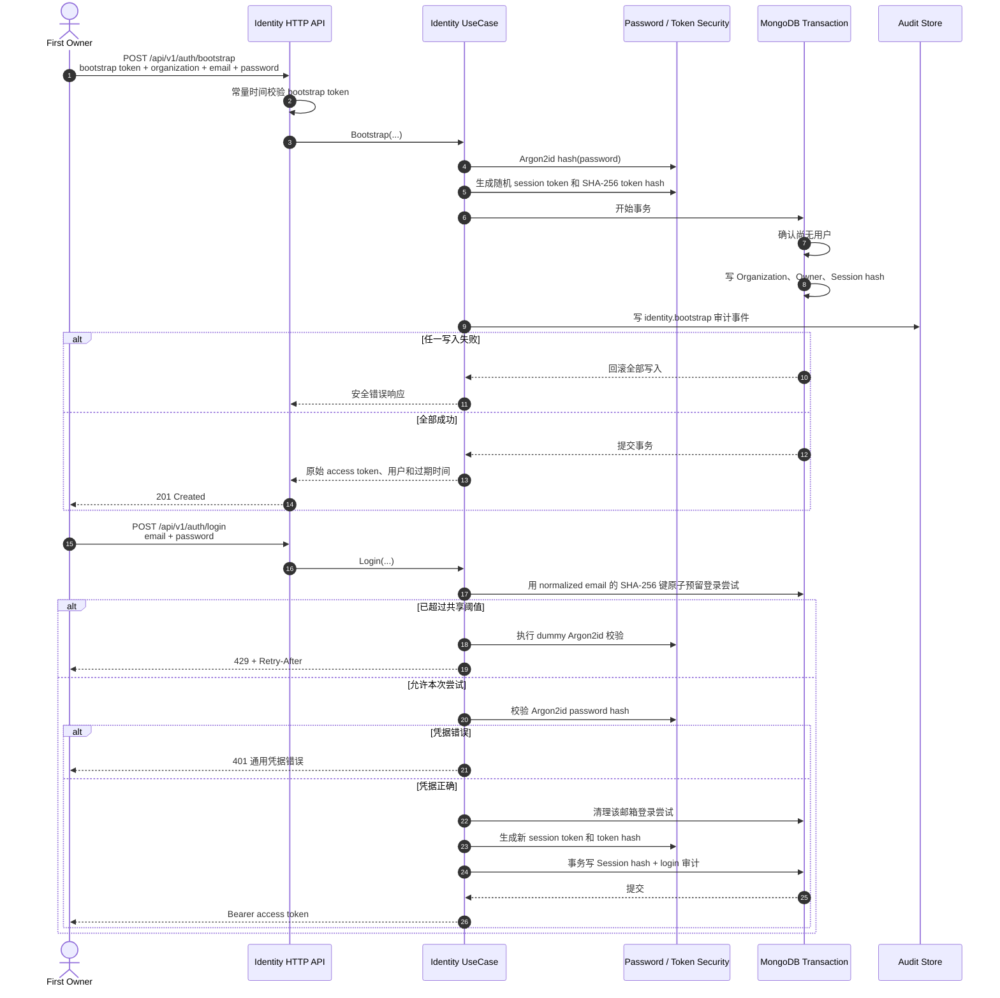
```mermaid
sequenceDiagram
    autonumber
    actor O as First Owner
    participant API as Identity HTTP API
    participant UC as Identity UseCase
    participant K as Password / Token Security
    participant M as MongoDB Transaction
    participant A as Audit Store

    O->>API: POST /api/v1/auth/bootstrap<br/>bootstrap token + organization + email + password
    API->>API: 常量时间校验 bootstrap token
    API->>UC: Bootstrap(...)
    UC->>K: Argon2id hash(password)
    UC->>K: 生成随机 session token 和 SHA-256 token hash
    UC->>M: 开始事务
    M->>M: 确认尚无用户
    M->>M: 写 Organization、Owner、Session hash
    UC->>A: 写 identity.bootstrap 审计事件
    alt 任一写入失败
        M-->>UC: 回滚全部写入
        UC-->>API: 安全错误响应
    else 全部成功
        M-->>UC: 提交事务
        UC-->>API: 原始 access token、用户和过期时间
        API-->>O: 201 Created
    end

    O->>API: POST /api/v1/auth/login<br/>email + password
    API->>UC: Login(...)
    UC->>M: 用 normalized email 的 SHA-256 键原子预留登录尝试
    alt 已超过共享阈值
        UC->>K: 执行 dummy Argon2id 校验
        UC-->>O: 429 + Retry-After
    else 允许本次尝试
        UC->>K: 校验 Argon2id password hash
        alt 凭据错误
            UC-->>O: 401 通用凭据错误
        else 凭据正确
            UC->>M: 清理该邮箱登录尝试
            UC->>K: 生成新 session token 和 token hash
            UC->>M: 事务写 Session hash + login 审计
            M-->>UC: 提交
            UC-->>O: Bearer access token
        end
    end
```

登录尝试限制保存在 MongoDB，而不是单个 Server 进程内存中，因此多实例共享同一阈值。默认同一 normalized email 在 15 分钟窗口内允许 5 次尝试，第 6 次开始返回 `429 login_rate_limited`；正确登录会清理计数。记录只保存邮箱的 SHA-256 键、计数、窗口和过期时间，TTL 自动清理。它解决账号维度的密码猜测；正式产品路由另有应用级来源/实例两级共享限流，但仍不能替代反向代理/WAF 的连接层保护。代理信任和失败关闭时序见[产品 API 入口保护](ingress-protection.md)。

每次成功登录在创建新 Session 的同一事务中保留该用户最新的 `security.max_active_sessions` 个活跃 Session，默认 10 个；更早的 Session 会被撤销。用户可以通过 `GET /api/v1/auth/sessions` 查看不含 Token/hash 的 Session ID、创建/过期时间和当前会话标记，再通过 `DELETE /api/v1/auth/sessions/{session_id}` 撤销自己的任意 Session。删除条件同时固定 Session ID 与当前 User ID，不能用猜测到的 ID 撤销其他用户会话。

Owner 还可以使用 `/api/v1/auth/users/{user_id}/sessions` 查看和紧急撤销同一 Organization 成员的会话；列表同样不含 Token/hash，撤销和管理员审计在同一事务中提交。完整时序见[本地用户邀请与会话治理](users-and-invitations.md)。

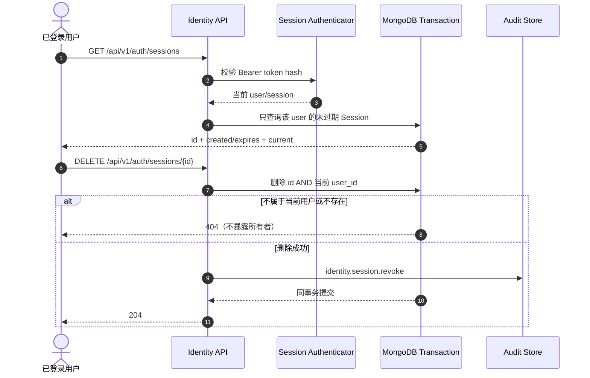
```mermaid
sequenceDiagram
    autonumber
    actor U as 已登录用户
    participant API as Identity API
    participant I as Session Authenticator
    participant M as MongoDB Transaction
    participant A as Audit Store

    U->>API: GET /api/v1/auth/sessions
    API->>I: 校验 Bearer token hash
    I-->>API: 当前 user/session
    API->>M: 只查询该 user 的未过期 Session
    M-->>U: id + created/expires + current
    U->>API: DELETE /api/v1/auth/sessions/{id}
    API->>M: 删除 id AND 当前 user_id
    alt 不属于当前用户或不存在
        M-->>U: 404（不暴露所有者）
    else 删除成功
        API->>A: identity.session.revoke
        M-->>API: 同事务提交
        API-->>U: 204
    end
```

## 已实现：认证、授权、资源写入与审计

Project、Project Member、Project 下的 Application、Registry Credential、Environment、不可变 Release 和 Runtime Target 共用相同的写入骨架。Environment 承载普通配置值或外部秘密引用，但不保存秘密正文；Release 只声明需要的配置键。身份来自 Bearer Session；Owner 使用 Organization 全局角色，其他用户在每次 Project 请求中实时解析成员角色。资源与审计事件处于同一 MongoDB 事务，因此审计失败不会留下无审计的资源。

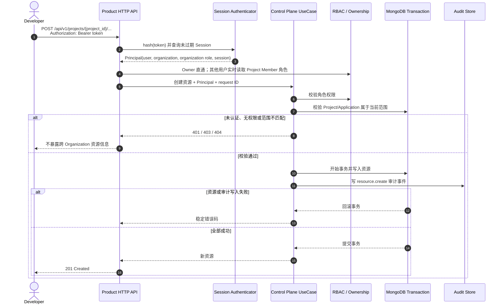
```mermaid
sequenceDiagram
    autonumber
    actor D as Developer
    participant API as Product HTTP API
    participant I as Session Authenticator
    participant U as Control Plane UseCase
    participant R as RBAC / Ownership
    participant M as MongoDB Transaction
    participant A as Audit Store

    D->>API: POST /api/v1/projects/{project_id}/...<br/>Authorization: Bearer token
    API->>I: hash(token) 并查询未过期 Session
    I-->>API: Principal(user, organization, organization role, session)
    API->>R: Owner 直通；其他用户实时读取 Project Member 角色
    API->>U: 创建资源 + Principal + request ID
    U->>R: 校验角色权限
    U->>M: 校验 Project/Application 属于当前范围
    alt 未认证、无权限或范围不匹配
        U-->>API: 401 / 403 / 404
        API-->>D: 不暴露跨 Organization 资源信息
    else 校验通过
        U->>M: 开始事务并写入资源
        U->>A: 写 resource.create 审计事件
        alt 资源或审计写入失败
            M-->>U: 回滚事务
            U-->>API: 稳定错误码
        else 全部成功
                M-->>U: 提交事务
            U-->>API: 新资源
            API-->>D: 201 Created
        end
    end
```

Environment 创建是 Project 范围内的独立资源，后续 Deployment 执行时再通过 Runtime Target 选择实际运行位置：

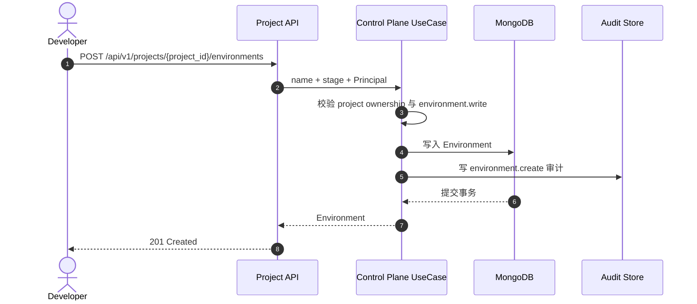
```mermaid
sequenceDiagram
    autonumber
    actor D as Developer
    participant API as Project API
    participant U as Control Plane UseCase
    participant M as MongoDB
    participant A as Audit Store

    D->>API: POST /api/v1/projects/{project_id}/environments
    API->>U: name + stage + Principal
    U->>U: 校验 project ownership 与 environment.write
    U->>M: 写入 Environment
    U->>A: 写 environment.create 审计
    M-->>U: 提交事务
    U-->>API: Environment
    API-->>D: 201 Created
```

## 已实现：Runtime Target 连接探测

探测只由 Maintainer 或 Owner 显式触发。控制面在执行时解析 mTLS 引用并 Ping Docker Engine，MongoDB 和 API 只保存安全状态，不保存证书正文或底层连接错误。

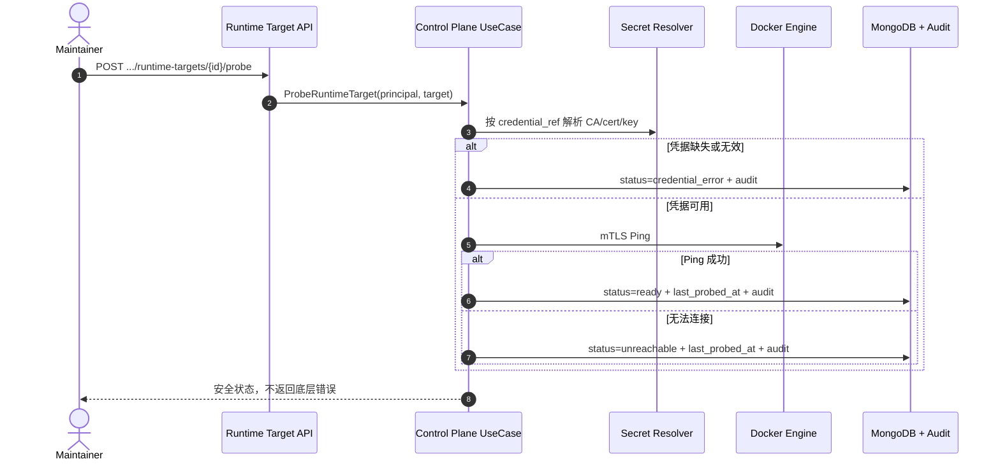
```mermaid
sequenceDiagram
    autonumber
    actor M as Maintainer
    participant API as Runtime Target API
    participant U as Control Plane UseCase
    participant S as Secret Resolver
    participant D as Docker Engine
    participant DB as MongoDB + Audit

    M->>API: POST .../runtime-targets/{id}/probe
    API->>U: ProbeRuntimeTarget(principal, target)
    U->>S: 按 credential_ref 解析 CA/cert/key
    alt 凭据缺失或无效
        U->>DB: status=credential_error + audit
    else 凭据可用
        U->>D: mTLS Ping
        alt Ping 成功
            U->>DB: status=ready + last_probed_at + audit
        else 无法连接
            U->>DB: status=unreachable + last_probed_at + audit
        end
    end
    U-->>M: 安全状态，不返回底层错误
```

## 已实现：Runtime Target 可重试删除

删除不是单次数据库操作。第一次请求先把 Target 原子改为 `retiring`，因此所有新建、重试、回滚和自动部署都会被 ready 门禁拒绝；非终态 Deployment 在事务和审计中转为 `canceling`，API 返回 `202`。客户端重试后，只有当 Worker 已排空命令，系统才按槽位清理稳定运行资源、释放 Agent 水位并删除元数据。

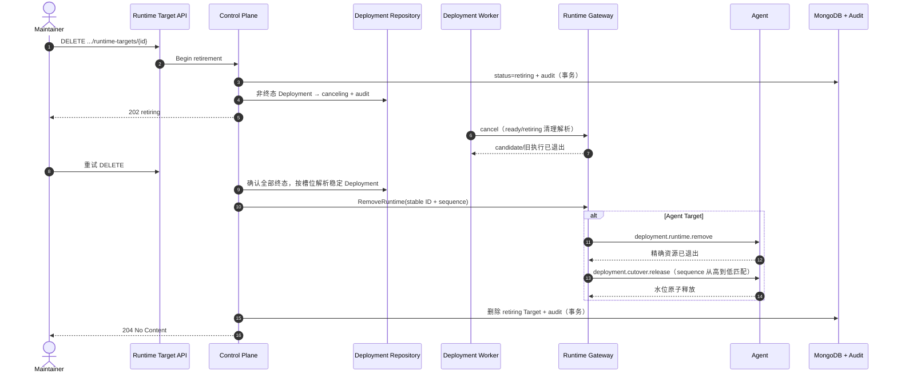
```mermaid
sequenceDiagram
    autonumber
    actor M as Maintainer
    participant API as Runtime Target API
    participant CP as Control Plane
    participant DQ as Deployment Repository
    participant W as Deployment Worker
    participant RG as Runtime Gateway
    participant A as Agent
    participant DB as MongoDB + Audit

    M->>API: DELETE .../runtime-targets/{id}
    API->>CP: Begin retirement
    CP->>DB: status=retiring + audit（事务）
    CP->>DQ: 非终态 Deployment → canceling + audit
    CP-->>M: 202 retiring
    W->>RG: cancel（ready/retiring 清理解析）
    RG-->>W: candidate/旧执行已退出
    M->>API: 重试 DELETE
    CP->>DQ: 确认全部终态，按槽位解析稳定 Deployment
    CP->>RG: RemoveRuntime(stable ID + sequence)
    alt Agent Target
        RG->>A: deployment.runtime.remove
        A-->>RG: 精确资源已退出
        RG->>A: deployment.cutover.release（sequence 从高到低匹配）
        A-->>RG: 水位原子释放
    end
    CP->>DB: 删除 retiring Target + audit（事务）
    CP-->>M: 204 No Content
```

任一步外部清理失败都会保留 `retiring` 状态；重试不会重新开放部署，也不会把普通 cancel 的租约 fence 绕过去。Agent 删除命令要求持久水位足以保护目标稳定容器，release 仍只接受精确当前水位。

## 已实现：Managed Host 与 Runtime Target 绑定

Managed Host 属于 Organization，Runtime Target 属于 Project。Owner 先登记 Host，Maintainer 或 Owner 再把 Project Runtime Target 绑定到该 Host。Server 在创建目标时从后端解析 Host，不相信客户端声明的 Organization，并强制 `agent/direct` 模式一致。

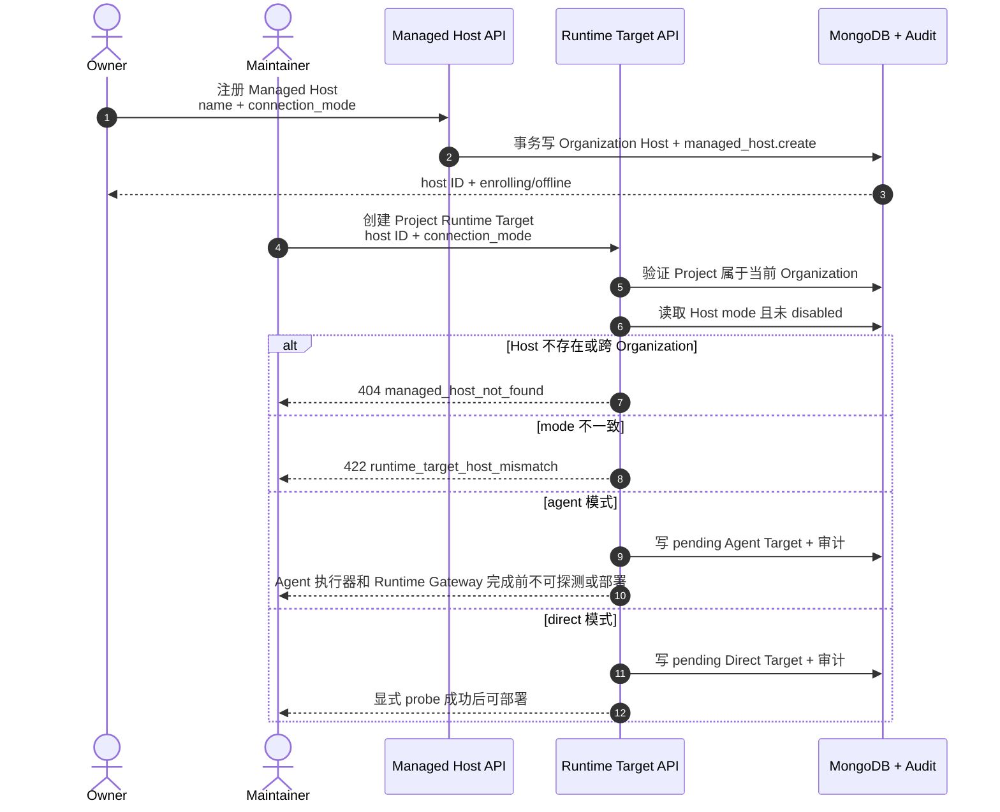
```mermaid
sequenceDiagram
    autonumber
    actor O as Owner
    actor M as Maintainer
    participant H as Managed Host API
    participant T as Runtime Target API
    participant DB as MongoDB + Audit

    O->>H: 注册 Managed Host<br/>name + connection_mode
    H->>DB: 事务写 Organization Host + managed_host.create
    DB-->>O: host ID + enrolling/offline
    M->>T: 创建 Project Runtime Target<br/>host ID + connection_mode
    T->>DB: 验证 Project 属于当前 Organization
    T->>DB: 读取 Host mode 且未 disabled
    alt Host 不存在或跨 Organization
        T-->>M: 404 managed_host_not_found
    else mode 不一致
        T-->>M: 422 runtime_target_host_mismatch
    else agent 模式
        T->>DB: 写 pending Agent Target + 审计
        T-->>M: Agent 执行器和 Runtime Gateway 完成前不可探测或部署
    else direct 模式
        T->>DB: 写 pending Direct Target + 审计
        T-->>M: 显式 probe 成功后可部署
    end
```

## 部分实现：Agent 首次安全接入

Owner 为 `agent` 模式 Host 创建短时一次性 enrollment。原始 token 只返回一次，MongoDB 只保存其 SHA-256 hash。Agent 私钥在目标主机本地生成，只把 CSR 发送给 Server。Server 签发固定 Organization、Host、Agent Identity 和 instance 的客户端证书，并在同一 MongoDB 事务中消费 token、创建身份、绑定 Host 和写审计。

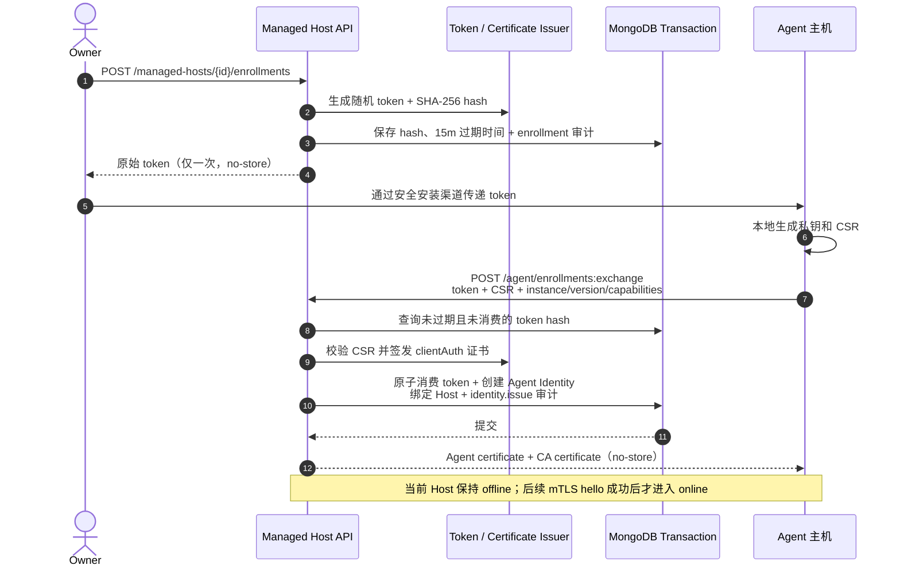
```mermaid
sequenceDiagram
    autonumber
    actor O as Owner
    participant API as Managed Host API
    participant K as Token / Certificate Issuer
    participant DB as MongoDB Transaction
    participant A as Agent 主机

    O->>API: POST /managed-hosts/{id}/enrollments
    API->>K: 生成随机 token + SHA-256 hash
    API->>DB: 保存 hash、15m 过期时间 + enrollment 审计
    API-->>O: 原始 token（仅一次，no-store）
    O->>A: 通过安全安装渠道传递 token
    A->>A: 本地生成私钥和 CSR
    A->>API: POST /agent/enrollments:exchange<br/>token + CSR + instance/version/capabilities
    API->>DB: 查询未过期且未消费的 token hash
    API->>K: 校验 CSR 并签发 clientAuth 证书
    API->>DB: 原子消费 token + 创建 Agent Identity<br/>绑定 Host + identity.issue 审计
    DB-->>API: 提交
    API-->>A: Agent certificate + CA certificate（no-store）
    Note over A,API: 当前 Host 保持 offline；后续 mTLS hello 成功后才进入 online
```

过期 token、携带不同 CSR/instance/版本/能力的重复兑换、Host 已禁用、跨 Host 绑定和无效 CSR 都会被拒绝。仅完全相同的请求可在 10 分钟内取回原 Identity 与证书，用来恢复 Server 已提交但响应丢失的情况；不会重复创建身份或审计。Owner 禁用 Host 时，当前数据库身份会被标记吊销，所有未消费 enrollment 立即过期。配置和客户可读说明见 [agent-enrollment.md](agent-enrollment.md)。

## 已实现基础：Agent mTLS 控制连接与在线状态

Agent 使用 enrollment 获得的证书主动连接独立 TLS 1.3 端口。TLS 层先验证 Agent CA，应用层再把 SPIFFE URI、证书序列号和指纹与 MongoDB 固定身份匹配。当前双端已经实现 hello、`v1` 版本协商、frame 上限、单调序号、心跳、在线状态、重连 fence、单实例禁用断流、有上限的抖动退避和优雅停止；Server 端提供 `runtime.probe`、`deployment.prepare/stage/activate/cancel`、Runtime Inventory command/result，以及 `terminal.container`/`terminal.host` 会话复用。Agent 侧本机 Docker executor、deadline、并发去重、跨重启安全结果缓存、受限容器终端和固定身份主机 PTY 也已实现。Agent Control Server 启用时，Agent probe、Deployment Gateway 与两类 Terminal Gateway 在 composition root 配套注册。

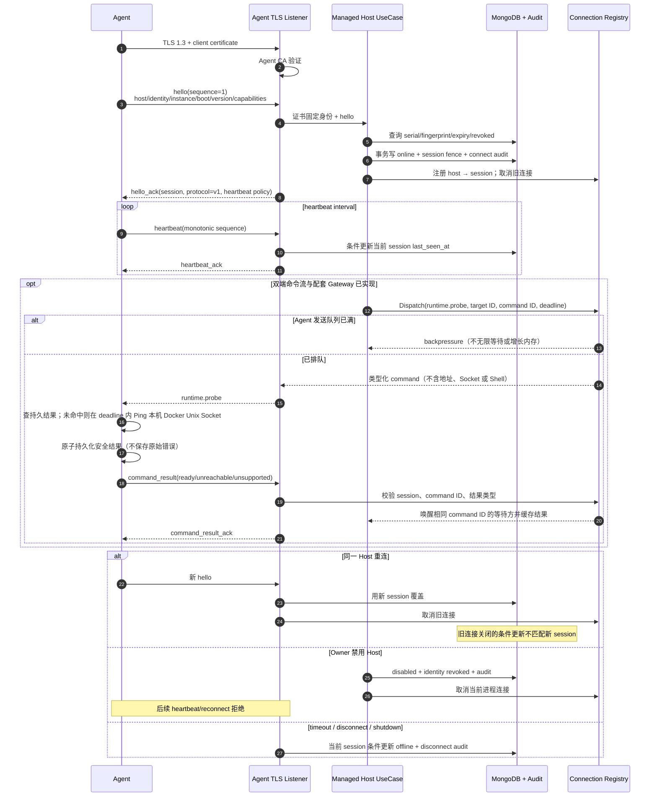
```mermaid
sequenceDiagram
    autonumber
    participant A as Agent
    participant TLS as Agent TLS Listener
    participant U as Managed Host UseCase
    participant DB as MongoDB + Audit
    participant R as Connection Registry

    A->>TLS: TLS 1.3 + client certificate
    TLS->>TLS: Agent CA 验证
    A->>TLS: hello(sequence=1)<br/>host/identity/instance/boot/version/capabilities
    TLS->>U: 证书固定身份 + hello
    U->>DB: 查询 serial/fingerprint/expiry/revoked
    U->>DB: 事务写 online + session fence + connect audit
    U->>R: 注册 host → session；取消旧连接
    TLS-->>A: hello_ack(session, protocol=v1, heartbeat policy)
    loop heartbeat interval
        A->>TLS: heartbeat(monotonic sequence)
        TLS->>DB: 条件更新当前 session last_seen_at
        TLS-->>A: heartbeat_ack
    end
    opt 双端命令流与配套 Gateway 已实现
        U->>R: Dispatch(runtime.probe, target ID, command ID, deadline)
        alt Agent 发送队列已满
            R-->>U: backpressure（不无限等待或增长内存）
        else 已排队
            R-->>TLS: 类型化 command（不含地址、Socket 或 Shell）
            TLS-->>A: runtime.probe
            A->>A: 查持久结果；未命中则在 deadline 内 Ping 本机 Docker Unix Socket
            A->>A: 原子持久化安全结果（不保存原始错误）
            A->>TLS: command_result(ready/unreachable/unsupported)
            TLS->>R: 校验 session、command ID、结果类型
            R-->>U: 唤醒相同 command ID 的等待方并缓存结果
            TLS-->>A: command_result_ack
        end
    end
    alt 同一 Host 重连
        A->>TLS: 新 hello
        TLS->>DB: 用新 session 覆盖
        TLS->>R: 取消旧连接
        Note over DB: 旧连接关闭的条件更新不匹配新 session
    else Owner 禁用 Host
        U->>DB: disabled + identity revoked + audit
        U->>R: 取消当前进程连接
        Note over A,TLS: 后续 heartbeat/reconnect 拒绝
    else timeout / disconnect / shutdown
        TLS->>DB: 当前 session 条件更新 offline + disconnect audit
    end
```

完整 wire frame 与错误边界见 [Agent Control Protocol v1](../api/agent-control.md)。

## 已实现：手动触发与隔离源码检出

手动触发在 API Server 内只完成安全控制面步骤：精确 ref 解析、完整 Commit SHA、配置快照、幂等和审计。随后独立 Build Worker 按 Mongo lease 领取任务，在受限临时目录用固定 Git 检出并二次验证 Commit，再通过受认证的 rootless BuildKit 构建和推送镜像；API Server 始终不执行客户代码。真实 OCI digest 在 generation fence 下形成 Artifact，并幂等衔接不可变 Release。

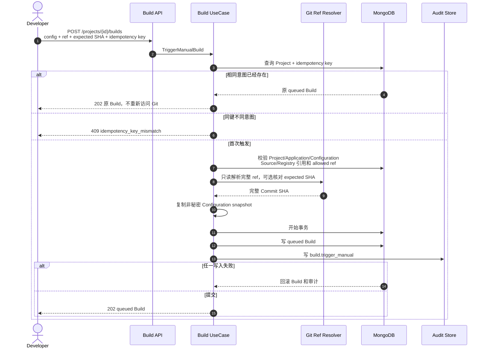
```mermaid
sequenceDiagram
    autonumber
    actor D as Developer
    participant API as Build API
    participant U as Build UseCase
    participant G as Git Ref Resolver
    participant M as MongoDB
    participant A as Audit Store

    D->>API: POST /projects/{id}/builds<br/>config + ref + expected SHA + idempotency key
    API->>U: TriggerManualBuild
    U->>M: 查询 Project + idempotency key
    alt 相同意图已经存在
        M-->>U: 原 queued Build
        U-->>D: 202 原 Build，不重新访问 Git
    else 同键不同意图
        U-->>D: 409 idempotency_key_mismatch
    else 首次触发
        U->>M: 校验 Project/Application/Configuration<br/>Source/Registry 引用和 allowed ref
        U->>G: 只读解析完整 ref，可选核对 expected SHA
        G-->>U: 完整 Commit SHA
        U->>U: 复制非秘密 Configuration snapshot
        U->>M: 开始事务
        U->>M: 写 queued Build
        U->>A: 写 build.trigger_manual
        alt 任一写入失败
            M-->>U: 回滚 Build 和审计
        else 提交
            U-->>D: 202 queued Build
        end
    end
```

## 已实现：通用 Trigger Token 自动触发 queued Build

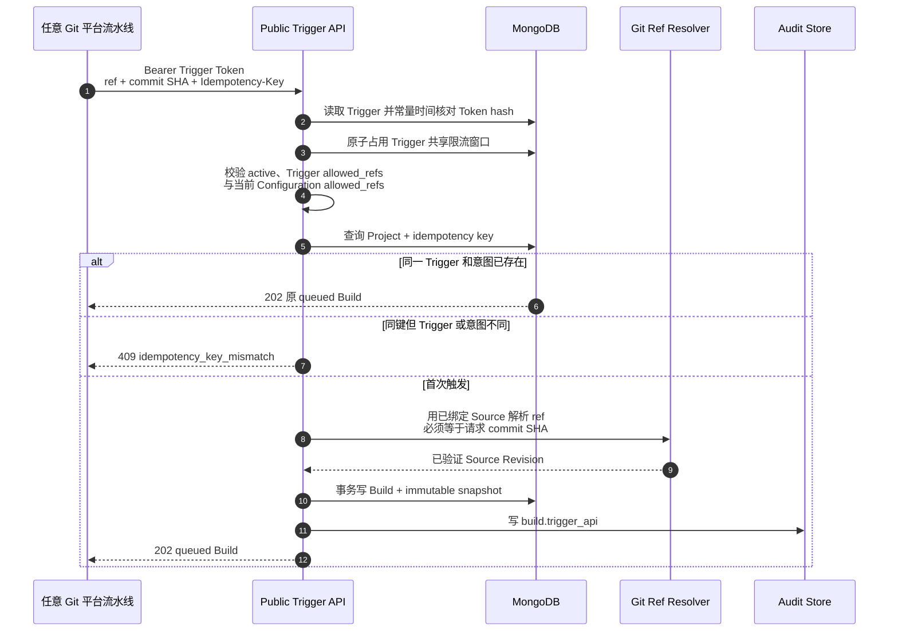
```mermaid
sequenceDiagram
    autonumber
    participant CI as 任意 Git 平台流水线
    participant API as Public Trigger API
    participant M as MongoDB
    participant G as Git Ref Resolver
    participant A as Audit Store

    CI->>API: Bearer Trigger Token<br/>ref + commit SHA + Idempotency-Key
    API->>M: 读取 Trigger 并常量时间核对 Token hash
    API->>M: 原子占用 Trigger 共享限流窗口
    API->>API: 校验 active、Trigger allowed_refs<br/>与当前 Configuration allowed_refs
    API->>M: 查询 Project + idempotency key
    alt 同一 Trigger 和意图已存在
        M-->>CI: 202 原 queued Build
    else 同键但 Trigger 或意图不同
        API-->>CI: 409 idempotency_key_mismatch
    else 首次触发
        API->>G: 用已绑定 Source 解析 ref<br/>必须等于请求 commit SHA
        G-->>API: 已验证 Source Revision
        API->>M: 事务写 Build + immutable snapshot
        API->>A: 写 build.trigger_api
        API-->>CI: 202 queued Build
    end
```

## 已实现：平台签名 Webhook 自动触发 queued Build

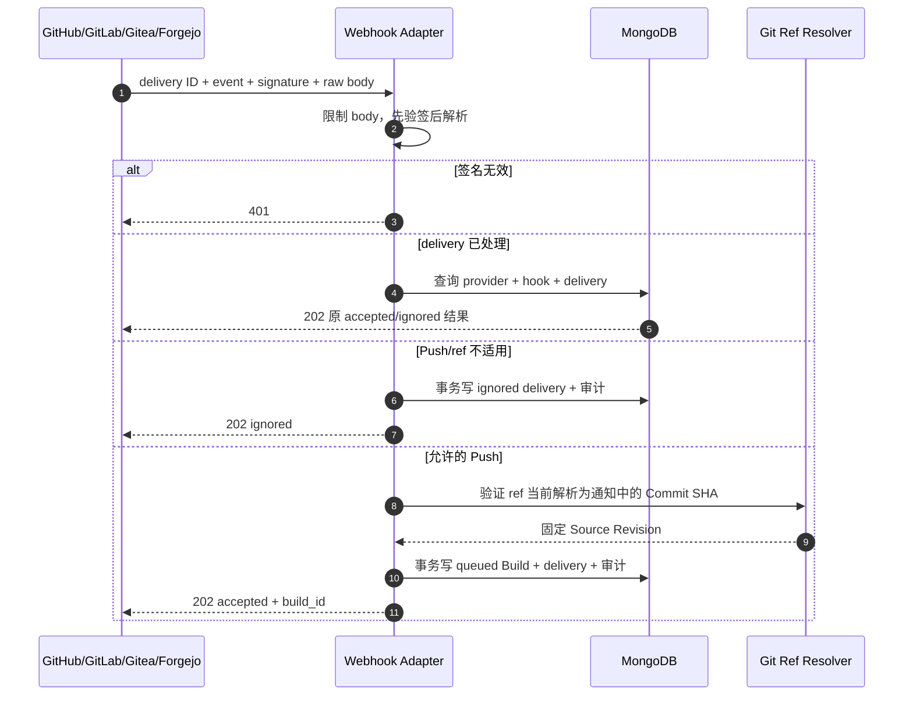
```mermaid
sequenceDiagram
    autonumber
    participant G as GitHub/GitLab/Gitea/Forgejo
    participant H as Webhook Adapter
    participant M as MongoDB
    participant R as Git Ref Resolver

    G->>H: delivery ID + event + signature + raw body
    H->>H: 限制 body，先验签后解析
    alt 签名无效
        H-->>G: 401
    else delivery 已处理
        H->>M: 查询 provider + hook + delivery
        M-->>G: 202 原 accepted/ignored 结果
    else Push/ref 不适用
        H->>M: 事务写 ignored delivery + 审计
        H-->>G: 202 ignored
    else 允许的 Push
        H->>R: 验证 ref 当前解析为通知中的 Commit SHA
        R-->>H: 固定 Source Revision
        H->>M: 事务写 queued Build + delivery + 审计
        H-->>G: 202 accepted + build_id
    end
```

原始 body、签名和 Secret 不写入 MongoDB。Handler 不执行 checkout 或 BuildKit，详细平台配置见 [Git 平台 Webhook](webhooks.md)。

## 已实现：Build 领取、失联接管与 fence

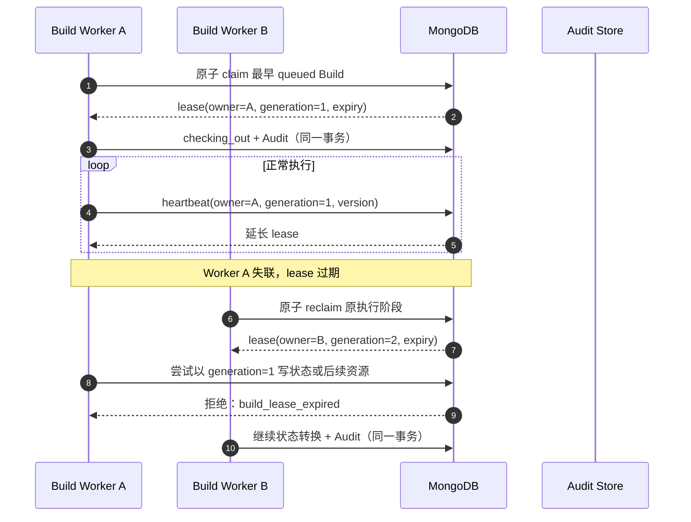
```mermaid
sequenceDiagram
    autonumber
    participant W1 as Build Worker A
    participant W2 as Build Worker B
    participant M as MongoDB
    participant A as Audit Store

    W1->>M: 原子 claim 最早 queued Build
    M-->>W1: lease(owner=A, generation=1, expiry)
    W1->>M: checking_out + Audit（同一事务）
    loop 正常执行
        W1->>M: heartbeat(owner=A, generation=1, version)
        M-->>W1: 延长 lease
    end
    Note over W1,M: Worker A 失联，lease 过期
    W2->>M: 原子 reclaim 原执行阶段
    M-->>W2: lease(owner=B, generation=2, expiry)
    W1->>M: 尝试以 generation=1 写状态或后续资源
    M-->>W1: 拒绝：build_lease_expired
    W2->>M: 继续状态转换 + Audit（同一事务）
```

取消请求只把 Build 转为 `canceling`；持有或接管 lease 的 Worker 完成清理后才能写 `canceled`。失败重试复制来源 Build 的固定 Commit 与配置快照，创建带 `source_build_id` 的新 queued Build，不修改原记录。启用独立 Build Worker 后，queued/canceling 记录会被领取；Worker 会执行 checkout、BuildKit solve、Registry push 与清理。推送完成后以事务创建 Artifact 并把 Build 改为 `succeeded`；Release 或自动 Deployment 协调失败时只重试 `release_pending` Artifact。

## 已实现：Artifact 与 Release 幂等交接

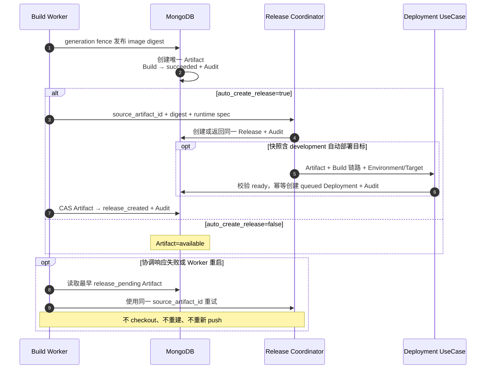
```mermaid
sequenceDiagram
    autonumber
    participant W as Build Worker
    participant M as MongoDB
    participant C as Release Coordinator
    participant D as Deployment UseCase

    W->>M: generation fence 发布 image digest
    M->>M: 创建唯一 Artifact<br/>Build → succeeded + Audit
    alt auto_create_release=true
        W->>C: source_artifact_id + digest + runtime spec
        C->>M: 创建或返回同一 Release + Audit
        opt 快照含 development 自动部署目标
            C->>D: Artifact + Build 链路 + Environment/Target
            D->>M: 校验 ready，幂等创建 queued Deployment + Audit
        end
        W->>M: CAS Artifact → release_created + Audit
    else auto_create_release=false
        Note over M: Artifact=available
    end
    opt 协调响应失败或 Worker 重启
        W->>M: 读取最早 release_pending Artifact
        W->>C: 使用同一 source_artifact_id 重试
        Note over W,C: 不 checkout、不重建、不重新 push
    end
```

运行规格和自动部署规则都来自触发时的 Build Configuration 快照，包括端口、Environment 配置键、CPU/内存、健康检查，以及最多 8 个 development Environment/Runtime Target 组合。自动路径复用普通 Deployment 用例；staging/production 仍强制人工触发。详细状态与手动 API 见 [Artifact 与 Release 交接](artifacts.md)，权限与重试见[自动部署规则](automatic-deployments.md)。

## 部分实现：从 Release 到 Docker Deployment

下面链路已经具备基础实现：创建前 Runtime Target `ready` 门禁、queued Deployment、Project 范围校验、幂等回放、查询、取消、失败重试、回滚、MongoDB 持久化、Registry Credential、Release 运行规格、Environment 配置绑定、执行期 Secret Resolver、受管 Worker、按连接模式分派的 direct/agent Runtime Gateway、安全失败分类和状态审计。两条 Docker 路径都使用候选容器健康门禁、同 Deployment 的 lease generation fencing，以及跨 Deployment 的 cutover sequence；Agent 路径把远程切换拆为 stage、Server fence 和 activate，并把槽位最高 sequence 独立持久化。本地真实 Docker Engine 已覆盖 direct 健康切换和 Agent 两阶段部署/取消，单元回归已覆盖 Agent 重启、稳定容器缺失和延迟旧命令；远程 mTLS Engine、双主机断线/过期 fence、网络层延迟、实际入口流量和故障注入系统测试尚未完成，因此仍不是生产闭环。

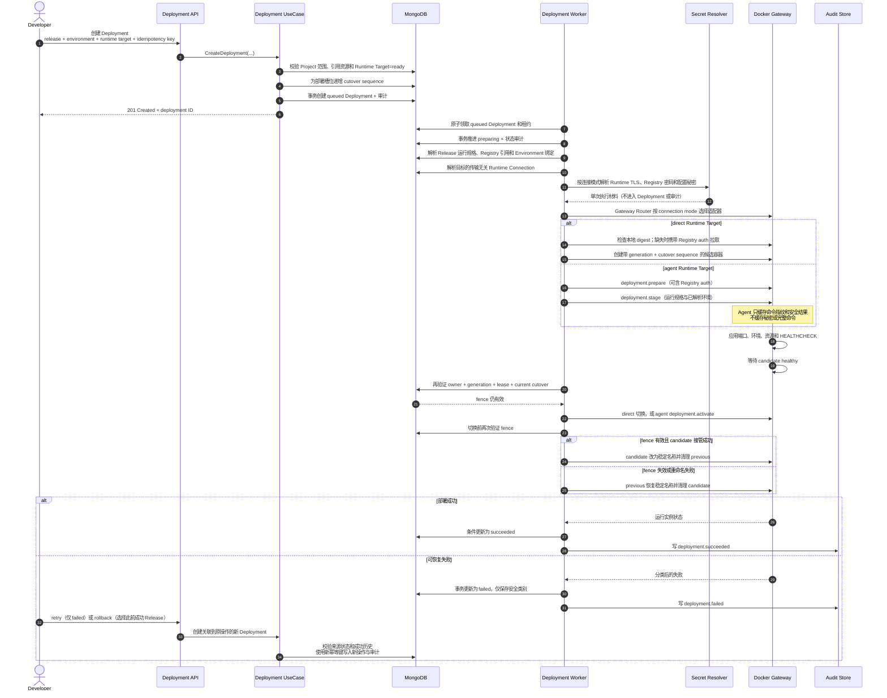
```mermaid
sequenceDiagram
    autonumber
    actor D as Developer
    participant API as Deployment API
    participant U as Deployment UseCase
    participant M as MongoDB
    participant W as Deployment Worker
    participant S as Secret Resolver
    participant G as Docker Gateway
    participant A as Audit Store

    D->>API: 创建 Deployment<br/>release + environment + runtime target + idempotency key
    API->>U: CreateDeployment(...)
    U->>M: 校验 Project 范围、引用资源和 Runtime Target=ready
    U->>M: 为部署槽位递增 cutover sequence
    U->>M: 事务创建 queued Deployment + 审计
    U-->>D: 201 Created + deployment ID

    W->>M: 原子领取 queued Deployment 和租约
    W->>M: 事务推进 preparing + 状态审计
    W->>M: 解析 Release 运行规格、Registry 引用和 Environment 绑定
    W->>M: 解析目标的传输无关 Runtime Connection
    W->>S: 按连接模式解析 Runtime TLS、Registry 密码和配置秘密
    S-->>W: 单次执行材料（不进入 Deployment 或审计）
    W->>G: Gateway Router 按 connection mode 选择适配器
    alt direct Runtime Target
        W->>G: 检查本地 digest；缺失时携带 Registry auth 拉取
        W->>G: 创建带 generation + cutover sequence 的候选容器
    else agent Runtime Target
        W->>G: deployment.prepare（可含 Registry auth）
        W->>G: deployment.stage（运行规格与已解析环境）
        Note over G: Agent 只缓存命令指纹和安全结果<br/>不缓存秘密或完整命令
    end
    G->>G: 应用端口、环境、资源和 HEALTHCHECK
    G->>G: 等待 candidate healthy
    W->>M: 再验证 owner + generation + lease + current cutover
    M-->>W: fence 仍有效
    W->>G: direct 切换，或 agent deployment.activate
    W->>M: 切换前再次验证 fence
    alt fence 有效且 candidate 接管成功
        W->>G: candidate 改为稳定名称并清理 previous
    else fence 失效或重命名失败
        W->>G: previous 恢复稳定名称并清理 candidate
    end
    alt 部署成功
        G-->>W: 运行实例状态
        W->>M: 条件更新为 succeeded
        W->>A: 写 deployment.succeeded
    else 可恢复失败
        G-->>W: 分类后的失败
        W->>M: 事务更新为 failed，仅保存安全类别
        W->>A: 写 deployment.failed
        D->>API: retry（仅 failed）或 rollback（选择此前成功 Release）
        API->>U: 创建关联到原操作的新 Deployment
        U->>M: 校验来源状态和成功历史<br/>使用新幂等键写入新操作与审计
    end
```

正式 Deployment 的状态只允许由领域方法推进，取消不是直接删除，而是经过 `canceling`：

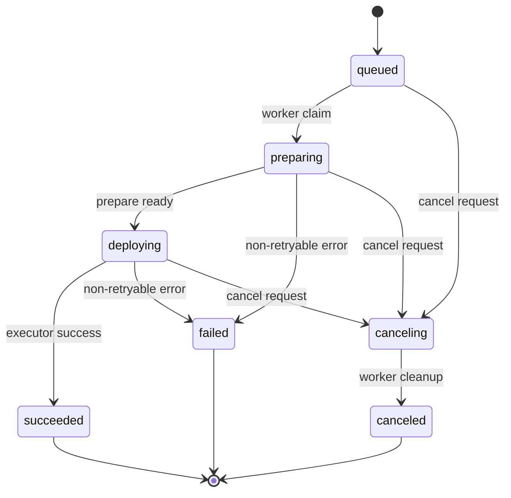
```mermaid
stateDiagram-v2
    [*] --> queued
    queued --> preparing: worker claim
    preparing --> deploying: prepare ready
    deploying --> succeeded: executor success
    preparing --> failed: non-retryable error
    deploying --> failed: non-retryable error
    queued --> canceling: cancel request
    preparing --> canceling: cancel request
    deploying --> canceling: cancel request
    canceling --> canceled: worker cleanup
    succeeded --> [*]
    failed --> [*]
    canceled --> [*]
```

## 阅读边界

- 当前正式持久化资源：Organization、User、User Invitation、Session、Managed Host、Agent Enrollment、Agent Identity、Project、Project Member、Project Application（含可选 Template 快照）、Repository Credential、Source Repository、Build Configuration、Build Trigger、Build Hook、Webhook Delivery、Build（含状态/lease/fence）、Registry Credential、Environment、Release、Runtime Target、Deployment、Audit Event；内置 Template Catalog 随 Server 版本只读发布。
- Runtime Target 只保存连接元数据和 `credential_ref`，不保存凭据正文；显式探测会更新 `ready`、`unreachable` 或 `credential_error` 及探测时间。
- Git 自建 CA/代理矩阵、远程 mTLS Docker Engine、入口流量和故障注入系统测试仍是后续纵向切片；只读内置 Template 与 Application 脱钩快照已经落地。独立 Build Worker 的固定 Git HTTPS/SSH checkout、rootless BuildKit/Registry push、有界脱敏日志、Artifact/Release 交接与 Build 控制面队列协议已完成，基础 Deployment Worker 与 Docker 执行默认关闭。
- 顶层 Application、Environment、Deployment 路由是默认关闭的工程样例，与正式 Project 范围 API 相互隔离。
