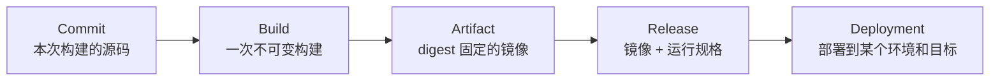
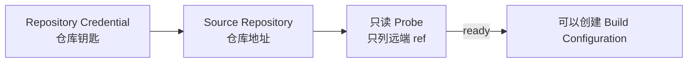
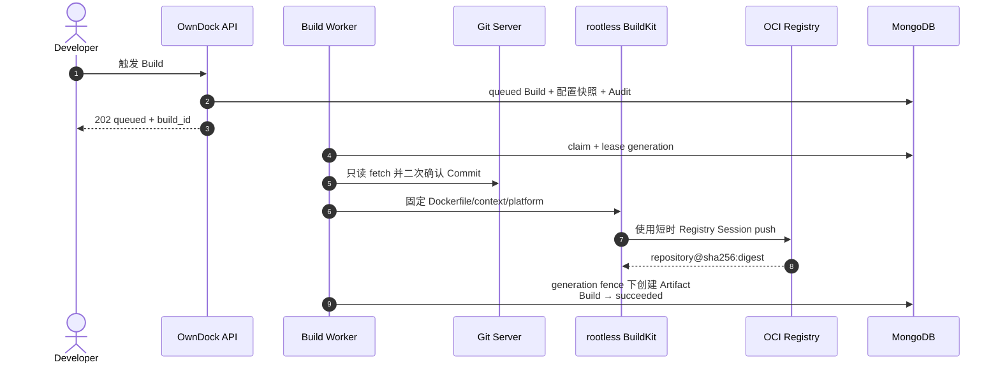
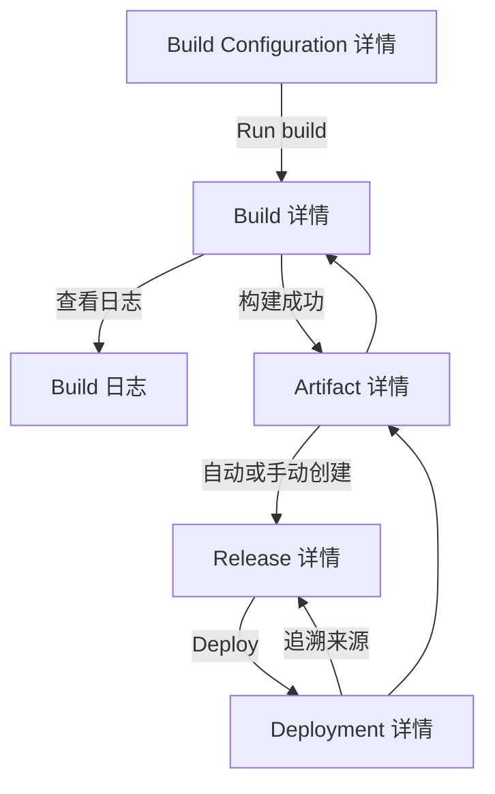

# 从 Git 到开发环境：完整用户旅程

这份说明面向第一次使用 OwnDock 的开发者。目标不是教你搭一套通用 CI，而是把一个已有 Git 仓库安全地变成可追踪的镜像、Release 和开发环境 Deployment。

## 先看最终结果

一次成功交付会留下完整证据链：

- **Build** 回答“用哪个 Commit 和配方构建”；
- **Artifact** 回答“Registry 中实际得到哪个不可变镜像”；
- **Release** 回答“这个镜像应怎样运行”；
- **Deployment** 回答“哪个 Release 被部署到哪个 Environment 和 Runtime Target”。

Build 成功不等于 Deployment 成功。每一段都有独立状态和审计记录，失败时只重试需要重试的一段。

## 开始前准备

| 需要准备 | 例子 | 用途 |
| --- | --- | --- |
| Project 和 Application | `customer-portal` / `api` | 确定资源归属 |
| Git clone URL | `https://git.example.com/team/api.git` | 找到源码 |
| 仓库只读凭据 | Access Token 或 SSH Deploy Key | 读取私有仓库 |
| OCI Registry 凭据 | Registry 账号的外部 Secret 引用 | 推送构建结果 |
| Dockerfile | `Dockerfile` 或 `services/api/Dockerfile` | 定义镜像构建 |
| Environment | `development` | 提供运行配置边界 |
| Runtime Target | 已成功探测的 Docker 目标 | 实际运行容器 |

不要把 Git Token、Deploy Key、Registry 密码或 Webhook Secret 写进请求正文、Git URL、Dockerfile、构建参数或仓库。OwnDock 保存的是 `secret://...` 引用，Worker 执行到相应步骤时才短时解析秘密。

## 第一步：连接代码仓库

先创建 Repository Credential，再创建 Source Repository。公开仓库可以省略凭据；私有仓库必须使用只读权限。

Probe 只验证网络、TLS/SSH 身份、凭据和远端 ref，不 checkout 源码，也不执行仓库内容。SSH 场景还需要分别固定 Deploy Key 公钥指纹和 Git 主机公钥指纹。具体字段见 [Source Repository 使用说明](source-repositories.md)。

## 第二步：创建构建配方

Build Configuration 绑定：

- Source Repository；
- Dockerfile 与 context；
- 允许构建的精确 branch/tag ref；
- Registry Credential 与目标镜像仓库；
- CPU、内存、临时磁盘、超时和并发；
- Release 运行规格；
- 是否自动创建 Release，以及可选的 development 自动部署目标。

它是一份可修改的“以后怎样构建”配置。每次触发时，OwnDock 都会复制不可变快照，因此修改配置不会改写历史 Build。详见 [Build Configuration 使用说明](build-configurations.md)。

## 第三步：选择触发方式

三种入口最终创建相同的 `queued` Build，安全边界不同：

| 入口 | 适合场景 | 调用方能决定什么 | 调用方不能决定什么 |
| --- | --- | --- | --- |
| 手动触发 | 首次验证、人工发布 | 已允许的 ref，可选预期 Commit | 仓库、Dockerfile、Registry、部署目标 |
| Trigger Token | 任意 Git 平台或外部自动化 | 已允许的 ref + 完整 Commit | 配方中的其他字段 |
| 平台 Webhook | GitHub、GitLab、Gitea、Forgejo Push | 由已验签事件提供 ref + Commit | 仓库读取权限和配方 |

Webhook 是“门铃”，Repository Credential 是“仓库钥匙”。配置了 Webhook 并不代表 OwnDock 能读取私有代码；配置了仓库凭据也不会让代码更新自动触发 Build。详见 [Trigger Token](build-triggers.md)和[平台 Webhook](webhooks.md)。

首次接入建议先手动触发。确认 checkout、构建、push 和 Release 都成功后，再配置自动入口。

## 第四步：观察 Build

触发接口返回 `202 queued` 只表示任务已经可靠写入 MongoDB。独立 Build Worker 随后依次执行：

页面或客户端应同时展示：状态、阶段、完整 Commit SHA、触发来源、配置版本、开始/结束时间、安全失败类别和增量日志。日志使用 Build 绑定的不透明 cursor 轮询；进入终态后停止轮询，不把日志正文写入浏览器持久存储或分析平台。详见 [Build](builds.md)和[Build 日志](build-logs.md)。

## 第五步：理解 Artifact 和 Release

成功 push 后，OwnDock 使用 Registry 返回的 digest 创建 Artifact。它不会用 `latest` 作为可追踪身份。

如果配方启用 `auto_create_release`，Artifact 会幂等创建唯一 Release；协调暂时失败时，Artifact 保持 `release_pending`，恢复后只重试交接，不重新读取 Git、不重建镜像、不重复 push。详见 [Artifact 与 Release](artifacts.md)。

## 第六步：部署

默认流程由人选择 Release、Environment 和 Runtime Target，再创建 Deployment。只有 Maintainer/Owner 显式配置的 `development` 目标可以在 Release 形成后自动创建普通 Deployment；`staging` 和 `production` 首版始终需要人工触发。

自动和手动 Deployment 使用同一套目标就绪检查、幂等、审计、健康门禁、取消、失败重试和运行时 fencing。自动路径不是绕过部署安全的第二套执行器。详见 [自动部署规则](automatic-deployments.md)和[Deployment Worker](worker.md)。

## 页面如何串起来

后续 Web 前端应保留以下稳定跳转关系，避免用户看到一组互不相关的 ID：

| 页面 | 必须显示 | 主要操作 |
| --- | --- | --- |
| Build Configuration | 仓库、ref、Dockerfile/context、Registry、资源、Release 和自动部署规则 | 修改、手动触发、创建 Trigger/Hook |
| Build 详情 | Commit、快照版本、触发来源、状态/阶段、失败类别、时长 | 取消允许状态、失败后创建 Retry、查看日志 |
| Artifact 详情 | canonical digest、平台、Release 状态、来源 Build | 手动创建 Release、查看 Release |
| Release 详情 | digest、运行规格、来源 Artifact | 选择 Environment/Target 部署 |
| Deployment 详情 | 环境、目标、来源、状态、健康/失败信息 | 取消、失败重试、选择旧 Release 回滚 |

Cancel、Retry 和 Rollback 都创建或推进明确的操作记录，不覆盖历史失败。按钮是否显示必须由后端状态和权限共同决定，不能只靠前端猜测。

## 常见失败从哪里查

| 现象 | 先检查 | 不要做 |
| --- | --- | --- |
| Source probe 失败 | URL、网络、CA/Host Key、只读凭据 | 关闭 TLS/SSH 校验 |
| `revision_mismatch` | ref 是否刚移动、页面显示的 Commit | 静默改构建另一个 Commit |
| checkout 失败 | Build 的 `checkout` 日志和安全失败类别 | 把 Token 放进 URL 重试 |
| build 失败 | Dockerfile、context、平台、资源上限 | 在 API Server 执行 Dockerfile 排障 |
| Registry 认证失败 | Registry server、账号 Secret 注入 | 把 Registry 密码写进配置或日志 |
| `release_pending` | Release 协调、Environment/Target 是否就绪 | 重新构建同一个镜像 |
| Deployment 失败 | Deployment 详情、目标状态和健康检查 | 修改或删除历史 Release |
| Webhook `429` | `Retry-After` 和平台重试策略 | 伪造新 delivery ID 绕过限制 |

## 当前开放边界

当前版本仍是 pre-release。Git 自建 CA/企业代理矩阵、完整 Build Worker 进程故障、硬配额磁盘耗尽、生产 egress 策略和多主机生产故障验收尚未全部关闭。启用前先运行 [Git-to-Deploy 安全验收](build-security-acceptance.md)并根据自己的 Git、Registry、内核、文件系统和网络环境完成外部兼容验证。
