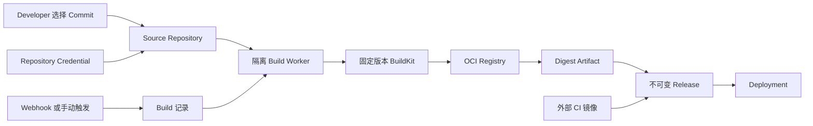
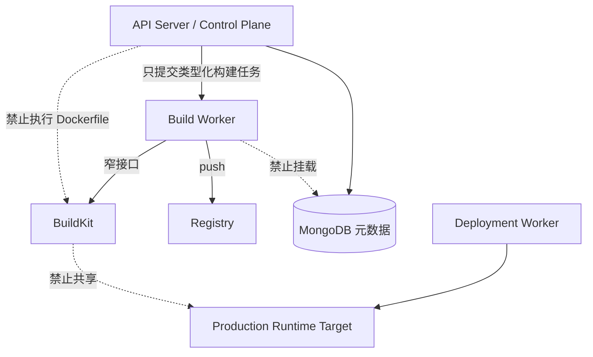

# Git-to-Deploy 产品与安全边界

> 状态：产品已接受；Source Repository/Repository Credential 登记与受限连接探测 API 已实现，构建链尚未开放。

Git-to-Deploy 的目标是让用户连接现有 Git 仓库，选择一个 Commit，通过受约束的 Dockerfile 构建 OCI 镜像，并自动形成可部署、可追踪、可回滚的 Release。用户仍可以跳过内置构建，直接使用外部 CI 已生成的 OCI 镜像。

OwnDock 不建设允许任意脚本和插件的通用 CI 平台。

## 三个容易混淆的概念

| 概念 | 通俗理解 | 是否提供其他能力 |
| --- | --- | --- |
| Git URL | 代码在哪里，例如 HTTPS 或 SSH clone 地址 | 只定位仓库 |
| Repository Credential | OwnDock 读取私有仓库的钥匙，例如 Deploy Key 或 Access Token | 只授予仓库读取权限 |
| Webhook | 代码更新后通知 OwnDock“现在可以触发构建”的回调 | 不提供仓库读取权限 |

即使没有 GitHub、GitLab 或 Gitea/Forgejo 的专用 Webhook Adapter，只要 Git 服务支持标准 HTTPS/SSH，用户仍应可以保存仓库并手动触发构建。专用 Adapter 只负责解析平台事件、验签和改善体验，不能成为读取代码的必要条件。

## 首版范围

- 标准 Git HTTPS/SSH；
- 私有仓库 Deploy Key 或 Access Token 引用；
- 固定 Commit、Dockerfile 和构建上下文；
- 单一目标平台；
- 隔离 Build Worker 与固定版本/不可变 digest 的 BuildKit；
- Registry push 后记录真实 OCI digest；
- 手动触发和平台无关的通用 Trigger API；
- GitHub、GitLab、Gitea/Forgejo Webhook 通过独立 Adapter 扩展；
- Build 日志有大小、保留时间和脱敏边界；
- Artifact 成功后再创建不可变 Release。

首版不包含任意 YAML/Shell Pipeline、用户自定义插件、PR/Fork 自动构建、submodule、Git LFS、多架构或分布式构建。

## 强制安全边界

- API Server 不执行 Git checkout、Dockerfile 或构建命令；
- Build Worker 不挂载生产 Docker Socket、生产 Volume 或控制面数据库；
- Build cache、源码工作目录与 Runtime Target 属于不同信任域；
- Git 凭据、Registry 凭据和 Webhook secret 分开授权，按步骤最小化暴露；
- Git checkout、源码压缩包、私钥、Token 和 BuildKit cache 不写入 MongoDB；
- Webhook 必须验签、防重放并快速返回，实际构建异步执行；
- Build 成功前不创建 Release；Registry 返回 digest 后形成 Artifact，再幂等衔接 Release。

## 当前实现状态

目前 OwnDock 已实现外部 OCI digest → Release → Deployment 的基础链路，以及 Source Repository/Repository Credential 的 Project 所有权、RBAC、MongoDB、事务审计、登记查询和显式 probe API。probe 在 10 秒边界内执行等价于 `ls-remote` 的只读引用查询，运行时解析外部秘密，验证系统 CA 或固定 SSH Host Key，并只持久化安全状态；它不 checkout 源码、不运行仓库内容。真实 Git 服务兼容矩阵、Build Configuration、Build、Artifact、Build Worker、BuildKit 和 Webhook API 尚未完成。具体连接格式、状态和客户解释见 [Source Repository 使用说明](source-repositories.md)。
