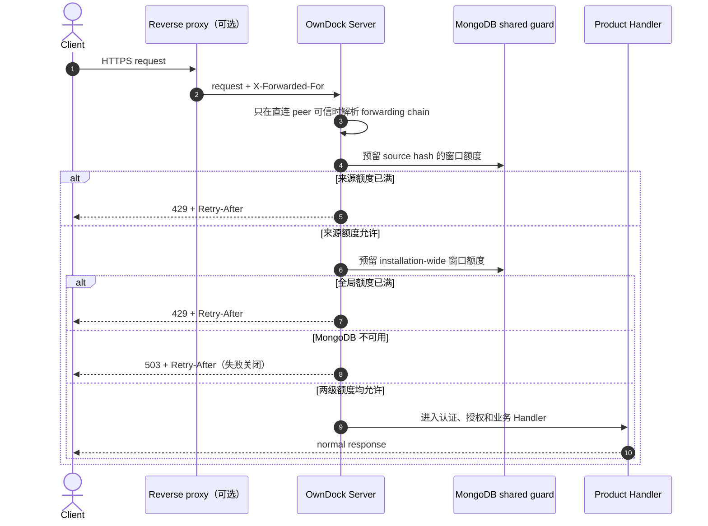
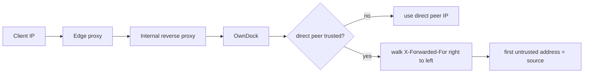

# 产品 API 入口保护

OwnDock 在正式产品 API 前提供一层应用级共享限流。它解决两个常见问题：同一个来源在短时间内发送过多请求，以及所有来源合计把一个小型安装压垮。计数保存在 MongoDB，因此部署多个 OwnDock Server 时仍共享同一阈值，不会因为请求被分配到不同实例而绕过限制。

这层保护不替代反向代理、云防火墙或 WAF。反向代理更适合限制连接数、请求体和明显的网络攻击；OwnDock 负责在请求进入产品 Handler 前执行一致、可配置的应用级准入。

## 默认规则

```yaml
security:
  ingress_source_limit: 600
  ingress_global_limit: 6000
  ingress_rate_window: 1m
  trusted_proxy_cidrs: []
```

- 同一可信来源默认每分钟最多 600 个产品 API 请求；
- 整个 OwnDock 安装默认每分钟最多 6,000 个产品 API 请求；
- `/api/v1/auth/*`、Project、Managed Host、Build Trigger、Webhook 等正式产品路由都经过这层保护；
- `/livez`、`/readyz`、`/metrics` 和版本信息不经过产品限流，便于平台在业务入口拥塞时继续判断进程状态；
- 来源键只以 SHA-256 保存，不把原始 IP 写入限流 collection；窗口过期后由 TTL 索引清理。

超过任一阈值时返回 `429 rate_limited`，并通过 `Retry-After` 告诉客户端至少等待多少秒。若 MongoDB 无法安全完成共享计数，OwnDock 返回 `503 ingress_protection_unavailable`，不会在保护失效时放行请求。



## 正确配置反向代理

`X-Forwarded-For` 是普通请求头，客户端可以自行伪造。OwnDock 只有在 TCP 直连对端属于 `trusted_proxy_cidrs` 时才读取它；否则始终以直连对端 IP 作为来源。

例如反向代理和 OwnDock 位于专用 `10.20.0.0/16` 网络，可以配置：

```yaml
security:
  trusted_proxy_cidrs:
    - 10.20.0.0/16
```

OwnDock 从右向左检查代理链，跳过已明确受信任的代理地址，第一个不受信任的地址才被视为客户来源。配置值必须是规范 CIDR，不能写单独主机名、任意文本或 `0.0.0.0/0` 作为省事的全信任范围。若 Cloudflare、阿里云负载均衡或自建 Nginx 是直连代理，只配置 OwnDock 实际网络路径中会直接连接 Server 的代理网段，并把代理网段变化纳入运维变更。



直连部署保持 `trusted_proxy_cidrs: []`。修改代理拓扑前应先确认真实 TCP 对端和代理覆写策略；不要让代理把客户端提交的整个 forwarding chain 原样透传且不追加自己的地址。

## 容量调整

`ingress_source_limit` 必须在 1～100,000 之间，`ingress_global_limit` 必须不小于来源阈值且不超过 1,000,000，窗口必须在 1 秒～1 小时之间。最多配置 64 个不重复的规范 CIDR。配置不合法时 Server 拒绝启动，避免错误信任代理或静默关闭保护。

先根据正常峰值调整全局阈值，再为单来源保留足够的 Web 页面并发请求空间。修改后观察 `429`、Server 延迟、MongoDB Primary 和连接层指标；不要只靠提高阈值掩盖循环重试或异常客户端。
