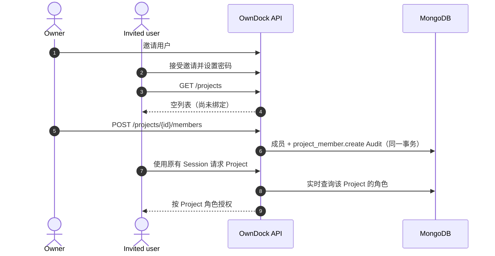
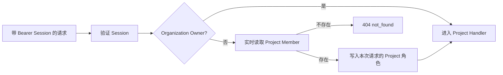

# Project 成员与权限

OwnDock 把“能登录”和“能进入某个 Project”分成两件事。Owner 邀请用户成功后，新用户只是 Organization `viewer`，默认看不到任何 Project；Owner 或 Project Maintainer 必须再把该用户绑定到具体 Project。

## 角色边界

| 角色 | Project 内主要能力 |
|---|---|
| Owner | 隐式访问全部 Project、创建 Project、管理任意 Project 成员；不会写入成员表 |
| Maintainer | 管理当前 Project 成员、凭据、构建设置、运行目标、部署和回滚 |
| Developer | 查看资源，创建 Application、Release、Build、Deployment，并取消工作流 |
| Viewer | 只读 Project 资源 |

Project 成员只能选择 `maintainer`、`developer` 或 `viewer`。Organization Owner 是全局恢复入口，不能被写成普通 Project 成员。Maintainer 也不能修改或删除自己的成员关系，避免误操作立即锁死当前管理入口。



## API 使用

Owner 可以从 `GET /api/v1/auth/users` 找到同一 Organization 内已经接受邀请的用户；Project Maintainer 没有 Organization 用户列表权限，需要输入已知的成员邮箱。绑定请求为：

```http
POST /api/v1/projects/{project_id}/members
Authorization: Bearer <owner-or-maintainer-session>
Content-Type: application/json

{"email":"developer@example.com","role":"developer"}
```

成员列表、修改和移除接口为：

```text
GET    /api/v1/projects/{project_id}/members
PATCH  /api/v1/projects/{project_id}/members/{user_id}
DELETE /api/v1/projects/{project_id}/members/{user_id}?expected_version=2
```

PATCH 请求同时提交 `role` 和 `expected_version`。版本不一致返回 `409 project_member_conflict`，前端应重新读取成员列表，不能静默覆盖他人的修改。重复绑定同一用户或邮箱也返回相同冲突错误。

## 为什么撤权会立即生效

Session 只证明用户身份和 Organization 基础角色，不缓存 Project 角色。每次访问 `/projects/{project_id}/...` 时，Server 都从 `project_members` 解析当前角色，再把它用于 Application、Build、Deployment、Runtime Inventory 等模块：



因此降权或移除成员后，不需要等待 Session 过期，下一次请求就使用新角色或返回 404。对无成员关系和跨 Organization 的 Project 都返回 404，避免泄露 Project 是否存在。公开 Webhook 和 Build Trigger Token 固定绑定到自身配置，不借用用户成员关系。

成员创建、改角色和移除分别写入 `project_member.create`、`project_member.update`、`project_member.delete` 审计事件，并和成员变更处于同一 MongoDB 事务。
