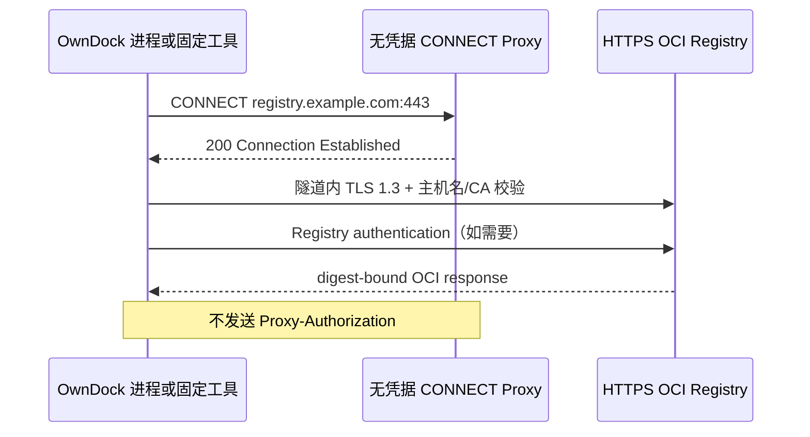

# Registry 连接与认证

OwnDock 通过 Project 下的 Registry Credential 记录“连接哪个 OCI Registry，以及本次连接怎样认证”。资源只保存安全元数据和外部秘密引用，不保存密码正文。公开 Registry 与私有 Registry 使用同一条 Artifact、Build、Evidence、Release 和 Deployment 链路，但认证模式必须显式选择，不能用空用户名或虚假密码模拟公开访问。

## 两种认证模式

| `authentication_mode` | 适用场景 | 必填字段 | OwnDock 行为 |
| --- | --- | --- | --- |
| `anonymous` | 允许匿名拉取或推送的公开/内部 Registry | `name`、`server` | 不读取密码、不生成 Docker Auth、不向 BuildKit、Syft、Trivy、Cosign 或 ORAS 注入认证环境变量 |
| `basic` | 用户名 + 密码、Robot Account 或访问令牌 | `name`、`server`、`username`、`password_ref` | 每次操作按 `password_ref` 解析密码，使用完成后清零内存；API、MongoDB、Job、日志和审计均不保存密码正文 |

`anonymous` 会拒绝 `username` 和 `password_ref`；`basic` 缺少其中任一字段也会拒绝。这样可以区分“明确选择公开访问”和“私有 Registry 配置不完整”，避免认证故障被错误地降级为匿名访问。

## 创建公开 Registry 连接

```http
POST /api/v1/projects/{project_id}/registry-credentials
Authorization: Bearer <session-token>
Content-Type: application/json

{
  "name": "Docker Hub Public",
  "server": "registry-1.docker.io",
  "authentication_mode": "anonymous"
}
```

响应中的 `password_configured` 为 `false`，并且不返回 `username`。

## 创建私有 Registry 连接

```http
POST /api/v1/projects/{project_id}/registry-credentials
Authorization: Bearer <session-token>
Content-Type: application/json

{
  "name": "Production Registry",
  "server": "registry.example.com",
  "authentication_mode": "basic",
  "username": "robot$owndock",
  "password_ref": "secret://production-registry"
}
```

`secret://production-registry` 默认映射到 Server、Build Worker 和 Evidence Worker 进程环境中的：

```text
OWNDOCK_REGISTRY_PRODUCTION_REGISTRY_PASSWORD
```

API 响应只返回 `password_configured: true`，不会返回 `password_ref` 或密码。Deployment Worker 仅在 Release 使用该连接且准备拉取镜像时生成短时 Docker Registry Authorization；匿名连接不会触发秘密解析。

## 安全边界

- `server` 只接受 Registry 主机名和可选端口，不接受 URL scheme、路径、userinfo、查询参数或 fragment。
- 镜像仓库的 Registry 域名必须与所选连接的 `server` 完全一致，防止把一个 Project 的凭据发送到其他主机。
- 外部 Artifact 只接受完整 `repository@sha256:...`，Server 会回读并哈希精确 manifest；认证模式不改变 digest 完整性验证。
- Artifact manifest 最大 8 MiB；空响应、超限内容、descriptor size/digest/media type 不一致都会作为完整性失败处理。
- Registry HTTP 客户端最多跟随 2 次重定向，并且只接受相同 scheme、主机和端口；跨主机、跨端口、HTTPS 降级、userinfo 或远程明文重定向会在发送下一请求前拒绝，避免认证材料离开原 Registry。
- OwnDock 不提供“认证失败后自动匿名重试”。`basic` 解析失败、密码错误或记录损坏时必须失败关闭。
- 当前远程 Registry 强制 HTTPS/TLS 1.3；明文 HTTP 只允许显式开启的 loopback 集成测试。不能用关闭 TLS 校验替代正确的证书信任配置。

## 自建 Registry 的私有 CA

自建 Harbor、Distribution 或企业 Registry 使用内部 CA 时，可以在安装配置中显式增加这个 CA：

```yaml
product:
  registry_ca_cert_file: /etc/owndock/registry/ca.pem
```

同一文件必须以只读挂载提供给 Server、Build Worker 和 Evidence Worker。路径必须是没有首尾空格的绝对路径；文件必须是普通文件，不能是符号链接，大小不能超过 1 MiB，并且只能包含一个或多个有效的 X.509 `CERTIFICATE` PEM 块。配置为空时仅使用操作系统信任根；配置不安全、不可读或内容无效时，相关进程拒绝启动，不会退回跳过 TLS 校验。

进程启动时会读取并固定一份 CA 内容快照。Server 的 Artifact manifest 探测、Server/Build Worker 的 Evidence 回读，以及 Evidence Worker 的 ORAS 发布和读取都会把该 CA 追加到系统信任根。Evidence Worker 还会在自己拥有的 `0700` 临时目录中创建 `0600` 快照，通过 `SSL_CERT_FILE` 只交给固定版本的 Syft、Trivy 和 Cosign；进程退出时删除快照。它们不会重新打开运维人员提供的原始路径。

这里配置的是 **OwnDock 进程访问 Registry 的信任**，不等于 Registry 凭据，也不会关闭证书主机名验证。另有两个独立边界：

- BuildKit 推送镜像时，由 BuildKit daemon 配置 Registry CA；
- Docker Engine 或目标主机拉取镜像时，由目标 Docker daemon 配置 Registry CA。

这两个守护进程不读取 `product.registry_ca_cert_file`，部署时必须按它们各自的标准方式安装同一 CA。

## 显式 Registry HTTPS 代理

Server、Build Worker 和 Evidence Worker 自身访问 Registry 时可以使用安装级、无凭据代理：

```yaml
product:
  registry_https_proxy: http://proxy.internal:3128
```

该值必须是规范的 `http://host[:port]` 或 `https://host[:port]` origin，不能包含用户名、密码、路径、查询参数或 fragment。OwnDock 不支持代理认证；需要认证的企业出口应在受信任网络中提供一个不含客户端凭据的专用转发入口，或通过网络策略限定来源。配置不合法时相关进程拒绝启动。

OwnDock 的 Registry HTTP 客户端不会继承进程环境中的 `HTTP_PROXY`、`HTTPS_PROXY` 或 `NO_PROXY`。配置代理后，Server 的 Artifact 探测和 Evidence 下载、Build Worker 的 Evidence 回读，以及 Evidence Worker 的 ORAS/Syft/Trivy/Cosign Registry 操作都只使用这个显式地址。子进程同时收到大小写代理变量，并强制空 `NO_PROXY`，避免客户环境中的旁路规则让流量绕过已选择的出口；Registry Basic 凭据仍只发送给隧道内的目标 Registry，不作为 `Proxy-Authorization` 发送。

生产 Evidence Worker Compose 把这个值指向 Evidence Boundary 内的固定 `owndock-egress-gateway` 地址，并由独立的 `runtime.evidence_egress_gateway.allowed_destinations` 精确允许 Registry/KMS。Worker 不加入 gateway 的 uplink 网络，因此清空代理变量后的 raw TCP、metadata 地址和未授权目标没有直接路由。Build Boundary 使用同一个无秘密网关镜像的独立实例和 `runtime.build_egress_gateway` 允许列表；两种 scope 不共享网络或允许列表。配置和故障时序见 [Artifact Evidence](artifact-evidence.md#运行-evidence-worker)。



若使用 `https://` 代理，`registry_ca_cert_file` 的补充根也用于校验代理 TLS；应把所需企业 CA 一并纳入受控 bundle。这个产品配置不控制另外三个网络边界：

- BuildKit 拉取 frontend/base image 和推送构建结果，使用 Build Boundary 的 `build_egress_proxy_url` 与 BuildKit 自己的 Registry 信任；
- Docker Engine 或 Agent 目标主机拉取 Release 镜像，使用 Docker daemon 自身的代理和 CA；
- Trivy 漏洞库更新器只使用独立 Vulnerability DB Boundary 中的网关地址和 `runtime.vulnerability_database_egress_gateway` allowlist。

这些边界不能通过给 OwnDock 进程设置环境变量代替。不同 Registry 品牌、中国大陆网络和完全离线的客户等价矩阵仍属于生产验收范围。

MongoDB v45 会把升级前已有的 Registry Credential 明确回填为 `basic`。新建匿名记录不会保存 `username` 或 `password_ref`。
