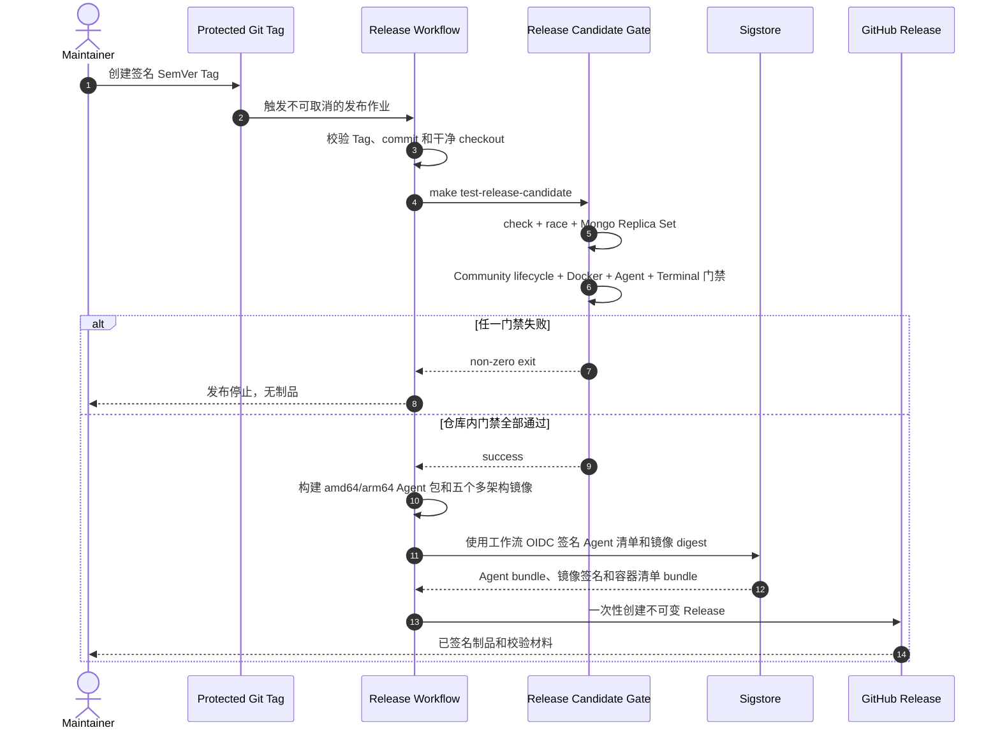

# 社区版发布候选门禁

OwnDock 的正式 Tag 不能只证明代码能够编译。发布候选必须同时通过仓库内可重复门禁，并保留需要客户等价环境验证的外部门禁。两类证据不能互相替代。

## 仓库内自动门禁

在准备 Tag 的干净 commit 上执行：

```bash
make test-release-candidate
```

该命令固定执行：

- 格式、依赖完整性、`go vet`、全量单元测试、OpenAPI 严格校验和全部进程构建；
- 全仓竞态测试；
- MongoDB 8.3.7 单节点 Replica Set 的 migration、事务、权限、状态机和持久化集成测试；
- 社区版 Compose 首次启动、最小权限数据库身份、Bootstrap、Server 重启、候选升级、基线回滚、停写备份和空卷恢复；
- 真实本机 Docker Engine 的 direct 与 Agent 执行回归；
- Agent 包格式、Release manifest、真实进程控制流、证书轮换恢复和双 Host 身份隔离；
- Terminal、Agent protocol、Gateway 与观测链路的专项竞态门禁。

正式 Tag 的 GitHub Release 工作流会重新执行同一个命令，不能只依赖分支上曾经通过的结果。门禁失败时不构建、不签名也不发布制品。门禁成功后，工作流并行构建并发布五个 `linux/amd64`、`linux/arm64` 镜像，镜像只使用精确 SemVer tag，不发布浮动 `latest`：

- `ghcr.io/owndock/owndock`；
- `ghcr.io/owndock/owndock-build-worker`；
- `ghcr.io/owndock/owndock-build-egress-gateway`；
- `ghcr.io/owndock/owndock-evidence-worker`；
- `ghcr.io/owndock/owndock-vulnerability-db-updater`。

工作流为每个 manifest digest 生成 SBOM、Provenance 和 Sigstore keyless 签名，并把五个不可变引用写入签名的 `CONTAINER_IMAGES.txt`。全部镜像构建成功后才提升精确 SemVer tag；重跑只接受 tag 已指向相同 digest 的情况，任何不同 digest 都拒绝覆盖。部署配置应使用清单中的 `image@sha256:digest`，不能仅依赖 tag。

发布工作流在耗时构建前先按 SemVer 优先级检查版本单调递增，拒绝低于或等于任何已发布版本的 Tag。它不会依赖 GitHub Release 的显示顺序，而是在最多 1,000 条有界记录中选择严格小于当前版本的最大 SemVer 作为上一版。首个版本只建立基线；从第二个版本开始，它会下载并离线验证上一版安装包、容器清单与 Sigstore 身份，恢复当前候选构建产生且已经签名的 Server digest，再以两个精确镜像执行：

- 上一版启动、Bootstrap 和持久化重启；
- 升级到当前版并验证版本、登录与数据保持；
- 回滚到上一版并再次验证版本、登录与数据保持；
- 停写备份、创建新空卷、恢复、恢复后登录和全程秘密日志扫描。

上述发布前门禁和发布后社区矩阵都在原生 Ubuntu 24.04 amd64/arm64 Runner 上执行，并校验内核、cgroup v2 与 Docker Engine 架构。任一架构失败时不会创建 GitHub Release。两条发布前结果分别写入 `COMMUNITY_COMPATIBILITY_amd64.txt` 和 `COMMUNITY_COMPATIBILITY_arm64.txt`，与安装包、容器清单和 `verify-community-release` 一起进入已签名的 `COMMUNITY_SHA256SUMS`；首个版本明确记录为 `baseline`，后续版本只有完整旅程通过才记录 `passed`。验证器在客户先完成脚本自身的签名校验和验证后，失败关闭地检查精确文件集、两个 bundle、五个固定仓库的 digest 引用和两份报告。发布成功后，发布工作流还会显式 dispatch `community-release-compatibility` 和 Agent 兼容矩阵，使用两版已发布制品留下可手动重跑的发布后证据；不能依赖 `GITHUB_TOKEN` 创建的 Release 事件再次触发工作流。兼容矩阵不接受未发布 Tag、可变镜像 tag 或未签名的 Server digest。



## 外部发布阻断项

`make test-release-candidate` 不会伪装以下真实环境结果：

- 两台独立客户等价 Linux 主机上的 Agent 安装、部署、断线、升级与回滚；
- 远程 mTLS Docker Engine 的网络分区、延迟旧命令和入口流量验证；
- Chrome/Firefox/Safari 的登录、权限即时撤销、Terminal WSS、IME、resize、慢消费者与断网 E2E；
- 客户选择的 Registry、私有 CA、代理、KMS 和隔离网络兼容矩阵；
- 客户等价存储上的 MongoDB Primary 切换、加密备份异地取回和版本升级演练；
- 首个受保护 Tag 的公开下载、在线/离线验签和联网 Registry 安装验证；完全隔离安装不在当前社区支持范围。

这些结果应绑定精确 Tag、commit、运行环境和时间，并在发布评审中逐项确认。缺少结果时只能发布 pre-release，不能标记为 production-ready。

## 与重型安全门禁的关系

`make test-build-security`、私有 Sigstore、真实漏洞数据库和双架构供应链任务包含大镜像、外部下载或专用基础设施，不重复塞入每次 Tag 作业。正式稳定版必须引用这些任务在同一候选 commit 上的成功结果；找不到匹配 commit 的结果时，应重新手动触发而不是沿用旧版本证据。

## 容器镜像验签

从 Release 的 `CONTAINER_IMAGES.txt` 选择精确引用前，先按 [Agent 正式发布与制品验签](release-security.md)相同的工作流身份验证 `CONTAINER_IMAGES.sigstore.json`。然后对每个镜像 digest 验证 Registry 中的签名：

```bash
cosign verify \
  ghcr.io/owndock/owndock@sha256:<digest> \
  --certificate-identity \
  https://github.com/owndock/owndock/.github/workflows/release.yml@refs/tags/v0.1.0 \
  --certificate-oidc-issuer https://token.actions.githubusercontent.com
```

Tag、清单和镜像三者任一 digest 不一致都必须停止安装。
