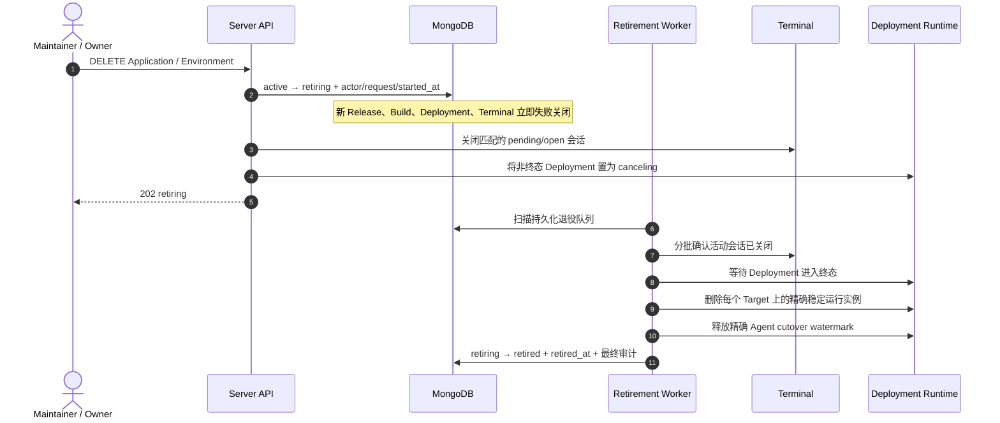
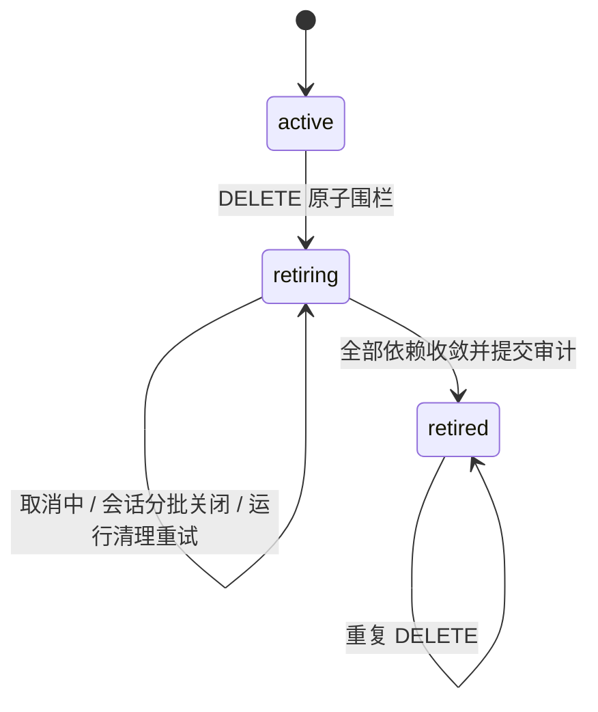

# Application 与 Environment 退役

Application 和 Environment 删除采用可恢复的生命周期工作流，不执行跨集合级联硬删除。API 首先把资源从 `active` 原子切换为 `retiring`，立即关闭 Release、Build、Deployment 和 Terminal 的新增入口；Server 随后排空关联 Deployment、关闭活动容器会话、删除精确稳定运行实例并释放 Agent cutover watermark，最后把资源标记为 `retired`。

`202 Accepted` 表示退役上下文已经持久化，客户端不负责驱动后续进度。后台 Worker 会按 `retirement.started_at` 有界扫描，Server 重启后继续执行。已完成的 DELETE 返回 `204 No Content`，重复删除也返回 204。

## 数据保留与可见性

- `Release`、`Build`、`Artifact`、`Deployment`、策略快照和 `Audit Event` 是不可变历史，不因上层资源退役而删除。
- 默认 Application/Environment 列表只返回 `active` 资源；处于 `retiring` 或 `retired` 的资源不能再被新工作引用。
- 已知 Application ID 仍可读取其不可变 Release 历史。
- 名称唯一索引只约束 `active` 资源，因此可用原名称创建新的业务身份；新旧资源 ID 永不混用。
- 运行清理以 `Project + Application + Environment + Runtime Target` 稳定槽位为单位。每个 Target 独立解析连接，只删除该范围内最后成功 Deployment 拥有的实例。

## 失败与并发语义

并发 Worker 依靠状态条件更新和事务保证只有一个完成提交。运行实例删除、Agent watermark 释放、会话关闭均使用精确身份并可安全重试；任何凭据、连接或 fencing 校验失败都会保留 `retiring` 记录，避免用“元数据已删”掩盖未清理资源。

历史 Deployment 引用的 Runtime Target 只有在权威控制面确认目标记录已经不存在时才跳过清理，因为目标自身的退役流程已经完成相同的运行排空。目标记录仍存在但处于 `unreachable`、非 ready 或暂时无法解析清理连接时不会被当作已删除，资源保持 `retiring` 并由 Worker 重试。

容器 TerminalSession 创建会在同一 MongoDB 事务中写入 Application/Environment 的内部 admission revision，再写会话与审计。退役状态切换会写同一父文档，因此并发的“最后一次 active 检查”和退役不能同时提交，消除收敛扫描后落入新活动会话的 write-skew 窗口。

MongoDB migration v48 为 Application/Environment 增加状态、持久退役队列和 active-only 名称唯一索引；v49 为活动容器会话回填 Application/Environment 归属，并建立两类有界收敛索引。
