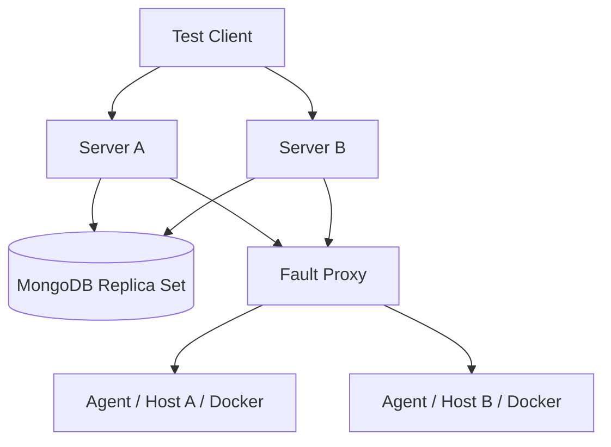
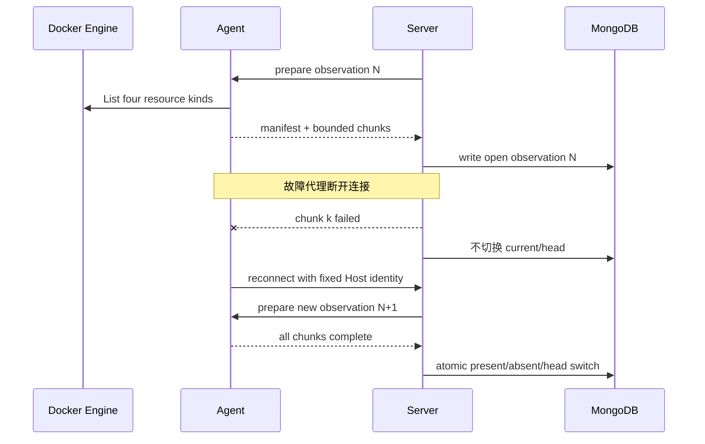

# Runtime Inventory 验收手册

本文定义 Runtime Inventory 从自动测试到真实多主机环境的发布门禁。它验证的是 OwnDock 的安全视图和最终收敛，不把 Docker Engine 当成可由浏览器直接访问的 API。

## 已进入仓库的自动门禁

| 场景 | 当前规模 | 必须成立 | 命令 |
| --- | ---: | --- | --- |
| 大资源分块 | 10,000 个资源 | 每块不超过 48 KiB/500 条，顺序稳定，重组无重复无遗漏 | `make check` |
| Mongo current 投影 | 1,202 个资源 | 每 500 条批量核验归属，Project 只见 1 个合法受管容器；未配置核验器时归属强制清零 | `make test-integration` |
| Host keyset 分页 | 1,202 个资源、每页 200 | 游标遍历终止，无重复无遗漏，伪造 Label 仍未受管 | `make test-integration` |
| Mongo 事务回滚 | complete 中途注入归属核验失败 | current/observation 不出现部分提交，重试后收敛并保留 first-seen | `make test-integration` |
| Mongo 视图索引 | migration 执行并重复执行 | v17 最终字段顺序支持默认与 include-absent keyset 排序 | `make test-integration` |
| absent 解释 | 空完整 observation | 默认列表为空；`include_absent=true` 可读取受管资源最后安全摘要 | `make test-integration` |
| Event 洪峰 | 4,096 条输入 | 单批最多 64 条并标记 truncated，Actor attributes 不进入结果 | `make check` |
| 恶意动态字段 | Container/Image/Network/Volume 哨兵 | Label、Parent、Driver/IPAM options、Aux address、Mountpoint、Driver status 不跨 mapper | `make check` |
| API 权限与 DTO | 四角色与非法参数 | Project/Host 权限分离，拒绝 endpoint/filter/重复参数，不返回 Label/Attribute | `make check` |
| 并发安全 | 核心 Inventory/Agent/Server 包 | 不出现数据竞争 | 见下方 race 命令 |

竞态门禁：

```bash
go test -race \
  ./internal/adapters/dockerinventory \
  ./internal/shared/runtimeinventory \
  ./internal/shared/agentprotocol \
  ./internal/agent/runtime \
  ./internal/modules/runtimeinventory/... \
  ./internal/modules/managedhost/service \
  ./internal/server
```

## 真实环境门禁

生产可用声明前至少准备以下隔离环境：

- 两台独立 Linux 主机，各运行一个 Agent 和 Docker Engine；
- 两个 Runtime Target 分别绑定固定 Managed Host，不允许跨 Host 命令回退；
- MongoDB Replica Set，启用认证和 TLS，并可控制 Primary 切换；
- Server 至少两个实例，共享 MongoDB，但使用独立 instance ID；
- 可控制的网络代理，用于制造断线、延迟、乱序和丢包；
- 只含测试哨兵的镜像、Label、Volume 与 Network fixture，不使用真实客户秘密。



## 必测故障序列

1. 两个 Server 同时争抢同一 Target 的全量和 Event 租约，只允许一个有效 owner/token。
2. 在 Agent 分块传输中途断线，open observation 不得改变 current；重连或重启后由新完整 observation 收敛。
3. 在 Event 洪峰中故意丢弃一段事件；truncated 提示应催促全量对账，最终状态以完整 observation 为准。
4. 切换 MongoDB Primary，已提交事务保持完整，失败事务不留下部分 current/head；Worker 按重试周期恢复。
5. Host A 断线时 Host B 的采集、Deployment 和查询继续工作，命令不能串到另一 Host。
6. 创建恶意 Label、Driver options、Volume metadata 和包含测试哨兵的 Actor attributes；检查 API、MongoDB 安全投影、日志、审计与 Trace 均无禁止字段。
7. 记录 1k、10k、目标上限三个规模下的采集耗时、Agent/Server 峰值内存、MongoDB 写入时长和 API P95；超过部署预算时必须降低上限或优化，不能只扩大超时。



## 通过标准与证据

- 所有自动门禁、Replica Set 集成测试和 race 测试通过；
- 两主机故障矩阵连续运行至少三轮，结果一致且没有跨 Host/跨 Organization 数据；
- 禁止字段在 API、MongoDB、日志、审计、Trace 的扫描结果均为零；
- 资源上限、超时、并发和保留期与部署文档一致；
- 保存测试版本、镜像 digest、配置摘要、指标报告和失败注入时间线；
- Web 明确区分 Project 受管资源与 Host 全量资源，并说明 Inventory 权限不授予 Terminal。

未满足任一项时，Runtime Inventory 保持 pre-release，采集 Worker 默认关闭。
