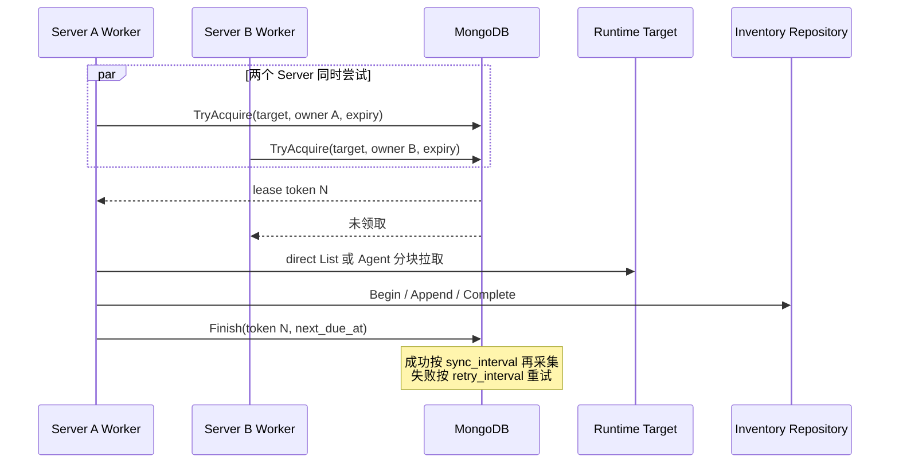
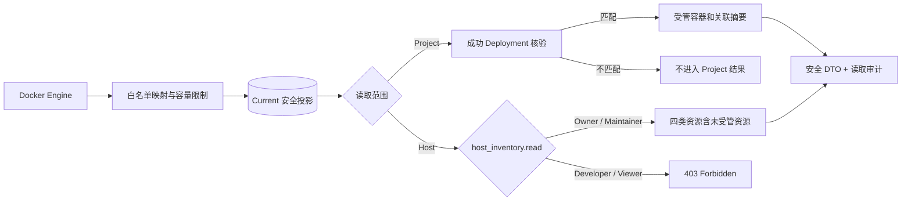
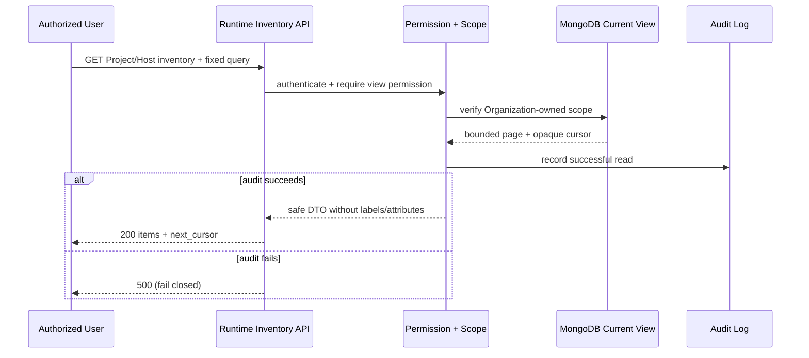
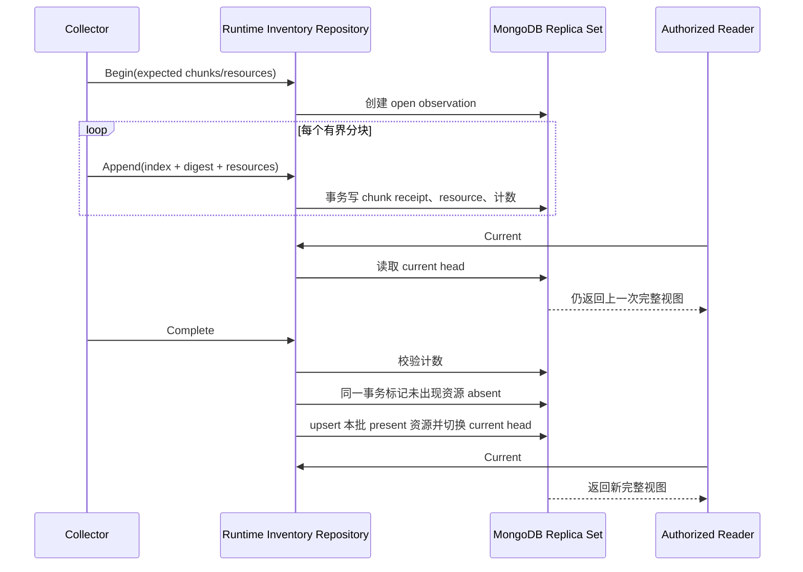
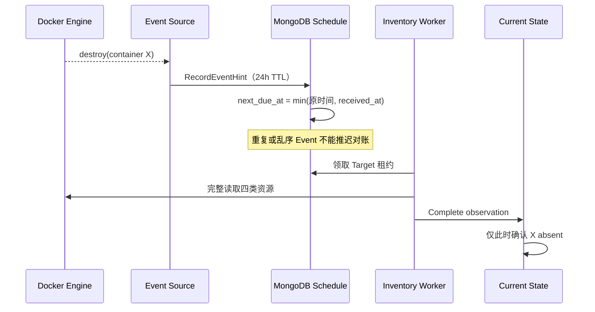
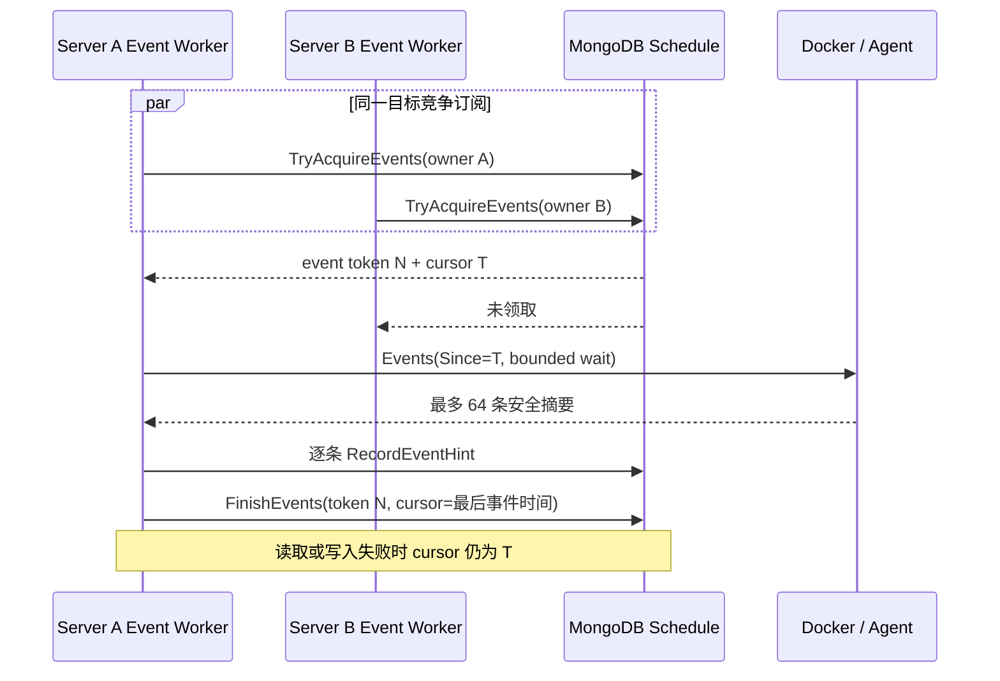

# Docker Runtime Inventory

Docker Runtime Inventory 是 OwnDock 对纳管 Docker Engine 当前资源的安全视图。目标是让获授权用户查看 Container、Image、Network 和 Volume，而不需要 SSH 登录主机，也不向浏览器开放 Docker Remote API。

## 当前状态

已经实现：

- 独立 `runtimeinventory` 领域，不依赖 Docker SDK 或 MongoDB Driver；
- Container、Image、Network、Volume 的 OwnDock 安全投影；
- 可供 direct 与 Agent 复用的 Docker List Reader 和四类资源白名单 mapper；
- 精确 JSON 字节数与资源数双重限制的安全分块算法，默认单块 48 KiB；
- Agent `prepare → pull chunk → release` 协议与 Server 拉取编排；
- Agent 最多 2 份、单份 32 MiB、10 分钟自动回收的纯内存快照；
- direct 安全 Source 到 observation/chunk/complete 的持久化编排；
- 从 `ready` Runtime Target 读取 Organization、Host、连接模式和凭据引用的内部 Target Source；
- direct 模式按次解析 TLS 凭据、创建独立 Docker Client，并在采集结束后关闭连接和清零 PEM 字节；
- Agent/direct Collector Router 和默认关闭的有界周期 Worker；
- `runtime_inventory_schedule` 的 MongoDB 原子租约、递增 token、成功周期与失败重试时间；
- 单进程并发上限与多 Server 下同一 Runtime Target 不并发采集；
- inventory command 对断线、尚未连接和 Registry 背压做有界短重试；
- 真实 HTTP Agent 流覆盖同进程重连续拉，以及快照丢失后放弃旧 observation、重新完整采集；
- 只允许 Project、Application、Deployment 三个结构化归属候选 Label；
- Network 的 IPv4/IPv6、Attachable、Ingress 与 IPAM 安全摘要；
- Volume 的创建时间以及“引用状态是否可知”，不把未知误写成未使用；
- observation、chunk、resource 和 current head 的 MongoDB Repository；
- 固定批次数、资源数、单批资源数和动态字段数量上限；
- chunk 内容 SHA-256 校验和幂等重放；
- MongoDB 按 Runtime Target 原子分配单调 generation，多 Server 不依赖主机时钟判断新旧；
- 完整 observation 提交后才原子切换当前视图；
- 独立 `runtime_inventory_current` 投影显式记录 `present/absent`、首次发现、最后确认和判定消失时间；
- 完整提交在同一事务内完成 absent 标记、present upsert 和 current head 切换；
- 空完整快照、资源消失后重新出现以及首次发现时间保留的 Replica Set 测试；
- Event 安全摘要、24 小时 TTL 和“只提前全量对账、不直接修改 presence”的调度 Repository；
- Event 在采集期间到达时不会被 Worker 完成时间覆盖，重复和乱序提示不能推迟已到期对账；
- direct 与 Agent 都会读取真实 Docker Engine 的有限 snapshot window Event；
- Agent manifest 最多携带 64 条安全 Event，不带 Actor attributes，且不进入磁盘或 completed-result cache；
- snapshot window 内有 Event 时，完整提交后立即安排下一次 observation，修复四类 List 之间的混合快照；
- direct 与 Agent 的有界持续 Event 轮询、Docker 时间游标和断线后的 inclusive `Since` 续读；
- `runtime_inventory_schedule` 的独立 Event owner/expiry/token 租约，确保多 Server 对同一 Runtime Target 只有一个订阅者；
- Event 全部安全落库后才推进游标，采集或写入失败保持旧游标并按失败周期重试；
- 完成 observation 时用同 Organization、Project、Application、Runtime Target 的成功 Deployment 核验容器 Label，伪造或过期归属保持未受管；
- `GET /api/v1/projects/{project_id}/runtime-inventory` 只返回核验后的 Project 受管容器，Viewer、Developer、Maintainer 和 Owner 可读；
- `GET /api/v1/managed-hosts/{managed_host_id}/runtime-inventory` 返回 Host 四类安全资源，仅 Owner 和 Maintainer 可读；
- 两类查询只接受 Runtime Target、固定 Kind、是否包含 absent、页大小和不透明游标，不接受 endpoint、Docker object ID 或任意 filter；
- 查询响应使用独立 DTO，不返回内部 Labels、Attributes、原始 Inspect 或凭据，且每次成功读取都会写审计；
- 归属核验按最多 500 个投影批量查询成功 Deployment，避免大主机按容器产生 N+1 查询；
- 自动容量门禁覆盖 10,000 个资源的有界无损分块、1,202 个 Mongo current 资源的最大页长游标遍历，以及 4,096 条 Event 洪峰截断；
- Image/Network/Volume 的 Label、父镜像、Driver/IPAM options、辅助地址、Mountpoint 和 Driver status 秘密哨兵不会跨越 mapper；
- 较旧 observation 不能覆盖较新视图；
- 未完成 observation 的两小时回收、被替换 generation 的七天回收和 TTL 索引；
- Replica Set 集成测试覆盖未完成批次不可见、重复分块、当前视图切换、空视图、旧批次 fence，以及两个 Server 同时领取时只能有一个成功。

尚未实现：

- 大主机容量、恶意 Labels/Driver options、秘密泄漏、双主机断线和事件洪峰系统测试。

因此当前代码已具备受权限保护的资源浏览 API；周期采集仍默认关闭，系统级容量、安全与故障验收完成前仍按 pre-release 能力管理。

## 周期采集如何工作

Server 只扫描状态为 `ready` 的 Runtime Target。Target 中保存的是连接路由和 `secret://` 引用，不是证书内容。Worker 默认关闭；启用后使用固定并发数轮询候选目标，并在每次采集前领取 MongoDB 租约：

租约 token 每次领取都会递增。完成调度时必须同时匹配 Target、owner 和 token，因此旧 Server 在租约过期后迟到的完成请求不能覆盖新 Server 的调度结果。`lease_duration` 必须大于单次 `operation_timeout`，正常任务不会在执行中被第二个实例接管；进程崩溃后则可在租约到期后恢复。

direct 模式在每次操作开始时才把 `secret://alias` 解析成 `OWNDOCK_RUNTIME_<ALIAS>_CA_PEM`、`_CERT_PEM` 和 `_KEY_PEM`。这些字节只用于创建本次 TLS Client，之后会被清零，不写入 Target、observation、MongoDB 或日志。Agent 模式不解析运行时 TLS 凭据，直接使用 Agent mTLS 连接注册表中的 Host 身份。

默认配置是 2 个全量采集并发任务、每 5 分钟成功同步一次、失败 30 秒后重试，单次操作最多 1 分钟，租约 2 分钟。Event 使用独立的 4 个并发任务，每次最多等待 Docker 2 秒，成功后最早 1 秒再次轮询；这样短时订阅不会占用全量采集的 Worker。`max_chunk_bytes` 同时兼容 direct 和 Agent，因此当前配置上限为 48 KiB。未部署 Agent Server 时，Agent 类型目标会安全失败并进入重试，不会退回 direct 连接。

Agent 不主动把整机快照推到 Server，也不把大结果写入命令缓存。Server 先要求 Agent prepare，得到资源数、分块数和 10 分钟相对保留时间，再逐块 pull；每块成功落库后才请求下一块。Agent 与 Server 的通用 completed-result cache 都跳过三类 inventory 命令。单条命令在 `command_timeout` 内对断线、未连接和背压做短间隔重试：进程内重连会用相同 Target/observation/index 继续拉取；Agent 重启后新 Executor 没有内存快照，会返回 `inventory_snapshot_missing`，当前 observation 失败关闭，下一次任务使用新 ID 重新完整采集。MongoDB 中未完成批次两小时后回收。

共享 transport 还限制一次快照最多 100,000 个资源、10,000 个 chunk 和 64 MiB 编码资源数据；Agent 为目标客户主机采用更严格的单份 32 MiB 内存上限。任一上限失败都不会切换当前视图。

## 数据模型

一次 observation 固定 Organization、Managed Host 和 Runtime Target，并声明分块数与资源总数。每个资源文档包含：

- `kind`：`container`、`image`、`network` 或 `volume`；
- Docker runtime ID 和显示名称；
- `managed`、Project 和可选 Deployment 关联；
- 资源类型对应的稳定摘要；
- 经过过滤的 Labels 和 Attributes；
- Container 的安全 Port、Mount、Network attachment；
- `observed_at` 和 `schema_version`。

领域模型没有以下字段：

- 原始 Docker Inspect；
- Container Env 值；
- Registry authorization；
- TLS、SSH 或 Git 凭据；
- Mount 的宿主机 source path；
- Docker 原始错误。

Mount 只保留类型、名称、容器内 destination 和只读标记。动态字段的键名会拒绝 `env`、`authorization`、`credential`、`password`、`private_key`、`registry_auth`、`secret` 和 `token` 等秘密类别。

Docker Label 采用精确白名单，不接受 namespace 前缀匹配。当前传输只保留 `net.owndock.project_id`、`net.owndock.application_id` 和 `net.owndock.deployment_id`，而且值必须是长度受限的结构化 ID。OCI description、任意自定义 Label、fencing token、environment ID、Volume options 和 Driver status 都不会进入 payload。

这三个 Label 只是“归属候选”。Server 把 payload 转换为领域资源时始终先设置 `managed=false`；完整 observation 投影时，再用数据库中状态为 `succeeded` 且 Organization、Project、Application、Runtime Target 全部一致的 Deployment 核验。任何字段缺失、不一致或没有成功 Deployment 的容器都保持未受管，不能进入 Project 视图。

## 对外查询与权限

Project 和 Host 是两种不同的可见性边界：

- Project API 返回平台能够用成功 Deployment 证明归属的容器。容器中嵌入镜像引用、端口、Mount 和 Network attachment 安全摘要，但不会把该 Host 的完整 Image、Network、Volume 清单暴露给 Project 用户；
- Host API 返回该 Organization 所属 Host 上的 Container、Image、Network、Volume，包括未受管资源，因此要求独立的 `host_inventory.read` 权限；
- Project 的 Viewer、Developer、Maintainer、Owner 具有 `runtime_inventory.read`；Host 视图仅 Maintainer、Owner 具有 `host_inventory.read`；
- inventory 权限不等于 Terminal 权限，也不能作为后续容器终端授权依据。

两个 endpoint 都使用固定参数：`runtime_target_id`、`kind`、`include_absent`、`limit` 和 `cursor`。`limit` 默认 100、最大 200；`cursor` 是 Server 返回的不透明续页值，客户端只需原样传回。未知参数和重复参数会被拒绝，因此浏览器不能提交 Docker endpoint、容器 ID 或原生 filter 扩大读取范围。

## 为什么使用 generation

如果采集过程直接覆盖当前资源，Agent 在传到一半时断线，Server 无法分辨“资源已经删除”和“资源所在分块尚未到达”。OwnDock 因此先把新 observation 写成独立 generation：

同一分块按 observation、index 和内容 digest 幂等。index 相同但内容不同会失败；同一 observation 中 Kind + runtime ID 重复也会失败。完成操作要求接收计数与声明完全一致。

`Begin` 会通过 `runtime_inventory_counters` 为每个 Runtime Target 原子分配单调 generation。完成时只有 generation 大于当前 head 的 observation 才能切换视图；延迟到达的旧 observation 即使客户端时间更晚，也不能覆盖更新后的主机视图。

不可变的 `runtime_inventory_resources` 保存每个完整 generation 的证据，`runtime_inventory_current` 保存面向读取的最新状态。资源只在完整 observation 提交时从 `present` 变为 `absent`；失败或缺块批次完全不能触碰 current 投影。消失资源保留最后一份安全摘要和原 generation，记录 `absent_at`，七天后由 TTL 回收。若它在保留期内重新出现，会清除 `absent_at`、更新 generation，并保留原 `first_seen_at`。

## Event 如何缩短延迟

Event 不是资源状态写入命令。Repository 只保存 Kind、Runtime ID、规范化 action、发生/接收时间等安全摘要，并把目标的 `next_due_at` 提前；真正的 `present/absent` 仍由随后一次完整 observation 决定：

领取租约时 Worker 会暂时移除旧 `next_due_at`。如果采集期间又收到 Event，Event 会写入新的提前时间；`Finish` 使用最小值合并正常周期，因此不会覆盖这次提示。

direct 和 Agent 都会在完整快照开始与结束之间查询一次真实 Docker Event 历史窗口。该窗口解决 Container、Image、Network、Volume 四次 List 并非同一瞬间的问题：只要窗口内发生规范化事件，Server 就在本次完整提交后立即再做一次 observation。

快照之间由独立 Event Worker 做有界持续轮询。这里的“游标”可以通俗理解为“上次已经安全处理到哪个 Docker 事件时间”。游标只取自 Docker Event 自己的 `occurred_at`，不使用 Server 当前时间，所以 Agent 主机与控制面时钟有偏差时也不会因为控制面时间更快而跳过事件。断线后使用 inclusive `Since` 从最后时间重新读取，最后一条可能重复，但 Event Hint 的稳定 ID 会去重。MongoDB DateTime 保存到毫秒精度，纳秒事件游标持久化后会向较早的毫秒边界回落，因此只会扩大安全重放范围，不会向未来推进并跳过事件。只有整批提示都记录成功才保存新游标；任何读取或 MongoDB 写入失败都保留旧游标。

每批最多 64 条；达到上限标记 truncated，并由提示立即触发全量对账。Actor attributes、`exec_*` command、健康检查输出和任意 Labels 都不会跨越适配器。事件命令和结果不进入 Agent 磁盘缓存或 Server completed cache。Docker Event 本身可能丢失、重复或乱序，因此 Event 永远只是“尽快再核对一次”的提示，固定周期全量采集仍负责最终收敛。

## 存储与保留

MongoDB collection：

- `runtime_inventory_observations`
- `runtime_inventory_chunks`
- `runtime_inventory_resources`
- `runtime_inventory_heads`
- `runtime_inventory_counters`
- `runtime_inventory_schedule`
- `runtime_inventory_current`
- `runtime_inventory_event_hints`

`Begin` 创建的 open observation、chunk 和 resource 先设置两小时过期时间，避免 Agent 断线或 Server 重启留下永久孤儿数据。完成提交会移除当前 generation 的过期时间；切换后，上一 generation 的 observation、chunk 和 resource 设置七天过期时间。MongoDB TTL 负责最终回收。

`runtime_inventory_schedule` 只保存 Target/Organization/Host 标识、全量与 Event 各自的租约 owner/token/expiry、Docker 事件游标、下一次到期时间和最近成功或失败时间，不保存 endpoint、凭据引用、证书或采集错误正文。Migration v13 为全量采集到期领取与 Host 诊断建立索引，v14 为 current presence 投影和 24 小时 Event 摘要建立唯一、读取与 TTL 索引，v15 为 Event 轮询到期与租约接管建立索引，v16 建立 Project/Host 视图索引，v17 优化其字段顺序，使默认查询与包含 absent 的稳定游标遍历都能复用索引排序。

该保留期用于故障解释和后续 absent/history 投影，不是长期审计。Docker 日志、Stats 和高频原始 Event 不写入这些 collection：

- 日志使用流式读取或专用日志存储；
- CPU、内存、磁盘和网络指标进入时序系统；
- Event 只作为增量提示，完整 observation 负责最终收敛。

## 权限边界

公开 API 已区分：

- Project 受管视图：只显示能验证到当前 Project/Deployment 的资源；
- Host inventory 视图：显示纳管 Engine 上的未受管资源，需要单独的 Host 权限。

资源清单不能作为容器终端授权。Terminal 仍从当前 Deployment 解析固定容器，调用方不能通过提交任意 Docker ID、endpoint 或 filter 扩大访问范围。

## 自动验收与仍需外部环境的门禁

普通测试会验证精确字节/资源上限、10,000 资源分块重组、恶意 Docker 动态字段秘密哨兵、4,096 Event 洪峰截断、API DTO 脱敏和权限矩阵。MongoDB Replica Set 测试会提交 1,202 个 current 资源，验证 500 条批量投影、最大 200 条 keyset 分页、无重复无遗漏、伪造归属不生效、跨 Organization 隔离、最终视图索引顺序，以及空 observation 后默认隐藏 absent、授权查询仍可解释消失资源。测试还会在 complete 事务的归属核验阶段注入失败，确认 current 与 observation 整体回滚，并验证重试后成功收敛且保留 first-seen。

这些自动门禁不能替代真实环境验收。INV-008 仍需两台独立 Agent 主机上的断线/重连、事件永久丢失、洪峰期间全量收敛、MongoDB 故障恢复、CPU/内存峰值和客户 Web E2E；完成前保持 pre-release 标识。
