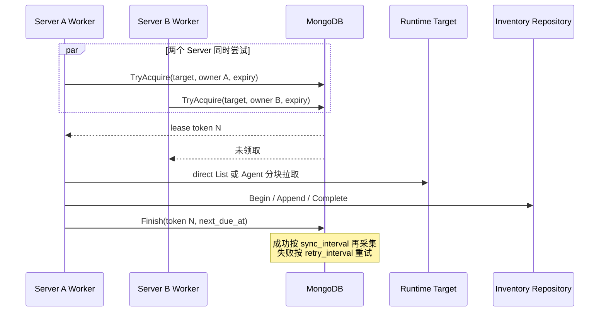
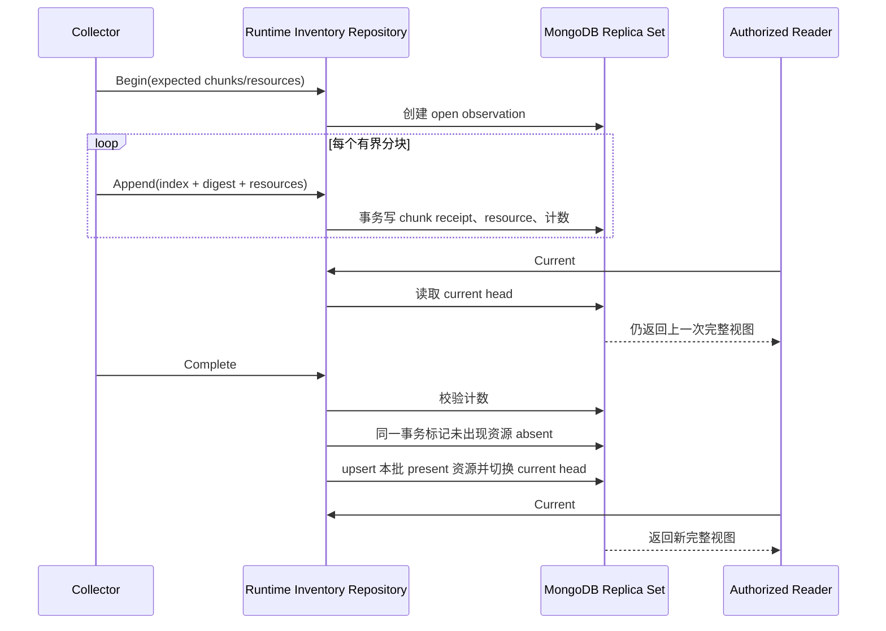
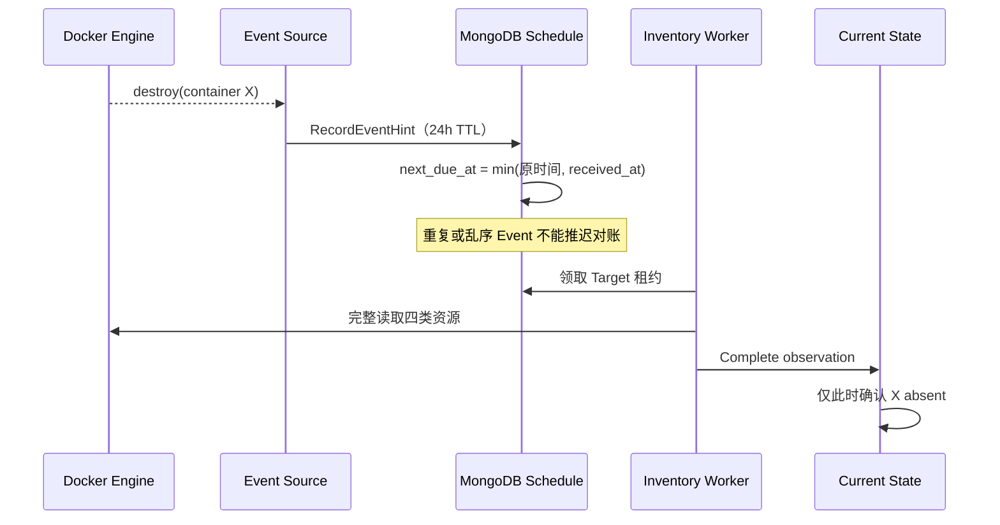

# Docker Runtime Inventory

Docker Runtime Inventory 是 OwnDock 对纳管 Docker Engine 当前资源的安全视图。目标是让获授权用户查看 Container、Image、Network 和 Volume，而不需要 SSH 登录主机，也不向浏览器开放 Docker Remote API。

## 当前状态

已经实现：

- 独立 `runtimeinventory` 领域，不依赖 Docker SDK 或 MongoDB Driver；
- Container、Image、Network、Volume 的 OwnDock 安全投影；
- 可供 direct 与 Agent 复用的 Docker List Reader 和四类资源白名单 mapper；
- 精确 JSON 字节数与资源数双重限制的安全分块算法，默认单块 48 KiB；
- Agent `prepare → pull chunk → release` 协议与 Server 拉取编排；
- Agent 最多 2 份、单份 32 MiB、10 分钟自动回收的纯内存快照；
- direct 安全 Source 到 observation/chunk/complete 的持久化编排；
- 从 `ready` Runtime Target 读取 Organization、Host、连接模式和凭据引用的内部 Target Source；
- direct 模式按次解析 TLS 凭据、创建独立 Docker Client，并在采集结束后关闭连接和清零 PEM 字节；
- Agent/direct Collector Router 和默认关闭的有界周期 Worker；
- `runtime_inventory_schedule` 的 MongoDB 原子租约、递增 token、成功周期与失败重试时间；
- 单进程并发上限与多 Server 下同一 Runtime Target 不并发采集；
- inventory command 对断线、尚未连接和 Registry 背压做有界短重试；
- 真实 HTTP Agent 流覆盖同进程重连续拉，以及快照丢失后放弃旧 observation、重新完整采集；
- 只允许 Project、Application、Deployment 三个结构化归属候选 Label；
- Network 的 IPv4/IPv6、Attachable、Ingress 与 IPAM 安全摘要；
- Volume 的创建时间以及“引用状态是否可知”，不把未知误写成未使用；
- observation、chunk、resource 和 current head 的 MongoDB Repository；
- 固定批次数、资源数、单批资源数和动态字段数量上限；
- chunk 内容 SHA-256 校验和幂等重放；
- MongoDB 按 Runtime Target 原子分配单调 generation，多 Server 不依赖主机时钟判断新旧；
- 完整 observation 提交后才原子切换当前视图；
- 独立 `runtime_inventory_current` 投影显式记录 `present/absent`、首次发现、最后确认和判定消失时间；
- 完整提交在同一事务内完成 absent 标记、present upsert 和 current head 切换；
- 空完整快照、资源消失后重新出现以及首次发现时间保留的 Replica Set 测试；
- Event 安全摘要、24 小时 TTL 和“只提前全量对账、不直接修改 presence”的调度 Repository；
- Event 在采集期间到达时不会被 Worker 完成时间覆盖，重复和乱序提示不能推迟已到期对账；
- direct 与 Agent 都会读取真实 Docker Engine 的有限 snapshot window Event；
- Agent manifest 最多携带 64 条安全 Event，不带 Actor attributes，且不进入磁盘或 completed-result cache；
- snapshot window 内有 Event 时，完整提交后立即安排下一次 observation，修复四类 List 之间的混合快照；
- 较旧 observation 不能覆盖较新视图；
- 未完成 observation 的两小时回收、被替换 generation 的七天回收和 TTL 索引；
- Replica Set 集成测试覆盖未完成批次不可见、重复分块、当前视图切换、空视图、旧批次 fence，以及两个 Server 同时领取时只能有一个成功。

尚未实现：

- direct/Agent Docker Event 持续订阅、游标持久化与断线恢复；
- 对外查询 API、Host inventory 权限和 Project 受管视图；
- 大主机容量、恶意 Labels/Driver options 和秘密泄漏系统测试。

因此当前代码已经具备默认关闭的内部周期采集链路，但还不是可供用户使用的资源浏览功能。

## 周期采集如何工作

Server 只扫描状态为 `ready` 的 Runtime Target。Target 中保存的是连接路由和 `secret://` 引用，不是证书内容。Worker 默认关闭；启用后使用固定并发数轮询候选目标，并在每次采集前领取 MongoDB 租约：

租约 token 每次领取都会递增。完成调度时必须同时匹配 Target、owner 和 token，因此旧 Server 在租约过期后迟到的完成请求不能覆盖新 Server 的调度结果。`lease_duration` 必须大于单次 `operation_timeout`，正常任务不会在执行中被第二个实例接管；进程崩溃后则可在租约到期后恢复。

direct 模式在每次操作开始时才把 `secret://alias` 解析成 `OWNDOCK_RUNTIME_<ALIAS>_CA_PEM`、`_CERT_PEM` 和 `_KEY_PEM`。这些字节只用于创建本次 TLS Client，之后会被清零，不写入 Target、observation、MongoDB 或日志。Agent 模式不解析运行时 TLS 凭据，直接使用 Agent mTLS 连接注册表中的 Host 身份。

默认配置是 2 个并发任务、每 5 分钟成功同步一次、失败 30 秒后重试，单次操作最多 1 分钟，租约 2 分钟。`max_chunk_bytes` 同时兼容 direct 和 Agent，因此当前配置上限为 48 KiB。未部署 Agent Server 时，Agent 类型目标会安全失败并进入重试，不会退回 direct 连接。

Agent 不主动把整机快照推到 Server，也不把大结果写入命令缓存。Server 先要求 Agent prepare，得到资源数、分块数和 10 分钟相对保留时间，再逐块 pull；每块成功落库后才请求下一块。Agent 与 Server 的通用 completed-result cache 都跳过三类 inventory 命令。单条命令在 `command_timeout` 内对断线、未连接和背压做短间隔重试：进程内重连会用相同 Target/observation/index 继续拉取；Agent 重启后新 Executor 没有内存快照，会返回 `inventory_snapshot_missing`，当前 observation 失败关闭，下一次任务使用新 ID 重新完整采集。MongoDB 中未完成批次两小时后回收。

共享 transport 还限制一次快照最多 100,000 个资源、10,000 个 chunk 和 64 MiB 编码资源数据；Agent 为目标客户主机采用更严格的单份 32 MiB 内存上限。任一上限失败都不会切换当前视图。

## 数据模型

一次 observation 固定 Organization、Managed Host 和 Runtime Target，并声明分块数与资源总数。每个资源文档包含：

- `kind`：`container`、`image`、`network` 或 `volume`；
- Docker runtime ID 和显示名称；
- `managed`、Project 和可选 Deployment 关联；
- 资源类型对应的稳定摘要；
- 经过过滤的 Labels 和 Attributes；
- Container 的安全 Port、Mount、Network attachment；
- `observed_at` 和 `schema_version`。

领域模型没有以下字段：

- 原始 Docker Inspect；
- Container Env 值；
- Registry authorization；
- TLS、SSH 或 Git 凭据；
- Mount 的宿主机 source path；
- Docker 原始错误。

Mount 只保留类型、名称、容器内 destination 和只读标记。动态字段的键名会拒绝 `env`、`authorization`、`credential`、`password`、`private_key`、`registry_auth`、`secret` 和 `token` 等秘密类别。

Docker Label 采用精确白名单，不接受 namespace 前缀匹配。当前传输只保留 `net.owndock.project_id`、`net.owndock.application_id` 和 `net.owndock.deployment_id`，而且值必须是长度受限的结构化 ID。OCI description、任意自定义 Label、fencing token、environment ID、Volume options 和 Driver status 都不会进入 payload。

这三个 Label 只是“归属候选”。Server 把 payload 转换为领域资源时始终先设置 `managed=false`，后续必须用当前 Deployment 数据核验 Runtime Target、容器和执行身份，不能仅凭 Label 授予 Project 可见性。

## 为什么使用 generation

如果采集过程直接覆盖当前资源，Agent 在传到一半时断线，Server 无法分辨“资源已经删除”和“资源所在分块尚未到达”。OwnDock 因此先把新 observation 写成独立 generation：

同一分块按 observation、index 和内容 digest 幂等。index 相同但内容不同会失败；同一 observation 中 Kind + runtime ID 重复也会失败。完成操作要求接收计数与声明完全一致。

`Begin` 会通过 `runtime_inventory_counters` 为每个 Runtime Target 原子分配单调 generation。完成时只有 generation 大于当前 head 的 observation 才能切换视图；延迟到达的旧 observation 即使客户端时间更晚，也不能覆盖更新后的主机视图。

不可变的 `runtime_inventory_resources` 保存每个完整 generation 的证据，`runtime_inventory_current` 保存面向读取的最新状态。资源只在完整 observation 提交时从 `present` 变为 `absent`；失败或缺块批次完全不能触碰 current 投影。消失资源保留最后一份安全摘要和原 generation，记录 `absent_at`，七天后由 TTL 回收。若它在保留期内重新出现，会清除 `absent_at`、更新 generation，并保留原 `first_seen_at`。

## Event 如何缩短延迟

Event 不是资源状态写入命令。Repository 只保存 Kind、Runtime ID、规范化 action、发生/接收时间等安全摘要，并把目标的 `next_due_at` 提前；真正的 `present/absent` 仍由随后一次完整 observation 决定：

领取租约时 Worker 会暂时移除旧 `next_due_at`。如果采集期间又收到 Event，Event 会写入新的提前时间；`Finish` 使用最小值合并正常周期，因此不会覆盖这次提示。

当前 direct 和 Agent 会在完整快照开始与结束之间查询一次真实 Docker Event 历史窗口。该窗口解决 Container、Image、Network、Volume 四次 List 并非同一瞬间的问题：只要窗口内发生规范化事件，Server 就在本次完整提交后立即再做一次 observation。Event transport 最多 64 条；达到上限标记 truncated，同样只触发下一次完整对账。Actor attributes、`exec_*` command、健康检查输出和任意 Labels 都不会跨越适配器。Agent manifest 及结果不落盘缓存，真实 HTTP Agent 流已验证事件能到达 Server 提示仓储。

持续订阅和断线游标尚未完成，因此快照之间的低延迟变化暂时仍依赖固定周期。即使未来订阅断开、Event 乱序或永久丢失，周期全量采集也必须最终收敛。

## 存储与保留

MongoDB collection：

- `runtime_inventory_observations`
- `runtime_inventory_chunks`
- `runtime_inventory_resources`
- `runtime_inventory_heads`
- `runtime_inventory_counters`
- `runtime_inventory_schedule`
- `runtime_inventory_current`
- `runtime_inventory_event_hints`

`Begin` 创建的 open observation、chunk 和 resource 先设置两小时过期时间，避免 Agent 断线或 Server 重启留下永久孤儿数据。完成提交会移除当前 generation 的过期时间；切换后，上一 generation 的 observation、chunk 和 resource 设置七天过期时间。MongoDB TTL 负责最终回收。

`runtime_inventory_schedule` 只保存 Target/Organization/Host 标识、租约 owner/token/expiry、下一次到期时间和最近成功或失败时间，不保存 endpoint、凭据引用、证书或采集错误正文。Migration v13 为到期领取与 Host 诊断建立索引。Migration v14 为 current presence 投影和 24 小时 Event 摘要建立唯一、读取与 TTL 索引。

该保留期用于故障解释和后续 absent/history 投影，不是长期审计。Docker 日志、Stats 和高频原始 Event 不写入这些 collection：

- 日志使用流式读取或专用日志存储；
- CPU、内存、磁盘和网络指标进入时序系统；
- Event 只作为增量提示，完整 observation 负责最终收敛。

## 权限边界

后续公开 API 必须区分：

- Project 受管视图：只显示能验证到当前 Project/Deployment 的资源；
- Host inventory 视图：显示纳管 Engine 上的未受管资源，需要单独的 Host 权限。

资源清单不能作为容器终端授权。Terminal 仍从当前 Deployment 解析固定容器，调用方不能通过提交任意 Docker ID、endpoint 或 filter 扩大访问范围。
