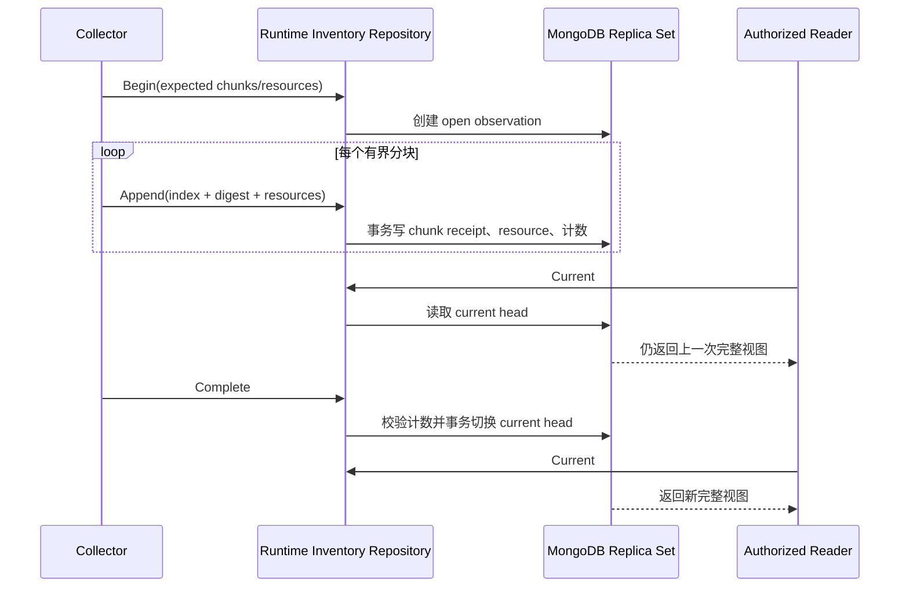

# Docker Runtime Inventory

Docker Runtime Inventory 是 OwnDock 对纳管 Docker Engine 当前资源的安全视图。目标是让获授权用户查看 Container、Image、Network 和 Volume，而不需要 SSH 登录主机，也不向浏览器开放 Docker Remote API。

## 当前状态

已经实现：

- 独立 `runtimeinventory` 领域，不依赖 Docker SDK 或 MongoDB Driver；
- Container、Image、Network、Volume 的 OwnDock 安全投影；
- 可供 direct 与 Agent 复用的 Docker List Reader 和四类资源白名单 mapper；
- 精确 JSON 字节数与资源数双重限制的安全分块算法，默认单块 48 KiB；
- Agent `prepare → pull chunk → release` 协议与 Server 拉取编排；
- Agent 最多 2 份、单份 32 MiB、10 分钟自动回收的纯内存快照；
- direct 安全 Source 到 observation/chunk/complete 的持久化编排；
- 只允许 Project、Application、Deployment 三个结构化归属候选 Label；
- Network 的 IPv4/IPv6、Attachable、Ingress 与 IPAM 安全摘要；
- Volume 的创建时间以及“引用状态是否可知”，不把未知误写成未使用；
- observation、chunk、resource 和 current head 的 MongoDB Repository；
- 固定批次数、资源数、单批资源数和动态字段数量上限；
- chunk 内容 SHA-256 校验和幂等重放；
- MongoDB 按 Runtime Target 原子分配单调 generation，多 Server 不依赖主机时钟判断新旧；
- 完整 observation 提交后才原子切换当前视图；
- 较旧 observation 不能覆盖较新视图；
- 未完成 observation 的两小时回收、被替换 generation 的七天回收和 TTL 索引；
- Replica Set 集成测试覆盖未完成批次不可见、重复分块、当前视图切换、空视图和旧批次 fence。

尚未实现：

- 把 direct Reader 接入 Runtime Target credential resolver 和周期任务；
- 把 Agent Collector 接入 Runtime Target 周期任务和多 Server 路由；
- Docker Event 增量更新与周期全量对账；
- 对外查询 API、Host inventory 权限和 Project 受管视图；
- 大主机容量、断线恢复、恶意 Labels/Driver options 和秘密泄漏系统测试。

因此当前代码是持久化基础，不是已经可供用户使用的资源浏览功能。

Agent 不主动把整机快照推到 Server，也不把大结果写入命令缓存。Server 先要求 Agent prepare，得到资源数、分块数和 10 分钟相对保留时间，再逐块 pull；每块成功落库后才请求下一块。Agent 与 Server 的通用 completed-result cache 都跳过三类 inventory 命令。进程内重连可以继续拉取同一 observation；Agent 重启导致内存快照丢失时，Server 重新开始 observation，MongoDB 中未完成批次两小时后回收。

共享 transport 还限制一次快照最多 100,000 个资源、10,000 个 chunk 和 64 MiB 编码资源数据；Agent 为目标客户主机采用更严格的单份 32 MiB 内存上限。任一上限失败都不会切换当前视图。

## 数据模型

一次 observation 固定 Organization、Managed Host 和 Runtime Target，并声明分块数与资源总数。每个资源文档包含：

- `kind`：`container`、`image`、`network` 或 `volume`；
- Docker runtime ID 和显示名称；
- `managed`、Project 和可选 Deployment 关联；
- 资源类型对应的稳定摘要；
- 经过过滤的 Labels 和 Attributes；
- Container 的安全 Port、Mount、Network attachment；
- `observed_at` 和 `schema_version`。

领域模型没有以下字段：

- 原始 Docker Inspect；
- Container Env 值；
- Registry authorization；
- TLS、SSH 或 Git 凭据；
- Mount 的宿主机 source path；
- Docker 原始错误。

Mount 只保留类型、名称、容器内 destination 和只读标记。动态字段的键名会拒绝 `env`、`authorization`、`credential`、`password`、`private_key`、`registry_auth`、`secret` 和 `token` 等秘密类别。

Docker Label 采用精确白名单，不接受 namespace 前缀匹配。当前传输只保留 `net.owndock.project_id`、`net.owndock.application_id` 和 `net.owndock.deployment_id`，而且值必须是长度受限的结构化 ID。OCI description、任意自定义 Label、fencing token、environment ID、Volume options 和 Driver status 都不会进入 payload。

这三个 Label 只是“归属候选”。Server 把 payload 转换为领域资源时始终先设置 `managed=false`，后续必须用当前 Deployment 数据核验 Runtime Target、容器和执行身份，不能仅凭 Label 授予 Project 可见性。

## 为什么使用 generation

如果采集过程直接覆盖当前资源，Agent 在传到一半时断线，Server 无法分辨“资源已经删除”和“资源所在分块尚未到达”。OwnDock 因此先把新 observation 写成独立 generation：

同一分块按 observation、index 和内容 digest 幂等。index 相同但内容不同会失败；同一 observation 中 Kind + runtime ID 重复也会失败。完成操作要求接收计数与声明完全一致。

`Begin` 会通过 `runtime_inventory_counters` 为每个 Runtime Target 原子分配单调 generation。完成时只有 generation 大于当前 head 的 observation 才能切换视图；延迟到达的旧 observation 即使客户端时间更晚，也不能覆盖更新后的主机视图。

## 存储与保留

MongoDB collection：

- `runtime_inventory_observations`
- `runtime_inventory_chunks`
- `runtime_inventory_resources`
- `runtime_inventory_heads`
- `runtime_inventory_counters`

`Begin` 创建的 open observation、chunk 和 resource 先设置两小时过期时间，避免 Agent 断线或 Server 重启留下永久孤儿数据。完成提交会移除当前 generation 的过期时间；切换后，上一 generation 的 observation、chunk 和 resource 设置七天过期时间。MongoDB TTL 负责最终回收。

该保留期用于故障解释和后续 absent/history 投影，不是长期审计。Docker 日志、Stats 和高频原始 Event 不写入这些 collection：

- 日志使用流式读取或专用日志存储；
- CPU、内存、磁盘和网络指标进入时序系统；
- Event 只作为增量提示，完整 observation 负责最终收敛。

## 权限边界

后续公开 API 必须区分：

- Project 受管视图：只显示能验证到当前 Project/Deployment 的资源；
- Host inventory 视图：显示纳管 Engine 上的未受管资源，需要单独的 Host 权限。

资源清单不能作为容器终端授权。Terminal 仍从当前 Deployment 解析固定容器，调用方不能通过提交任意 Docker ID、endpoint 或 filter 扩大访问范围。
