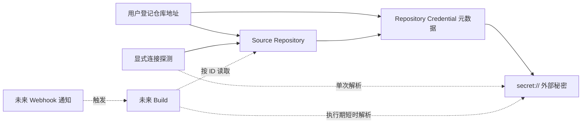
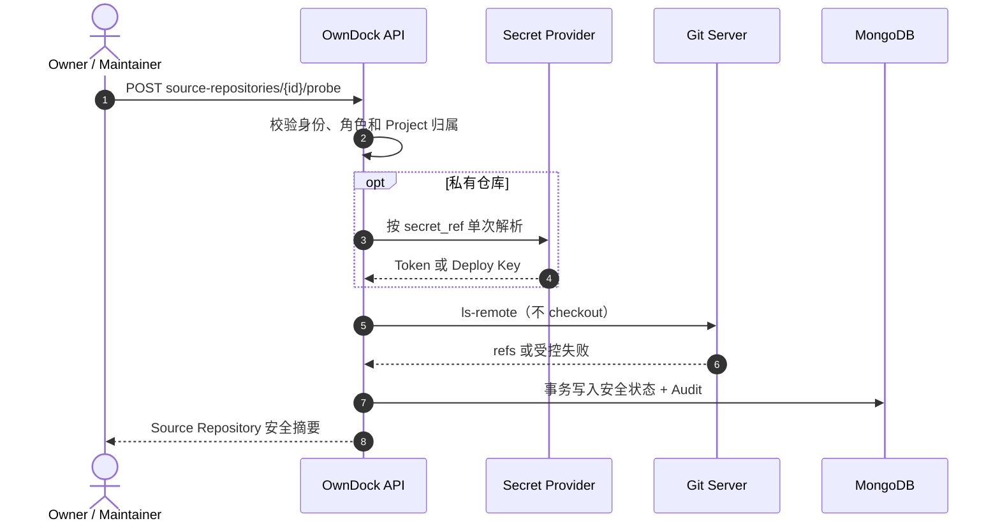

# Source Repository 与读取凭据

OwnDock 已提供 Project 范围的源码仓库连接和显式探测 API。它负责说明“代码在哪里、用哪把受保护的钥匙读取、SSH 主机是否可信”，并可验证仓库及默认分支当前是否可访问。探测只读取远端引用，不 checkout 源码、不执行仓库内容，也不会构建镜像或接收 Webhook；这些后续能力会在独立 Build Worker 完成后逐步开放。

## 三个容易混淆的概念

```text
仓库地址 = 代码在哪里
仓库凭据 = OwnDock 是否有权限读取
Webhook = 代码变化后，何时通知 OwnDock
```

- Source Repository 保存不含 Token 的 HTTPS/SSH 地址、默认分支和连接状态；
- Repository Credential 保存凭据类型和展示用元数据，秘密正文由 `secret://` 指向外部秘密来源；
- Webhook 只是通知入口，不能代替读取凭据，也不能临时替换仓库地址。



## 当前支持范围

- HTTPS：`https://git.example.com/team/api.git`；
- SSH URL：`ssh://git@git.example.com:2222/team/api.git`；
- SSH 常用简写：`git@git.example.com:team/api.git`；
- 公开 HTTPS 仓库可以不绑定凭据；
- 私有 HTTPS 仓库使用 Access Token；
- SSH 仓库使用 Deploy Key，并且必须固定 `SHA256:` Host Key fingerprint。
- 显式探测会验证凭据、TLS/SSH 主机身份和默认分支，但不会下载工作区。

当前明确拒绝：

- HTTPS URL 中的 username/Token，以及任何 URL 中的 password；SSH URL 只允许公开的登录用户名（通常是 `git`）；
- `http://`、`git://`、`file://`、本地路径和 remote helper；
- URL query、fragment 和路径穿越形式；
- 未固定 Host Key 的 SSH 仓库；
- HTTPS 凭据绑定到 SSH 仓库，或 SSH Deploy Key 绑定到 HTTPS 仓库；
- 关闭 TLS 校验或跳过 SSH Host Key 校验。

## 为什么 API 不返回 secret_ref

`secret://git-token` 本身不是 Token，但它会暴露秘密命名和部署配置。创建请求可以提交该引用，MongoDB 只在凭据文档中保存引用；列表与创建响应只返回：

```json
{
  "type": "https_access_token",
  "secret_configured": true
}
```

响应不会包含 `secret_ref`，更不会包含 Access Token 或私钥。`secret_configured: true` 只表示已登记受保护引用，不表示运行环境中一定存在秘密。探测时才会短时解析凭据，使用后清理承载秘密的字节；未来 checkout 也必须在隔离 Build Worker 中采用同样的单次解析方式。

当前环境变量 Secret Provider 的映射规则如下。这里展示的是配置名，不是秘密正文：

| `secret_ref` | 凭据类型 | 运行环境变量 |
| --- | --- | --- |
| `secret://customer-api` | HTTPS Access Token | `OWNDOCK_GIT_CUSTOMER_API_TOKEN` |
| `secret://customer-api` | SSH Deploy Key | `OWNDOCK_GIT_CUSTOMER_API_PRIVATE_KEY_PEM` |

SSH 有两个不同指纹，不能混用：Repository Credential 的 `public_key_fingerprint` 是 Deploy Key 公钥指纹，用来确认解析出的私钥没有配错；Source Repository 的 `ssh_host_key_fingerprint` 是 Git 服务器主机公钥指纹，用来确认连接的服务器没有被替换。

## 权限

| 操作 | Owner | Maintainer | Developer | Viewer |
| --- | --- | --- | --- | --- |
| 查看安全仓库/凭据元数据 | 是 | 是 | 是 | 是 |
| 创建仓库连接 | 是 | 是 | 否 | 否 |
| 创建仓库凭据 | 是 | 是 | 否 | 否 |
| 探测仓库连接 | 是 | 是 | 否 | 否 |

资源必须属于当前 Organization 下的 Project。名称在同一 Project 内不区分大小写且唯一；跨 Project ID 查询统一返回不存在。

## API

```text
GET/POST /api/v1/projects/{project_id}/repository-credentials
GET/POST /api/v1/projects/{project_id}/source-repositories
GET      /api/v1/projects/{project_id}/source-repositories/{source_repository_id}
POST     /api/v1/projects/{project_id}/source-repositories/{source_repository_id}/probe
```

创建资源和审计事件在同一 MongoDB 事务中提交。探测先完成受限网络读取，再把安全结果、`last_probed_at` 和审计事件放进同一事务；原始 Git、网络和凭据错误不会进入 API 响应或数据库。



| 状态 | 含义 | 常见处理 |
| --- | --- | --- |
| `pending` | 尚未探测 | 主动执行探测 |
| `ready` | 仓库可访问且默认分支存在 | 可以继续配置构建 |
| `authentication_error` | 凭据缺失、无效、权限不足或仓库不可见 | 检查 Secret Provider 和 Git 授权 |
| `host_key_mismatch` | SSH 服务器指纹与固定值不同 | 先人工核实服务器变更，不能跳过校验 |
| `reference_not_found` | 仓库可访问，但默认分支不存在 | 修正默认分支 |
| `unreachable` | 超时、DNS、TLS 或网络连接失败 | 检查网络、CA、代理或服务状态 |

`ready` 是 `last_probed_at` 时刻的连接快照，不是永久保证；构建执行时仍会重新验证和固定 Commit。单次探测默认最多 10 秒，可通过 `product.source_probe_timeout` 在 1～30 秒范围内调整，且仍受 HTTP 请求总超时约束。

## 后续阶段

BUILD-001 的受限 Git 连接探测、执行期秘密解析和 `/probe` 契约已经落地，仍需补齐真实 Git 服务的 HTTPS/SSH 兼容矩阵门禁。Build Configuration、触发、Webhook、checkout 和 BuildKit 分别由后续 BUILD 任务实现；API Server 始终不 checkout 源码或执行客户代码。
