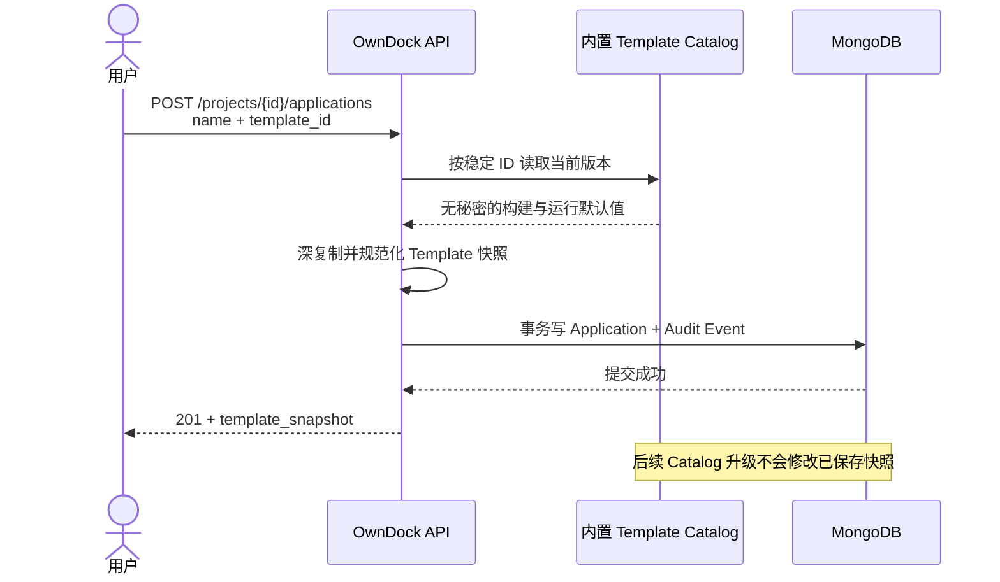

# 内置 Template 与 Application 快照

Template 可以理解为“新建 Application 时的一组安全默认值”。它用于减少第一次配置的重复输入，但不是运行中的父对象，也不会在后台持续控制 Application。

OwnDock 社区版当前提供两个只读内置 Template：

| Template ID | 适用场景 | 复制的默认值 |
| --- | --- | --- |
| `http-service` | 对外提供 HTTP 的服务 | `Dockerfile`、`.` 构建上下文、容器 `8080/tcp` 端口、默认 CPU/内存 |
| `background-worker` | 不暴露端口的常驻任务 | `Dockerfile`、`.` 构建上下文、默认 CPU/内存 |

Template 不包含 Git 仓库、凭据、Registry、Environment 值、秘密、命令或 Runtime Target。选择 Template 不能绕过后续资源的 Project 所有权、权限和安全校验。

## 为什么复制快照

创建 Application 时，Server 读取指定的 Template 版本，将 `template_id`、`template_version`、构建路径和运行规格复制到 Application 的 `template_snapshot`。此后 Template 发布新版本，已有 Application 的快照保持不变。



这条规则避免“模板改了一次，生产应用在不知情时一起变化”。如果用户希望采用新版，应由未来的显式比较与确认流程创建新配置，不能静默同步。

## API 使用

查询内置目录和单个版本：

```http
GET /api/v1/templates
GET /api/v1/templates/http-service
Authorization: Bearer <session>
```

从 Template 创建 Application：

```http
POST /api/v1/projects/{project_id}/applications
Authorization: Bearer <session>
Content-Type: application/json

{
  "name": "Customer API",
  "template_id": "http-service"
}
```

`template_id` 可省略；省略时创建空白 Application。选择不存在的 ID 返回 `404 not_found`。Viewer 可以查看目录，只有具备 `application.write` 的 Owner、Maintainer 或 Developer 可以实例化。

目录中的 `name` 和 `description` 同时返回 `en-US` 与 `zh-CN`，避免把请求时的显示语言写入资源快照。客户端应按当前 locale 选择展示字段，不应按展示文案编写业务分支。

## 当前产品边界

- 已实现：只读内置目录、双语展示文本、按 ID 查询、Application 快照、MongoDB 持久化、事务审计与 OpenAPI 契约；
- 不提供：模板继承、后台同步、公开市场、任意模板脚本；
- 团队私有模板、审批、策略和治理属于未来商业扩展，不是社区版完成部署闭环的前置条件。

Template 快照是表单默认值和来源证据。创建 Build Configuration 或 Release 时，客户端可以用它预填字段，但对应写接口仍会独立校验，不能把快照当作已经创建的 Build Configuration 或 Release。
