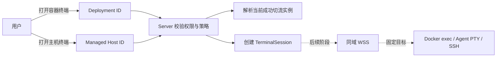
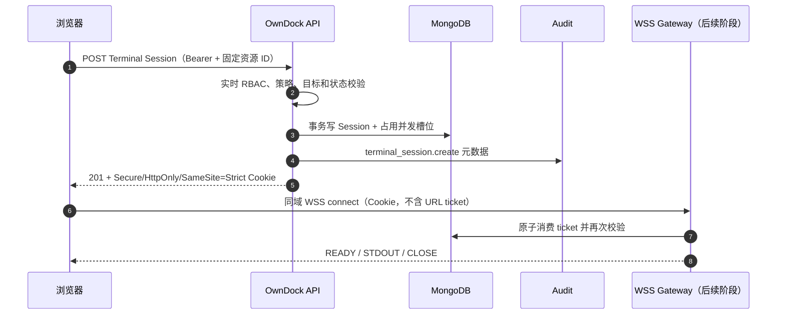
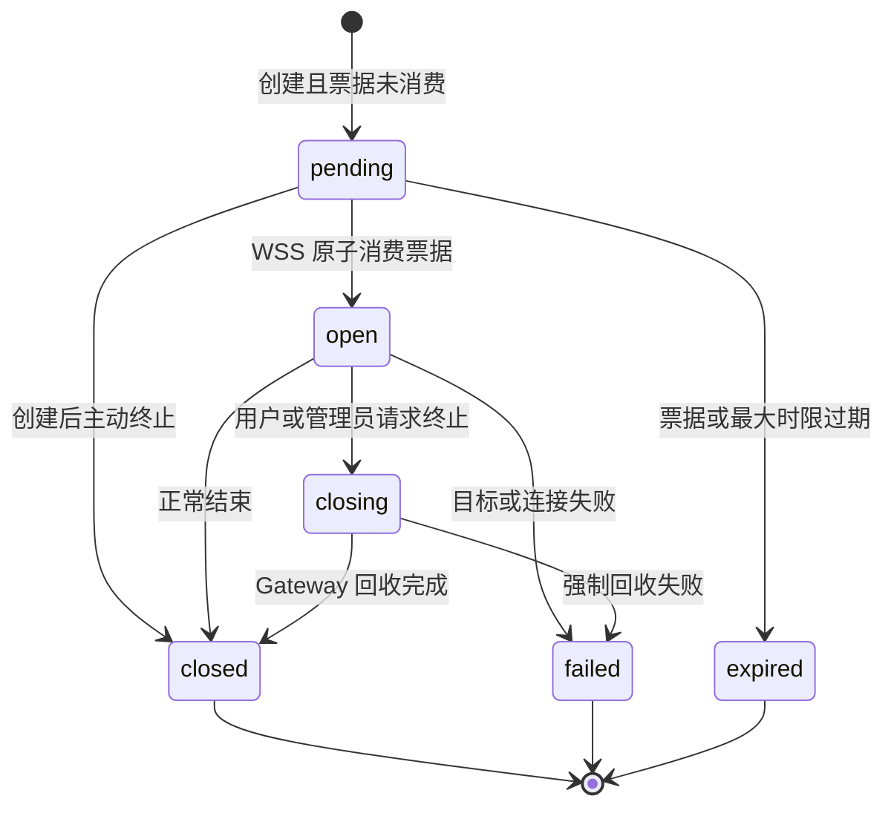

# 安全终端会话

OwnDock 的终端不是“把 Docker 或 SSH 暴露给浏览器”，而是一项有目标、有权限、有时限、可终止、可审计的临时操作。

当前控制面已经实现 Terminal 权限、访问策略、`TerminalSession` 状态机、MongoDB 持久化、并发限制、一次性连接票据、REST API 和元数据审计。容器 Docker exec、主机 PTY/SSH 和浏览器 WSS 字节流仍在后续阶段，因此当前版本可以管理会话，但还不能宣称交互式终端已完整交付。

## 用户看到的两个入口

- 容器终端从 Deployment 详情进入。请求只提交 `deployment_id`，Server 解析当前成功切流的受管实例。
- 主机终端从 Managed Host 详情进入。路径中的 `managed_host_id` 固定目标，不会从 Project 的部署权限推导主机权限。

浏览器不能提交 container ID、Docker endpoint、主机地址、socket、系统用户名、shell 命令、工作目录或特权参数。这些限制防止前端参数被变成任意远程执行接口。

## 默认权限

| 角色 | 容器终端 | 主机终端 | 策略与他人会话 |
| --- | --- | --- | --- |
| Owner | 允许 | 允许 | 允许 |
| Maintainer | 允许 | 默认不允许，需组织策略显式开启 | 可管理 Project 策略和 Project 会话 |
| Developer | 默认不允许，需 Project 策略显式开启 | 不允许 | 只能终止自己的会话 |
| Viewer | 不允许 | 不允许 | 不允许 |

Project 默认策略只允许 Owner、Maintainer 访问 development 和 staging；production 默认关闭。Organization 默认策略只允许 Owner 打开主机终端。管理员可以缩小 Runtime Target 或 Managed Host 范围，也可以调整 idle/max timeout 与每用户、每目标并发数。

## 创建与连接为什么分两步

REST 创建操作先完成身份、范围、资源状态、策略和并发检查，并记录 `TerminalSession`。成功后，Server 设置短时、单次、限定 connect 路径的 Cookie。票据不进入 JSON、URL、浏览器历史、Access Log 或 Trace。

当前已实现上图创建、持久化、Cookie 下发，以及供 WSS 调用的 MongoDB 原子消费/过期/重放拒绝用例；WSS upgrade、Origin、帧流控与实际执行网关尚未开放。

## 会话生命周期

终止 API 是幂等的。pending 会话终止时立即清除票据并释放并发槽位；open 会话先进入 closing，后续 Gateway 完成 PTY/exec 回收后进入终态。

## 数据与审计边界

MongoDB 保存会话目标引用、操作者、连接方式、来源 IP、User-Agent、请求 ID、时间、状态、安全错误码和结束原因。数据库只保存票据 SHA-256 摘要。

OwnDock 基础版不保存命令、stdin、stdout、stderr、环境变量、Shell history 或完整底层错误。审计能回答“谁在何时进入哪个受管目标、持续多久、如何结束”，但不会形成一个新的业务秘密仓库。

## API 摘要

| 方法与路径 | 用途 |
| --- | --- |
| `GET/PUT /api/v1/terminal-policy` | 查询或保存 Organization 主机终端策略 |
| `GET/PUT /api/v1/projects/{project_id}/terminal-policy` | 查询或保存 Project 容器终端策略 |
| `POST /api/v1/projects/{project_id}/terminal-sessions/container` | 用 Deployment ID 创建容器会话 |
| `POST /api/v1/managed-hosts/{managed_host_id}/terminal-sessions` | 创建固定主机会话 |
| `GET /api/v1/terminal-sessions/{session_id}` | 查询安全会话元数据 |
| `POST /api/v1/terminal-sessions/{session_id}:terminate` | 幂等终止会话 |

完整字段和错误响应以 [OpenAPI](../api/openapi.yaml) 为准。
