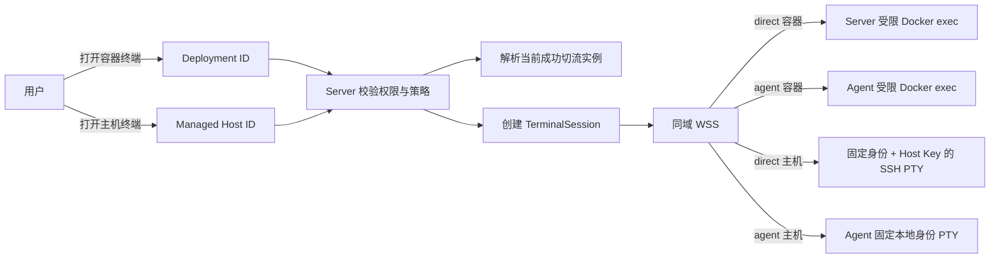
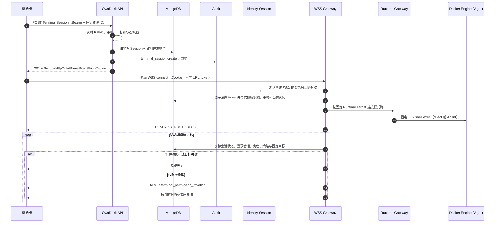
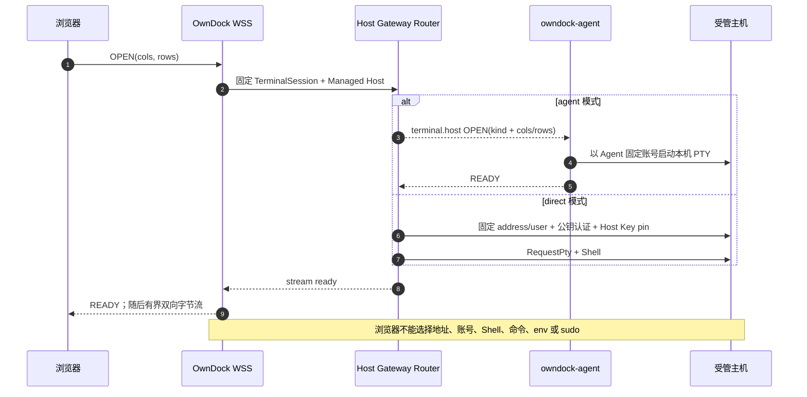
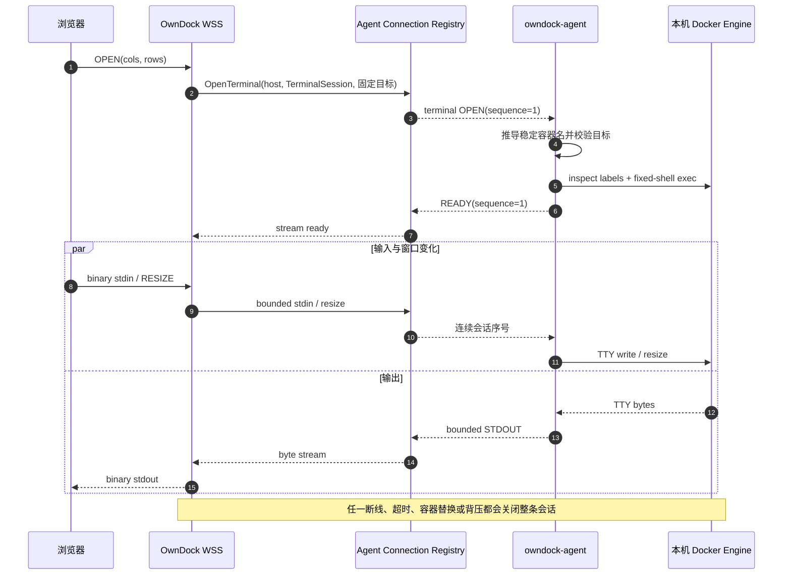
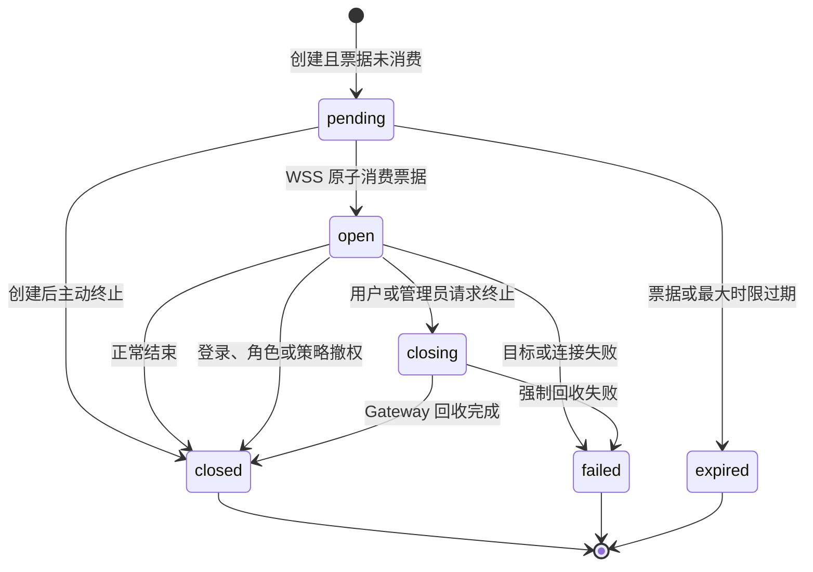

# 安全终端会话

OwnDock 的终端不是“把 Docker 或 SSH 暴露给浏览器”，而是一项有目标、有权限、有时限、可终止、可审计的临时操作。

当前已经实现 Terminal 权限、访问策略、`TerminalSession` 状态机、MongoDB 持久化、并发限制、一次性连接票据、REST API、同域 WSS 传输、活动会话周期复核与撤权、元数据审计，以及 direct/Agent 两种连接模式的受限容器和主机终端。真实远程 Linux/SSH 故障注入、两主机和浏览器系统验收仍未完成，因此这些能力仍按 pre-release 管理。

## 用户看到的两个入口

- 容器终端从 Deployment 详情进入。请求只提交 `deployment_id`，Server 解析当前成功切流的受管实例。
- 主机终端从 Managed Host 详情进入。路径中的 `managed_host_id` 固定目标，不会从 Project 的部署权限推导主机权限。

浏览器不能提交 container ID、Docker endpoint、主机地址、socket、系统用户名、shell 命令、工作目录或特权参数。这些限制防止前端参数被变成任意远程执行接口。

## 默认权限

| 角色 | 容器终端 | 主机终端 | 策略与他人会话 |
| --- | --- | --- | --- |
| Owner | 允许 | 允许 | 允许 |
| Maintainer | 允许 | 默认不允许，需组织策略显式开启 | 可管理 Project 策略和 Project 会话 |
| Developer | 默认不允许，需 Project 策略显式开启 | 不允许 | 只能终止自己的会话 |
| Viewer | 不允许 | 不允许 | 不允许 |

Project 默认策略只允许 Owner、Maintainer 访问 development 和 staging；production 默认关闭。Organization 默认策略只允许 Owner 打开主机终端。管理员可以缩小 Runtime Target 或 Managed Host 范围，也可以调整 idle/max timeout 与每用户、每目标并发数。

## 创建与连接为什么分两步

REST 创建操作先完成身份、范围、资源状态、策略和并发检查，并记录 `TerminalSession`。成功后，Server 设置短时、单次、限定 connect 路径的 Cookie。票据不进入 JSON、URL、浏览器历史、Access Log 或 Trace。

浏览器原生 WebSocket 不能设置普通 REST `Authorization` Header。OwnDock 不把 Bearer Token 放进 URL 或 WebSocket 子协议，而是在创建 TerminalSession 时只保存当前登录会话 ID。连接时，一次性 Cookie 证明本次终端凭据的持有权，Server 再确认所绑定的登录会话没有退出或被撤销，并实时复核角色、策略和目标。随后 MongoDB 原子消费票据；同一票据过期或重放都会失败。

WSS 固定使用 `owndock.terminal.v1` 子协议。文本控制消息承载 `OPEN/READY/RESIZE/PING/PONG/CLOSE/ERROR`，二进制消息按方向承载 stdin 或 TTY stdout。控制消息最大 4 KiB，单个数据消息最大 32 KiB，输入最多 200 条/秒，输出逐条写入并受写超时约束，不建立无界队列。慢读导致写截止、终端后端输入阻塞、浏览器硬断线都会关闭整条 Stream 并只持久化稳定原因；idle/max timer 不会被阻塞 I/O 绕过。首条消息必须是带初始窗口尺寸的 `OPEN`，后续控制序号必须连续递增。

客户端消息超过大小上限时以 WebSocket `1009` 和 `terminal_message_too_large` 关闭；速率超限或控制序号/方向违规时以 `1008` 和 `terminal_rate_limit_exceeded` / `terminal_protocol_violation` 关闭。这些稳定码可供前端显示通俗说明，底层解析错误和用户输入不会写入关闭原因或数据库。

direct Docker exec 只连接 Server 根据当前成功 Deployment 推导出的稳定容器名，并在 exec 前后核对 Deployment、Project、Application、Environment 和 cutover sequence 标签。固定 shell 顺序为 `/bin/sh`、`/bin/bash`、`/bin/ash`；不接受浏览器传入的 command、user、env、workdir、detach 或 privileged。连接期间容器被替换、停止或 generation 改变会主动关闭底层流。

Agent 模式复用同一授权和目标解析结果，但 Server 不连接远端 Docker 地址。它通过现有 mTLS Agent 控制连接发送 `terminal.container` 有界帧；`OPEN` 只包含已解析的 Deployment、Project、Application、Environment、Runtime Target、稳定容器名、cutover sequence 和窗口尺寸。Agent 再次推导容器名、核对运行状态与标签后，才在本机 Unix Socket 上启动同一组固定 shell。stdin、TTY stdout 和 resize 使用每会话连续序号传输；每台 Agent 的容器与主机终端合计最多 16 个，连接和发送队列都有上限，断线不会自动恢复旧 PTY。该通道不会携带 Docker endpoint、socket、任意命令、用户、环境变量、工作目录或特权开关。

## 主机终端如何限制权限

Agent 主机终端使用单独的 `terminal.host` capability，不能用 `terminal.container` 权限代替。Server 发出的 `OPEN` 只有 `kind=host` 和窗口尺寸，不含用户名、Shell、命令、环境变量或工作目录。主机上的可信配置固定 `host_terminal.user` 和 `host_terminal.shell`；Agent 必须本来就以该系统账号运行，不调用 `sudo`、`su` 或 `setuid` 临时切换身份。首版只接受本机配置中的 `/bin/sh`、`/bin/bash` 或 `/bin/ash`，并拒绝可被 group/world 写入的 Shell 文件。

每个 Agent 最多同时打开 4 个主机终端，容器与主机终端合计最多 16 个。PTY 只获得重新构造的最小环境，不继承 Agent 进程中的证书、令牌或其他环境秘密。关闭、超时、撤权或 Agent 断线时，Agent 先向整个 PTY 进程组发送 `SIGTERM` 并关闭控制终端；本机配置的短宽限期结束后仍未退出才发送 `SIGKILL`。这保证前台 Shell 启动的子进程不能仅靠持有 PTY 文件描述符长期残留。

direct 主机终端只读取 Managed Host 上预先登记的一组完整 SSH 配置：`host:port` 地址、固定系统用户、`SHA256:` Host Key 指纹和 `secret://alias` 私钥引用。四项必须同时存在，浏览器不能在创建会话时覆盖其中任何一项。Server 只使用公钥认证并强制匹配固定 Host Key，不提供跳过校验开关；建立 PTY 后调用 SSH `shell` request，而不是把用户输入拼成远程命令。当前环境变量 Secret Resolver 的名称为 `OWNDOCK_MANAGED_HOST_SSH_<ALIAS>_PRIVATE_KEY_PEM`，其中 alias 转为大写并把 `-` 替换为 `_`。解析出的 PEM 字节副本在握手后立即清零，私钥原文不写入 MongoDB、日志或审计。

连接成功不代表权限被永久缓存。WSS 默认每 2 秒从 MongoDB 读取权威会话，并重新解析绑定的登录会话、当前 Project 角色、有效策略和固定目标。管理员终止会话、目标停止或实例身份变化会立即进入关闭流程；登录退出、成员移除、角色降级或策略收紧会先发送稳定错误码 `terminal_permission_revoked`，再遵守复核时读取到的 `revocation_grace_period`。宽限期允许设为 0 到 5 分钟，权限在宽限期内恢复时会取消待关闭计时。复核依赖存储或身份服务发生异常时失败关闭，不继续保留高权限通道。多实例部署不依赖进程内广播，因此最长发现延迟约为一个复核周期。

## 会话生命周期

终止 API 是幂等的。pending 会话终止时立即清除票据并释放并发槽位；open 会话先进入 closing，后续 Gateway 完成 PTY/exec 回收后进入终态。

Runtime Target 删除使用同一状态机收敛容器终端：Target 一进入 `retiring` 就拒绝新的会话与连接；后台任务按 Target 有界扫描活动会话，把 pending/open 会话在权威存储中直接关闭为 `target_unavailable`。这样即使持有流的 Server 突然退出，也不会留下永久 `closing` 行阻塞退役；仍在线的 WSS 最迟在下一次复核时观察终态并关闭流，随后运行资源清理提供最终执行隔离。每个发生转换的会话都记录原始 Target 删除 Actor 与 Request ID。主机终端只绑定 Managed Host，不会因某个 Project Runtime Target 删除而终止。

## 数据与审计边界

MongoDB 保存会话目标引用、操作者、连接方式、来源 IP、User-Agent、请求 ID、时间、状态、安全错误码和结束原因。数据库只保存票据 SHA-256 摘要。

OwnDock 基础版不保存命令、stdin、stdout、stderr、环境变量、Shell history 或完整底层错误。审计能回答“谁在何时进入哪个受管目标、持续多久、如何结束”，但不会形成一个新的业务秘密仓库。

`/metrics` 只按固定的终端类型、连接模式和关闭原因统计当前连接数、累计连接数、关闭次数与连接时长。Organization、Project、用户、会话、主机、Runtime Target 和 Deployment ID 都不会成为 Prometheus 标签。完整指标和发布门禁见[终端威胁模型、安全指标与验收](terminal-security-acceptance.md)。

## API 摘要

| 方法与路径 | 用途 |
| --- | --- |
| `GET/PUT /api/v1/terminal-policy` | 查询或保存 Organization 主机终端策略 |
| `GET/PUT /api/v1/projects/{project_id}/terminal-policy` | 查询或保存 Project 容器终端策略 |
| `POST /api/v1/projects/{project_id}/terminal-sessions/container` | 用 Deployment ID 创建容器会话 |
| `POST /api/v1/managed-hosts/{managed_host_id}/terminal-sessions` | 创建固定主机会话 |
| `GET /api/v1/terminal-sessions/{session_id}` | 查询安全会话元数据 |
| `POST /api/v1/terminal-sessions/{session_id}:terminate` | 幂等终止会话 |
| `GET /api/v1/terminal-sessions/{session_id}:connect` | 同域 WSS；使用限定路径的一次性 Cookie，不使用 URL ticket |

完整字段和错误响应以 [OpenAPI](../api/openapi.yaml) 为准。
