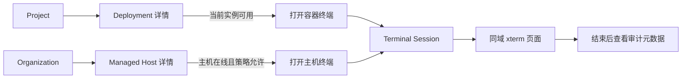
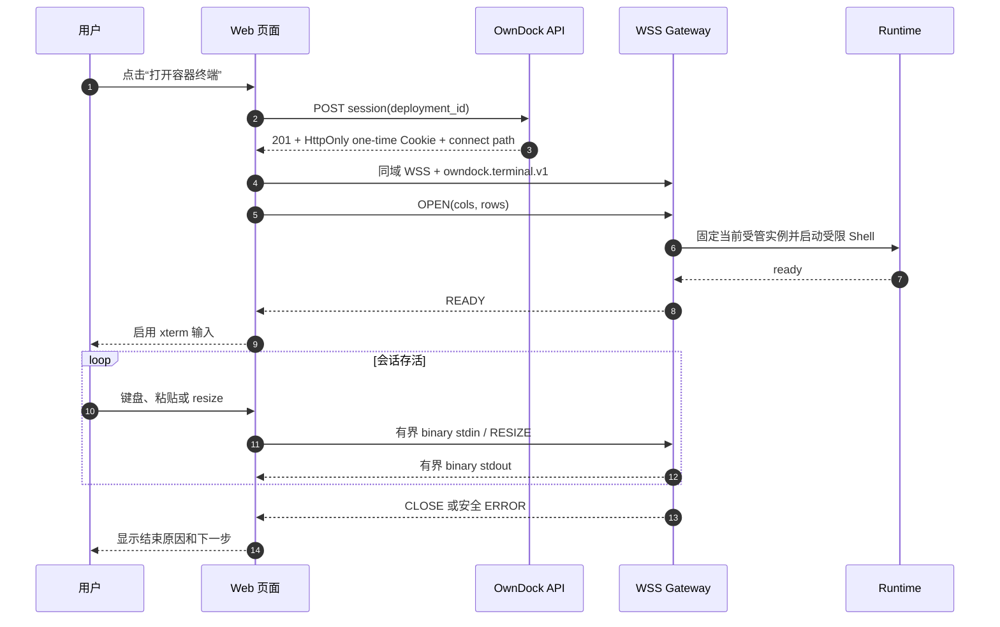
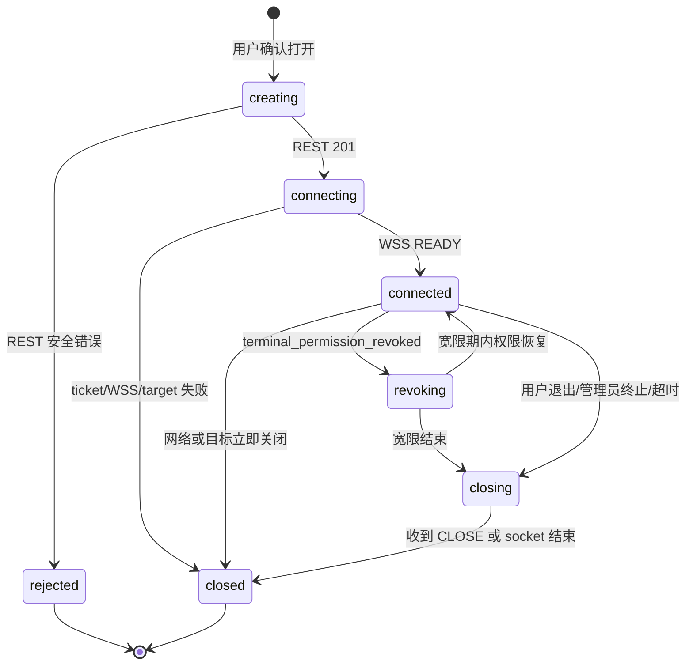

# 容器与主机终端用户旅程

本文面向产品、Web 开发、测试和交付人员，说明用户从哪里进入终端、页面应展示什么、不同状态如何解释，以及前端不能突破哪些安全边界。后端契约已经实现；独立 Web 项目中的页面和真实浏览器 E2E 尚未完成，因此终端仍标记为 pre-release。

## 用户先理解三个概念

- **容器终端**用于排查某次 Deployment 当前正在运行的受管容器，从 Deployment 详情进入。
- **主机终端**用于维护整台 Managed Host，从主机详情进入，权限高于容器终端。
- **Terminal Session**是一次临时、可终止、可审计的连接，不是一个长期 SSH/Docker 凭据。

用户只选择 OwnDock 资源。页面不得询问或提交容器 ID、Docker 地址、Socket、主机地址、系统用户名、Shell 命令、环境变量、工作目录或 privileged 开关。

## 入口、权限与禁用原因

页面可以根据角色、资源状态和 Agent capability 提前隐藏或禁用入口，但点击后仍必须调用后端重新授权，不能把前端判断当作权限。

| 场景 | 默认入口 | 默认角色 | 页面提示 |
| --- | --- | --- | --- |
| development/staging 容器 | Deployment 详情的“打开终端” | Owner、Maintainer | Developer 只有在 Project 策略显式开启后可用 |
| production 容器 | Deployment 详情的“打开终端” | 默认全部关闭 | 说明需要管理员显式开启 production 策略 |
| Agent 主机 | Managed Host 详情的“主机终端” | Owner | 还要求在线且具有 `terminal.host` capability |
| direct SSH 主机 | Managed Host 详情的“主机终端” | Owner | 还要求固定地址、用户、Host Key 和私钥引用完整配置 |

Viewer 不显示终端操作。Maintainer 默认不能打开主机终端。拥有某个 Project 的 Deployment 权限不等于拥有它所在主机的 Shell 权限。

禁用按钮旁应给出可行动原因，例如“当前部署没有运行实例”“Agent 离线”“当前环境策略禁止终端”“需要主机终端权限”。不要展示底层 Docker、SSH、证书或数据库错误。

## 容器终端操作流程

1. 用户进入 Deployment 详情，页面持续显示 Application、Environment、Runtime Target 和 Deployment 标识。
2. 页面确认当前 Deployment 已成功且存在当前受管实例，然后显示“打开终端”。
3. 用户点击后，Web 只向创建接口提交 `deployment_id`。
4. Server 返回 `201` 并设置限定 connect 路径的一次性安全 Cookie；响应 JSON 不包含 ticket。
5. 页面立即使用返回的 connect path 建立同域 WSS，并选择 `owndock.terminal.v1` 子协议。
6. 收到 `READY` 后才启用键盘输入和粘贴；连接前的按键不得排队后补发。
7. 用户退出、超时、被撤权、容器替换或网络断开后，页面进入明确终态；首版不自动恢复旧 PTY。

## 主机终端操作流程

主机详情必须持续显示主机名称、连接模式和风险提示。打开前使用确认对话框说明“该终端操作整台主机，不只影响某个容器”，但不要求用户输入账号或命令。

Web 调用 `/api/v1/managed-hosts/{managed_host_id}/terminal-sessions`，请求体不带目标参数。Agent 模式由主机本地可信配置固定系统账号与 Shell；direct 模式由 Managed Host 预先登记并由 Secret Provider 解析固定 SSH 配置。页面不能允许在两种模式之间临时切换。

## 页面连接状态

前端建议使用下面的本地 UI 状态；它们不新增后端领域状态，也不写入数据库。

| UI 状态 | 用户可操作 | 页面要求 |
| --- | --- | --- |
| `creating` | 取消等待 | 禁止重复创建，不显示空白黑屏 |
| `connecting` | 取消连接 | 显示固定目标；尚未收到 `READY` 时禁用输入 |
| `connected` | 输入、粘贴、resize、退出 | 目标名称和剩余时限持续可见 |
| `revoking` | 保存现场、主动退出 | 明确显示权限已撤销及剩余宽限；不要暗示可能永久继续 |
| `closing` | 无新输入 | 停止发送 stdin，等待有界关闭，不无限转圈 |
| `closed/rejected` | 返回详情或创建新会话 | 显示稳定原因；新会话必须重新走 REST 创建 |

刷新页面、浏览器崩溃或网络切换都视为本次交互结束。可以查询 Terminal Session 元数据确认最终状态，但不能复用旧 Cookie、WebSocket 或 PTY。

## xterm 集成边界

Web 可使用 xterm 类渲染器，但 terminal 模块必须单独管理 WebSocket 生命周期：

- REST Query cache 只保存 Terminal Session 元数据，不保存 stdin/stdout；
- 终端字节不进入全局状态、localStorage、sessionStorage、IndexedDB、剪贴板历史、错误监控、分析事件或前端录屏；
- 只有收到 `READY` 后才 attach 键盘；dispose 时先停止输入，再关闭 socket 和 renderer；
- resize 取渲染器实际列/行，限制为 1～1000 列、1～500 行，并做节流；
- 文本控制帧最大 4 KiB，二进制输入最大 32 KiB；大段粘贴应提示并按协议上限分块，不能制造无界发送队列；
- IME composition 未结束时不能逐键发送；移动端只需保证只读详情和安全退出，首版交互终端以桌面为主；
- 页面标题、状态和关闭原因走 `zh-CN/en-US` 语义 key；终端字节、Shell 输出、资源名称和错误原文不翻译。

## 错误与结束原因怎么展示

前端按稳定 code 分支，不按后端 message 文本分支。下面的文案是产品含义，最终翻译可以调整，但不能改变处理动作。

| 稳定 code/reason | 通俗解释 | 建议操作 |
| --- | --- | --- |
| `terminal_access_denied` | 当前账号或策略不允许访问该终端 | 联系 Project/Organization 管理员，不自动重试 |
| `terminal_resource_not_found` | 目标已删除或不属于当前范围 | 返回资源列表并刷新 |
| `terminal_resource_conflict` | Deployment 或运行实例已经变化 | 刷新详情后创建新会话 |
| `terminal_session_limit_reached` | 用户或目标的并发会话已达上限 | 关闭不用的会话后重试 |
| `terminal_target_unavailable` | 主机、Agent、容器或 SSH 当前不可用 | 检查目标状态；允许用户手动重试新会话 |
| `terminal_ticket_invalid` | 一次性连接凭据已过期、使用过或不匹配 | 重新创建 Terminal Session，不重放旧连接 |
| `terminal_permission_revoked` / `permission_revoked` | 会话期间权限被撤销或策略收紧 | 显示宽限倒计时，停止后重新申请权限 |
| `idle_timeout` | 长时间无输入，会话已自动关闭 | 需要时创建新会话 |
| `maximum_duration` | 达到管理员设置的最长时限 | 创建新会话；不能在旧连接上续期 |
| `administrator_terminated` | 管理员终止了本次会话 | 返回详情，必要时联系管理员 |
| `server_shutdown` | 服务正在重启或维护 | 稍后手动创建新会话 |
| `terminal_message_too_large` | 单次输入超过协议上限 | 缩小粘贴内容；不要自动重复发送 |
| `terminal_rate_limit_exceeded` | 输入速度超过安全上限 | 停止发送并由用户重新创建会话 |
| `terminal_protocol_violation` | 客户端协议状态不一致 | 记录前端版本与 Request ID，提示升级或刷新页面 |
| `terminal_connection_failed` / `connection_failed` | 安全连接未能完成或意外中断 | 显示 Request ID；不展示底层错误正文 |

## 会话历史与审计

终端关闭后，详情可以显示操作者、固定目标、连接模式、创建/连接/结束时间、状态、关闭原因和 Request ID。审计时间线使用 `terminal_session.create/connect/terminate/close/fail` 元数据回答“谁在何时进入哪个目标、持续多久、怎样结束”。

基础版不保存也不展示命令、stdin、stdout、stderr、Shell history 或环境变量。不要把“没有录像”描述成“没有审计”：操作身份和会话生命周期仍然可审计，只是不采集终端内容。

## Web 验收清单

- 容器入口只能从 Deployment，主机入口只能从 Managed Host；跨 Project/Organization 资源 ID 被拒绝。
- Owner、Maintainer、Developer、Viewer 和 production 默认策略的按钮状态与后端结果一致。
- Cookie 不可被 JavaScript 读取，connect URL、日志、监控和浏览器历史中没有 ticket 或 Bearer Token。
- READY 前无输入；resize、IME、粘贴、慢消费者、后台标签页和窄屏安全退出行为明确。
- 票据过期/重放、Origin 错误、目标替换、容器退出、Agent 断线、管理员终止和撤权宽限都有稳定页面终态。
- 页面刷新或断线不会声称恢复原 PTY；重新连接一定创建新 Terminal Session。
- 两种语言 key 完整，颜色不是唯一状态提示，键盘可聚焦退出操作，关闭原因对屏幕阅读器可读。
- 测试 artifact、console、网络采集、错误监控和截图不包含终端内容或秘密。

后端状态、协议和安全实现详见[安全终端会话](terminal-sessions.md)；威胁模型与发布门禁见[终端威胁模型、安全指标与验收](terminal-security-acceptance.md)；字段以 [OpenAPI](../api/openapi.yaml) 为准。
