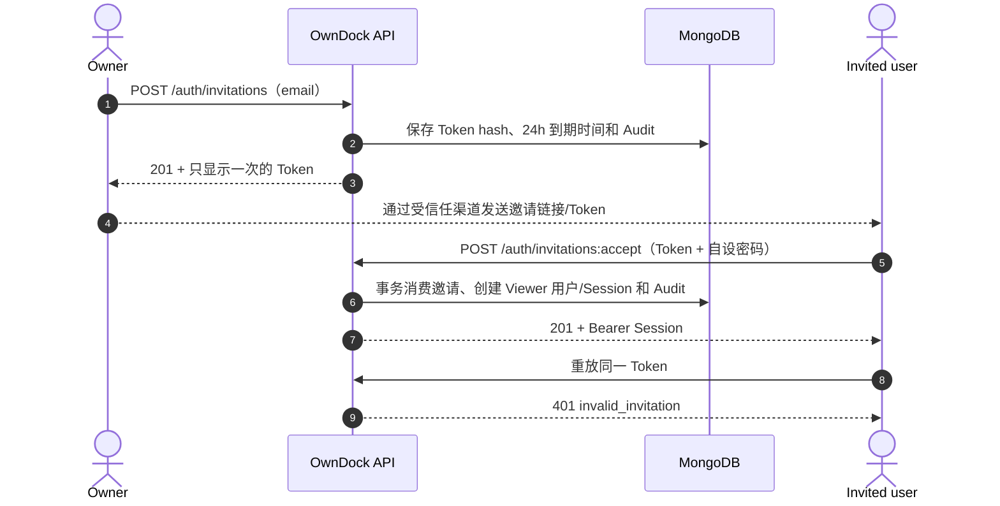
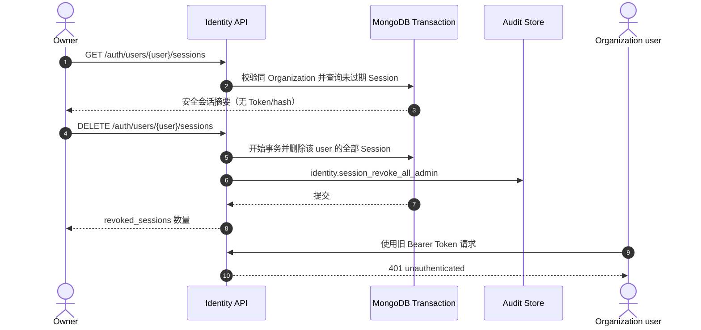

# 本地用户邀请

OwnDock 不开放公开注册。首个 Owner 通过 bootstrap 创建后，由 Owner 邀请同一 Organization 的其他本地用户；受邀者自己设置密码，再由 Owner 或 Project Maintainer 按 [Project 成员与权限](project-members.md) 分配 Project 角色。

## 为什么不用管理员代设密码

如果管理员创建账号时直接填写成员密码，管理员就会知道一份可登录的长期凭据，成员还需要通过聊天或邮件传递它。一次性邀请把这两个风险拆开：

- Owner 只填写成员邮箱；
- OwnDock 只在创建响应中显示一次随机邀请 Token，数据库只保存 SHA-256 哈希；
- 成员使用 Token 设置自己的密码；
- Token 成功使用、过期或被撤销后不能再次创建账号；
- 新账号只获得 Organization `viewer` 身份，不会自动访问任何 Project。



## Owner 创建邀请

```http
POST /api/v1/auth/invitations
Authorization: Bearer <owner-session>
Content-Type: application/json

{"email":"developer@example.com"}
```

成功响应带 `Cache-Control: no-store`，并包含一次显示的 `token`。前端可以提供一次复制按钮，但不能把 Token 写入 Local Storage、分析事件、错误上报或普通日志。默认有效期为 24 小时，可通过 `security.user_invitation_ttl` 在 15 分钟到 7 天之间调整。

Owner 可以查看安全元数据或撤销仍处于 active 的邀请：

```text
GET  /api/v1/auth/invitations
POST /api/v1/auth/invitations/{invitation_id}:revoke
```

列表不会返回明文 Token 或 `token_hash`。状态包括 `active`、`accepted` 和 `revoked`；MongoDB TTL 只清理已经到期且仍 active 的邀请，accepted/revoked 元数据和审计记录不会因为原到期时间被自动删除。

## 成员接受邀请

```http
POST /api/v1/auth/invitations:accept
Content-Type: application/json

{
  "token":"<one-time-token>",
  "password":"<member-selected-password>"
}
```

这个接口不接受已有用户 Session。成功时会在同一 MongoDB 事务中：

1. 条件消费仍 active、未过期、版本匹配的邀请；
2. 创建同一 Organization 内唯一邮箱的 Viewer 用户；
3. 使用 Argon2id 保存密码哈希；
4. 创建受活跃 Session 上限治理的 Bearer Session；
5. 写入 `identity.invitation_accept` 审计事件。

无效、过期、已撤销、已接受或邮箱已经存在的邀请统一返回 `401 invalid_invitation`，避免匿名调用方用错误差异探测账号。密码不符合 12～128 字符规则时返回普通字段校验错误。

## 用户元数据

Owner 可以读取 Organization 的安全用户列表：

```text
GET /api/v1/auth/users
```

响应只包含 ID、Organization ID、规范化邮箱、Organization 角色和创建时间，不包含密码哈希、Session Token 或邀请 Token。当前本地邀请用户的 Organization 角色固定为 Viewer；实际开发、维护或只读权限由 Project Member 绑定决定。Owner 是唯一的 Organization 全局管理角色。

## Owner 管理成员会话

账号疑似泄漏、成员离职或设备丢失时，Owner 可以查看同一 Organization 用户的活跃会话安全摘要，并撤销一个或全部会话：

```text
GET    /api/v1/auth/users/{user_id}/sessions
DELETE /api/v1/auth/users/{user_id}/sessions/{session_id}
DELETE /api/v1/auth/users/{user_id}/sessions
```

列表只包含 Session ID、创建时间和过期时间，不返回 Bearer Token 或 `token_hash`，响应固定为 `Cache-Control: no-store`。单个撤销和全部撤销分别形成 `identity.session_revoke_admin` 与 `identity.session_revoke_all_admin` 审计事件，并和 Session 删除在同一 MongoDB 事务中提交。不存在或属于其他 Organization 的用户统一返回 404。

管理员入口不能撤销当前 Owner 自己正在使用的 Session，也不能通过“全部撤销”把当前 Owner 踢下线；Owner 应使用普通自助 Session 接口选择自己的其他会话，或调用 logout 结束当前会话。这个约束避免误操作中断唯一的管理入口。



## 当前边界

- 不发送邮件；Owner 需要通过自己信任的渠道传递一次性 Token；
- 不开放公开注册、管理员代设密码或可回读密码；
- 暂不支持忘记密码、自助改密和 OIDC；这些需要独立的撤权、会话失效和审计设计；
- 邀请完成账号创建，不等于已经获得 Project 权限；未绑定时 Project 列表为空，绑定、改角色或移除在下一次请求立即生效。
