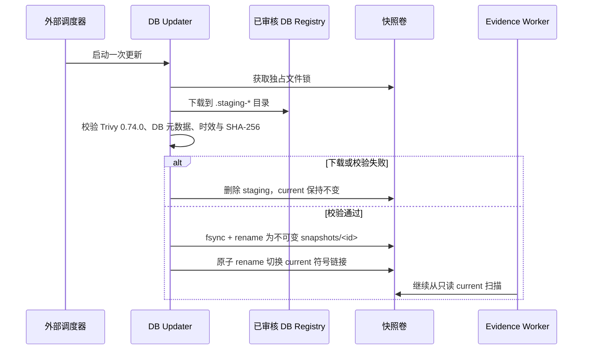

# Trivy 漏洞库快照运维

OwnDock 的漏洞扫描分成两个权限完全不同的进程：

- `owndock-vulnerability-db-updater` 只负责从经过审核的 OCI 地址下载 Trivy DB、校验并发布快照；
- `owndock-evidence-worker` 只读快照并扫描镜像，永远不会在一个扫描任务里更新数据库。

这样做的直接好处是：同一批扫描使用同一份可追踪的漏洞库；网络抖动或下载失败不会破坏正在使用的数据库；Registry 凭据、MongoDB 和 KMS 凭据也不需要交给更新器。

## 原子发布如何工作

更新器在同一个持久卷中完成所有步骤：

```text
/var/lib/owndock/trivy-db/
├── .update.lock
├── current -> snapshots/v2-20260829T070304Z-d57cf8ac0a4c2235
└── snapshots/
    ├── v2-20260828T070304Z-...
    └── v2-20260829T070304Z-d57cf8ac0a4c2235/
        └── db/
            ├── metadata.json
            └── trivy.db
```



更新器拒绝并发执行、过期的新下载、未来时间异常、非普通 DB 文件、符号链接注入、超过 4 GiB 的 DB，以及非 `:2` schema 仓库。默认保留至少三份快照，且快照发布不足 72 小时时不会回收。扫描前后如果 `current` 恰好发生切换，Worker 会发现 DB 元数据不同并让该任务失败关闭，重试时再使用完整的新快照。

## 第一次准备

宿主机目录由固定容器身份 `65532:65532` 管理：

```bash
sudo install -d -o 65532 -g 65532 -m 0750 /var/lib/owndock/trivy-db
```

发布两个镜像后，必须在部署配置中使用不可变 digest，不能使用 `latest`：

```bash
export OWNDOCK_VULNERABILITY_DB_UPDATER_IMAGE='registry.example.com/owndock/vulnerability-db-updater@sha256:...'
export OWNDOCK_TRIVY_DATABASE_ROOT='/var/lib/owndock/trivy-db'

docker compose -f deploy/vulnerability-db-updater.compose.yaml run --rm vulnerability-db-updater
readlink /var/lib/owndock/trivy-db/current
```

确认 `current` 存在后再启动 Evidence Worker。两个 Compose 文件使用同一个 `OWNDOCK_TRIVY_DATABASE_ROOT`：Updater 挂载为 `rw`，Worker 挂载为 `ro`。不得通过 override 给 Worker 增加写权限。

## 下载地址与国内网络

默认按顺序尝试：

1. `mirror.gcr.io/aquasec/trivy-db:2`
2. `ghcr.io/aquasecurity/trivy-db:2`

客户可以通过 `OWNDOCK_TRIVY_DB_PRIMARY_REPOSITORY` 和 `OWNDOCK_TRIVY_DB_FALLBACK_REPOSITORY` 指向自己同步并审核的 OCI 镜像，但仓库必须显式使用 schema tag `:2`，不能使用 `latest`。每次实际下载的 DB 文件 SHA-256、schema、更新时间、下载时间和下次更新时间都会进入快照或扫描观察值，因此镜像 Tag 的变化不会丢失证据。

需要代理时只给 Updater 配置 `OWNDOCK_TRIVY_DB_HTTPS_PROXY`。它与 Evidence Worker 访问客户镜像时使用的 `product.registry_https_proxy` 是两个独立出口，不要混用，也不要通过宿主环境变量隐式注入。生产防火墙应只允许 Updater 访问所选 DB Registry 和 DNS，并只允许 Evidence Worker 访问 MongoDB、目标镜像 Registry、所选 KMS 和 DNS。

## 调度与故障恢复

Updater 是一次性任务，不在 Server 中常驻。建议由 systemd timer、Kubernetes CronJob 或现有运维调度器每 6～12 小时运行一次，并在 `next_update` 前完成。调度器应对非零退出码告警，但不要删除 `current` 后重试。

- 更新失败：旧 `current` 不变；检查网络、代理、磁盘和 DB 源后重新执行。
- Worker 报告 `stale=true`：说明扫描年龄或 DB 的 `next_update` 已到期，不代表“没有漏洞”；应先恢复 DB 更新再重扫。
- `current` 被手工改成普通目录：Updater 会拒绝覆盖。修复时应从已验证的 `snapshots/<id>` 恢复相对符号链接，不能把未知文件复制进去。
- 磁盘不足：扩容或在确认快照不再被任何 Worker 使用后处理旧快照；不要清理当前快照或 `.staging-*` 之外的运行中文件。

社区版包含构建后扫描、手动重扫、默认关闭的 Server 持续重扫调度和这套 DB 快照更新路径。持续重扫只会为已过期 Observation 排入固定版本 Trivy Job；它不会启动或替代 DB Updater，因此仍应先保证 `current` 快照及时更新。具体开关、重试时间桶和多 Server 并发语义见 [Artifact 证据](artifact-evidence.md)。跨 Project 风险看板、集中通知和 Organization 级治理属于后续商业能力，但不能改变社区版对 DB 时效和失败关闭的要求。
