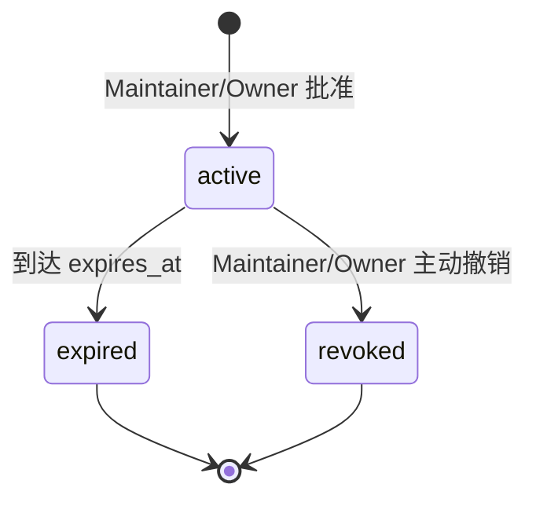
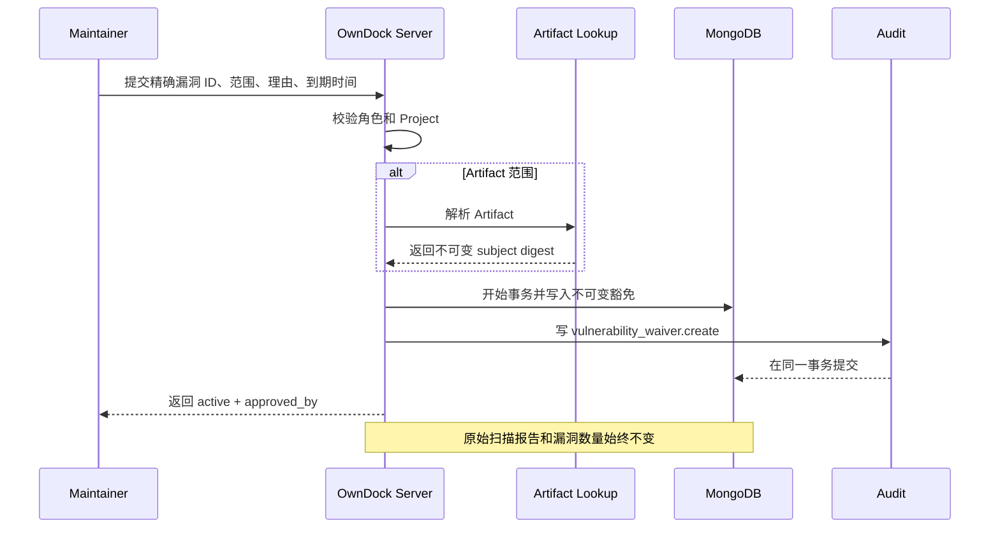

# 漏洞豁免：如何临时接受一个已知风险

漏洞豁免不是“把扫描结果删掉”，而是一条可审计的临时决定：团队知道某个精确漏洞仍然存在，但基于当前使用方式、补丁窗口或供应商结论，在限定范围和期限内接受风险。

OwnDock 始终保留原始 Trivy 报告、Evidence 索引和漏洞数量。创建豁免不会把 `critical` 改成 `0`，不会把扫描结果改成“安全”，也不会覆盖历史报告。Deployment Policy 只在创建 Deployment 的评估时单独读取仍然有效且范围精确匹配的豁免。

## 一条有效豁免必须回答什么

- `vulnerability_id`：一个精确的扫描器漏洞 ID，例如 `CVE-2026-12345`；不接受 `CVE-*`、严重级别或“全部漏洞”；
- `scope`：`project` 或 `artifact`；
- `reason`：为什么此时可以接受风险；
- `approved_by`：由 Server 从当前登录用户写入，客户端不能冒充批准人；
- `expires_at`：批准后至少 1 小时、最多 180 天，不能永久有效。

Project 级豁免适用于该 Project 后续策略评估中的对应漏洞 ID。Artifact 级豁免还会在批准时绑定 Artifact 的不可变 OCI SHA-256 digest；同名 Tag 后来移动到新镜像时，旧豁免不会跟着移动。

Viewer、Developer、Maintainer 和 Owner 可以读取。只有 Maintainer 和 Owner 可以创建或撤销；Developer 不能自行批准自己的风险例外。

## 生命周期



豁免创建后不能编辑或延期。需要改变范围、理由或到期时间时，应创建一条新记录；旧记录继续保留。有效记录只能用 `expected_version: 1` 撤销，撤销后版本为 `2`，不能恢复。

## 创建 Artifact 级豁免

```http
POST /api/v1/projects/{project_id}/vulnerability-waivers
Authorization: Bearer <session-token>
Content-Type: application/json
X-Request-ID: risk-review-20260829-01

{
  "scope": "artifact",
  "artifact_id": "artifact-01",
  "vulnerability_id": "CVE-2026-12345",
  "reason": "受影响功能已关闭，计划在下一维护窗口升级基础镜像。",
  "expires_at": "2026-09-28T10:00:00Z"
}
```

Server 会重新读取 Artifact，确认它属于当前 Organization 和 Project，并把真实 `subject_digest` 写入记录。请求不能自行提交 digest。

Project 级请求使用 `"scope":"project"`，并且必须省略 `artifact_id`。

## 查询与历史

```http
GET /api/v1/projects/{project_id}/vulnerability-waivers?status=active&limit=50
GET /api/v1/projects/{project_id}/vulnerability-waivers?status=all&vulnerability_id=CVE-2026-12345
GET /api/v1/projects/{project_id}/vulnerability-waivers/{waiver_id}
Authorization: Bearer <session-token>
```

列表默认只返回当前有效记录，按创建时间从新到旧排列，每页最多 100 条。`next_cursor` 非空时将它原样传回；cursor 已绑定 Organization、Project 和筛选条件，不能跨查询复用。使用 `status=all` 可以查看 `active`、`expired` 和 `revoked` 全部历史。

## 撤销

```http
POST /api/v1/projects/{project_id}/vulnerability-waivers/{waiver_id}:revoke
Authorization: Bearer <session-token>
Content-Type: application/json
X-Request-ID: risk-review-20260829-02

{
  "reason": "包含补丁的新 Artifact 已部署。",
  "expected_version": 1
}
```

创建或撤销时，豁免记录和审计事件在同一个 MongoDB 事务中提交。并发撤销、已过期记录或已撤销记录返回 `409`，不会重写历史。



当前版本的 Deployment Policy 已消费有效豁免。求值会重新校验 OCI 详细报告，先保留原始数量，再按精确漏洞 ID 计算剩余数量，并把实际命中的豁免 ID、版本、范围和到期时间冻结到 Deployment。豁免本身仍不会自动允许部署：只有启用的策略需要漏洞门禁时，它才参与该次结论。详见 [Deployment Policy](deployment-policies.md)。
