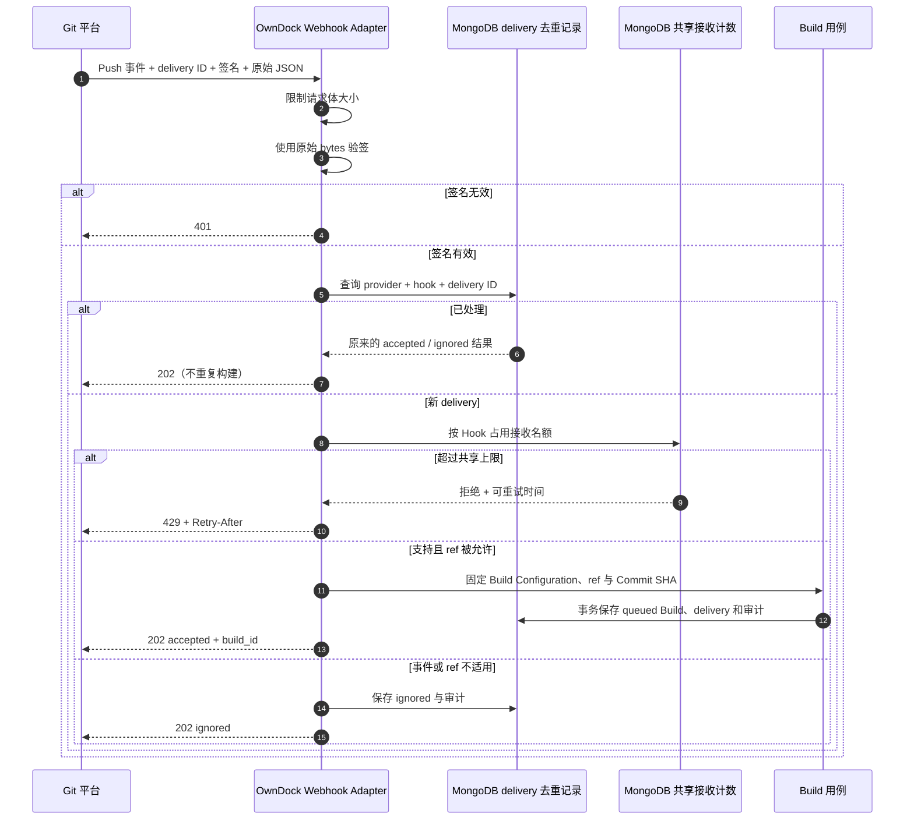

# Git 平台 Webhook

Webhook 解决的是“代码更新后，什么时候通知 OwnDock 开始构建”。它不授予 OwnDock 读取代码的权限，也不能替代 Repository Credential。

> 当前状态：GitHub、GitLab Standard Webhooks、Gitea 和 Forgejo 的 Push 事件已实现。收到合法通知后只创建 `queued` Build；源码 checkout 和镜像构建仍由后续 Build Worker 完成。

## 先理解三样东西

| 配置 | 通俗理解 | 用途 |
| --- | --- | --- |
| Git URL | 代码的地址 | 找到仓库 |
| Repository Credential | 仓库钥匙 | 读取私有代码 |
| Webhook Secret | 门铃暗号 | 证明通知确实来自已配置的 Git 平台 |

三者必须分开管理。Webhook 地址中没有 Project ID、仓库地址或 Secret；一次合法通知也不能修改仓库、Dockerfile、Registry 或部署目标。

## 工作过程



`202` 表示通知已被可靠接收，不表示镜像已经构建完成。重复 delivery 会得到首次处理结果。原始请求体、签名和 Webhook Secret 都不会写入 MongoDB。

Git 平台可能因为网络重试而打乱 Push 通知的到达顺序。OwnDock 不相信通知的先后顺序：创建 Build 前会读取该 ref 当前指向的 Commit，并要求它与通知中的 Commit 一致。较新的 Push 已经更新分支后，迟到的旧通知会记录为 `ignored` 并返回 `202`，不会创建旧 Build，也不会把应用自动部署回旧代码。

## 创建 Build Hook

Owner 或 Maintainer 先为一个 Build Configuration 创建 Hook：

```http
POST /api/v1/projects/{project_id}/applications/{application_id}/build-configurations/{configuration_id}/hooks
Authorization: Bearer <session>
Content-Type: application/json

{
  "name": "GitHub main push",
  "provider": "github",
  "allowed_refs": ["refs/heads/main"],
  "secret_ref": "secret://github-main-hook"
}
```

`allowed_refs` 只能是 Build Configuration 已允许 ref 的子集。查询接口只返回 `secret_configured`，不会回读 Secret 或 `secret_ref`。

当前环境秘密适配器把 `secret://github-main-hook` 解析为：

```text
OWNDOCK_WEBHOOK_GITHUB_MAIN_HOOK_SECRET
```

把该变量作为 Server 容器 Secret 注入，不要写进 Git、配置文件、Webhook URL 或日志。

创建成功后，将下列地址填写到 Git 平台的 Webhook URL：

```text
https://<你的 OwnDock API 域名>/api/v1/build-hooks/{provider}/{build_hook_id}
```

Content type 选择 `application/json`，事件只选择 Push。Pull Request / Merge Request（包括来自 Fork 的请求）即使签名正确也固定返回 `202 ignored`，不会获得 Repository/Registry Secret，也不会进入 checkout 或 BuildKit；首版不提供“允许不可信 PR 构建”的开关。默认请求体上限为 1 MiB，可通过 `product.build_webhook_max_body_bytes` 在 1 KiB 到 5 MiB 之间调整。

每个 Hook 默认每分钟最多接收 120 个新的、签名有效的 delivery，可通过 `product.build_webhook_rate_limit` 和 `product.build_webhook_rate_window` 调整。计数保存在 MongoDB 中，多个 Server 实例共用同一个上限。已记录 delivery 会先重新验签，再直接返回原结果，不重复占用名额。

## 平台差异

| 平台 | provider | 当前校验方式 | delivery / event |
| --- | --- | --- | --- |
| GitHub | `github` | `X-Hub-Signature-256`，HMAC-SHA256 | `X-GitHub-Delivery` / `X-GitHub-Event` |
| GitLab | `gitlab` | Standard Webhooks 的 `webhook-signature`，消息同时绑定 ID、时间戳和原始 body；Unix 秒必须在服务端时间前后 5 分钟内 | `webhook-id` / `X-Gitlab-Event` |
| Gitea | `gitea` | `X-Gitea-Signature`，HMAC-SHA256 | `X-Gitea-Delivery` / `X-Gitea-Event` |
| Forgejo | `forgejo` | `X-Forgejo-Signature`，HMAC-SHA256 | `X-Forgejo-Delivery` / `X-Forgejo-Event` |

GitLab 首版只接受 GitLab 19.1 引入的 Standard Webhooks 强签名，Secret 值是 `whsec_...`。旧式 `X-Gitlab-Token` 只是明文共享值，不属于当前安全基线；使用较旧 GitLab 时，可暂时改用[通用 Build Trigger Token](build-triggers.md)。

GitLab 每次重试会更新尝试时间，但保持同一个 `webhook-id`。OwnDock 先拒绝超出 5 分钟容差、格式异常或存在签名分隔歧义的时间戳/ID，再解析 body；通过后仍按 delivery ID 长期去重。部署时必须让 Server 使用可靠的 NTP/云时间同步，否则明显的时钟偏差会被安全地拒绝为签名无效。

平台签名格式参考：[GitHub](https://docs.github.com/en/webhooks/using-webhooks/validating-webhook-deliveries)、[GitLab](https://docs.gitlab.com/user/project/integrations/webhooks/)、[Gitea](https://docs.gitea.com/1.25/usage/repository/webhooks)、[Forgejo](https://forgejo.org/docs/latest/user/webhooks/)。

## 返回结果与排障

| HTTP 状态 | 含义 | 建议 |
| --- | --- | --- |
| `202 accepted` | 已创建或重放一个 queued Build | 使用 `build_id` 查询 Build |
| `202 ignored` | 签名合法，但不是支持的 Push、是删除 ref，或 ref 不在允许列表 | 检查事件和 allowed refs |
| `400` | 缺少必要 Header，或签名通过后的 JSON 无效 | 检查平台配置和代理是否改写请求 |
| `401` | 签名不匹配 | 确保 Git 平台和 Server 使用同一个 Webhook Secret |
| `404` | provider、Hook 不存在或已撤销 | 检查 URL，必要时重新创建 Hook |
| `413` | 请求体超过上限 | 减少事件类型或谨慎调大上限 |
| `415` | Content-Type 不是 `application/json` | 修改平台 Content type |
| `429` | 当前 Hook 在共享时间窗内收到过多新 delivery | 按 `Retry-After` 等待；不要更换 delivery ID 绕过限制 |
| `503` | Server 当前无法读取 Webhook Secret | 检查 Secret 注入并重启/恢复 Server |

撤销 Hook 后不可恢复：

```http
POST /api/v1/projects/{project_id}/applications/{application_id}/build-configurations/{configuration_id}/hooks/{build_hook_id}:revoke
Authorization: Bearer <session>
```

## 安全边界

- 先对原始请求体验签，再解析 JSON；伪造内容不能进入事件解析。
- delivery 的唯一键是 `provider + hook_id + delivery_id`，并与 Build、审计在同一 MongoDB 事务内保存。
- delivery 去重记录不设置 TTL，避免旧 delivery 在自动过期后再次触发；记录只含必要元数据，不含请求体和签名。
- Push 中的 Commit SHA 仍要由只读 Git 查询确认确实属于该 ref；Webhook 不能直接决定要构建的仓库或配方。
- Delivery ID 只用于识别同一次通知；不同 Delivery ID 也可能乱序。OwnDock 以远端 ref 当前 Commit 为准，迟到的旧 Push 固定忽略。
- Handler 不执行 checkout、Dockerfile 或 BuildKit，因此可以快速返回 `202`。
