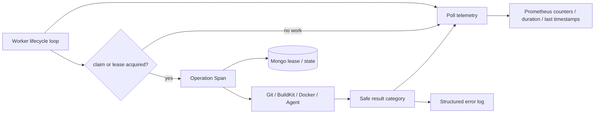

# Worker 可观测性与告警

OwnDock 的后台执行不是“发出请求后立即完成”：Deployment、Build、Runtime Inventory 全量采集和 Docker Event 收敛都由 Worker 从 MongoDB 领取带租约的任务。运维人员需要区分三种情况：当前没有工作、Worker 正常处理工作，以及 Worker 因数据库、运行目标或执行超时而无法继续。

为避免高基数和秘密泄漏，Prometheus 只使用固定 Worker 名称和固定结果；Project、Host、Runtime Target、Build、Deployment ID 不进入指标标签。资源 ID 只作为操作级 Trace 属性帮助受控排障，Span 名称固定，Trace 不记录 endpoint、凭据、请求正文、Docker/Git 原始错误或构建日志。

## 信号分层



统一轮询指标覆盖四个固定 Worker：

| `worker` | 运行位置 | 用途 |
| --- | --- | --- |
| `build` | 独立 `owndock-build-worker` | Build、Artifact 与 Release 交接 |
| `deployment` | `owndock` Server，可配置启用 | Deployment 执行与取消 |
| `runtime_inventory` | `owndock` Server，可配置启用 | 周期全量资源对账 |
| `runtime_inventory_events` | `owndock` Server，可配置启用 | 有界 Docker Event 收敛 |

结果只有 `success`、`error`、`timeout`、`canceled`。`success` 表示一次轮询正常结束，也可能表示当前没有到期任务；它证明循环和依赖查询可以继续运行，不等于刚完成了一次用户任务。`canceled` 通常出现在进程优雅停止时，不应直接作为故障告警。

## Prometheus 指标

| 指标 | 含义 |
| --- | --- |
| `owndock_worker_polls_total{worker,result}` | 每类 Worker 的轮询次数和安全结果 |
| `owndock_worker_poll_duration_seconds{worker,result}` | 一次轮询从查询到执行/结算的耗时 |
| `owndock_worker_last_success_unixtime{worker}` | 最近一次正常结束轮询的 Unix 时间 |
| `owndock_worker_last_error_unixtime{worker}` | 最近一次 error/timeout 的 Unix 时间 |
| `owndock_build_worker_operations_total{result}` | 已领取 Build 的执行结果，不包含空轮询 |
| `owndock_build_worker_operation_duration_seconds{result}` | 已领取 Build 的完整执行耗时 |
| `owndock_build_worker_log_writes_total{stage,result}` | 脱敏 Build 日志持久化结果 |
| `owndock_build_worker_log_bytes_total{stage}` | 提交持久化的脱敏日志字节数 |

可从以下告警思路开始，再按实际 `poll_interval` 和 `operation_timeout` 调整窗口：

```promql
# 最近 10 分钟出现后台轮询错误或超时
sum by (worker) (
  increase(owndock_worker_polls_total{result=~"error|timeout"}[10m])
) > 0

# 启用的 Worker 长时间没有完成任何轮询
time() - owndock_worker_last_success_unixtime > 900

# 最近错误晚于最近成功，说明错误后尚未观察到恢复
owndock_worker_last_error_unixtime
  > on (worker) owndock_worker_last_success_unixtime
```

第二条不能对未启用的 Worker 强行告警：未启用时不会产生该 Worker 的时间序列。对于可能持续数小时的 Build，应按 Build `operation_timeout` 设置阈值，不能直接套用 Inventory 的分钟级阈值。

## Trace

领取业务任务后才创建操作 Span；空轮询不会制造大量无价值 Trace：

| Span | 安全属性 |
| --- | --- |
| `build.execute` | Build/Project ID、状态、lease generation |
| `deployment.execute` | Deployment/Project ID、operation、状态、lease generation |
| `runtime_inventory.collect` | Project、Host、Runtime Target ID、连接模式、lease token |
| `runtime_inventory.events.collect` | Project、Host、Runtime Target ID、连接模式、lease token |

错误 Span 只设置固定的安全状态描述。原始 Docker、Git、BuildKit 或数据库错误不会作为 Span Event/属性导出；具体用户可见失败仍以领域的稳定 `failure_category`、审计和脱敏 Build 日志为准。Trace 默认关闭，启用方式见[目标架构](architecture.md)。

## 运维端点

Server 在自身监听地址提供 `/livez`、`/readyz` 和 `/metrics`；嵌入 Server 的 Deployment/Inventory Worker 指标也从该 `/metrics` 暴露。

独立 Build Worker 在 `runtime.build_worker.metrics_address` 提供：

- `/livez`：进程正在运行；
- `/readyz`：MongoDB 当前可 Ping，失败只返回通用 `not ready`；
- `/metrics`：进程、Go、Build 专用和统一 Worker 指标。

该地址默认使用 loopback。若 Prometheus 跨主机抓取，应通过监控专网、防火墙或受认证反向代理开放，不要直接暴露到互联网。`/readyz` 只反映 Worker 的必要数据库依赖，不替代 Git、Registry、BuildKit、Docker 和 Agent 的任务级失败指标。

## 排障顺序

1. 检查进程 `/livez` 和 `/readyz`；
2. 查看对应 `worker` 的最近成功时间、错误增量和耗时分位数；
3. 使用固定 Span 名称过滤 Trace，再以资源 ID 属性定位单次执行；
4. 查看稳定失败类别、审计和脱敏日志；
5. 不要为了排障临时记录秘密、原始请求体、完整外部错误或客户代码输出。
